This file has been autogenerated - do not edit manually.

# Information Model Diagram

<!-- Generated by :k2-common:generateInformationModelDiagramDoc -->

## Classes

[Acquisition](#class-acquisition) | [Activity](#class-activity) | [Actor](#class-actor) | [Addition](#class-addition) | [AttributeAssignment](#class-attribute-assignment) | [BiologicalObject](#class-biological-object) | [Birth](#class-birth) | [Creation](#class-creation) | [Currency](#class-currency) | [Death](#class-death) | [DesignOrProcedure](#class-design-or-procedure) | [Destruction](#class-destruction) | [DigitalObject](#class-digital-object) | [DigitalService](#class-digital-service) | [Dimension](#class-dimension) | [Dissolution](#class-dissolution) | [Encounter](#class-encounter) | [Event](#class-event) | [Formation](#class-formation) | [Group](#class-group) | [HumanMadeFeature](#class-human-made-feature) | [HumanMadeObject](#class-human-made-object) | [Identifier](#class-identifier) | [InformationObject](#class-information-object) | [Inscription](#class-inscription) | [Joining](#class-joining) | [Language](#class-language) | [Leaving](#class-leaving) | [LinguisticObject](#class-linguistic-object) | [Mark](#class-mark) | [Material](#class-material) | [MeasurementUnit](#class-measurement-unit) | [Modification](#class-modification) | [MonetaryAmount](#class-monetary-amount) | [Move](#class-move) | [Name](#class-name) | [PartAddition](#class-part-addition) | [PartRemoval](#class-part-removal) | [Payment](#class-payment) | [Period](#class-period) | [Person](#class-person) | [PhysicalFeature](#class-physical-feature) | [Place](#class-place) | [Production](#class-production) | [PropositionalObject](#class-propositional-object) | [RecordProvenance](#class-record-provenance) | [Removal](#class-removal) | [Right](#class-right) | [RightAcquisition](#class-right-acquisition) | [Set](#class-set) | [Site](#class-site) | [SourceRecord](#class-source-record) | [TimeSpan](#class-time-span) | [Title](#class-title) | [Transfer](#class-transfer) | [TransferOfCustody](#class-transfer-of-custody) | [Transformation](#class-transformation) | [Type](#class-type) | [VisualItem](#class-visual-item)

See the [Property Index](#property-index).

---

<a id="class-acquisition"></a>
## Acquisition

This class comprises transfers of legal ownership from one or more instances of E39 Actor to one or more other instances of E39 Actor. The class also applies to the establishment or loss of ownership of instances of E18 Physical Thing. It does not, however, imply changes of any other kinds of right. The recording of the donor and/or recipient is optional. It is possible that in an instance of E8 Acquisition there is either no donor or no recipient. Depending on the circumstances, it may describe: 1. the beginning of ownership 2. the end of ownership 3. the transfer of ownership 4. the acquisition from an unknown source 5. the loss of title due to destruction of the item It may also describe events where a collector appropriates legal title, for example by annexation or field collection. The interpretation of the museum notion of "accession" differs between institutions. The CRM therefore models legal ownership (E8 Acquisition) and physical custody (E10 Transfer of Custody) separately. Institutions will then model their specific notions of accession and deaccession as combinations of these.

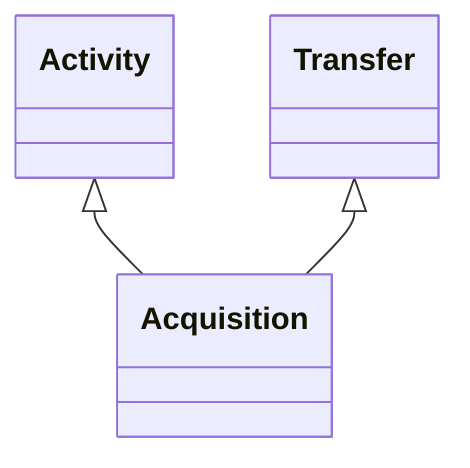

### Inherited Properties

| Defined In | Properties |
|------------|------------|
| AbstractEntity | [`id`](#prop-abstract-entity-id)&nbsp;&#124;&nbsp;[`type`](#prop-abstract-entity-type)&nbsp;&#124;&nbsp;[`_label`](#prop-abstract-entity-_label) |
| Activity | [`carried_out_by`](#prop-activity-carried_out_by)&nbsp;&#124;&nbsp;[`continued`](#prop-activity-continued)&nbsp;&#124;&nbsp;[`continued_by`](#prop-activity-continued_by)&nbsp;&#124;&nbsp;[`general_purpose`](#prop-activity-general_purpose)&nbsp;&#124;&nbsp;[`influenced_by`](#prop-activity-influenced_by)&nbsp;&#124;&nbsp;[`intended_use_of`](#prop-activity-intended_use_of)&nbsp;&#124;&nbsp;[`motivated_by`](#prop-activity-motivated_by)&nbsp;&#124;&nbsp;[`specific_purpose`](#prop-activity-specific_purpose)&nbsp;&#124;&nbsp;[`specific_technique`](#prop-activity-specific_technique)&nbsp;&#124;&nbsp;[`technique`](#prop-activity-technique)&nbsp;&#124;&nbsp;[`used_object_of_type`](#prop-activity-used_object_of_type)&nbsp;&#124;&nbsp;[`used_specific_object`](#prop-activity-used_specific_object) |
| CRMEntity | [`_classifications`](#prop-crmentity-_classifications)&nbsp;&#124;&nbsp;[`_description`](#prop-crmentity-_description)&nbsp;&#124;&nbsp;[`_primaryName`](#prop-crmentity-_primary-name)&nbsp;&#124;&nbsp;[`added_member_by`](#prop-crmentity-added_member_by)&nbsp;&#124;&nbsp;[`assigned_by`](#prop-crmentity-assigned_by)&nbsp;&#124;&nbsp;[`attributed_by`](#prop-crmentity-attributed_by)&nbsp;&#124;&nbsp;[`classified_as`](#prop-crmentity-classified_as)&nbsp;&#124;&nbsp;[`depicted_by`](#prop-crmentity-depicted_by)&nbsp;&#124;&nbsp;[`equivalent`](#prop-crmentity-equivalent)&nbsp;&#124;&nbsp;[`exemplifies`](#prop-crmentity-exemplifies)&nbsp;&#124;&nbsp;[`identified_by`](#prop-crmentity-identified_by)&nbsp;&#124;&nbsp;[`influenced`](#prop-crmentity-influenced)&nbsp;&#124;&nbsp;[`member_of_set`](#prop-crmentity-member_of_set)&nbsp;&#124;&nbsp;[`motivated`](#prop-crmentity-motivated)&nbsp;&#124;&nbsp;[`notation`](#prop-crmentity-notation)&nbsp;&#124;&nbsp;[`note`](#prop-crmentity-note)&nbsp;&#124;&nbsp;[`preferred_identifier`](#prop-crmentity-preferred_identifier)&nbsp;&#124;&nbsp;[`record_provenance`](#prop-crmentity-record_provenance)&nbsp;&#124;&nbsp;[`referred_to_by`](#prop-crmentity-referred_to_by)&nbsp;&#124;&nbsp;[`removed_member_by`](#prop-crmentity-removed_member_by)&nbsp;&#124;&nbsp;[`replaces`](#prop-crmentity-replaces)&nbsp;&#124;&nbsp;[`representation`](#prop-crmentity-representation)&nbsp;&#124;&nbsp;[`subject_of`](#prop-crmentity-subject_of) |
| Event | [`caused`](#prop-event-caused)&nbsp;&#124;&nbsp;[`caused_by`](#prop-event-caused_by)&nbsp;&#124;&nbsp;[`involved`](#prop-event-involved)&nbsp;&#124;&nbsp;[`participant`](#prop-event-participant)&nbsp;&#124;&nbsp;[`specific_purpose_of`](#prop-event-specific_purpose_of) |
| Period | [`part`](#prop-period-part)&nbsp;&#124;&nbsp;[`part_of`](#prop-period-part_of)&nbsp;&#124;&nbsp;[`took_place_at`](#prop-period-took_place_at)&nbsp;&#124;&nbsp;[`took_place_on_or_within`](#prop-period-took_place_on_or_within) |
| SpacetimeVolume | [`distinct_from`](#prop-spacetime-volume-distinct_from)&nbsp;&#124;&nbsp;[`during`](#prop-spacetime-volume-during)&nbsp;&#124;&nbsp;[`includes`](#prop-spacetime-volume-includes)&nbsp;&#124;&nbsp;[`spacetime_volume_is_defined_by`](#prop-spacetime-volume-spacetime_volume_is_defined_by)&nbsp;&#124;&nbsp;[`spatial_projection`](#prop-spacetime-volume-spatial_projection)&nbsp;&#124;&nbsp;[`temporal_projection`](#prop-spacetime-volume-temporal_projection)&nbsp;&#124;&nbsp;[`thing_defined_by`](#prop-spacetime-volume-thing_defined_by)&nbsp;&#124;&nbsp;[`volume_overlaps_with`](#prop-spacetime-volume-volume_overlaps_with) |
| TemporalEntity | [`after`](#prop-temporal-entity-after)&nbsp;&#124;&nbsp;[`before`](#prop-temporal-entity-before)&nbsp;&#124;&nbsp;[`ends_after_or_with_the_start_of`](#prop-temporal-entity-ends_after_or_with_the_start_of)&nbsp;&#124;&nbsp;[`ends_after_the_end_of`](#prop-temporal-entity-ends_after_the_end_of)&nbsp;&#124;&nbsp;[`ends_after_the_start_of`](#prop-temporal-entity-ends_after_the_start_of)&nbsp;&#124;&nbsp;[`ends_before_or_with_the_end_of`](#prop-temporal-entity-ends_before_or_with_the_end_of)&nbsp;&#124;&nbsp;[`ends_before_or_with_the_start_of`](#prop-temporal-entity-ends_before_or_with_the_start_of)&nbsp;&#124;&nbsp;[`ends_before_the_end_of`](#prop-temporal-entity-ends_before_the_end_of)&nbsp;&#124;&nbsp;[`ends_with_or_after_the_end_of`](#prop-temporal-entity-ends_with_or_after_the_end_of)&nbsp;&#124;&nbsp;[`starts_after_or_with_the_end_of`](#prop-temporal-entity-starts_after_or_with_the_end_of)&nbsp;&#124;&nbsp;[`starts_after_the_start_of`](#prop-temporal-entity-starts_after_the_start_of)&nbsp;&#124;&nbsp;[`starts_before_or_with_the_end_of`](#prop-temporal-entity-starts_before_or_with_the_end_of)&nbsp;&#124;&nbsp;[`starts_before_or_with_the_start_of`](#prop-temporal-entity-starts_before_or_with_the_start_of)&nbsp;&#124;&nbsp;[`starts_before_the_end_of`](#prop-temporal-entity-starts_before_the_end_of)&nbsp;&#124;&nbsp;[`starts_before_the_start_of`](#prop-temporal-entity-starts_before_the_start_of)&nbsp;&#124;&nbsp;[`starts_with_or_after_the_start_of`](#prop-temporal-entity-starts_with_or_after_the_start_of)&nbsp;&#124;&nbsp;[`timespan`](#prop-temporal-entity-timespan) |
| Transfer | [`transferred`](#prop-transfer-transferred)&nbsp;&#124;&nbsp;[`transferred_from`](#prop-transfer-transferred_from)&nbsp;&#124;&nbsp;[`transferred_to`](#prop-transfer-transferred_to) |

### Local Properties

| Name | Cardinality | Value | Defined In | Description |
|------|-------------|-------|------------|-------------|
| <a id="prop-acquisition-transferred_title_from"></a>`transferred_title_from` | `0..*` | [Actor](#class-actor)[] | local | This property identifies the E39 Actor or Actors who relinquish legal ownership as the result of an E8 Acquisition. The property will typically be used to describe a person donating or selling an object to a museum. In reality title is either transferred to or from someone, or both. |
| <a id="prop-acquisition-transferred_title_of"></a>`transferred_title_of` | `0..*` | `PhysicalThing[]` | local | This property identifies the E18 Physical Thing or things involved in an E8 Acquisition. In reality, an acquisition must refer to at least one transferred item. |
| <a id="prop-acquisition-transferred_title_to"></a>`transferred_title_to` | `0..*` | [Actor](#class-actor)[] | local | This property identifies the E39 Actor that acquires the legal ownership of an object as a result of an E8 Acquisition. The property will typically describe an Actor purchasing or otherwise acquiring an object from another Actor. However, title may also be acquired, without any corresponding loss of title by another Actor, through legal fieldwork such as hunting, shooting or fishing. In reality the title is either transferred to or from someone, or both. |

---

<a id="class-activity"></a>
## Activity

This class comprises actions intentionally carried out by instances of E39 Actor that result in changes of state in the cultural, social, or physical systems documented. This notion includes complex, composite and long-lasting actions such as the building of a settlement or a war, as well as simple, short-lived actions such as the opening of a door.

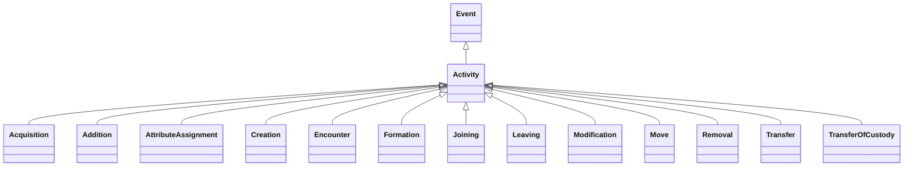

### Inherited Properties

| Defined In | Properties |
|------------|------------|
| AbstractEntity | [`id`](#prop-abstract-entity-id)&nbsp;&#124;&nbsp;[`type`](#prop-abstract-entity-type)&nbsp;&#124;&nbsp;[`_label`](#prop-abstract-entity-_label) |
| CRMEntity | [`_classifications`](#prop-crmentity-_classifications)&nbsp;&#124;&nbsp;[`_description`](#prop-crmentity-_description)&nbsp;&#124;&nbsp;[`_primaryName`](#prop-crmentity-_primary-name)&nbsp;&#124;&nbsp;[`added_member_by`](#prop-crmentity-added_member_by)&nbsp;&#124;&nbsp;[`assigned_by`](#prop-crmentity-assigned_by)&nbsp;&#124;&nbsp;[`attributed_by`](#prop-crmentity-attributed_by)&nbsp;&#124;&nbsp;[`classified_as`](#prop-crmentity-classified_as)&nbsp;&#124;&nbsp;[`depicted_by`](#prop-crmentity-depicted_by)&nbsp;&#124;&nbsp;[`equivalent`](#prop-crmentity-equivalent)&nbsp;&#124;&nbsp;[`exemplifies`](#prop-crmentity-exemplifies)&nbsp;&#124;&nbsp;[`identified_by`](#prop-crmentity-identified_by)&nbsp;&#124;&nbsp;[`influenced`](#prop-crmentity-influenced)&nbsp;&#124;&nbsp;[`member_of_set`](#prop-crmentity-member_of_set)&nbsp;&#124;&nbsp;[`motivated`](#prop-crmentity-motivated)&nbsp;&#124;&nbsp;[`notation`](#prop-crmentity-notation)&nbsp;&#124;&nbsp;[`note`](#prop-crmentity-note)&nbsp;&#124;&nbsp;[`preferred_identifier`](#prop-crmentity-preferred_identifier)&nbsp;&#124;&nbsp;[`record_provenance`](#prop-crmentity-record_provenance)&nbsp;&#124;&nbsp;[`referred_to_by`](#prop-crmentity-referred_to_by)&nbsp;&#124;&nbsp;[`removed_member_by`](#prop-crmentity-removed_member_by)&nbsp;&#124;&nbsp;[`replaces`](#prop-crmentity-replaces)&nbsp;&#124;&nbsp;[`representation`](#prop-crmentity-representation)&nbsp;&#124;&nbsp;[`subject_of`](#prop-crmentity-subject_of) |
| Event | [`caused`](#prop-event-caused)&nbsp;&#124;&nbsp;[`caused_by`](#prop-event-caused_by)&nbsp;&#124;&nbsp;[`involved`](#prop-event-involved)&nbsp;&#124;&nbsp;[`participant`](#prop-event-participant)&nbsp;&#124;&nbsp;[`specific_purpose_of`](#prop-event-specific_purpose_of) |
| Period | [`part`](#prop-period-part)&nbsp;&#124;&nbsp;[`part_of`](#prop-period-part_of)&nbsp;&#124;&nbsp;[`took_place_at`](#prop-period-took_place_at)&nbsp;&#124;&nbsp;[`took_place_on_or_within`](#prop-period-took_place_on_or_within) |
| SpacetimeVolume | [`distinct_from`](#prop-spacetime-volume-distinct_from)&nbsp;&#124;&nbsp;[`during`](#prop-spacetime-volume-during)&nbsp;&#124;&nbsp;[`includes`](#prop-spacetime-volume-includes)&nbsp;&#124;&nbsp;[`spacetime_volume_is_defined_by`](#prop-spacetime-volume-spacetime_volume_is_defined_by)&nbsp;&#124;&nbsp;[`spatial_projection`](#prop-spacetime-volume-spatial_projection)&nbsp;&#124;&nbsp;[`temporal_projection`](#prop-spacetime-volume-temporal_projection)&nbsp;&#124;&nbsp;[`thing_defined_by`](#prop-spacetime-volume-thing_defined_by)&nbsp;&#124;&nbsp;[`volume_overlaps_with`](#prop-spacetime-volume-volume_overlaps_with) |
| TemporalEntity | [`after`](#prop-temporal-entity-after)&nbsp;&#124;&nbsp;[`before`](#prop-temporal-entity-before)&nbsp;&#124;&nbsp;[`ends_after_or_with_the_start_of`](#prop-temporal-entity-ends_after_or_with_the_start_of)&nbsp;&#124;&nbsp;[`ends_after_the_end_of`](#prop-temporal-entity-ends_after_the_end_of)&nbsp;&#124;&nbsp;[`ends_after_the_start_of`](#prop-temporal-entity-ends_after_the_start_of)&nbsp;&#124;&nbsp;[`ends_before_or_with_the_end_of`](#prop-temporal-entity-ends_before_or_with_the_end_of)&nbsp;&#124;&nbsp;[`ends_before_or_with_the_start_of`](#prop-temporal-entity-ends_before_or_with_the_start_of)&nbsp;&#124;&nbsp;[`ends_before_the_end_of`](#prop-temporal-entity-ends_before_the_end_of)&nbsp;&#124;&nbsp;[`ends_with_or_after_the_end_of`](#prop-temporal-entity-ends_with_or_after_the_end_of)&nbsp;&#124;&nbsp;[`starts_after_or_with_the_end_of`](#prop-temporal-entity-starts_after_or_with_the_end_of)&nbsp;&#124;&nbsp;[`starts_after_the_start_of`](#prop-temporal-entity-starts_after_the_start_of)&nbsp;&#124;&nbsp;[`starts_before_or_with_the_end_of`](#prop-temporal-entity-starts_before_or_with_the_end_of)&nbsp;&#124;&nbsp;[`starts_before_or_with_the_start_of`](#prop-temporal-entity-starts_before_or_with_the_start_of)&nbsp;&#124;&nbsp;[`starts_before_the_end_of`](#prop-temporal-entity-starts_before_the_end_of)&nbsp;&#124;&nbsp;[`starts_before_the_start_of`](#prop-temporal-entity-starts_before_the_start_of)&nbsp;&#124;&nbsp;[`starts_with_or_after_the_start_of`](#prop-temporal-entity-starts_with_or_after_the_start_of)&nbsp;&#124;&nbsp;[`timespan`](#prop-temporal-entity-timespan) |

### Local Properties

| Name | Cardinality | Value | Defined In | Description |
|------|-------------|-------|------------|-------------|
| <a id="prop-activity-carried_out_by"></a>`carried_out_by` | `0..*` | [Actor](#class-actor)[] | local | This property describes the active participation of an E39 Actor in an E7 Activity. It implies causal or legal responsibility. The P14.1 in the role of property of the property allows the nature of an Actor’s participation to be specified. |
| <a id="prop-activity-continued"></a>`continued` | `0..*` | [Activity](#class-activity)[] | local | This property associates two instances of E7 Activity, where the domain is considered as an intentional continuation of the range. A continuation of an activity may happen when the continued activity is still ongoing or after the continued activity has completely ended. The continuing activity may have started already before it decided to continue the other one. Continuation implies a coherence of intentions and outcomes of the involved activities. |
| <a id="prop-activity-continued_by"></a>`continued_by` | `0..*` | [Activity](#class-activity)[] | local | Inverse of continued |
| <a id="prop-activity-general_purpose"></a>`general_purpose` | `0..*` | [Type](#class-type)[] | local | This property describes an intentional relationship between an E7 Activity and some general goal or purpose. This may involve activities intended as preparation for some type of activity or event. P21had general purpose (was purpose of) differs from P20 had specific purpose (was purpose of) in that no occurrence of an event is implied as the purpose. |
| <a id="prop-activity-influenced_by"></a>`influenced_by` | `0..*` | `CRMEntity[]` | local | This is a high level property, which captures the relationship between an E7 Activity and anything that may have had some bearing upon it. The property has more specific sub properties. |
| <a id="prop-activity-intended_use_of"></a>`intended_use_of` | `0..*` | `HumanMadeThing[]` | local | This property relates an E7 Activity with objects created specifically for use in the activity. This is distinct from the intended use of an item in some general type of activity such as the book of common prayer which was intended for use in Church of England services (see P101 had as general use (was use of)). |
| <a id="prop-activity-motivated_by"></a>`motivated_by` | `0..*` | `CRMEntity[]` | local | This property describes an item or items that are regarded as a reason for carrying out the E7 Activity. For example, the discovery of a large hoard of treasure may call for a celebration, an order from head quarters can start a military manoeuvre. |
| <a id="prop-activity-specific_purpose"></a>`specific_purpose` | `0..*` | [Event](#class-event)[] | local | This property identifies the relationship between a preparatory activity and the event it is intended to be preparation for. This includes activities, orders and other organisational actions, taken in preparation for other activities or events. P20 had specific purpose (was purpose of) implies that an activity succeeded in achieving its aim. If it does not succeed, such as the setting of a trap that did not catch anything, one may document the unrealized intention using P21 had general purpose (was purpose of):E55 Type and/or P33 used specific technique (was used by): E29 Design or Procedure. |
| <a id="prop-activity-specific_technique"></a>`specific_technique` | `0..*` | [DesignOrProcedure](#class-design-or-procedure)[] | local | This property identifies a specific instance of E29 Design or Procedure in order to carry out an instance of E7 Activity or parts of it. The property differs from P32 used general technique (was technique of) in that P33 refers to an instance of E29 Design or Procedure, which is a concrete information object in its own right rather than simply being a term or a method known by tradition. Typical examples would include intervention plans for conservation or the construction plans of a building. |
| <a id="prop-activity-technique"></a>`technique` | `0..*` | [Type](#class-type)[] | local | This property identifies the technique or method that was employed in an activity. These techniques should be drawn from an external E55 Type hierarchy of consistent terminology of general techniques or methods such as embroidery, oil-painting, carbon dating, etc. Specific documented techniques should be described as instances of E29 Design or Procedure. This property identifies the technique that was employed in an act of modification. |
| <a id="prop-activity-used_object_of_type"></a>`used_object_of_type` | `0..*` | [Type](#class-type)[] | local | This property defines the kind of objects used in an E7 Activity, when the specific instance is either unknown or not of interest, such as use of "a hammer". |
| <a id="prop-activity-used_specific_object"></a>`used_specific_object` | `0..*` | `Thing[]` | local | This property describes the use of material or immaterial things in a way essential to the performance or the outcome of an E7 Activity. This property typically applies to tools, instruments, moulds, raw materials and items embedded in a product. It implies that the presence of the object in question was a necessary condition for the action. For example, the activity of writing this text required the use of a computer. An immaterial thing can be used if at least one of its carriers is present. For example, the software tools on a computer. Another example is the use of a particular name by a particular group of people over some span to identify a thing, such as a settlement. In this case, the physical carriers of this name are at least the people understanding its use. |

---

<a id="class-actor"></a>
## Actor

This class comprises people, either individually or in groups, who have the potential to perform intentional actions of kinds for which someone may be held responsible. The CRM does not attempt to model the inadvertent actions of such actors. Individual people should be documented as instances of E21 Person, whereas groups should be documented as instances of either E74 Group or its subclass E40 Legal Body.

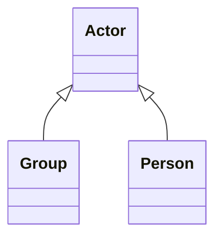

### Inherited Properties

| Defined In | Properties |
|------------|------------|
| AbstractEntity | [`id`](#prop-abstract-entity-id)&nbsp;&#124;&nbsp;[`type`](#prop-abstract-entity-type)&nbsp;&#124;&nbsp;[`_label`](#prop-abstract-entity-_label) |
| CRMEntity | [`_classifications`](#prop-crmentity-_classifications)&nbsp;&#124;&nbsp;[`_description`](#prop-crmentity-_description)&nbsp;&#124;&nbsp;[`_primaryName`](#prop-crmentity-_primary-name)&nbsp;&#124;&nbsp;[`added_member_by`](#prop-crmentity-added_member_by)&nbsp;&#124;&nbsp;[`assigned_by`](#prop-crmentity-assigned_by)&nbsp;&#124;&nbsp;[`attributed_by`](#prop-crmentity-attributed_by)&nbsp;&#124;&nbsp;[`classified_as`](#prop-crmentity-classified_as)&nbsp;&#124;&nbsp;[`depicted_by`](#prop-crmentity-depicted_by)&nbsp;&#124;&nbsp;[`equivalent`](#prop-crmentity-equivalent)&nbsp;&#124;&nbsp;[`exemplifies`](#prop-crmentity-exemplifies)&nbsp;&#124;&nbsp;[`identified_by`](#prop-crmentity-identified_by)&nbsp;&#124;&nbsp;[`influenced`](#prop-crmentity-influenced)&nbsp;&#124;&nbsp;[`member_of_set`](#prop-crmentity-member_of_set)&nbsp;&#124;&nbsp;[`motivated`](#prop-crmentity-motivated)&nbsp;&#124;&nbsp;[`notation`](#prop-crmentity-notation)&nbsp;&#124;&nbsp;[`note`](#prop-crmentity-note)&nbsp;&#124;&nbsp;[`preferred_identifier`](#prop-crmentity-preferred_identifier)&nbsp;&#124;&nbsp;[`record_provenance`](#prop-crmentity-record_provenance)&nbsp;&#124;&nbsp;[`referred_to_by`](#prop-crmentity-referred_to_by)&nbsp;&#124;&nbsp;[`removed_member_by`](#prop-crmentity-removed_member_by)&nbsp;&#124;&nbsp;[`replaces`](#prop-crmentity-replaces)&nbsp;&#124;&nbsp;[`representation`](#prop-crmentity-representation)&nbsp;&#124;&nbsp;[`subject_of`](#prop-crmentity-subject_of) |
| PersistentItem | [`brought_into_existence_by`](#prop-persistent-item-brought_into_existence_by)&nbsp;&#124;&nbsp;[`present_at`](#prop-persistent-item-present_at)&nbsp;&#124;&nbsp;[`taken_out_of_existence_by`](#prop-persistent-item-taken_out_of_existence_by) |

### Local Properties

| Name | Cardinality | Value | Defined In | Description |
|------|-------------|-------|------------|-------------|
| <a id="prop-actor-acquired_custody_through"></a>`acquired_custody_through` | `0..*` | [TransferOfCustody](#class-transfer-of-custody)[] | local | Inverse of transferred_custody_to |
| <a id="prop-actor-acquired_title_through"></a>`acquired_title_through` | `0..*` | [Acquisition](#class-acquisition)[] | local | Inverse of transferred_title_to |
| <a id="prop-actor-carried_out"></a>`carried_out` | `0..*` | [Activity](#class-activity)[] | local | Inverse of carried_out_by |
| <a id="prop-actor-contact_point"></a>`contact_point` | `0..*` | `Appellation[]` | local | This property identifies an E51 Contact Point of any type that provides access to an E39 Actor by any communication method, such as e-mail or fax. |
| <a id="prop-actor-current_custodian_of"></a>`current_custodian_of` | `0..*` | `PhysicalThing[]` | local | Inverse of current_custodian |
| <a id="prop-actor-current_owner_of"></a>`current_owner_of` | `0..*` | `PhysicalThing[]` | local | Inverse of current_owner |
| <a id="prop-actor-current_permanent_custodian_of"></a>`current_permanent_custodian_of` | `0..*` | `PhysicalObject[]` | local | Inverse of Current Permanent Custodian |
| <a id="prop-actor-former_or_current_keeper_of"></a>`former_or_current_keeper_of` | `0..*` | `PhysicalThing[]` | local | Inverse of former_or_current_keeper |
| <a id="prop-actor-former_or_current_owner_of"></a>`former_or_current_owner_of` | `0..*` | `PhysicalThing[]` | local | Inverse of former_or_current_owner |
| <a id="prop-actor-joined_by"></a>`joined_by` | `0..*` | [Joining](#class-joining)[] | local | Inverse of joined |
| <a id="prop-actor-left_by"></a>`left_by` | `0..*` | [Leaving](#class-leaving)[] | local | Inverse of separated |
| <a id="prop-actor-member_of"></a>`member_of` | `0..*` | [Group](#class-group)[] | local | Inverse of member |
| <a id="prop-actor-participated_in"></a>`participated_in` | `0..*` | [Event](#class-event)[] | local | Inverse of participant |
| <a id="prop-actor-possesses"></a>`possesses` | `0..*` | [Right](#class-right)[] | local | This property identifies former or current instances of E30 Rights held by an E39 Actor. |
| <a id="prop-actor-residence"></a>`residence` | `0..*` | [Place](#class-place)[] | local | This property describes the current or former E53 Place of residence of an E39 Actor. The residence may be either the Place where the Actor resides, or a legally registered address of any kind. |
| <a id="prop-actor-right_on"></a>`right_on` | `0..*` | `LegalObject[]` | local | Inverse of right_held_by |
| <a id="prop-actor-surrendered_custody_through"></a>`surrendered_custody_through` | `0..*` | [TransferOfCustody](#class-transfer-of-custody)[] | local | Inverse of transferred_custody_from |
| <a id="prop-actor-surrendered_title_through"></a>`surrendered_title_through` | `0..*` | [Acquisition](#class-acquisition)[] | local | Inverse of transferred_title_from |

---

<a id="class-addition"></a>
## Addition

The addition of some entity to a Set

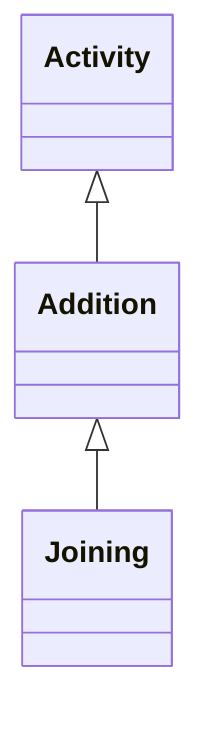

### Inherited Properties

| Defined In | Properties |
|------------|------------|
| AbstractEntity | [`id`](#prop-abstract-entity-id)&nbsp;&#124;&nbsp;[`type`](#prop-abstract-entity-type)&nbsp;&#124;&nbsp;[`_label`](#prop-abstract-entity-_label) |
| Activity | [`carried_out_by`](#prop-activity-carried_out_by)&nbsp;&#124;&nbsp;[`continued`](#prop-activity-continued)&nbsp;&#124;&nbsp;[`continued_by`](#prop-activity-continued_by)&nbsp;&#124;&nbsp;[`general_purpose`](#prop-activity-general_purpose)&nbsp;&#124;&nbsp;[`influenced_by`](#prop-activity-influenced_by)&nbsp;&#124;&nbsp;[`intended_use_of`](#prop-activity-intended_use_of)&nbsp;&#124;&nbsp;[`motivated_by`](#prop-activity-motivated_by)&nbsp;&#124;&nbsp;[`specific_purpose`](#prop-activity-specific_purpose)&nbsp;&#124;&nbsp;[`specific_technique`](#prop-activity-specific_technique)&nbsp;&#124;&nbsp;[`technique`](#prop-activity-technique)&nbsp;&#124;&nbsp;[`used_object_of_type`](#prop-activity-used_object_of_type)&nbsp;&#124;&nbsp;[`used_specific_object`](#prop-activity-used_specific_object) |
| CRMEntity | [`_classifications`](#prop-crmentity-_classifications)&nbsp;&#124;&nbsp;[`_description`](#prop-crmentity-_description)&nbsp;&#124;&nbsp;[`_primaryName`](#prop-crmentity-_primary-name)&nbsp;&#124;&nbsp;[`added_member_by`](#prop-crmentity-added_member_by)&nbsp;&#124;&nbsp;[`assigned_by`](#prop-crmentity-assigned_by)&nbsp;&#124;&nbsp;[`attributed_by`](#prop-crmentity-attributed_by)&nbsp;&#124;&nbsp;[`classified_as`](#prop-crmentity-classified_as)&nbsp;&#124;&nbsp;[`depicted_by`](#prop-crmentity-depicted_by)&nbsp;&#124;&nbsp;[`equivalent`](#prop-crmentity-equivalent)&nbsp;&#124;&nbsp;[`exemplifies`](#prop-crmentity-exemplifies)&nbsp;&#124;&nbsp;[`identified_by`](#prop-crmentity-identified_by)&nbsp;&#124;&nbsp;[`influenced`](#prop-crmentity-influenced)&nbsp;&#124;&nbsp;[`member_of_set`](#prop-crmentity-member_of_set)&nbsp;&#124;&nbsp;[`motivated`](#prop-crmentity-motivated)&nbsp;&#124;&nbsp;[`notation`](#prop-crmentity-notation)&nbsp;&#124;&nbsp;[`note`](#prop-crmentity-note)&nbsp;&#124;&nbsp;[`preferred_identifier`](#prop-crmentity-preferred_identifier)&nbsp;&#124;&nbsp;[`record_provenance`](#prop-crmentity-record_provenance)&nbsp;&#124;&nbsp;[`referred_to_by`](#prop-crmentity-referred_to_by)&nbsp;&#124;&nbsp;[`removed_member_by`](#prop-crmentity-removed_member_by)&nbsp;&#124;&nbsp;[`replaces`](#prop-crmentity-replaces)&nbsp;&#124;&nbsp;[`representation`](#prop-crmentity-representation)&nbsp;&#124;&nbsp;[`subject_of`](#prop-crmentity-subject_of) |
| Event | [`caused`](#prop-event-caused)&nbsp;&#124;&nbsp;[`caused_by`](#prop-event-caused_by)&nbsp;&#124;&nbsp;[`involved`](#prop-event-involved)&nbsp;&#124;&nbsp;[`participant`](#prop-event-participant)&nbsp;&#124;&nbsp;[`specific_purpose_of`](#prop-event-specific_purpose_of) |
| Period | [`part`](#prop-period-part)&nbsp;&#124;&nbsp;[`part_of`](#prop-period-part_of)&nbsp;&#124;&nbsp;[`took_place_at`](#prop-period-took_place_at)&nbsp;&#124;&nbsp;[`took_place_on_or_within`](#prop-period-took_place_on_or_within) |
| SpacetimeVolume | [`distinct_from`](#prop-spacetime-volume-distinct_from)&nbsp;&#124;&nbsp;[`during`](#prop-spacetime-volume-during)&nbsp;&#124;&nbsp;[`includes`](#prop-spacetime-volume-includes)&nbsp;&#124;&nbsp;[`spacetime_volume_is_defined_by`](#prop-spacetime-volume-spacetime_volume_is_defined_by)&nbsp;&#124;&nbsp;[`spatial_projection`](#prop-spacetime-volume-spatial_projection)&nbsp;&#124;&nbsp;[`temporal_projection`](#prop-spacetime-volume-temporal_projection)&nbsp;&#124;&nbsp;[`thing_defined_by`](#prop-spacetime-volume-thing_defined_by)&nbsp;&#124;&nbsp;[`volume_overlaps_with`](#prop-spacetime-volume-volume_overlaps_with) |
| TemporalEntity | [`after`](#prop-temporal-entity-after)&nbsp;&#124;&nbsp;[`before`](#prop-temporal-entity-before)&nbsp;&#124;&nbsp;[`ends_after_or_with_the_start_of`](#prop-temporal-entity-ends_after_or_with_the_start_of)&nbsp;&#124;&nbsp;[`ends_after_the_end_of`](#prop-temporal-entity-ends_after_the_end_of)&nbsp;&#124;&nbsp;[`ends_after_the_start_of`](#prop-temporal-entity-ends_after_the_start_of)&nbsp;&#124;&nbsp;[`ends_before_or_with_the_end_of`](#prop-temporal-entity-ends_before_or_with_the_end_of)&nbsp;&#124;&nbsp;[`ends_before_or_with_the_start_of`](#prop-temporal-entity-ends_before_or_with_the_start_of)&nbsp;&#124;&nbsp;[`ends_before_the_end_of`](#prop-temporal-entity-ends_before_the_end_of)&nbsp;&#124;&nbsp;[`ends_with_or_after_the_end_of`](#prop-temporal-entity-ends_with_or_after_the_end_of)&nbsp;&#124;&nbsp;[`starts_after_or_with_the_end_of`](#prop-temporal-entity-starts_after_or_with_the_end_of)&nbsp;&#124;&nbsp;[`starts_after_the_start_of`](#prop-temporal-entity-starts_after_the_start_of)&nbsp;&#124;&nbsp;[`starts_before_or_with_the_end_of`](#prop-temporal-entity-starts_before_or_with_the_end_of)&nbsp;&#124;&nbsp;[`starts_before_or_with_the_start_of`](#prop-temporal-entity-starts_before_or_with_the_start_of)&nbsp;&#124;&nbsp;[`starts_before_the_end_of`](#prop-temporal-entity-starts_before_the_end_of)&nbsp;&#124;&nbsp;[`starts_before_the_start_of`](#prop-temporal-entity-starts_before_the_start_of)&nbsp;&#124;&nbsp;[`starts_with_or_after_the_start_of`](#prop-temporal-entity-starts_with_or_after_the_start_of)&nbsp;&#124;&nbsp;[`timespan`](#prop-temporal-entity-timespan) |

### Local Properties

| Name | Cardinality | Value | Defined In | Description |
|------|-------------|-------|------------|-------------|
| <a id="prop-addition-added_member"></a>`added_member` | `0..*` | `CRMEntity[]` | local |  |
| <a id="prop-addition-added_to"></a>`added_to` | `0..*` | [Set](#class-set)[] | local |  |

---

<a id="class-attribute-assignment"></a>
## AttributeAssignment

This class comprises the actions of making assertions about properties of an object or any relation between two items or concepts. This class allows the documentation of how the respective assignment came about, and whose opinion it was. All the attributes or properties assigned in such an action can also be seen as directly attached to the respective item or concept, possibly as a collection of contradictory values. All cases of properties in this model that are also described indirectly through an action are characterised as "short cuts" of this action. This redundant modelling of two alternative views is preferred because many implementations may have good reasons to model either the action or the short cut, and the relation between both alternatives can be captured by simple rules. In particular, the class describes the actions of people making propositions and statements during certain museum procedures, e.g. the person and date when a condition statement was made, an identifier was assigned, the museum object was measured, etc. Which kinds of such assignments and statements need to be documented explicitly in structures of a schema rather than free text, depends on if this information should be accessible by structured queries.

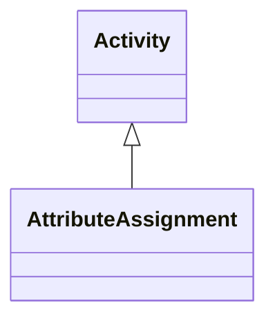

### Inherited Properties

| Defined In | Properties |
|------------|------------|
| AbstractEntity | [`id`](#prop-abstract-entity-id)&nbsp;&#124;&nbsp;[`type`](#prop-abstract-entity-type)&nbsp;&#124;&nbsp;[`_label`](#prop-abstract-entity-_label) |
| Activity | [`carried_out_by`](#prop-activity-carried_out_by)&nbsp;&#124;&nbsp;[`continued`](#prop-activity-continued)&nbsp;&#124;&nbsp;[`continued_by`](#prop-activity-continued_by)&nbsp;&#124;&nbsp;[`general_purpose`](#prop-activity-general_purpose)&nbsp;&#124;&nbsp;[`influenced_by`](#prop-activity-influenced_by)&nbsp;&#124;&nbsp;[`intended_use_of`](#prop-activity-intended_use_of)&nbsp;&#124;&nbsp;[`motivated_by`](#prop-activity-motivated_by)&nbsp;&#124;&nbsp;[`specific_purpose`](#prop-activity-specific_purpose)&nbsp;&#124;&nbsp;[`specific_technique`](#prop-activity-specific_technique)&nbsp;&#124;&nbsp;[`technique`](#prop-activity-technique)&nbsp;&#124;&nbsp;[`used_object_of_type`](#prop-activity-used_object_of_type)&nbsp;&#124;&nbsp;[`used_specific_object`](#prop-activity-used_specific_object) |
| CRMEntity | [`_classifications`](#prop-crmentity-_classifications)&nbsp;&#124;&nbsp;[`_description`](#prop-crmentity-_description)&nbsp;&#124;&nbsp;[`_primaryName`](#prop-crmentity-_primary-name)&nbsp;&#124;&nbsp;[`added_member_by`](#prop-crmentity-added_member_by)&nbsp;&#124;&nbsp;[`assigned_by`](#prop-crmentity-assigned_by)&nbsp;&#124;&nbsp;[`attributed_by`](#prop-crmentity-attributed_by)&nbsp;&#124;&nbsp;[`classified_as`](#prop-crmentity-classified_as)&nbsp;&#124;&nbsp;[`depicted_by`](#prop-crmentity-depicted_by)&nbsp;&#124;&nbsp;[`equivalent`](#prop-crmentity-equivalent)&nbsp;&#124;&nbsp;[`exemplifies`](#prop-crmentity-exemplifies)&nbsp;&#124;&nbsp;[`identified_by`](#prop-crmentity-identified_by)&nbsp;&#124;&nbsp;[`influenced`](#prop-crmentity-influenced)&nbsp;&#124;&nbsp;[`member_of_set`](#prop-crmentity-member_of_set)&nbsp;&#124;&nbsp;[`motivated`](#prop-crmentity-motivated)&nbsp;&#124;&nbsp;[`notation`](#prop-crmentity-notation)&nbsp;&#124;&nbsp;[`note`](#prop-crmentity-note)&nbsp;&#124;&nbsp;[`preferred_identifier`](#prop-crmentity-preferred_identifier)&nbsp;&#124;&nbsp;[`record_provenance`](#prop-crmentity-record_provenance)&nbsp;&#124;&nbsp;[`referred_to_by`](#prop-crmentity-referred_to_by)&nbsp;&#124;&nbsp;[`removed_member_by`](#prop-crmentity-removed_member_by)&nbsp;&#124;&nbsp;[`replaces`](#prop-crmentity-replaces)&nbsp;&#124;&nbsp;[`representation`](#prop-crmentity-representation)&nbsp;&#124;&nbsp;[`subject_of`](#prop-crmentity-subject_of) |
| Event | [`caused`](#prop-event-caused)&nbsp;&#124;&nbsp;[`caused_by`](#prop-event-caused_by)&nbsp;&#124;&nbsp;[`involved`](#prop-event-involved)&nbsp;&#124;&nbsp;[`participant`](#prop-event-participant)&nbsp;&#124;&nbsp;[`specific_purpose_of`](#prop-event-specific_purpose_of) |
| Period | [`part`](#prop-period-part)&nbsp;&#124;&nbsp;[`part_of`](#prop-period-part_of)&nbsp;&#124;&nbsp;[`took_place_at`](#prop-period-took_place_at)&nbsp;&#124;&nbsp;[`took_place_on_or_within`](#prop-period-took_place_on_or_within) |
| SpacetimeVolume | [`distinct_from`](#prop-spacetime-volume-distinct_from)&nbsp;&#124;&nbsp;[`during`](#prop-spacetime-volume-during)&nbsp;&#124;&nbsp;[`includes`](#prop-spacetime-volume-includes)&nbsp;&#124;&nbsp;[`spacetime_volume_is_defined_by`](#prop-spacetime-volume-spacetime_volume_is_defined_by)&nbsp;&#124;&nbsp;[`spatial_projection`](#prop-spacetime-volume-spatial_projection)&nbsp;&#124;&nbsp;[`temporal_projection`](#prop-spacetime-volume-temporal_projection)&nbsp;&#124;&nbsp;[`thing_defined_by`](#prop-spacetime-volume-thing_defined_by)&nbsp;&#124;&nbsp;[`volume_overlaps_with`](#prop-spacetime-volume-volume_overlaps_with) |
| TemporalEntity | [`after`](#prop-temporal-entity-after)&nbsp;&#124;&nbsp;[`before`](#prop-temporal-entity-before)&nbsp;&#124;&nbsp;[`ends_after_or_with_the_start_of`](#prop-temporal-entity-ends_after_or_with_the_start_of)&nbsp;&#124;&nbsp;[`ends_after_the_end_of`](#prop-temporal-entity-ends_after_the_end_of)&nbsp;&#124;&nbsp;[`ends_after_the_start_of`](#prop-temporal-entity-ends_after_the_start_of)&nbsp;&#124;&nbsp;[`ends_before_or_with_the_end_of`](#prop-temporal-entity-ends_before_or_with_the_end_of)&nbsp;&#124;&nbsp;[`ends_before_or_with_the_start_of`](#prop-temporal-entity-ends_before_or_with_the_start_of)&nbsp;&#124;&nbsp;[`ends_before_the_end_of`](#prop-temporal-entity-ends_before_the_end_of)&nbsp;&#124;&nbsp;[`ends_with_or_after_the_end_of`](#prop-temporal-entity-ends_with_or_after_the_end_of)&nbsp;&#124;&nbsp;[`starts_after_or_with_the_end_of`](#prop-temporal-entity-starts_after_or_with_the_end_of)&nbsp;&#124;&nbsp;[`starts_after_the_start_of`](#prop-temporal-entity-starts_after_the_start_of)&nbsp;&#124;&nbsp;[`starts_before_or_with_the_end_of`](#prop-temporal-entity-starts_before_or_with_the_end_of)&nbsp;&#124;&nbsp;[`starts_before_or_with_the_start_of`](#prop-temporal-entity-starts_before_or_with_the_start_of)&nbsp;&#124;&nbsp;[`starts_before_the_end_of`](#prop-temporal-entity-starts_before_the_end_of)&nbsp;&#124;&nbsp;[`starts_before_the_start_of`](#prop-temporal-entity-starts_before_the_start_of)&nbsp;&#124;&nbsp;[`starts_with_or_after_the_start_of`](#prop-temporal-entity-starts_with_or_after_the_start_of)&nbsp;&#124;&nbsp;[`timespan`](#prop-temporal-entity-timespan) |

### Local Properties

| Name | Cardinality | Value | Defined In | Description |
|------|-------------|-------|------------|-------------|
| <a id="prop-attribute-assignment-assigned"></a>`assigned` | `0..*` | `CRMEntity[]` | local | This property indicates the attribute that was assigned or the item that was related to the item denoted by a property P140 assigned attribute to in an Attribute assignment action. |
| <a id="prop-attribute-assignment-assigned_property"></a>`assigned_property` | `1..*` | [Type](#class-type)[] | local | This property associates an instance of E13 Attribute Assignment with the type of property or relation that this assignment maintains to hold between the item to which it assigns an attribute and the attribute itself. Note that the properties defined by the CIDOC CRM also constitute instances of E55 Type themselves. The direction of the assigned property type is understood to be from the attributed item (the range of property P140 assigned attribute to) to the attribute item (the range of the property P141 assigned). More than one property type may be assigned to hold between two items. |
| <a id="prop-attribute-assignment-assigned_to"></a>`assigned_to` | `0..*` | `CRMEntity[]` | local | This property indicates the item to which an attribute or relation is assigned. |
| <a id="prop-attribute-assignment-property_classified_as"></a>`property_classified_as` | `0..*` | [Type](#class-type)[] | local | Record dot one properties via Attribute Assignments |

---

<a id="class-biological-object"></a>
## BiologicalObject

This class comprises individual items of a material nature, which live, have lived or are natural products of or from living organisms. Artificial objects that incorporate biological elements, such as Victorian butterfly frames, can be documented as both instances of E20 Biological Object and E22 Human-Made Object.

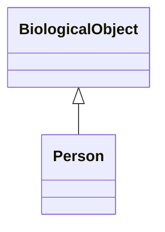

### Inherited Properties

| Defined In | Properties |
|------------|------------|
| AbstractEntity | [`id`](#prop-abstract-entity-id)&nbsp;&#124;&nbsp;[`type`](#prop-abstract-entity-type)&nbsp;&#124;&nbsp;[`_label`](#prop-abstract-entity-_label) |
| CRMEntity | [`_classifications`](#prop-crmentity-_classifications)&nbsp;&#124;&nbsp;[`_description`](#prop-crmentity-_description)&nbsp;&#124;&nbsp;[`_primaryName`](#prop-crmentity-_primary-name)&nbsp;&#124;&nbsp;[`added_member_by`](#prop-crmentity-added_member_by)&nbsp;&#124;&nbsp;[`assigned_by`](#prop-crmentity-assigned_by)&nbsp;&#124;&nbsp;[`attributed_by`](#prop-crmentity-attributed_by)&nbsp;&#124;&nbsp;[`classified_as`](#prop-crmentity-classified_as)&nbsp;&#124;&nbsp;[`depicted_by`](#prop-crmentity-depicted_by)&nbsp;&#124;&nbsp;[`equivalent`](#prop-crmentity-equivalent)&nbsp;&#124;&nbsp;[`exemplifies`](#prop-crmentity-exemplifies)&nbsp;&#124;&nbsp;[`identified_by`](#prop-crmentity-identified_by)&nbsp;&#124;&nbsp;[`influenced`](#prop-crmentity-influenced)&nbsp;&#124;&nbsp;[`member_of_set`](#prop-crmentity-member_of_set)&nbsp;&#124;&nbsp;[`motivated`](#prop-crmentity-motivated)&nbsp;&#124;&nbsp;[`notation`](#prop-crmentity-notation)&nbsp;&#124;&nbsp;[`note`](#prop-crmentity-note)&nbsp;&#124;&nbsp;[`preferred_identifier`](#prop-crmentity-preferred_identifier)&nbsp;&#124;&nbsp;[`record_provenance`](#prop-crmentity-record_provenance)&nbsp;&#124;&nbsp;[`referred_to_by`](#prop-crmentity-referred_to_by)&nbsp;&#124;&nbsp;[`removed_member_by`](#prop-crmentity-removed_member_by)&nbsp;&#124;&nbsp;[`replaces`](#prop-crmentity-replaces)&nbsp;&#124;&nbsp;[`representation`](#prop-crmentity-representation)&nbsp;&#124;&nbsp;[`subject_of`](#prop-crmentity-subject_of) |
| LegalObject | [`right_held_by`](#prop-legal-object-right_held_by)&nbsp;&#124;&nbsp;[`subject_to`](#prop-legal-object-subject_to) |
| PersistentItem | [`brought_into_existence_by`](#prop-persistent-item-brought_into_existence_by)&nbsp;&#124;&nbsp;[`present_at`](#prop-persistent-item-present_at)&nbsp;&#124;&nbsp;[`taken_out_of_existence_by`](#prop-persistent-item-taken_out_of_existence_by) |
| PhysicalObject | [`bears`](#prop-physical-object-bears)&nbsp;&#124;&nbsp;[`current_permanent_custodian`](#prop-physical-object-current_permanent_custodian)&nbsp;&#124;&nbsp;[`moved_by`](#prop-physical-object-moved_by)&nbsp;&#124;&nbsp;[`number_of_parts`](#prop-physical-object-number_of_parts) |
| PhysicalThing | [`added_by`](#prop-physical-thing-added_by)&nbsp;&#124;&nbsp;[`carries`](#prop-physical-thing-carries)&nbsp;&#124;&nbsp;[`changed_ownership_through`](#prop-physical-thing-changed_ownership_through)&nbsp;&#124;&nbsp;[`contains_members_of`](#prop-physical-thing-contains_members_of)&nbsp;&#124;&nbsp;[`current_custodian`](#prop-physical-thing-current_custodian)&nbsp;&#124;&nbsp;[`current_location`](#prop-physical-thing-current_location)&nbsp;&#124;&nbsp;[`current_owner`](#prop-physical-thing-current_owner)&nbsp;&#124;&nbsp;[`current_permanent_location`](#prop-physical-thing-current_permanent_location)&nbsp;&#124;&nbsp;[`custody_transferred_through`](#prop-physical-thing-custody_transferred_through)&nbsp;&#124;&nbsp;[`defines`](#prop-physical-thing-defines)&nbsp;&#124;&nbsp;[`destroyed_by`](#prop-physical-thing-destroyed_by)&nbsp;&#124;&nbsp;[`encountered_by`](#prop-physical-thing-encountered_by)&nbsp;&#124;&nbsp;[`former_or_current_keeper`](#prop-physical-thing-former_or_current_keeper)&nbsp;&#124;&nbsp;[`former_or_current_location`](#prop-physical-thing-former_or_current_location)&nbsp;&#124;&nbsp;[`former_or_current_owner`](#prop-physical-thing-former_or_current_owner)&nbsp;&#124;&nbsp;[`held_or_supported_by`](#prop-physical-thing-held_or_supported_by)&nbsp;&#124;&nbsp;[`holds_or_supports`](#prop-physical-thing-holds_or_supports)&nbsp;&#124;&nbsp;[`made_of`](#prop-physical-thing-made_of)&nbsp;&#124;&nbsp;[`occupies`](#prop-physical-thing-occupies)&nbsp;&#124;&nbsp;[`part`](#prop-physical-thing-part)&nbsp;&#124;&nbsp;[`part_of`](#prop-physical-thing-part_of)&nbsp;&#124;&nbsp;[`provides_reference_space_for`](#prop-physical-thing-provides_reference_space_for)&nbsp;&#124;&nbsp;[`removed_by`](#prop-physical-thing-removed_by)&nbsp;&#124;&nbsp;[`resulted_from`](#prop-physical-thing-resulted_from)&nbsp;&#124;&nbsp;[`section`](#prop-physical-thing-section)&nbsp;&#124;&nbsp;[`transformed_by`](#prop-physical-thing-transformed_by)&nbsp;&#124;&nbsp;[`witnessed`](#prop-physical-thing-witnessed) |
| SpacetimeVolume | [`distinct_from`](#prop-spacetime-volume-distinct_from)&nbsp;&#124;&nbsp;[`during`](#prop-spacetime-volume-during)&nbsp;&#124;&nbsp;[`includes`](#prop-spacetime-volume-includes)&nbsp;&#124;&nbsp;[`spacetime_volume_is_defined_by`](#prop-spacetime-volume-spacetime_volume_is_defined_by)&nbsp;&#124;&nbsp;[`spatial_projection`](#prop-spacetime-volume-spatial_projection)&nbsp;&#124;&nbsp;[`temporal_projection`](#prop-spacetime-volume-temporal_projection)&nbsp;&#124;&nbsp;[`thing_defined_by`](#prop-spacetime-volume-thing_defined_by)&nbsp;&#124;&nbsp;[`volume_overlaps_with`](#prop-spacetime-volume-volume_overlaps_with) |
| Thing | [`dimension`](#prop-thing-dimension)&nbsp;&#124;&nbsp;[`features_are_also_found_on`](#prop-thing-features_are_also_found_on)&nbsp;&#124;&nbsp;[`general_use`](#prop-thing-general_use)&nbsp;&#124;&nbsp;[`shows_features_of`](#prop-thing-shows_features_of)&nbsp;&#124;&nbsp;[`used_for`](#prop-thing-used_for) |

### Local Properties

This class defines no local properties.

---

<a id="class-birth"></a>
## Birth

This class comprises the births of human beings. E67 Birth is a biological event focussing on the context of people coming into life. (E63 Beginning of Existence comprises the coming into life of any living beings). Twins, triplets etc. are brought into life by the same E67 Birth event. The introduction of the E67 Birth event as a documentation element allows the description of a range of family relationships in a simple model. Suitable extensions may describe more details and the complexity of motherhood with the intervention of modern medicine. In this model, the biological father is not seen as a necessary participant in the E67 Birth event.

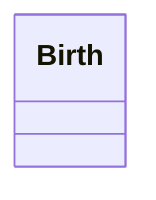

### Inherited Properties

| Defined In | Properties |
|------------|------------|
| AbstractEntity | [`id`](#prop-abstract-entity-id)&nbsp;&#124;&nbsp;[`type`](#prop-abstract-entity-type)&nbsp;&#124;&nbsp;[`_label`](#prop-abstract-entity-_label) |
| BeginningOfExistence | [`brought_into_existence`](#prop-beginning-of-existence-brought_into_existence) |
| CRMEntity | [`_classifications`](#prop-crmentity-_classifications)&nbsp;&#124;&nbsp;[`_description`](#prop-crmentity-_description)&nbsp;&#124;&nbsp;[`_primaryName`](#prop-crmentity-_primary-name)&nbsp;&#124;&nbsp;[`added_member_by`](#prop-crmentity-added_member_by)&nbsp;&#124;&nbsp;[`assigned_by`](#prop-crmentity-assigned_by)&nbsp;&#124;&nbsp;[`attributed_by`](#prop-crmentity-attributed_by)&nbsp;&#124;&nbsp;[`classified_as`](#prop-crmentity-classified_as)&nbsp;&#124;&nbsp;[`depicted_by`](#prop-crmentity-depicted_by)&nbsp;&#124;&nbsp;[`equivalent`](#prop-crmentity-equivalent)&nbsp;&#124;&nbsp;[`exemplifies`](#prop-crmentity-exemplifies)&nbsp;&#124;&nbsp;[`identified_by`](#prop-crmentity-identified_by)&nbsp;&#124;&nbsp;[`influenced`](#prop-crmentity-influenced)&nbsp;&#124;&nbsp;[`member_of_set`](#prop-crmentity-member_of_set)&nbsp;&#124;&nbsp;[`motivated`](#prop-crmentity-motivated)&nbsp;&#124;&nbsp;[`notation`](#prop-crmentity-notation)&nbsp;&#124;&nbsp;[`note`](#prop-crmentity-note)&nbsp;&#124;&nbsp;[`preferred_identifier`](#prop-crmentity-preferred_identifier)&nbsp;&#124;&nbsp;[`record_provenance`](#prop-crmentity-record_provenance)&nbsp;&#124;&nbsp;[`referred_to_by`](#prop-crmentity-referred_to_by)&nbsp;&#124;&nbsp;[`removed_member_by`](#prop-crmentity-removed_member_by)&nbsp;&#124;&nbsp;[`replaces`](#prop-crmentity-replaces)&nbsp;&#124;&nbsp;[`representation`](#prop-crmentity-representation)&nbsp;&#124;&nbsp;[`subject_of`](#prop-crmentity-subject_of) |
| Event | [`caused`](#prop-event-caused)&nbsp;&#124;&nbsp;[`caused_by`](#prop-event-caused_by)&nbsp;&#124;&nbsp;[`involved`](#prop-event-involved)&nbsp;&#124;&nbsp;[`participant`](#prop-event-participant)&nbsp;&#124;&nbsp;[`specific_purpose_of`](#prop-event-specific_purpose_of) |
| Period | [`part`](#prop-period-part)&nbsp;&#124;&nbsp;[`part_of`](#prop-period-part_of)&nbsp;&#124;&nbsp;[`took_place_at`](#prop-period-took_place_at)&nbsp;&#124;&nbsp;[`took_place_on_or_within`](#prop-period-took_place_on_or_within) |
| SpacetimeVolume | [`distinct_from`](#prop-spacetime-volume-distinct_from)&nbsp;&#124;&nbsp;[`during`](#prop-spacetime-volume-during)&nbsp;&#124;&nbsp;[`includes`](#prop-spacetime-volume-includes)&nbsp;&#124;&nbsp;[`spacetime_volume_is_defined_by`](#prop-spacetime-volume-spacetime_volume_is_defined_by)&nbsp;&#124;&nbsp;[`spatial_projection`](#prop-spacetime-volume-spatial_projection)&nbsp;&#124;&nbsp;[`temporal_projection`](#prop-spacetime-volume-temporal_projection)&nbsp;&#124;&nbsp;[`thing_defined_by`](#prop-spacetime-volume-thing_defined_by)&nbsp;&#124;&nbsp;[`volume_overlaps_with`](#prop-spacetime-volume-volume_overlaps_with) |
| TemporalEntity | [`after`](#prop-temporal-entity-after)&nbsp;&#124;&nbsp;[`before`](#prop-temporal-entity-before)&nbsp;&#124;&nbsp;[`ends_after_or_with_the_start_of`](#prop-temporal-entity-ends_after_or_with_the_start_of)&nbsp;&#124;&nbsp;[`ends_after_the_end_of`](#prop-temporal-entity-ends_after_the_end_of)&nbsp;&#124;&nbsp;[`ends_after_the_start_of`](#prop-temporal-entity-ends_after_the_start_of)&nbsp;&#124;&nbsp;[`ends_before_or_with_the_end_of`](#prop-temporal-entity-ends_before_or_with_the_end_of)&nbsp;&#124;&nbsp;[`ends_before_or_with_the_start_of`](#prop-temporal-entity-ends_before_or_with_the_start_of)&nbsp;&#124;&nbsp;[`ends_before_the_end_of`](#prop-temporal-entity-ends_before_the_end_of)&nbsp;&#124;&nbsp;[`ends_with_or_after_the_end_of`](#prop-temporal-entity-ends_with_or_after_the_end_of)&nbsp;&#124;&nbsp;[`starts_after_or_with_the_end_of`](#prop-temporal-entity-starts_after_or_with_the_end_of)&nbsp;&#124;&nbsp;[`starts_after_the_start_of`](#prop-temporal-entity-starts_after_the_start_of)&nbsp;&#124;&nbsp;[`starts_before_or_with_the_end_of`](#prop-temporal-entity-starts_before_or_with_the_end_of)&nbsp;&#124;&nbsp;[`starts_before_or_with_the_start_of`](#prop-temporal-entity-starts_before_or_with_the_start_of)&nbsp;&#124;&nbsp;[`starts_before_the_end_of`](#prop-temporal-entity-starts_before_the_end_of)&nbsp;&#124;&nbsp;[`starts_before_the_start_of`](#prop-temporal-entity-starts_before_the_start_of)&nbsp;&#124;&nbsp;[`starts_with_or_after_the_start_of`](#prop-temporal-entity-starts_with_or_after_the_start_of)&nbsp;&#124;&nbsp;[`timespan`](#prop-temporal-entity-timespan) |

### Local Properties

| Name | Cardinality | Value | Defined In | Description |
|------|-------------|-------|------------|-------------|
| <a id="prop-birth-brought_into_life"></a>`brought_into_life` | `0..*` | [Person](#class-person)[] | local | This property links an E67Birth event to an E21 Person in the role of offspring. Twins, triplets etc. are brought into life by the same Birth event. This is not intended for use with general Natural History material, only people. There is no explicit method for modelling conception and gestation except by using extensions. |
| <a id="prop-birth-by_mother"></a>`by_mother` | `1` | [Person](#class-person) | local | This property links an E67 Birth event to an E21 Person as a participant in the role of birth-giving mother. Note that biological fathers are not necessarily participants in the Birth (see P97 from father (was father for)). The Person being born is linked to the Birth with the property P98 brought into life (was born). This is not intended for use with general natural history material, only people. There is no explicit method for modelling conception and gestation except by using extensions. This is a sub-property of P11 had participant (participated in). |
| <a id="prop-birth-from_father"></a>`from_father` | `1` | [Person](#class-person) | local | This property links an E67 Birth event to an E21 Person in the role of biological father. Note that biological fathers are not seen as necessary participants in the Birth, whereas birth-giving mothers are (see P96 by mother (gave birth)). The Person being born is linked to the Birth with the property P98 brought into life (was born). This is not intended for use with general natural history material, only people. There is no explicit method for modelling conception and gestation except by using extensions. A Birth event is normally (but not always) associated with one biological father. |

---

<a id="class-creation"></a>
## Creation

This class comprises events that result in the creation of conceptual items or immaterial products, such as legends, poems, texts, music, images, movies, laws, types etc.

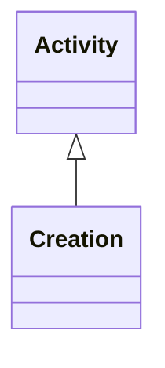

### Inherited Properties

| Defined In | Properties |
|------------|------------|
| AbstractEntity | [`id`](#prop-abstract-entity-id)&nbsp;&#124;&nbsp;[`type`](#prop-abstract-entity-type)&nbsp;&#124;&nbsp;[`_label`](#prop-abstract-entity-_label) |
| Activity | [`carried_out_by`](#prop-activity-carried_out_by)&nbsp;&#124;&nbsp;[`continued`](#prop-activity-continued)&nbsp;&#124;&nbsp;[`continued_by`](#prop-activity-continued_by)&nbsp;&#124;&nbsp;[`general_purpose`](#prop-activity-general_purpose)&nbsp;&#124;&nbsp;[`influenced_by`](#prop-activity-influenced_by)&nbsp;&#124;&nbsp;[`intended_use_of`](#prop-activity-intended_use_of)&nbsp;&#124;&nbsp;[`motivated_by`](#prop-activity-motivated_by)&nbsp;&#124;&nbsp;[`specific_purpose`](#prop-activity-specific_purpose)&nbsp;&#124;&nbsp;[`specific_technique`](#prop-activity-specific_technique)&nbsp;&#124;&nbsp;[`technique`](#prop-activity-technique)&nbsp;&#124;&nbsp;[`used_object_of_type`](#prop-activity-used_object_of_type)&nbsp;&#124;&nbsp;[`used_specific_object`](#prop-activity-used_specific_object) |
| BeginningOfExistence | [`brought_into_existence`](#prop-beginning-of-existence-brought_into_existence) |
| CRMEntity | [`_classifications`](#prop-crmentity-_classifications)&nbsp;&#124;&nbsp;[`_description`](#prop-crmentity-_description)&nbsp;&#124;&nbsp;[`_primaryName`](#prop-crmentity-_primary-name)&nbsp;&#124;&nbsp;[`added_member_by`](#prop-crmentity-added_member_by)&nbsp;&#124;&nbsp;[`assigned_by`](#prop-crmentity-assigned_by)&nbsp;&#124;&nbsp;[`attributed_by`](#prop-crmentity-attributed_by)&nbsp;&#124;&nbsp;[`classified_as`](#prop-crmentity-classified_as)&nbsp;&#124;&nbsp;[`depicted_by`](#prop-crmentity-depicted_by)&nbsp;&#124;&nbsp;[`equivalent`](#prop-crmentity-equivalent)&nbsp;&#124;&nbsp;[`exemplifies`](#prop-crmentity-exemplifies)&nbsp;&#124;&nbsp;[`identified_by`](#prop-crmentity-identified_by)&nbsp;&#124;&nbsp;[`influenced`](#prop-crmentity-influenced)&nbsp;&#124;&nbsp;[`member_of_set`](#prop-crmentity-member_of_set)&nbsp;&#124;&nbsp;[`motivated`](#prop-crmentity-motivated)&nbsp;&#124;&nbsp;[`notation`](#prop-crmentity-notation)&nbsp;&#124;&nbsp;[`note`](#prop-crmentity-note)&nbsp;&#124;&nbsp;[`preferred_identifier`](#prop-crmentity-preferred_identifier)&nbsp;&#124;&nbsp;[`record_provenance`](#prop-crmentity-record_provenance)&nbsp;&#124;&nbsp;[`referred_to_by`](#prop-crmentity-referred_to_by)&nbsp;&#124;&nbsp;[`removed_member_by`](#prop-crmentity-removed_member_by)&nbsp;&#124;&nbsp;[`replaces`](#prop-crmentity-replaces)&nbsp;&#124;&nbsp;[`representation`](#prop-crmentity-representation)&nbsp;&#124;&nbsp;[`subject_of`](#prop-crmentity-subject_of) |
| Event | [`caused`](#prop-event-caused)&nbsp;&#124;&nbsp;[`caused_by`](#prop-event-caused_by)&nbsp;&#124;&nbsp;[`involved`](#prop-event-involved)&nbsp;&#124;&nbsp;[`participant`](#prop-event-participant)&nbsp;&#124;&nbsp;[`specific_purpose_of`](#prop-event-specific_purpose_of) |
| Period | [`part`](#prop-period-part)&nbsp;&#124;&nbsp;[`part_of`](#prop-period-part_of)&nbsp;&#124;&nbsp;[`took_place_at`](#prop-period-took_place_at)&nbsp;&#124;&nbsp;[`took_place_on_or_within`](#prop-period-took_place_on_or_within) |
| SpacetimeVolume | [`distinct_from`](#prop-spacetime-volume-distinct_from)&nbsp;&#124;&nbsp;[`during`](#prop-spacetime-volume-during)&nbsp;&#124;&nbsp;[`includes`](#prop-spacetime-volume-includes)&nbsp;&#124;&nbsp;[`spacetime_volume_is_defined_by`](#prop-spacetime-volume-spacetime_volume_is_defined_by)&nbsp;&#124;&nbsp;[`spatial_projection`](#prop-spacetime-volume-spatial_projection)&nbsp;&#124;&nbsp;[`temporal_projection`](#prop-spacetime-volume-temporal_projection)&nbsp;&#124;&nbsp;[`thing_defined_by`](#prop-spacetime-volume-thing_defined_by)&nbsp;&#124;&nbsp;[`volume_overlaps_with`](#prop-spacetime-volume-volume_overlaps_with) |
| TemporalEntity | [`after`](#prop-temporal-entity-after)&nbsp;&#124;&nbsp;[`before`](#prop-temporal-entity-before)&nbsp;&#124;&nbsp;[`ends_after_or_with_the_start_of`](#prop-temporal-entity-ends_after_or_with_the_start_of)&nbsp;&#124;&nbsp;[`ends_after_the_end_of`](#prop-temporal-entity-ends_after_the_end_of)&nbsp;&#124;&nbsp;[`ends_after_the_start_of`](#prop-temporal-entity-ends_after_the_start_of)&nbsp;&#124;&nbsp;[`ends_before_or_with_the_end_of`](#prop-temporal-entity-ends_before_or_with_the_end_of)&nbsp;&#124;&nbsp;[`ends_before_or_with_the_start_of`](#prop-temporal-entity-ends_before_or_with_the_start_of)&nbsp;&#124;&nbsp;[`ends_before_the_end_of`](#prop-temporal-entity-ends_before_the_end_of)&nbsp;&#124;&nbsp;[`ends_with_or_after_the_end_of`](#prop-temporal-entity-ends_with_or_after_the_end_of)&nbsp;&#124;&nbsp;[`starts_after_or_with_the_end_of`](#prop-temporal-entity-starts_after_or_with_the_end_of)&nbsp;&#124;&nbsp;[`starts_after_the_start_of`](#prop-temporal-entity-starts_after_the_start_of)&nbsp;&#124;&nbsp;[`starts_before_or_with_the_end_of`](#prop-temporal-entity-starts_before_or_with_the_end_of)&nbsp;&#124;&nbsp;[`starts_before_or_with_the_start_of`](#prop-temporal-entity-starts_before_or_with_the_start_of)&nbsp;&#124;&nbsp;[`starts_before_the_end_of`](#prop-temporal-entity-starts_before_the_end_of)&nbsp;&#124;&nbsp;[`starts_before_the_start_of`](#prop-temporal-entity-starts_before_the_start_of)&nbsp;&#124;&nbsp;[`starts_with_or_after_the_start_of`](#prop-temporal-entity-starts_with_or_after_the_start_of)&nbsp;&#124;&nbsp;[`timespan`](#prop-temporal-entity-timespan) |

### Local Properties

| Name | Cardinality | Value | Defined In | Description |
|------|-------------|-------|------------|-------------|
| <a id="prop-creation-created"></a>`created` | `1..*` | `ConceptualObject[]` | local | This property allows a conceptual E65 Creation to be linked to the E28 Conceptual Object created by it. It represents the act of conceiving the intellectual content of the E28 Conceptual Object. It does not represent the act of creating the first physical carrier of the E28 Conceptual Object. As an example, this is the composition of a poem, not its commitment to paper. |

---

<a id="class-currency"></a>
## Currency

This class comprises the units in which a monetary system, supported by an administrative authority or other community, quantifies and arithmetically compares all monetary amounts declared in the unit. The unit of a monetary system must describe a nominal value which is kept constant by its administrative authority and an associated banking system if it exists, and not by market value. For instance, one may pay with grams of gold, but the respective monetary amount would have been agreed as the gold price in US dollars on the day of the payment. Under this definition, British Pounds, U.S. Dollars, and European Euros are examples of currency, but “grams of gold” is not. One monetary system has one and only one currency. Instances of this class must not be confused with coin denominations, such as “Dime” or “Sestertius”. Non-monetary exchange of value in terms of quantities of a particular type of goods, such as cows, do not constitute a currency.

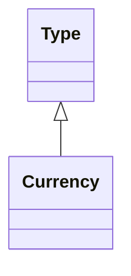

### Inherited Properties

| Defined In | Properties |
|------------|------------|
| AbstractEntity | [`id`](#prop-abstract-entity-id)&nbsp;&#124;&nbsp;[`type`](#prop-abstract-entity-type)&nbsp;&#124;&nbsp;[`_label`](#prop-abstract-entity-_label) |
| ConceptualObject | [`created_by`](#prop-conceptual-object-created_by) |
| CRMEntity | [`_classifications`](#prop-crmentity-_classifications)&nbsp;&#124;&nbsp;[`_description`](#prop-crmentity-_description)&nbsp;&#124;&nbsp;[`_primaryName`](#prop-crmentity-_primary-name)&nbsp;&#124;&nbsp;[`added_member_by`](#prop-crmentity-added_member_by)&nbsp;&#124;&nbsp;[`assigned_by`](#prop-crmentity-assigned_by)&nbsp;&#124;&nbsp;[`attributed_by`](#prop-crmentity-attributed_by)&nbsp;&#124;&nbsp;[`classified_as`](#prop-crmentity-classified_as)&nbsp;&#124;&nbsp;[`depicted_by`](#prop-crmentity-depicted_by)&nbsp;&#124;&nbsp;[`equivalent`](#prop-crmentity-equivalent)&nbsp;&#124;&nbsp;[`exemplifies`](#prop-crmentity-exemplifies)&nbsp;&#124;&nbsp;[`identified_by`](#prop-crmentity-identified_by)&nbsp;&#124;&nbsp;[`influenced`](#prop-crmentity-influenced)&nbsp;&#124;&nbsp;[`member_of_set`](#prop-crmentity-member_of_set)&nbsp;&#124;&nbsp;[`motivated`](#prop-crmentity-motivated)&nbsp;&#124;&nbsp;[`notation`](#prop-crmentity-notation)&nbsp;&#124;&nbsp;[`note`](#prop-crmentity-note)&nbsp;&#124;&nbsp;[`preferred_identifier`](#prop-crmentity-preferred_identifier)&nbsp;&#124;&nbsp;[`record_provenance`](#prop-crmentity-record_provenance)&nbsp;&#124;&nbsp;[`referred_to_by`](#prop-crmentity-referred_to_by)&nbsp;&#124;&nbsp;[`removed_member_by`](#prop-crmentity-removed_member_by)&nbsp;&#124;&nbsp;[`replaces`](#prop-crmentity-replaces)&nbsp;&#124;&nbsp;[`representation`](#prop-crmentity-representation)&nbsp;&#124;&nbsp;[`subject_of`](#prop-crmentity-subject_of) |
| HumanMadeThing | [`conformsTo`](#prop-human-made-thing-conforms-to)&nbsp;&#124;&nbsp;[`intended_for`](#prop-human-made-thing-intended_for)&nbsp;&#124;&nbsp;[`made_for`](#prop-human-made-thing-made_for)&nbsp;&#124;&nbsp;[`title`](#prop-human-made-thing-title) |
| PersistentItem | [`brought_into_existence_by`](#prop-persistent-item-brought_into_existence_by)&nbsp;&#124;&nbsp;[`present_at`](#prop-persistent-item-present_at)&nbsp;&#124;&nbsp;[`taken_out_of_existence_by`](#prop-persistent-item-taken_out_of_existence_by) |
| Thing | [`dimension`](#prop-thing-dimension)&nbsp;&#124;&nbsp;[`features_are_also_found_on`](#prop-thing-features_are_also_found_on)&nbsp;&#124;&nbsp;[`general_use`](#prop-thing-general_use)&nbsp;&#124;&nbsp;[`shows_features_of`](#prop-thing-shows_features_of)&nbsp;&#124;&nbsp;[`used_for`](#prop-thing-used_for) |
| Type | [`broader`](#prop-type-broader)&nbsp;&#124;&nbsp;[`defines_typical_parts_of`](#prop-type-defines_typical_parts_of)&nbsp;&#124;&nbsp;[`defines_typical_wholes_for`](#prop-type-defines_typical_wholes_for)&nbsp;&#124;&nbsp;[`exemplified_by`](#prop-type-exemplified_by)&nbsp;&#124;&nbsp;[`instance_represented_by`](#prop-type-instance_represented_by)&nbsp;&#124;&nbsp;[`intention_of`](#prop-type-intention_of)&nbsp;&#124;&nbsp;[`narrower`](#prop-type-narrower)&nbsp;&#124;&nbsp;[`purpose_of`](#prop-type-purpose_of)&nbsp;&#124;&nbsp;[`technique_of`](#prop-type-technique_of)&nbsp;&#124;&nbsp;[`type_of`](#prop-type-type_of)&nbsp;&#124;&nbsp;[`type_of_object_used_in`](#prop-type-type_of_object_used_in)&nbsp;&#124;&nbsp;[`use_of`](#prop-type-use_of) |

### Local Properties

| Name | Cardinality | Value | Defined In | Description |
|------|-------------|-------|------------|-------------|
| <a id="prop-currency-currency_of"></a>`currency_of` | `0..*` | [MonetaryAmount](#class-monetary-amount)[] | local | Inverse of P180 |

---

<a id="class-death"></a>
## Death

This class comprises the deaths of human beings. If a person is killed, their death should be instantiated as E69 Death and as E7 Activity. The death or perishing of other living beings should be documented using E64 End of Existence.

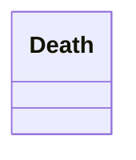

### Inherited Properties

| Defined In | Properties |
|------------|------------|
| AbstractEntity | [`id`](#prop-abstract-entity-id)&nbsp;&#124;&nbsp;[`type`](#prop-abstract-entity-type)&nbsp;&#124;&nbsp;[`_label`](#prop-abstract-entity-_label) |
| CRMEntity | [`_classifications`](#prop-crmentity-_classifications)&nbsp;&#124;&nbsp;[`_description`](#prop-crmentity-_description)&nbsp;&#124;&nbsp;[`_primaryName`](#prop-crmentity-_primary-name)&nbsp;&#124;&nbsp;[`added_member_by`](#prop-crmentity-added_member_by)&nbsp;&#124;&nbsp;[`assigned_by`](#prop-crmentity-assigned_by)&nbsp;&#124;&nbsp;[`attributed_by`](#prop-crmentity-attributed_by)&nbsp;&#124;&nbsp;[`classified_as`](#prop-crmentity-classified_as)&nbsp;&#124;&nbsp;[`depicted_by`](#prop-crmentity-depicted_by)&nbsp;&#124;&nbsp;[`equivalent`](#prop-crmentity-equivalent)&nbsp;&#124;&nbsp;[`exemplifies`](#prop-crmentity-exemplifies)&nbsp;&#124;&nbsp;[`identified_by`](#prop-crmentity-identified_by)&nbsp;&#124;&nbsp;[`influenced`](#prop-crmentity-influenced)&nbsp;&#124;&nbsp;[`member_of_set`](#prop-crmentity-member_of_set)&nbsp;&#124;&nbsp;[`motivated`](#prop-crmentity-motivated)&nbsp;&#124;&nbsp;[`notation`](#prop-crmentity-notation)&nbsp;&#124;&nbsp;[`note`](#prop-crmentity-note)&nbsp;&#124;&nbsp;[`preferred_identifier`](#prop-crmentity-preferred_identifier)&nbsp;&#124;&nbsp;[`record_provenance`](#prop-crmentity-record_provenance)&nbsp;&#124;&nbsp;[`referred_to_by`](#prop-crmentity-referred_to_by)&nbsp;&#124;&nbsp;[`removed_member_by`](#prop-crmentity-removed_member_by)&nbsp;&#124;&nbsp;[`replaces`](#prop-crmentity-replaces)&nbsp;&#124;&nbsp;[`representation`](#prop-crmentity-representation)&nbsp;&#124;&nbsp;[`subject_of`](#prop-crmentity-subject_of) |
| EndOfExistence | [`took_out_of_existence`](#prop-end-of-existence-took_out_of_existence) |
| Event | [`caused`](#prop-event-caused)&nbsp;&#124;&nbsp;[`caused_by`](#prop-event-caused_by)&nbsp;&#124;&nbsp;[`involved`](#prop-event-involved)&nbsp;&#124;&nbsp;[`participant`](#prop-event-participant)&nbsp;&#124;&nbsp;[`specific_purpose_of`](#prop-event-specific_purpose_of) |
| Period | [`part`](#prop-period-part)&nbsp;&#124;&nbsp;[`part_of`](#prop-period-part_of)&nbsp;&#124;&nbsp;[`took_place_at`](#prop-period-took_place_at)&nbsp;&#124;&nbsp;[`took_place_on_or_within`](#prop-period-took_place_on_or_within) |
| SpacetimeVolume | [`distinct_from`](#prop-spacetime-volume-distinct_from)&nbsp;&#124;&nbsp;[`during`](#prop-spacetime-volume-during)&nbsp;&#124;&nbsp;[`includes`](#prop-spacetime-volume-includes)&nbsp;&#124;&nbsp;[`spacetime_volume_is_defined_by`](#prop-spacetime-volume-spacetime_volume_is_defined_by)&nbsp;&#124;&nbsp;[`spatial_projection`](#prop-spacetime-volume-spatial_projection)&nbsp;&#124;&nbsp;[`temporal_projection`](#prop-spacetime-volume-temporal_projection)&nbsp;&#124;&nbsp;[`thing_defined_by`](#prop-spacetime-volume-thing_defined_by)&nbsp;&#124;&nbsp;[`volume_overlaps_with`](#prop-spacetime-volume-volume_overlaps_with) |
| TemporalEntity | [`after`](#prop-temporal-entity-after)&nbsp;&#124;&nbsp;[`before`](#prop-temporal-entity-before)&nbsp;&#124;&nbsp;[`ends_after_or_with_the_start_of`](#prop-temporal-entity-ends_after_or_with_the_start_of)&nbsp;&#124;&nbsp;[`ends_after_the_end_of`](#prop-temporal-entity-ends_after_the_end_of)&nbsp;&#124;&nbsp;[`ends_after_the_start_of`](#prop-temporal-entity-ends_after_the_start_of)&nbsp;&#124;&nbsp;[`ends_before_or_with_the_end_of`](#prop-temporal-entity-ends_before_or_with_the_end_of)&nbsp;&#124;&nbsp;[`ends_before_or_with_the_start_of`](#prop-temporal-entity-ends_before_or_with_the_start_of)&nbsp;&#124;&nbsp;[`ends_before_the_end_of`](#prop-temporal-entity-ends_before_the_end_of)&nbsp;&#124;&nbsp;[`ends_with_or_after_the_end_of`](#prop-temporal-entity-ends_with_or_after_the_end_of)&nbsp;&#124;&nbsp;[`starts_after_or_with_the_end_of`](#prop-temporal-entity-starts_after_or_with_the_end_of)&nbsp;&#124;&nbsp;[`starts_after_the_start_of`](#prop-temporal-entity-starts_after_the_start_of)&nbsp;&#124;&nbsp;[`starts_before_or_with_the_end_of`](#prop-temporal-entity-starts_before_or_with_the_end_of)&nbsp;&#124;&nbsp;[`starts_before_or_with_the_start_of`](#prop-temporal-entity-starts_before_or_with_the_start_of)&nbsp;&#124;&nbsp;[`starts_before_the_end_of`](#prop-temporal-entity-starts_before_the_end_of)&nbsp;&#124;&nbsp;[`starts_before_the_start_of`](#prop-temporal-entity-starts_before_the_start_of)&nbsp;&#124;&nbsp;[`starts_with_or_after_the_start_of`](#prop-temporal-entity-starts_with_or_after_the_start_of)&nbsp;&#124;&nbsp;[`timespan`](#prop-temporal-entity-timespan) |

### Local Properties

| Name | Cardinality | Value | Defined In | Description |
|------|-------------|-------|------------|-------------|
| <a id="prop-death-death_of"></a>`death_of` | `1..*` | [Person](#class-person)[] | local | This property property links an E69 Death event to the E21 Person that died. |

---

<a id="class-design-or-procedure"></a>
## DesignOrProcedure

This class comprises documented plans for the execution of actions in order to achieve a result of a specific quality, form or contents. In particular it comprises plans for deliberate human activities that may result in the modification or production of instances of E71 Human-Made Thing. Instances of E29 Design or Procedure can be structured in parts and sequences or depend on others. This is modelled using P69 has association with (is associated with). Designs or procedures can be seen as one of the following: 1. A schema for the activities it describes 2. A schema of the products that result from their application. 3. An independent intellectual product that may have never been applied, such as Leonardo da Vinci’s famous plans for flying machines. Because designs or procedures may never be applied or only partially executed, the CRM models a loose relationship between the plan and the respective product.

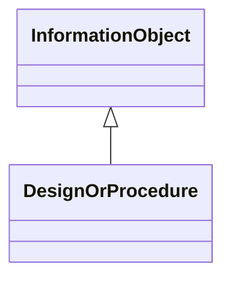

### Inherited Properties

| Defined In | Properties |
|------------|------------|
| AbstractEntity | [`id`](#prop-abstract-entity-id)&nbsp;&#124;&nbsp;[`type`](#prop-abstract-entity-type)&nbsp;&#124;&nbsp;[`_label`](#prop-abstract-entity-_label) |
| ConceptualObject | [`created_by`](#prop-conceptual-object-created_by) |
| CRMEntity | [`_classifications`](#prop-crmentity-_classifications)&nbsp;&#124;&nbsp;[`_description`](#prop-crmentity-_description)&nbsp;&#124;&nbsp;[`_primaryName`](#prop-crmentity-_primary-name)&nbsp;&#124;&nbsp;[`added_member_by`](#prop-crmentity-added_member_by)&nbsp;&#124;&nbsp;[`assigned_by`](#prop-crmentity-assigned_by)&nbsp;&#124;&nbsp;[`attributed_by`](#prop-crmentity-attributed_by)&nbsp;&#124;&nbsp;[`classified_as`](#prop-crmentity-classified_as)&nbsp;&#124;&nbsp;[`depicted_by`](#prop-crmentity-depicted_by)&nbsp;&#124;&nbsp;[`equivalent`](#prop-crmentity-equivalent)&nbsp;&#124;&nbsp;[`exemplifies`](#prop-crmentity-exemplifies)&nbsp;&#124;&nbsp;[`identified_by`](#prop-crmentity-identified_by)&nbsp;&#124;&nbsp;[`influenced`](#prop-crmentity-influenced)&nbsp;&#124;&nbsp;[`member_of_set`](#prop-crmentity-member_of_set)&nbsp;&#124;&nbsp;[`motivated`](#prop-crmentity-motivated)&nbsp;&#124;&nbsp;[`notation`](#prop-crmentity-notation)&nbsp;&#124;&nbsp;[`note`](#prop-crmentity-note)&nbsp;&#124;&nbsp;[`preferred_identifier`](#prop-crmentity-preferred_identifier)&nbsp;&#124;&nbsp;[`record_provenance`](#prop-crmentity-record_provenance)&nbsp;&#124;&nbsp;[`referred_to_by`](#prop-crmentity-referred_to_by)&nbsp;&#124;&nbsp;[`removed_member_by`](#prop-crmentity-removed_member_by)&nbsp;&#124;&nbsp;[`replaces`](#prop-crmentity-replaces)&nbsp;&#124;&nbsp;[`representation`](#prop-crmentity-representation)&nbsp;&#124;&nbsp;[`subject_of`](#prop-crmentity-subject_of) |
| HumanMadeThing | [`conformsTo`](#prop-human-made-thing-conforms-to)&nbsp;&#124;&nbsp;[`intended_for`](#prop-human-made-thing-intended_for)&nbsp;&#124;&nbsp;[`made_for`](#prop-human-made-thing-made_for)&nbsp;&#124;&nbsp;[`title`](#prop-human-made-thing-title) |
| InformationObject | [`format`](#prop-information-object-format)&nbsp;&#124;&nbsp;[`presence_of`](#prop-information-object-presence_of) |
| LegalObject | [`right_held_by`](#prop-legal-object-right_held_by)&nbsp;&#124;&nbsp;[`subject_to`](#prop-legal-object-subject_to) |
| PersistentItem | [`brought_into_existence_by`](#prop-persistent-item-brought_into_existence_by)&nbsp;&#124;&nbsp;[`present_at`](#prop-persistent-item-present_at)&nbsp;&#124;&nbsp;[`taken_out_of_existence_by`](#prop-persistent-item-taken_out_of_existence_by) |
| PropositionalObject | [`about`](#prop-propositional-object-about)&nbsp;&#124;&nbsp;[`conceptual_part`](#prop-propositional-object-conceptual_part)&nbsp;&#124;&nbsp;[`conceptually_part_of`](#prop-propositional-object-conceptually_part_of)&nbsp;&#124;&nbsp;[`refers_to`](#prop-propositional-object-refers_to) |
| SymbolicObject | [`carried_by`](#prop-symbolic-object-carried_by)&nbsp;&#124;&nbsp;[`content`](#prop-symbolic-object-content)&nbsp;&#124;&nbsp;[`digitally_carried_by`](#prop-symbolic-object-digitally_carried_by)&nbsp;&#124;&nbsp;[`incorporated_by`](#prop-symbolic-object-incorporated_by)&nbsp;&#124;&nbsp;[`part`](#prop-symbolic-object-part)&nbsp;&#124;&nbsp;[`part_of`](#prop-symbolic-object-part_of) |
| Thing | [`dimension`](#prop-thing-dimension)&nbsp;&#124;&nbsp;[`features_are_also_found_on`](#prop-thing-features_are_also_found_on)&nbsp;&#124;&nbsp;[`general_use`](#prop-thing-general_use)&nbsp;&#124;&nbsp;[`shows_features_of`](#prop-thing-shows_features_of)&nbsp;&#124;&nbsp;[`used_for`](#prop-thing-used_for) |

### Local Properties

| Name | Cardinality | Value | Defined In | Description |
|------|-------------|-------|------------|-------------|
| <a id="prop-design-or-procedure-associated_with"></a>`associated_with` | `0..*` | [DesignOrProcedure](#class-design-or-procedure)[] | local | This property generalises relationships like whole-part, sequence, prerequisite or inspired by between instances of E29 Design or Procedure. Any instance of E29 Design or Procedure may be associated with other designs or procedures. The property is considered to be symmetrical unless otherwise indicated by P69.1 has type. The P69.1 has type property of P69 has association with allows the nature of the association to be specified reading from domain to range; examples of types of association between instances of E29 Design or Procedure include: has part, follows, requires, etc. The property can typically be used to model the decomposition of the description of a complete workflow into a series of separate procedures. |
| <a id="prop-design-or-procedure-foresees_use_of"></a>`foresees_use_of` | `0..*` | [Material](#class-material)[] | local | This property identifies an E57 Material foreseeen to be used by an E29 Design or Procedure. E29 Designs and procedures commonly foresee the use of particular E57 Materials. The fabrication of adobe bricks, for example, requires straw, clay and water. This property enables this to be documented. This property is not intended for the documentation of E57 Materials that were used on a particular occasion when an instance of E29 Design or Procedure was executed. |
| <a id="prop-design-or-procedure-used_by"></a>`used_by` | `0..*` | [Activity](#class-activity)[] | local | Inverse of specific_technique |

---

<a id="class-destruction"></a>
## Destruction

This class comprises events that destroy one or more instances of E18 Physical Thing such that they lose their identity as the subjects of documentation. Some destruction events are intentional, while others are independent of human activity. Intentional destruction may be documented by classifying the event as both an E6 Destruction and E7 Activity. The decision to document an object as destroyed, transformed or modified is context sensitive: 1. If the matter remaining from the destruction is not documented, the event is modelled solely as E6 Destruction. 2. An event should also be documented using E81 Transformation if it results in the destruction of one or more objects and the simultaneous production of others using parts or material from the original. In this case, the new items have separate identities. Matter is preserved, but identity is not. 3. When the initial identity of the changed instance of E18 Physical Thing is preserved, the event should be documented as E11 Modification.

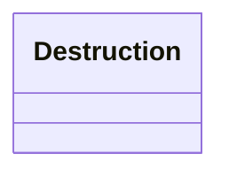

### Inherited Properties

| Defined In | Properties |
|------------|------------|
| AbstractEntity | [`id`](#prop-abstract-entity-id)&nbsp;&#124;&nbsp;[`type`](#prop-abstract-entity-type)&nbsp;&#124;&nbsp;[`_label`](#prop-abstract-entity-_label) |
| CRMEntity | [`_classifications`](#prop-crmentity-_classifications)&nbsp;&#124;&nbsp;[`_description`](#prop-crmentity-_description)&nbsp;&#124;&nbsp;[`_primaryName`](#prop-crmentity-_primary-name)&nbsp;&#124;&nbsp;[`added_member_by`](#prop-crmentity-added_member_by)&nbsp;&#124;&nbsp;[`assigned_by`](#prop-crmentity-assigned_by)&nbsp;&#124;&nbsp;[`attributed_by`](#prop-crmentity-attributed_by)&nbsp;&#124;&nbsp;[`classified_as`](#prop-crmentity-classified_as)&nbsp;&#124;&nbsp;[`depicted_by`](#prop-crmentity-depicted_by)&nbsp;&#124;&nbsp;[`equivalent`](#prop-crmentity-equivalent)&nbsp;&#124;&nbsp;[`exemplifies`](#prop-crmentity-exemplifies)&nbsp;&#124;&nbsp;[`identified_by`](#prop-crmentity-identified_by)&nbsp;&#124;&nbsp;[`influenced`](#prop-crmentity-influenced)&nbsp;&#124;&nbsp;[`member_of_set`](#prop-crmentity-member_of_set)&nbsp;&#124;&nbsp;[`motivated`](#prop-crmentity-motivated)&nbsp;&#124;&nbsp;[`notation`](#prop-crmentity-notation)&nbsp;&#124;&nbsp;[`note`](#prop-crmentity-note)&nbsp;&#124;&nbsp;[`preferred_identifier`](#prop-crmentity-preferred_identifier)&nbsp;&#124;&nbsp;[`record_provenance`](#prop-crmentity-record_provenance)&nbsp;&#124;&nbsp;[`referred_to_by`](#prop-crmentity-referred_to_by)&nbsp;&#124;&nbsp;[`removed_member_by`](#prop-crmentity-removed_member_by)&nbsp;&#124;&nbsp;[`replaces`](#prop-crmentity-replaces)&nbsp;&#124;&nbsp;[`representation`](#prop-crmentity-representation)&nbsp;&#124;&nbsp;[`subject_of`](#prop-crmentity-subject_of) |
| EndOfExistence | [`took_out_of_existence`](#prop-end-of-existence-took_out_of_existence) |
| Event | [`caused`](#prop-event-caused)&nbsp;&#124;&nbsp;[`caused_by`](#prop-event-caused_by)&nbsp;&#124;&nbsp;[`involved`](#prop-event-involved)&nbsp;&#124;&nbsp;[`participant`](#prop-event-participant)&nbsp;&#124;&nbsp;[`specific_purpose_of`](#prop-event-specific_purpose_of) |
| Period | [`part`](#prop-period-part)&nbsp;&#124;&nbsp;[`part_of`](#prop-period-part_of)&nbsp;&#124;&nbsp;[`took_place_at`](#prop-period-took_place_at)&nbsp;&#124;&nbsp;[`took_place_on_or_within`](#prop-period-took_place_on_or_within) |
| SpacetimeVolume | [`distinct_from`](#prop-spacetime-volume-distinct_from)&nbsp;&#124;&nbsp;[`during`](#prop-spacetime-volume-during)&nbsp;&#124;&nbsp;[`includes`](#prop-spacetime-volume-includes)&nbsp;&#124;&nbsp;[`spacetime_volume_is_defined_by`](#prop-spacetime-volume-spacetime_volume_is_defined_by)&nbsp;&#124;&nbsp;[`spatial_projection`](#prop-spacetime-volume-spatial_projection)&nbsp;&#124;&nbsp;[`temporal_projection`](#prop-spacetime-volume-temporal_projection)&nbsp;&#124;&nbsp;[`thing_defined_by`](#prop-spacetime-volume-thing_defined_by)&nbsp;&#124;&nbsp;[`volume_overlaps_with`](#prop-spacetime-volume-volume_overlaps_with) |
| TemporalEntity | [`after`](#prop-temporal-entity-after)&nbsp;&#124;&nbsp;[`before`](#prop-temporal-entity-before)&nbsp;&#124;&nbsp;[`ends_after_or_with_the_start_of`](#prop-temporal-entity-ends_after_or_with_the_start_of)&nbsp;&#124;&nbsp;[`ends_after_the_end_of`](#prop-temporal-entity-ends_after_the_end_of)&nbsp;&#124;&nbsp;[`ends_after_the_start_of`](#prop-temporal-entity-ends_after_the_start_of)&nbsp;&#124;&nbsp;[`ends_before_or_with_the_end_of`](#prop-temporal-entity-ends_before_or_with_the_end_of)&nbsp;&#124;&nbsp;[`ends_before_or_with_the_start_of`](#prop-temporal-entity-ends_before_or_with_the_start_of)&nbsp;&#124;&nbsp;[`ends_before_the_end_of`](#prop-temporal-entity-ends_before_the_end_of)&nbsp;&#124;&nbsp;[`ends_with_or_after_the_end_of`](#prop-temporal-entity-ends_with_or_after_the_end_of)&nbsp;&#124;&nbsp;[`starts_after_or_with_the_end_of`](#prop-temporal-entity-starts_after_or_with_the_end_of)&nbsp;&#124;&nbsp;[`starts_after_the_start_of`](#prop-temporal-entity-starts_after_the_start_of)&nbsp;&#124;&nbsp;[`starts_before_or_with_the_end_of`](#prop-temporal-entity-starts_before_or_with_the_end_of)&nbsp;&#124;&nbsp;[`starts_before_or_with_the_start_of`](#prop-temporal-entity-starts_before_or_with_the_start_of)&nbsp;&#124;&nbsp;[`starts_before_the_end_of`](#prop-temporal-entity-starts_before_the_end_of)&nbsp;&#124;&nbsp;[`starts_before_the_start_of`](#prop-temporal-entity-starts_before_the_start_of)&nbsp;&#124;&nbsp;[`starts_with_or_after_the_start_of`](#prop-temporal-entity-starts_with_or_after_the_start_of)&nbsp;&#124;&nbsp;[`timespan`](#prop-temporal-entity-timespan) |

### Local Properties

| Name | Cardinality | Value | Defined In | Description |
|------|-------------|-------|------------|-------------|
| <a id="prop-destruction-destroyed"></a>`destroyed` | `1..*` | `PhysicalThing[]` | local | This property allows specific instances of E18 Physical Thing that have been destroyed to be related to a destruction event. Destruction implies the end of an item’s life as a subject of cultural documentation – the physical matter of which the item was composed may in fact continue to exist. A destruction event may be contiguous with a Production that brings into existence a derived object composed partly of matter from the destroyed object. |

---

<a id="class-digital-object"></a>
## DigitalObject

This class comprises identifiable immaterial items that can be represented as sets of bit sequences, such as data sets, e-texts, images, audio or video items, software, etc., and are documented as single units. Any aggregation of instances of D1 Digital Object into a whole treated as single unit is also regarded as an instance of D1 Digital Object. This means that for instance, the content of a DVD, an XML file on it, and an element of this file, are regarded as distinct instances of D1 Digital Object, mutually related by the P106 is composed of (forms part of) property. A D1 Digital Object does not depend on a specific physical carrier, and it can exist on one or more carriers simultaneously.

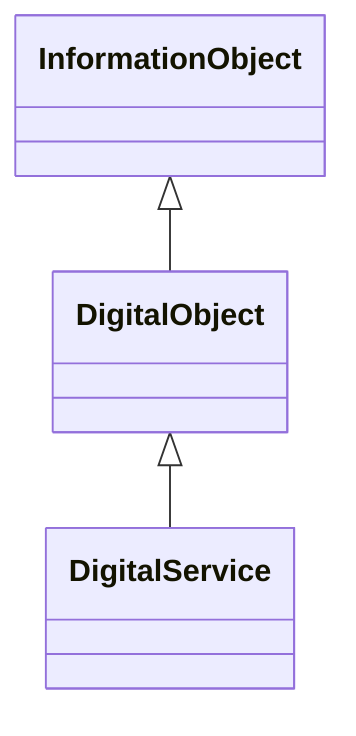

### Inherited Properties

| Defined In | Properties |
|------------|------------|
| AbstractEntity | [`id`](#prop-abstract-entity-id)&nbsp;&#124;&nbsp;[`type`](#prop-abstract-entity-type)&nbsp;&#124;&nbsp;[`_label`](#prop-abstract-entity-_label) |
| ConceptualObject | [`created_by`](#prop-conceptual-object-created_by) |
| CRMEntity | [`_classifications`](#prop-crmentity-_classifications)&nbsp;&#124;&nbsp;[`_description`](#prop-crmentity-_description)&nbsp;&#124;&nbsp;[`_primaryName`](#prop-crmentity-_primary-name)&nbsp;&#124;&nbsp;[`added_member_by`](#prop-crmentity-added_member_by)&nbsp;&#124;&nbsp;[`assigned_by`](#prop-crmentity-assigned_by)&nbsp;&#124;&nbsp;[`attributed_by`](#prop-crmentity-attributed_by)&nbsp;&#124;&nbsp;[`classified_as`](#prop-crmentity-classified_as)&nbsp;&#124;&nbsp;[`depicted_by`](#prop-crmentity-depicted_by)&nbsp;&#124;&nbsp;[`equivalent`](#prop-crmentity-equivalent)&nbsp;&#124;&nbsp;[`exemplifies`](#prop-crmentity-exemplifies)&nbsp;&#124;&nbsp;[`identified_by`](#prop-crmentity-identified_by)&nbsp;&#124;&nbsp;[`influenced`](#prop-crmentity-influenced)&nbsp;&#124;&nbsp;[`member_of_set`](#prop-crmentity-member_of_set)&nbsp;&#124;&nbsp;[`motivated`](#prop-crmentity-motivated)&nbsp;&#124;&nbsp;[`notation`](#prop-crmentity-notation)&nbsp;&#124;&nbsp;[`note`](#prop-crmentity-note)&nbsp;&#124;&nbsp;[`preferred_identifier`](#prop-crmentity-preferred_identifier)&nbsp;&#124;&nbsp;[`record_provenance`](#prop-crmentity-record_provenance)&nbsp;&#124;&nbsp;[`referred_to_by`](#prop-crmentity-referred_to_by)&nbsp;&#124;&nbsp;[`removed_member_by`](#prop-crmentity-removed_member_by)&nbsp;&#124;&nbsp;[`replaces`](#prop-crmentity-replaces)&nbsp;&#124;&nbsp;[`representation`](#prop-crmentity-representation)&nbsp;&#124;&nbsp;[`subject_of`](#prop-crmentity-subject_of) |
| HumanMadeThing | [`conformsTo`](#prop-human-made-thing-conforms-to)&nbsp;&#124;&nbsp;[`intended_for`](#prop-human-made-thing-intended_for)&nbsp;&#124;&nbsp;[`made_for`](#prop-human-made-thing-made_for)&nbsp;&#124;&nbsp;[`title`](#prop-human-made-thing-title) |
| InformationObject | [`format`](#prop-information-object-format)&nbsp;&#124;&nbsp;[`presence_of`](#prop-information-object-presence_of) |
| LegalObject | [`right_held_by`](#prop-legal-object-right_held_by)&nbsp;&#124;&nbsp;[`subject_to`](#prop-legal-object-subject_to) |
| PersistentItem | [`brought_into_existence_by`](#prop-persistent-item-brought_into_existence_by)&nbsp;&#124;&nbsp;[`present_at`](#prop-persistent-item-present_at)&nbsp;&#124;&nbsp;[`taken_out_of_existence_by`](#prop-persistent-item-taken_out_of_existence_by) |
| PropositionalObject | [`about`](#prop-propositional-object-about)&nbsp;&#124;&nbsp;[`conceptual_part`](#prop-propositional-object-conceptual_part)&nbsp;&#124;&nbsp;[`conceptually_part_of`](#prop-propositional-object-conceptually_part_of)&nbsp;&#124;&nbsp;[`refers_to`](#prop-propositional-object-refers_to) |
| SymbolicObject | [`carried_by`](#prop-symbolic-object-carried_by)&nbsp;&#124;&nbsp;[`content`](#prop-symbolic-object-content)&nbsp;&#124;&nbsp;[`digitally_carried_by`](#prop-symbolic-object-digitally_carried_by)&nbsp;&#124;&nbsp;[`incorporated_by`](#prop-symbolic-object-incorporated_by)&nbsp;&#124;&nbsp;[`part`](#prop-symbolic-object-part)&nbsp;&#124;&nbsp;[`part_of`](#prop-symbolic-object-part_of) |
| Thing | [`dimension`](#prop-thing-dimension)&nbsp;&#124;&nbsp;[`features_are_also_found_on`](#prop-thing-features_are_also_found_on)&nbsp;&#124;&nbsp;[`general_use`](#prop-thing-general_use)&nbsp;&#124;&nbsp;[`shows_features_of`](#prop-thing-shows_features_of)&nbsp;&#124;&nbsp;[`used_for`](#prop-thing-used_for) |

### Local Properties

| Name | Cardinality | Value | Defined In | Description |
|------|-------------|-------|------------|-------------|
| <a id="prop-digital-object-access_point"></a>`access_point` | `0..*` | [DigitalObject](#class-digital-object)[] | local | From an ur- digital object to a single concrete representation. A locator as opposed to an identifier, similar to the approximated_by for Place. |
| <a id="prop-digital-object-digitally_available_via"></a>`digitally_available_via` | `0..*` | [DigitalService](#class-digital-service)[] | local |  |
| <a id="prop-digital-object-digitally_carries"></a>`digitally_carries` | `0..*` | `SymbolicObject[]` | local |  |
| <a id="prop-digital-object-digitally_makes_available"></a>`digitally_makes_available` | `0..*` | [DigitalService](#class-digital-service)[] | local |  |
| <a id="prop-digital-object-digitally_shows"></a>`digitally_shows` | `0..*` | [VisualItem](#class-visual-item)[] | local |  |

---

<a id="class-digital-service"></a>
## DigitalService

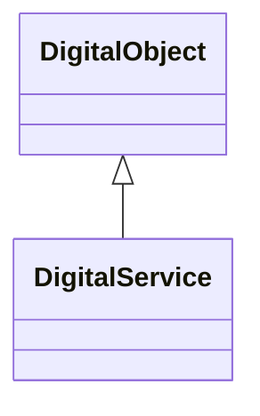

### Inherited Properties

| Defined In | Properties |
|------------|------------|
| AbstractEntity | [`id`](#prop-abstract-entity-id)&nbsp;&#124;&nbsp;[`type`](#prop-abstract-entity-type)&nbsp;&#124;&nbsp;[`_label`](#prop-abstract-entity-_label) |
| ConceptualObject | [`created_by`](#prop-conceptual-object-created_by) |
| CRMEntity | [`_classifications`](#prop-crmentity-_classifications)&nbsp;&#124;&nbsp;[`_description`](#prop-crmentity-_description)&nbsp;&#124;&nbsp;[`_primaryName`](#prop-crmentity-_primary-name)&nbsp;&#124;&nbsp;[`added_member_by`](#prop-crmentity-added_member_by)&nbsp;&#124;&nbsp;[`assigned_by`](#prop-crmentity-assigned_by)&nbsp;&#124;&nbsp;[`attributed_by`](#prop-crmentity-attributed_by)&nbsp;&#124;&nbsp;[`classified_as`](#prop-crmentity-classified_as)&nbsp;&#124;&nbsp;[`depicted_by`](#prop-crmentity-depicted_by)&nbsp;&#124;&nbsp;[`equivalent`](#prop-crmentity-equivalent)&nbsp;&#124;&nbsp;[`exemplifies`](#prop-crmentity-exemplifies)&nbsp;&#124;&nbsp;[`identified_by`](#prop-crmentity-identified_by)&nbsp;&#124;&nbsp;[`influenced`](#prop-crmentity-influenced)&nbsp;&#124;&nbsp;[`member_of_set`](#prop-crmentity-member_of_set)&nbsp;&#124;&nbsp;[`motivated`](#prop-crmentity-motivated)&nbsp;&#124;&nbsp;[`notation`](#prop-crmentity-notation)&nbsp;&#124;&nbsp;[`note`](#prop-crmentity-note)&nbsp;&#124;&nbsp;[`preferred_identifier`](#prop-crmentity-preferred_identifier)&nbsp;&#124;&nbsp;[`record_provenance`](#prop-crmentity-record_provenance)&nbsp;&#124;&nbsp;[`referred_to_by`](#prop-crmentity-referred_to_by)&nbsp;&#124;&nbsp;[`removed_member_by`](#prop-crmentity-removed_member_by)&nbsp;&#124;&nbsp;[`replaces`](#prop-crmentity-replaces)&nbsp;&#124;&nbsp;[`representation`](#prop-crmentity-representation)&nbsp;&#124;&nbsp;[`subject_of`](#prop-crmentity-subject_of) |
| DigitalObject | [`access_point`](#prop-digital-object-access_point)&nbsp;&#124;&nbsp;[`digitally_available_via`](#prop-digital-object-digitally_available_via)&nbsp;&#124;&nbsp;[`digitally_carries`](#prop-digital-object-digitally_carries)&nbsp;&#124;&nbsp;[`digitally_makes_available`](#prop-digital-object-digitally_makes_available)&nbsp;&#124;&nbsp;[`digitally_shows`](#prop-digital-object-digitally_shows) |
| HumanMadeThing | [`conformsTo`](#prop-human-made-thing-conforms-to)&nbsp;&#124;&nbsp;[`intended_for`](#prop-human-made-thing-intended_for)&nbsp;&#124;&nbsp;[`made_for`](#prop-human-made-thing-made_for)&nbsp;&#124;&nbsp;[`title`](#prop-human-made-thing-title) |
| InformationObject | [`format`](#prop-information-object-format)&nbsp;&#124;&nbsp;[`presence_of`](#prop-information-object-presence_of) |
| LegalObject | [`right_held_by`](#prop-legal-object-right_held_by)&nbsp;&#124;&nbsp;[`subject_to`](#prop-legal-object-subject_to) |
| PersistentItem | [`brought_into_existence_by`](#prop-persistent-item-brought_into_existence_by)&nbsp;&#124;&nbsp;[`present_at`](#prop-persistent-item-present_at)&nbsp;&#124;&nbsp;[`taken_out_of_existence_by`](#prop-persistent-item-taken_out_of_existence_by) |
| PropositionalObject | [`about`](#prop-propositional-object-about)&nbsp;&#124;&nbsp;[`conceptual_part`](#prop-propositional-object-conceptual_part)&nbsp;&#124;&nbsp;[`conceptually_part_of`](#prop-propositional-object-conceptually_part_of)&nbsp;&#124;&nbsp;[`refers_to`](#prop-propositional-object-refers_to) |
| SymbolicObject | [`carried_by`](#prop-symbolic-object-carried_by)&nbsp;&#124;&nbsp;[`content`](#prop-symbolic-object-content)&nbsp;&#124;&nbsp;[`digitally_carried_by`](#prop-symbolic-object-digitally_carried_by)&nbsp;&#124;&nbsp;[`incorporated_by`](#prop-symbolic-object-incorporated_by)&nbsp;&#124;&nbsp;[`part`](#prop-symbolic-object-part)&nbsp;&#124;&nbsp;[`part_of`](#prop-symbolic-object-part_of) |
| Thing | [`dimension`](#prop-thing-dimension)&nbsp;&#124;&nbsp;[`features_are_also_found_on`](#prop-thing-features_are_also_found_on)&nbsp;&#124;&nbsp;[`general_use`](#prop-thing-general_use)&nbsp;&#124;&nbsp;[`shows_features_of`](#prop-thing-shows_features_of)&nbsp;&#124;&nbsp;[`used_for`](#prop-thing-used_for) |

### Local Properties

This class defines no local properties.

---

<a id="class-dimension"></a>
## Dimension

This class comprises quantifiable properties that can be measured by some calibrated means and can be approximated by values, i.e. points or regions in a mathematical or conceptual space, such as natural or real numbers, RGB values etc. An instance of E54 Dimension represents the true quantity, independent from its numerical approximation, e.g. in inches or in cm. The properties of the class E54 Dimension allow for expressing the numerical approximation of the values of an instance of E54 Dimension. If the true values belong to a non-discrete space, such as spatial distances, it is recommended to record them as approximations by intervals or regions of indeterminacy enclosing the assumed true values. For instance, a length of 5 cm may be recorded as 4.5-5.5 cm, according to the precision of the respective observation. Note, that interoperability of values described in different units depends critically on the representation as value regions. Numerical approximations in archaic instances of E58 Measurement Unit used in historical records should be preserved. Equivalents corresponding to current knowledge should be recorded as additional instances of E54 Dimension as appropriate.

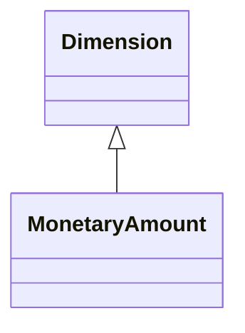

### Inherited Properties

| Defined In | Properties |
|------------|------------|
| AbstractEntity | [`id`](#prop-abstract-entity-id)&nbsp;&#124;&nbsp;[`type`](#prop-abstract-entity-type)&nbsp;&#124;&nbsp;[`_label`](#prop-abstract-entity-_label) |
| CRMEntity | [`_classifications`](#prop-crmentity-_classifications)&nbsp;&#124;&nbsp;[`_description`](#prop-crmentity-_description)&nbsp;&#124;&nbsp;[`_primaryName`](#prop-crmentity-_primary-name)&nbsp;&#124;&nbsp;[`added_member_by`](#prop-crmentity-added_member_by)&nbsp;&#124;&nbsp;[`assigned_by`](#prop-crmentity-assigned_by)&nbsp;&#124;&nbsp;[`attributed_by`](#prop-crmentity-attributed_by)&nbsp;&#124;&nbsp;[`classified_as`](#prop-crmentity-classified_as)&nbsp;&#124;&nbsp;[`depicted_by`](#prop-crmentity-depicted_by)&nbsp;&#124;&nbsp;[`equivalent`](#prop-crmentity-equivalent)&nbsp;&#124;&nbsp;[`exemplifies`](#prop-crmentity-exemplifies)&nbsp;&#124;&nbsp;[`identified_by`](#prop-crmentity-identified_by)&nbsp;&#124;&nbsp;[`influenced`](#prop-crmentity-influenced)&nbsp;&#124;&nbsp;[`member_of_set`](#prop-crmentity-member_of_set)&nbsp;&#124;&nbsp;[`motivated`](#prop-crmentity-motivated)&nbsp;&#124;&nbsp;[`notation`](#prop-crmentity-notation)&nbsp;&#124;&nbsp;[`note`](#prop-crmentity-note)&nbsp;&#124;&nbsp;[`preferred_identifier`](#prop-crmentity-preferred_identifier)&nbsp;&#124;&nbsp;[`record_provenance`](#prop-crmentity-record_provenance)&nbsp;&#124;&nbsp;[`referred_to_by`](#prop-crmentity-referred_to_by)&nbsp;&#124;&nbsp;[`removed_member_by`](#prop-crmentity-removed_member_by)&nbsp;&#124;&nbsp;[`replaces`](#prop-crmentity-replaces)&nbsp;&#124;&nbsp;[`representation`](#prop-crmentity-representation)&nbsp;&#124;&nbsp;[`subject_of`](#prop-crmentity-subject_of) |

### Local Properties

| Name | Cardinality | Value | Defined In | Description |
|------|-------------|-------|------------|-------------|
| <a id="prop-dimension-dimension_of"></a>`dimension_of` | `0..*` | `Thing[]` | local | Inverse of dimension |
| <a id="prop-dimension-duration_of"></a>`duration_of` | `0..*` | [TimeSpan](#class-time-span)[] | local | Inverse of P191 had duration |
| <a id="prop-dimension-lower_value_limit"></a>`lower_value_limit` | `0..*` | `string[]` | local | This property allows the lowest possible value of an E54 Dimension to be approximated by an E60 Number primitive. |
| <a id="prop-dimension-unit"></a>`unit` | `1` | [MeasurementUnit](#class-measurement-unit) | local | This property shows the type of unit an E54 Dimension was expressed in. |
| <a id="prop-dimension-upper_value_limit"></a>`upper_value_limit` | `0..*` | `string[]` | local | This property allows the greatest possible value of an E54 Dimension to be approximated by an E60 Number primitive. |
| <a id="prop-dimension-value"></a>`value` | `1` | `string` | local | This property allows an E54 Dimension to be approximated by an E60 Number primitive. |

---

<a id="class-dissolution"></a>
## Dissolution

This class comprises the events that result in the formal or informal termination of an E74 Group of people. If the dissolution was deliberate, the Dissolution event should also be instantiated as an E7 Activity.

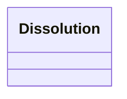

### Inherited Properties

| Defined In | Properties |
|------------|------------|
| AbstractEntity | [`id`](#prop-abstract-entity-id)&nbsp;&#124;&nbsp;[`type`](#prop-abstract-entity-type)&nbsp;&#124;&nbsp;[`_label`](#prop-abstract-entity-_label) |
| CRMEntity | [`_classifications`](#prop-crmentity-_classifications)&nbsp;&#124;&nbsp;[`_description`](#prop-crmentity-_description)&nbsp;&#124;&nbsp;[`_primaryName`](#prop-crmentity-_primary-name)&nbsp;&#124;&nbsp;[`added_member_by`](#prop-crmentity-added_member_by)&nbsp;&#124;&nbsp;[`assigned_by`](#prop-crmentity-assigned_by)&nbsp;&#124;&nbsp;[`attributed_by`](#prop-crmentity-attributed_by)&nbsp;&#124;&nbsp;[`classified_as`](#prop-crmentity-classified_as)&nbsp;&#124;&nbsp;[`depicted_by`](#prop-crmentity-depicted_by)&nbsp;&#124;&nbsp;[`equivalent`](#prop-crmentity-equivalent)&nbsp;&#124;&nbsp;[`exemplifies`](#prop-crmentity-exemplifies)&nbsp;&#124;&nbsp;[`identified_by`](#prop-crmentity-identified_by)&nbsp;&#124;&nbsp;[`influenced`](#prop-crmentity-influenced)&nbsp;&#124;&nbsp;[`member_of_set`](#prop-crmentity-member_of_set)&nbsp;&#124;&nbsp;[`motivated`](#prop-crmentity-motivated)&nbsp;&#124;&nbsp;[`notation`](#prop-crmentity-notation)&nbsp;&#124;&nbsp;[`note`](#prop-crmentity-note)&nbsp;&#124;&nbsp;[`preferred_identifier`](#prop-crmentity-preferred_identifier)&nbsp;&#124;&nbsp;[`record_provenance`](#prop-crmentity-record_provenance)&nbsp;&#124;&nbsp;[`referred_to_by`](#prop-crmentity-referred_to_by)&nbsp;&#124;&nbsp;[`removed_member_by`](#prop-crmentity-removed_member_by)&nbsp;&#124;&nbsp;[`replaces`](#prop-crmentity-replaces)&nbsp;&#124;&nbsp;[`representation`](#prop-crmentity-representation)&nbsp;&#124;&nbsp;[`subject_of`](#prop-crmentity-subject_of) |
| EndOfExistence | [`took_out_of_existence`](#prop-end-of-existence-took_out_of_existence) |
| Event | [`caused`](#prop-event-caused)&nbsp;&#124;&nbsp;[`caused_by`](#prop-event-caused_by)&nbsp;&#124;&nbsp;[`involved`](#prop-event-involved)&nbsp;&#124;&nbsp;[`participant`](#prop-event-participant)&nbsp;&#124;&nbsp;[`specific_purpose_of`](#prop-event-specific_purpose_of) |
| Period | [`part`](#prop-period-part)&nbsp;&#124;&nbsp;[`part_of`](#prop-period-part_of)&nbsp;&#124;&nbsp;[`took_place_at`](#prop-period-took_place_at)&nbsp;&#124;&nbsp;[`took_place_on_or_within`](#prop-period-took_place_on_or_within) |
| SpacetimeVolume | [`distinct_from`](#prop-spacetime-volume-distinct_from)&nbsp;&#124;&nbsp;[`during`](#prop-spacetime-volume-during)&nbsp;&#124;&nbsp;[`includes`](#prop-spacetime-volume-includes)&nbsp;&#124;&nbsp;[`spacetime_volume_is_defined_by`](#prop-spacetime-volume-spacetime_volume_is_defined_by)&nbsp;&#124;&nbsp;[`spatial_projection`](#prop-spacetime-volume-spatial_projection)&nbsp;&#124;&nbsp;[`temporal_projection`](#prop-spacetime-volume-temporal_projection)&nbsp;&#124;&nbsp;[`thing_defined_by`](#prop-spacetime-volume-thing_defined_by)&nbsp;&#124;&nbsp;[`volume_overlaps_with`](#prop-spacetime-volume-volume_overlaps_with) |
| TemporalEntity | [`after`](#prop-temporal-entity-after)&nbsp;&#124;&nbsp;[`before`](#prop-temporal-entity-before)&nbsp;&#124;&nbsp;[`ends_after_or_with_the_start_of`](#prop-temporal-entity-ends_after_or_with_the_start_of)&nbsp;&#124;&nbsp;[`ends_after_the_end_of`](#prop-temporal-entity-ends_after_the_end_of)&nbsp;&#124;&nbsp;[`ends_after_the_start_of`](#prop-temporal-entity-ends_after_the_start_of)&nbsp;&#124;&nbsp;[`ends_before_or_with_the_end_of`](#prop-temporal-entity-ends_before_or_with_the_end_of)&nbsp;&#124;&nbsp;[`ends_before_or_with_the_start_of`](#prop-temporal-entity-ends_before_or_with_the_start_of)&nbsp;&#124;&nbsp;[`ends_before_the_end_of`](#prop-temporal-entity-ends_before_the_end_of)&nbsp;&#124;&nbsp;[`ends_with_or_after_the_end_of`](#prop-temporal-entity-ends_with_or_after_the_end_of)&nbsp;&#124;&nbsp;[`starts_after_or_with_the_end_of`](#prop-temporal-entity-starts_after_or_with_the_end_of)&nbsp;&#124;&nbsp;[`starts_after_the_start_of`](#prop-temporal-entity-starts_after_the_start_of)&nbsp;&#124;&nbsp;[`starts_before_or_with_the_end_of`](#prop-temporal-entity-starts_before_or_with_the_end_of)&nbsp;&#124;&nbsp;[`starts_before_or_with_the_start_of`](#prop-temporal-entity-starts_before_or_with_the_start_of)&nbsp;&#124;&nbsp;[`starts_before_the_end_of`](#prop-temporal-entity-starts_before_the_end_of)&nbsp;&#124;&nbsp;[`starts_before_the_start_of`](#prop-temporal-entity-starts_before_the_start_of)&nbsp;&#124;&nbsp;[`starts_with_or_after_the_start_of`](#prop-temporal-entity-starts_with_or_after_the_start_of)&nbsp;&#124;&nbsp;[`timespan`](#prop-temporal-entity-timespan) |

### Local Properties

| Name | Cardinality | Value | Defined In | Description |
|------|-------------|-------|------------|-------------|
| <a id="prop-dissolution-dissolved"></a>`dissolved` | `1..*` | [Group](#class-group)[] | local | This property links the disbanding or E68 Dissolution of an E74 Group to the Group itself. |

---

<a id="class-encounter"></a>
## Encounter

This class comprises activities of S4 Observation (substance) where an E39 Actor encounters an instance of E18 Physical Thing of a kind relevant for the mission of the observation or regarded as potentially relevant for some community (identity). This observation produces knowledge about the existence of the respective thing at a particular place in or on surrounding matter. This knowledge may be new to the group of people the actor belongs to. In that case we would talk about a discovery. The observer may recognize or assign an individual identity of the thing encountered or regard only the type as noteworthy in the associated documentation or report. Note that this representation treats S19 as a subClass of only E7 Activity for ease of implementation, as we do not need the full set of relationships available via the complete hierarcy. In the full CRMsci, it is Activity -> Attribute Assignment -> Observation -> Encounter.

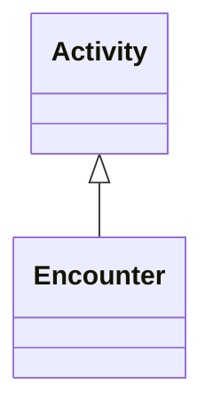

### Inherited Properties

| Defined In | Properties |
|------------|------------|
| AbstractEntity | [`id`](#prop-abstract-entity-id)&nbsp;&#124;&nbsp;[`type`](#prop-abstract-entity-type)&nbsp;&#124;&nbsp;[`_label`](#prop-abstract-entity-_label) |
| Activity | [`carried_out_by`](#prop-activity-carried_out_by)&nbsp;&#124;&nbsp;[`continued`](#prop-activity-continued)&nbsp;&#124;&nbsp;[`continued_by`](#prop-activity-continued_by)&nbsp;&#124;&nbsp;[`general_purpose`](#prop-activity-general_purpose)&nbsp;&#124;&nbsp;[`influenced_by`](#prop-activity-influenced_by)&nbsp;&#124;&nbsp;[`intended_use_of`](#prop-activity-intended_use_of)&nbsp;&#124;&nbsp;[`motivated_by`](#prop-activity-motivated_by)&nbsp;&#124;&nbsp;[`specific_purpose`](#prop-activity-specific_purpose)&nbsp;&#124;&nbsp;[`specific_technique`](#prop-activity-specific_technique)&nbsp;&#124;&nbsp;[`technique`](#prop-activity-technique)&nbsp;&#124;&nbsp;[`used_object_of_type`](#prop-activity-used_object_of_type)&nbsp;&#124;&nbsp;[`used_specific_object`](#prop-activity-used_specific_object) |
| CRMEntity | [`_classifications`](#prop-crmentity-_classifications)&nbsp;&#124;&nbsp;[`_description`](#prop-crmentity-_description)&nbsp;&#124;&nbsp;[`_primaryName`](#prop-crmentity-_primary-name)&nbsp;&#124;&nbsp;[`added_member_by`](#prop-crmentity-added_member_by)&nbsp;&#124;&nbsp;[`assigned_by`](#prop-crmentity-assigned_by)&nbsp;&#124;&nbsp;[`attributed_by`](#prop-crmentity-attributed_by)&nbsp;&#124;&nbsp;[`classified_as`](#prop-crmentity-classified_as)&nbsp;&#124;&nbsp;[`depicted_by`](#prop-crmentity-depicted_by)&nbsp;&#124;&nbsp;[`equivalent`](#prop-crmentity-equivalent)&nbsp;&#124;&nbsp;[`exemplifies`](#prop-crmentity-exemplifies)&nbsp;&#124;&nbsp;[`identified_by`](#prop-crmentity-identified_by)&nbsp;&#124;&nbsp;[`influenced`](#prop-crmentity-influenced)&nbsp;&#124;&nbsp;[`member_of_set`](#prop-crmentity-member_of_set)&nbsp;&#124;&nbsp;[`motivated`](#prop-crmentity-motivated)&nbsp;&#124;&nbsp;[`notation`](#prop-crmentity-notation)&nbsp;&#124;&nbsp;[`note`](#prop-crmentity-note)&nbsp;&#124;&nbsp;[`preferred_identifier`](#prop-crmentity-preferred_identifier)&nbsp;&#124;&nbsp;[`record_provenance`](#prop-crmentity-record_provenance)&nbsp;&#124;&nbsp;[`referred_to_by`](#prop-crmentity-referred_to_by)&nbsp;&#124;&nbsp;[`removed_member_by`](#prop-crmentity-removed_member_by)&nbsp;&#124;&nbsp;[`replaces`](#prop-crmentity-replaces)&nbsp;&#124;&nbsp;[`representation`](#prop-crmentity-representation)&nbsp;&#124;&nbsp;[`subject_of`](#prop-crmentity-subject_of) |
| Event | [`caused`](#prop-event-caused)&nbsp;&#124;&nbsp;[`caused_by`](#prop-event-caused_by)&nbsp;&#124;&nbsp;[`involved`](#prop-event-involved)&nbsp;&#124;&nbsp;[`participant`](#prop-event-participant)&nbsp;&#124;&nbsp;[`specific_purpose_of`](#prop-event-specific_purpose_of) |
| Period | [`part`](#prop-period-part)&nbsp;&#124;&nbsp;[`part_of`](#prop-period-part_of)&nbsp;&#124;&nbsp;[`took_place_at`](#prop-period-took_place_at)&nbsp;&#124;&nbsp;[`took_place_on_or_within`](#prop-period-took_place_on_or_within) |
| SpacetimeVolume | [`distinct_from`](#prop-spacetime-volume-distinct_from)&nbsp;&#124;&nbsp;[`during`](#prop-spacetime-volume-during)&nbsp;&#124;&nbsp;[`includes`](#prop-spacetime-volume-includes)&nbsp;&#124;&nbsp;[`spacetime_volume_is_defined_by`](#prop-spacetime-volume-spacetime_volume_is_defined_by)&nbsp;&#124;&nbsp;[`spatial_projection`](#prop-spacetime-volume-spatial_projection)&nbsp;&#124;&nbsp;[`temporal_projection`](#prop-spacetime-volume-temporal_projection)&nbsp;&#124;&nbsp;[`thing_defined_by`](#prop-spacetime-volume-thing_defined_by)&nbsp;&#124;&nbsp;[`volume_overlaps_with`](#prop-spacetime-volume-volume_overlaps_with) |
| TemporalEntity | [`after`](#prop-temporal-entity-after)&nbsp;&#124;&nbsp;[`before`](#prop-temporal-entity-before)&nbsp;&#124;&nbsp;[`ends_after_or_with_the_start_of`](#prop-temporal-entity-ends_after_or_with_the_start_of)&nbsp;&#124;&nbsp;[`ends_after_the_end_of`](#prop-temporal-entity-ends_after_the_end_of)&nbsp;&#124;&nbsp;[`ends_after_the_start_of`](#prop-temporal-entity-ends_after_the_start_of)&nbsp;&#124;&nbsp;[`ends_before_or_with_the_end_of`](#prop-temporal-entity-ends_before_or_with_the_end_of)&nbsp;&#124;&nbsp;[`ends_before_or_with_the_start_of`](#prop-temporal-entity-ends_before_or_with_the_start_of)&nbsp;&#124;&nbsp;[`ends_before_the_end_of`](#prop-temporal-entity-ends_before_the_end_of)&nbsp;&#124;&nbsp;[`ends_with_or_after_the_end_of`](#prop-temporal-entity-ends_with_or_after_the_end_of)&nbsp;&#124;&nbsp;[`starts_after_or_with_the_end_of`](#prop-temporal-entity-starts_after_or_with_the_end_of)&nbsp;&#124;&nbsp;[`starts_after_the_start_of`](#prop-temporal-entity-starts_after_the_start_of)&nbsp;&#124;&nbsp;[`starts_before_or_with_the_end_of`](#prop-temporal-entity-starts_before_or_with_the_end_of)&nbsp;&#124;&nbsp;[`starts_before_or_with_the_start_of`](#prop-temporal-entity-starts_before_or_with_the_start_of)&nbsp;&#124;&nbsp;[`starts_before_the_end_of`](#prop-temporal-entity-starts_before_the_end_of)&nbsp;&#124;&nbsp;[`starts_before_the_start_of`](#prop-temporal-entity-starts_before_the_start_of)&nbsp;&#124;&nbsp;[`starts_with_or_after_the_start_of`](#prop-temporal-entity-starts_with_or_after_the_start_of)&nbsp;&#124;&nbsp;[`timespan`](#prop-temporal-entity-timespan) |

### Local Properties

| Name | Cardinality | Value | Defined In | Description |
|------|-------------|-------|------------|-------------|
| <a id="prop-encounter-encountered"></a>`encountered` | `0..*` | `PhysicalThing[]` | local | This property associates an instance of S19 Encounter Event with an instance of E18 Physical Thing that has been found. e.g. The finding (S19) encountered (O19) the 18 arrowheads (E18) from Lerna in Argolis |

---

<a id="class-event"></a>
## Event

This class comprises changes of states in cultural, social or physical systems, regardless of scale, brought about by a series or group of coherent physical, cultural, technological or legal phenomena. Such changes of state will affect instances of E77 Persistent Item or its subclasses. The distinction between an E5 Event and an E4 Period is partly a question of the scale of observation. Viewed at a coarse level of detail, an E5 Event is an ‘instantaneous’ change of state. At a fine level, the E5 Event can be analysed into its component phenomena within a space and time frame, and as such can be seen as an E4 Period. The reverse is not necessarily the case: not all instances of E4 Period give rise to a noteworthy change of state.

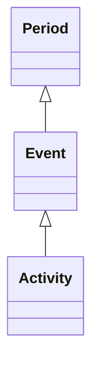

### Inherited Properties

| Defined In | Properties |
|------------|------------|
| AbstractEntity | [`id`](#prop-abstract-entity-id)&nbsp;&#124;&nbsp;[`type`](#prop-abstract-entity-type)&nbsp;&#124;&nbsp;[`_label`](#prop-abstract-entity-_label) |
| CRMEntity | [`_classifications`](#prop-crmentity-_classifications)&nbsp;&#124;&nbsp;[`_description`](#prop-crmentity-_description)&nbsp;&#124;&nbsp;[`_primaryName`](#prop-crmentity-_primary-name)&nbsp;&#124;&nbsp;[`added_member_by`](#prop-crmentity-added_member_by)&nbsp;&#124;&nbsp;[`assigned_by`](#prop-crmentity-assigned_by)&nbsp;&#124;&nbsp;[`attributed_by`](#prop-crmentity-attributed_by)&nbsp;&#124;&nbsp;[`classified_as`](#prop-crmentity-classified_as)&nbsp;&#124;&nbsp;[`depicted_by`](#prop-crmentity-depicted_by)&nbsp;&#124;&nbsp;[`equivalent`](#prop-crmentity-equivalent)&nbsp;&#124;&nbsp;[`exemplifies`](#prop-crmentity-exemplifies)&nbsp;&#124;&nbsp;[`identified_by`](#prop-crmentity-identified_by)&nbsp;&#124;&nbsp;[`influenced`](#prop-crmentity-influenced)&nbsp;&#124;&nbsp;[`member_of_set`](#prop-crmentity-member_of_set)&nbsp;&#124;&nbsp;[`motivated`](#prop-crmentity-motivated)&nbsp;&#124;&nbsp;[`notation`](#prop-crmentity-notation)&nbsp;&#124;&nbsp;[`note`](#prop-crmentity-note)&nbsp;&#124;&nbsp;[`preferred_identifier`](#prop-crmentity-preferred_identifier)&nbsp;&#124;&nbsp;[`record_provenance`](#prop-crmentity-record_provenance)&nbsp;&#124;&nbsp;[`referred_to_by`](#prop-crmentity-referred_to_by)&nbsp;&#124;&nbsp;[`removed_member_by`](#prop-crmentity-removed_member_by)&nbsp;&#124;&nbsp;[`replaces`](#prop-crmentity-replaces)&nbsp;&#124;&nbsp;[`representation`](#prop-crmentity-representation)&nbsp;&#124;&nbsp;[`subject_of`](#prop-crmentity-subject_of) |
| Period | [`part`](#prop-period-part)&nbsp;&#124;&nbsp;[`part_of`](#prop-period-part_of)&nbsp;&#124;&nbsp;[`took_place_at`](#prop-period-took_place_at)&nbsp;&#124;&nbsp;[`took_place_on_or_within`](#prop-period-took_place_on_or_within) |
| SpacetimeVolume | [`distinct_from`](#prop-spacetime-volume-distinct_from)&nbsp;&#124;&nbsp;[`during`](#prop-spacetime-volume-during)&nbsp;&#124;&nbsp;[`includes`](#prop-spacetime-volume-includes)&nbsp;&#124;&nbsp;[`spacetime_volume_is_defined_by`](#prop-spacetime-volume-spacetime_volume_is_defined_by)&nbsp;&#124;&nbsp;[`spatial_projection`](#prop-spacetime-volume-spatial_projection)&nbsp;&#124;&nbsp;[`temporal_projection`](#prop-spacetime-volume-temporal_projection)&nbsp;&#124;&nbsp;[`thing_defined_by`](#prop-spacetime-volume-thing_defined_by)&nbsp;&#124;&nbsp;[`volume_overlaps_with`](#prop-spacetime-volume-volume_overlaps_with) |
| TemporalEntity | [`after`](#prop-temporal-entity-after)&nbsp;&#124;&nbsp;[`before`](#prop-temporal-entity-before)&nbsp;&#124;&nbsp;[`ends_after_or_with_the_start_of`](#prop-temporal-entity-ends_after_or_with_the_start_of)&nbsp;&#124;&nbsp;[`ends_after_the_end_of`](#prop-temporal-entity-ends_after_the_end_of)&nbsp;&#124;&nbsp;[`ends_after_the_start_of`](#prop-temporal-entity-ends_after_the_start_of)&nbsp;&#124;&nbsp;[`ends_before_or_with_the_end_of`](#prop-temporal-entity-ends_before_or_with_the_end_of)&nbsp;&#124;&nbsp;[`ends_before_or_with_the_start_of`](#prop-temporal-entity-ends_before_or_with_the_start_of)&nbsp;&#124;&nbsp;[`ends_before_the_end_of`](#prop-temporal-entity-ends_before_the_end_of)&nbsp;&#124;&nbsp;[`ends_with_or_after_the_end_of`](#prop-temporal-entity-ends_with_or_after_the_end_of)&nbsp;&#124;&nbsp;[`starts_after_or_with_the_end_of`](#prop-temporal-entity-starts_after_or_with_the_end_of)&nbsp;&#124;&nbsp;[`starts_after_the_start_of`](#prop-temporal-entity-starts_after_the_start_of)&nbsp;&#124;&nbsp;[`starts_before_or_with_the_end_of`](#prop-temporal-entity-starts_before_or_with_the_end_of)&nbsp;&#124;&nbsp;[`starts_before_or_with_the_start_of`](#prop-temporal-entity-starts_before_or_with_the_start_of)&nbsp;&#124;&nbsp;[`starts_before_the_end_of`](#prop-temporal-entity-starts_before_the_end_of)&nbsp;&#124;&nbsp;[`starts_before_the_start_of`](#prop-temporal-entity-starts_before_the_start_of)&nbsp;&#124;&nbsp;[`starts_with_or_after_the_start_of`](#prop-temporal-entity-starts_with_or_after_the_start_of)&nbsp;&#124;&nbsp;[`timespan`](#prop-temporal-entity-timespan) |

### Local Properties

| Name | Cardinality | Value | Defined In | Description |
|------|-------------|-------|------------|-------------|
| <a id="prop-event-caused"></a>`caused` | `0..*` | [Event](#class-event)[] | local |  |
| <a id="prop-event-caused_by"></a>`caused_by` | `0..*` | [Event](#class-event)[] | local |  |
| <a id="prop-event-involved"></a>`involved` | `0..*` | `PersistentItem[]` | local | This property describes the active or passive presence of an E77 Persistent Item in an E5 Event without implying any specific role. It connects the history of a thing with the E53 Place and E50 Date of an event. For example, an object may be the desk, now in a museum on which a treaty was signed. The presence of an immaterial thing implies the presence of at least one of its carriers. |
| <a id="prop-event-participant"></a>`participant` | `0..*` | [Actor](#class-actor)[] | local | This property describes the active or passive participation of instances of E39 Actors in an E5 Event. It connects the life-line of the related E39 Actor with the E53 Place and E50 Date of the event. The property implies that the Actor was involved in the event but does not imply any causal relationship. The subject of a portrait can be said to have participated in the creation of the portrait. |
| <a id="prop-event-specific_purpose_of"></a>`specific_purpose_of` | `0..*` | [Activity](#class-activity)[] | local | Inverse of specific_purpose |

---

<a id="class-formation"></a>
## Formation

This class comprises events that result in the formation of a formal or informal E74 Group of people, such as a club, society, association, corporation or nation. E66 Formation does not include the arbitrary aggregation of people who do not act as a collective. The formation of an instance of E74 Group does not require that the group is populated with members at the time of formation. In order to express the joining of members at the time of formation, the respective activity should be simultaneously an instance of both E66 Formation and E85 Joining.

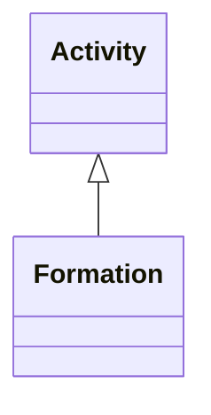

### Inherited Properties

| Defined In | Properties |
|------------|------------|
| AbstractEntity | [`id`](#prop-abstract-entity-id)&nbsp;&#124;&nbsp;[`type`](#prop-abstract-entity-type)&nbsp;&#124;&nbsp;[`_label`](#prop-abstract-entity-_label) |
| Activity | [`carried_out_by`](#prop-activity-carried_out_by)&nbsp;&#124;&nbsp;[`continued`](#prop-activity-continued)&nbsp;&#124;&nbsp;[`continued_by`](#prop-activity-continued_by)&nbsp;&#124;&nbsp;[`general_purpose`](#prop-activity-general_purpose)&nbsp;&#124;&nbsp;[`influenced_by`](#prop-activity-influenced_by)&nbsp;&#124;&nbsp;[`intended_use_of`](#prop-activity-intended_use_of)&nbsp;&#124;&nbsp;[`motivated_by`](#prop-activity-motivated_by)&nbsp;&#124;&nbsp;[`specific_purpose`](#prop-activity-specific_purpose)&nbsp;&#124;&nbsp;[`specific_technique`](#prop-activity-specific_technique)&nbsp;&#124;&nbsp;[`technique`](#prop-activity-technique)&nbsp;&#124;&nbsp;[`used_object_of_type`](#prop-activity-used_object_of_type)&nbsp;&#124;&nbsp;[`used_specific_object`](#prop-activity-used_specific_object) |
| BeginningOfExistence | [`brought_into_existence`](#prop-beginning-of-existence-brought_into_existence) |
| CRMEntity | [`_classifications`](#prop-crmentity-_classifications)&nbsp;&#124;&nbsp;[`_description`](#prop-crmentity-_description)&nbsp;&#124;&nbsp;[`_primaryName`](#prop-crmentity-_primary-name)&nbsp;&#124;&nbsp;[`added_member_by`](#prop-crmentity-added_member_by)&nbsp;&#124;&nbsp;[`assigned_by`](#prop-crmentity-assigned_by)&nbsp;&#124;&nbsp;[`attributed_by`](#prop-crmentity-attributed_by)&nbsp;&#124;&nbsp;[`classified_as`](#prop-crmentity-classified_as)&nbsp;&#124;&nbsp;[`depicted_by`](#prop-crmentity-depicted_by)&nbsp;&#124;&nbsp;[`equivalent`](#prop-crmentity-equivalent)&nbsp;&#124;&nbsp;[`exemplifies`](#prop-crmentity-exemplifies)&nbsp;&#124;&nbsp;[`identified_by`](#prop-crmentity-identified_by)&nbsp;&#124;&nbsp;[`influenced`](#prop-crmentity-influenced)&nbsp;&#124;&nbsp;[`member_of_set`](#prop-crmentity-member_of_set)&nbsp;&#124;&nbsp;[`motivated`](#prop-crmentity-motivated)&nbsp;&#124;&nbsp;[`notation`](#prop-crmentity-notation)&nbsp;&#124;&nbsp;[`note`](#prop-crmentity-note)&nbsp;&#124;&nbsp;[`preferred_identifier`](#prop-crmentity-preferred_identifier)&nbsp;&#124;&nbsp;[`record_provenance`](#prop-crmentity-record_provenance)&nbsp;&#124;&nbsp;[`referred_to_by`](#prop-crmentity-referred_to_by)&nbsp;&#124;&nbsp;[`removed_member_by`](#prop-crmentity-removed_member_by)&nbsp;&#124;&nbsp;[`replaces`](#prop-crmentity-replaces)&nbsp;&#124;&nbsp;[`representation`](#prop-crmentity-representation)&nbsp;&#124;&nbsp;[`subject_of`](#prop-crmentity-subject_of) |
| Event | [`caused`](#prop-event-caused)&nbsp;&#124;&nbsp;[`caused_by`](#prop-event-caused_by)&nbsp;&#124;&nbsp;[`involved`](#prop-event-involved)&nbsp;&#124;&nbsp;[`participant`](#prop-event-participant)&nbsp;&#124;&nbsp;[`specific_purpose_of`](#prop-event-specific_purpose_of) |
| Period | [`part`](#prop-period-part)&nbsp;&#124;&nbsp;[`part_of`](#prop-period-part_of)&nbsp;&#124;&nbsp;[`took_place_at`](#prop-period-took_place_at)&nbsp;&#124;&nbsp;[`took_place_on_or_within`](#prop-period-took_place_on_or_within) |
| SpacetimeVolume | [`distinct_from`](#prop-spacetime-volume-distinct_from)&nbsp;&#124;&nbsp;[`during`](#prop-spacetime-volume-during)&nbsp;&#124;&nbsp;[`includes`](#prop-spacetime-volume-includes)&nbsp;&#124;&nbsp;[`spacetime_volume_is_defined_by`](#prop-spacetime-volume-spacetime_volume_is_defined_by)&nbsp;&#124;&nbsp;[`spatial_projection`](#prop-spacetime-volume-spatial_projection)&nbsp;&#124;&nbsp;[`temporal_projection`](#prop-spacetime-volume-temporal_projection)&nbsp;&#124;&nbsp;[`thing_defined_by`](#prop-spacetime-volume-thing_defined_by)&nbsp;&#124;&nbsp;[`volume_overlaps_with`](#prop-spacetime-volume-volume_overlaps_with) |
| TemporalEntity | [`after`](#prop-temporal-entity-after)&nbsp;&#124;&nbsp;[`before`](#prop-temporal-entity-before)&nbsp;&#124;&nbsp;[`ends_after_or_with_the_start_of`](#prop-temporal-entity-ends_after_or_with_the_start_of)&nbsp;&#124;&nbsp;[`ends_after_the_end_of`](#prop-temporal-entity-ends_after_the_end_of)&nbsp;&#124;&nbsp;[`ends_after_the_start_of`](#prop-temporal-entity-ends_after_the_start_of)&nbsp;&#124;&nbsp;[`ends_before_or_with_the_end_of`](#prop-temporal-entity-ends_before_or_with_the_end_of)&nbsp;&#124;&nbsp;[`ends_before_or_with_the_start_of`](#prop-temporal-entity-ends_before_or_with_the_start_of)&nbsp;&#124;&nbsp;[`ends_before_the_end_of`](#prop-temporal-entity-ends_before_the_end_of)&nbsp;&#124;&nbsp;[`ends_with_or_after_the_end_of`](#prop-temporal-entity-ends_with_or_after_the_end_of)&nbsp;&#124;&nbsp;[`starts_after_or_with_the_end_of`](#prop-temporal-entity-starts_after_or_with_the_end_of)&nbsp;&#124;&nbsp;[`starts_after_the_start_of`](#prop-temporal-entity-starts_after_the_start_of)&nbsp;&#124;&nbsp;[`starts_before_or_with_the_end_of`](#prop-temporal-entity-starts_before_or_with_the_end_of)&nbsp;&#124;&nbsp;[`starts_before_or_with_the_start_of`](#prop-temporal-entity-starts_before_or_with_the_start_of)&nbsp;&#124;&nbsp;[`starts_before_the_end_of`](#prop-temporal-entity-starts_before_the_end_of)&nbsp;&#124;&nbsp;[`starts_before_the_start_of`](#prop-temporal-entity-starts_before_the_start_of)&nbsp;&#124;&nbsp;[`starts_with_or_after_the_start_of`](#prop-temporal-entity-starts_with_or_after_the_start_of)&nbsp;&#124;&nbsp;[`timespan`](#prop-temporal-entity-timespan) |

### Local Properties

| Name | Cardinality | Value | Defined In | Description |
|------|-------------|-------|------------|-------------|
| <a id="prop-formation-formed"></a>`formed` | `1..*` | [Group](#class-group)[] | local | This property links the founding or E66 Formation for an E74 Group with the Group itself. |
| <a id="prop-formation-formed_from"></a>`formed_from` | `0..*` | [Group](#class-group)[] | local | This property associates an instance of E66 Formation with an instance of E74 Group from which the new group was formed preserving a sense of continuity such as in mission, membership or tradition. |

---

<a id="class-group"></a>
## Group

This class comprises any gatherings or organizations of E39 Actors that act collectively or in a similar way due to any form of unifying relationship. In the wider sense this class also comprises official positions which used to be regarded in certain contexts as one actor, independent of the current holder of the office, such as the president of a country. In such cases, it may happen that the Group never had more than one member. A joint pseudonym (i.e., a name that seems indicative of an individual but that is actually used as a persona by two or more people) is a particular case of E74 Group. A gathering of people becomes an E74 Group when it exhibits organizational characteristics usually typified by a set of ideas or beliefs held in common, or actions performed together. These might be communication, creating some common artifact, a common purpose such as study, worship, business, sports, etc. Nationality can be modeled as membership in an E74 Group (cf. HumanML markup). Married couples and other concepts of family are regarded as particular examples of E74 Group.

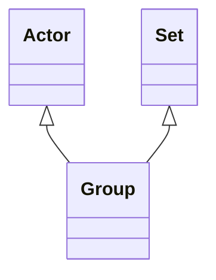

### Inherited Properties

| Defined In | Properties |
|------------|------------|
| AbstractEntity | [`id`](#prop-abstract-entity-id)&nbsp;&#124;&nbsp;[`type`](#prop-abstract-entity-type)&nbsp;&#124;&nbsp;[`_label`](#prop-abstract-entity-_label) |
| Actor | [`acquired_custody_through`](#prop-actor-acquired_custody_through)&nbsp;&#124;&nbsp;[`acquired_title_through`](#prop-actor-acquired_title_through)&nbsp;&#124;&nbsp;[`carried_out`](#prop-actor-carried_out)&nbsp;&#124;&nbsp;[`contact_point`](#prop-actor-contact_point)&nbsp;&#124;&nbsp;[`current_custodian_of`](#prop-actor-current_custodian_of)&nbsp;&#124;&nbsp;[`current_owner_of`](#prop-actor-current_owner_of)&nbsp;&#124;&nbsp;[`current_permanent_custodian_of`](#prop-actor-current_permanent_custodian_of)&nbsp;&#124;&nbsp;[`former_or_current_keeper_of`](#prop-actor-former_or_current_keeper_of)&nbsp;&#124;&nbsp;[`former_or_current_owner_of`](#prop-actor-former_or_current_owner_of)&nbsp;&#124;&nbsp;[`joined_by`](#prop-actor-joined_by)&nbsp;&#124;&nbsp;[`left_by`](#prop-actor-left_by)&nbsp;&#124;&nbsp;[`member_of`](#prop-actor-member_of)&nbsp;&#124;&nbsp;[`participated_in`](#prop-actor-participated_in)&nbsp;&#124;&nbsp;[`possesses`](#prop-actor-possesses)&nbsp;&#124;&nbsp;[`residence`](#prop-actor-residence)&nbsp;&#124;&nbsp;[`right_on`](#prop-actor-right_on)&nbsp;&#124;&nbsp;[`surrendered_custody_through`](#prop-actor-surrendered_custody_through)&nbsp;&#124;&nbsp;[`surrendered_title_through`](#prop-actor-surrendered_title_through) |
| ConceptualObject | [`created_by`](#prop-conceptual-object-created_by) |
| CRMEntity | [`_classifications`](#prop-crmentity-_classifications)&nbsp;&#124;&nbsp;[`_description`](#prop-crmentity-_description)&nbsp;&#124;&nbsp;[`_primaryName`](#prop-crmentity-_primary-name)&nbsp;&#124;&nbsp;[`added_member_by`](#prop-crmentity-added_member_by)&nbsp;&#124;&nbsp;[`assigned_by`](#prop-crmentity-assigned_by)&nbsp;&#124;&nbsp;[`attributed_by`](#prop-crmentity-attributed_by)&nbsp;&#124;&nbsp;[`classified_as`](#prop-crmentity-classified_as)&nbsp;&#124;&nbsp;[`depicted_by`](#prop-crmentity-depicted_by)&nbsp;&#124;&nbsp;[`equivalent`](#prop-crmentity-equivalent)&nbsp;&#124;&nbsp;[`exemplifies`](#prop-crmentity-exemplifies)&nbsp;&#124;&nbsp;[`identified_by`](#prop-crmentity-identified_by)&nbsp;&#124;&nbsp;[`influenced`](#prop-crmentity-influenced)&nbsp;&#124;&nbsp;[`member_of_set`](#prop-crmentity-member_of_set)&nbsp;&#124;&nbsp;[`motivated`](#prop-crmentity-motivated)&nbsp;&#124;&nbsp;[`notation`](#prop-crmentity-notation)&nbsp;&#124;&nbsp;[`note`](#prop-crmentity-note)&nbsp;&#124;&nbsp;[`preferred_identifier`](#prop-crmentity-preferred_identifier)&nbsp;&#124;&nbsp;[`record_provenance`](#prop-crmentity-record_provenance)&nbsp;&#124;&nbsp;[`referred_to_by`](#prop-crmentity-referred_to_by)&nbsp;&#124;&nbsp;[`removed_member_by`](#prop-crmentity-removed_member_by)&nbsp;&#124;&nbsp;[`replaces`](#prop-crmentity-replaces)&nbsp;&#124;&nbsp;[`representation`](#prop-crmentity-representation)&nbsp;&#124;&nbsp;[`subject_of`](#prop-crmentity-subject_of) |
| HumanMadeThing | [`conformsTo`](#prop-human-made-thing-conforms-to)&nbsp;&#124;&nbsp;[`intended_for`](#prop-human-made-thing-intended_for)&nbsp;&#124;&nbsp;[`made_for`](#prop-human-made-thing-made_for)&nbsp;&#124;&nbsp;[`title`](#prop-human-made-thing-title) |
| LegalObject | [`right_held_by`](#prop-legal-object-right_held_by)&nbsp;&#124;&nbsp;[`subject_to`](#prop-legal-object-subject_to) |
| PersistentItem | [`brought_into_existence_by`](#prop-persistent-item-brought_into_existence_by)&nbsp;&#124;&nbsp;[`present_at`](#prop-persistent-item-present_at)&nbsp;&#124;&nbsp;[`taken_out_of_existence_by`](#prop-persistent-item-taken_out_of_existence_by) |
| PropositionalObject | [`about`](#prop-propositional-object-about)&nbsp;&#124;&nbsp;[`conceptual_part`](#prop-propositional-object-conceptual_part)&nbsp;&#124;&nbsp;[`conceptually_part_of`](#prop-propositional-object-conceptually_part_of)&nbsp;&#124;&nbsp;[`refers_to`](#prop-propositional-object-refers_to) |
| Set | [`added_to_by`](#prop-set-added_to_by)&nbsp;&#124;&nbsp;[`members_contained_by`](#prop-set-members_contained_by)&nbsp;&#124;&nbsp;[`members_exemplified_by`](#prop-set-members_exemplified_by)&nbsp;&#124;&nbsp;[`removed_from_by`](#prop-set-removed_from_by)&nbsp;&#124;&nbsp;[`set_has_member`](#prop-set-set_has_member) |
| Thing | [`dimension`](#prop-thing-dimension)&nbsp;&#124;&nbsp;[`features_are_also_found_on`](#prop-thing-features_are_also_found_on)&nbsp;&#124;&nbsp;[`general_use`](#prop-thing-general_use)&nbsp;&#124;&nbsp;[`shows_features_of`](#prop-thing-shows_features_of)&nbsp;&#124;&nbsp;[`used_for`](#prop-thing-used_for) |

### Local Properties

| Name | Cardinality | Value | Defined In | Description |
|------|-------------|-------|------------|-------------|
| <a id="prop-group-dissolved_by"></a>`dissolved_by` | `0..1` | [Dissolution](#class-dissolution) | local | Inverse of dissolved |
| <a id="prop-group-formed_by"></a>`formed_by` | `0..1` | [Formation](#class-formation) | local | Inverse of formed |
| <a id="prop-group-gained_member_by"></a>`gained_member_by` | `0..*` | [Joining](#class-joining)[] | local | Inverse of joined_with |
| <a id="prop-group-lost_member_by"></a>`lost_member_by` | `0..*` | [Leaving](#class-leaving)[] | local | Inverse of separated_from |
| <a id="prop-group-member"></a>`member` | `0..*` | [Actor](#class-actor)[] | local | This property relates an E39 Actor to the E74 Group of which that E39 Actor is a member. Groups, Legal Bodies and Persons, may all be members of Groups. A Group necessarily consists of more than one member. This property is a shortcut of the more fully developed path from E74 Group through P144 joined with (gained member by), E85 Joining, P143 joined (was joined by) to E39 Actor The property P107.1 kind of member can be used to specify the type of membership or the role the member has in the group. |
| <a id="prop-group-participated_in_formation"></a>`participated_in_formation` | `0..*` | [Formation](#class-formation)[] | local | Inverse of formed_from |

---

<a id="class-human-made-feature"></a>
## HumanMadeFeature

This class comprises physical features that are purposely created by human activity, such as scratches, artificial caves, artificial water channels, etc. No assumptions are made as to the extent of modification required to justify regarding a feature as man-made. For example, rock art or even “cup and ring” carvings on bedrock a regarded as types of E25 Human-Made Feature.

```mermaid
classDiagram
direction TB
class HumanMadeFeature
PhysicalFeature <|-- HumanMadeFeature
click HumanMadeFeature href "#class-human-made-feature" "HumanMadeFeature"
click PhysicalFeature href "#class-physical-feature" "PhysicalFeature"
```

### Inherited Properties

| Defined In | Properties |
|------------|------------|
| AbstractEntity | [`id`](#prop-abstract-entity-id)&nbsp;&#124;&nbsp;[`type`](#prop-abstract-entity-type)&nbsp;&#124;&nbsp;[`_label`](#prop-abstract-entity-_label) |
| CRMEntity | [`_classifications`](#prop-crmentity-_classifications)&nbsp;&#124;&nbsp;[`_description`](#prop-crmentity-_description)&nbsp;&#124;&nbsp;[`_primaryName`](#prop-crmentity-_primary-name)&nbsp;&#124;&nbsp;[`added_member_by`](#prop-crmentity-added_member_by)&nbsp;&#124;&nbsp;[`assigned_by`](#prop-crmentity-assigned_by)&nbsp;&#124;&nbsp;[`attributed_by`](#prop-crmentity-attributed_by)&nbsp;&#124;&nbsp;[`classified_as`](#prop-crmentity-classified_as)&nbsp;&#124;&nbsp;[`depicted_by`](#prop-crmentity-depicted_by)&nbsp;&#124;&nbsp;[`equivalent`](#prop-crmentity-equivalent)&nbsp;&#124;&nbsp;[`exemplifies`](#prop-crmentity-exemplifies)&nbsp;&#124;&nbsp;[`identified_by`](#prop-crmentity-identified_by)&nbsp;&#124;&nbsp;[`influenced`](#prop-crmentity-influenced)&nbsp;&#124;&nbsp;[`member_of_set`](#prop-crmentity-member_of_set)&nbsp;&#124;&nbsp;[`motivated`](#prop-crmentity-motivated)&nbsp;&#124;&nbsp;[`notation`](#prop-crmentity-notation)&nbsp;&#124;&nbsp;[`note`](#prop-crmentity-note)&nbsp;&#124;&nbsp;[`preferred_identifier`](#prop-crmentity-preferred_identifier)&nbsp;&#124;&nbsp;[`record_provenance`](#prop-crmentity-record_provenance)&nbsp;&#124;&nbsp;[`referred_to_by`](#prop-crmentity-referred_to_by)&nbsp;&#124;&nbsp;[`removed_member_by`](#prop-crmentity-removed_member_by)&nbsp;&#124;&nbsp;[`replaces`](#prop-crmentity-replaces)&nbsp;&#124;&nbsp;[`representation`](#prop-crmentity-representation)&nbsp;&#124;&nbsp;[`subject_of`](#prop-crmentity-subject_of) |
| HumanMadeThing | [`conformsTo`](#prop-human-made-thing-conforms-to)&nbsp;&#124;&nbsp;[`intended_for`](#prop-human-made-thing-intended_for)&nbsp;&#124;&nbsp;[`made_for`](#prop-human-made-thing-made_for)&nbsp;&#124;&nbsp;[`title`](#prop-human-made-thing-title) |
| LegalObject | [`right_held_by`](#prop-legal-object-right_held_by)&nbsp;&#124;&nbsp;[`subject_to`](#prop-legal-object-subject_to) |
| PersistentItem | [`brought_into_existence_by`](#prop-persistent-item-brought_into_existence_by)&nbsp;&#124;&nbsp;[`present_at`](#prop-persistent-item-present_at)&nbsp;&#124;&nbsp;[`taken_out_of_existence_by`](#prop-persistent-item-taken_out_of_existence_by) |
| PhysicalFeature | [`found_on`](#prop-physical-feature-found_on) |
| PhysicalHumanMadeThing | [`augmented_by`](#prop-physical-human-made-thing-augmented_by)&nbsp;&#124;&nbsp;[`depicts`](#prop-physical-human-made-thing-depicts)&nbsp;&#124;&nbsp;[`diminished_by`](#prop-physical-human-made-thing-diminished_by)&nbsp;&#124;&nbsp;[`modified_by`](#prop-physical-human-made-thing-modified_by)&nbsp;&#124;&nbsp;[`produced_by`](#prop-physical-human-made-thing-produced_by)&nbsp;&#124;&nbsp;[`shows`](#prop-physical-human-made-thing-shows) |
| PhysicalThing | [`added_by`](#prop-physical-thing-added_by)&nbsp;&#124;&nbsp;[`carries`](#prop-physical-thing-carries)&nbsp;&#124;&nbsp;[`changed_ownership_through`](#prop-physical-thing-changed_ownership_through)&nbsp;&#124;&nbsp;[`contains_members_of`](#prop-physical-thing-contains_members_of)&nbsp;&#124;&nbsp;[`current_custodian`](#prop-physical-thing-current_custodian)&nbsp;&#124;&nbsp;[`current_location`](#prop-physical-thing-current_location)&nbsp;&#124;&nbsp;[`current_owner`](#prop-physical-thing-current_owner)&nbsp;&#124;&nbsp;[`current_permanent_location`](#prop-physical-thing-current_permanent_location)&nbsp;&#124;&nbsp;[`custody_transferred_through`](#prop-physical-thing-custody_transferred_through)&nbsp;&#124;&nbsp;[`defines`](#prop-physical-thing-defines)&nbsp;&#124;&nbsp;[`destroyed_by`](#prop-physical-thing-destroyed_by)&nbsp;&#124;&nbsp;[`encountered_by`](#prop-physical-thing-encountered_by)&nbsp;&#124;&nbsp;[`former_or_current_keeper`](#prop-physical-thing-former_or_current_keeper)&nbsp;&#124;&nbsp;[`former_or_current_location`](#prop-physical-thing-former_or_current_location)&nbsp;&#124;&nbsp;[`former_or_current_owner`](#prop-physical-thing-former_or_current_owner)&nbsp;&#124;&nbsp;[`held_or_supported_by`](#prop-physical-thing-held_or_supported_by)&nbsp;&#124;&nbsp;[`holds_or_supports`](#prop-physical-thing-holds_or_supports)&nbsp;&#124;&nbsp;[`made_of`](#prop-physical-thing-made_of)&nbsp;&#124;&nbsp;[`occupies`](#prop-physical-thing-occupies)&nbsp;&#124;&nbsp;[`part`](#prop-physical-thing-part)&nbsp;&#124;&nbsp;[`part_of`](#prop-physical-thing-part_of)&nbsp;&#124;&nbsp;[`provides_reference_space_for`](#prop-physical-thing-provides_reference_space_for)&nbsp;&#124;&nbsp;[`removed_by`](#prop-physical-thing-removed_by)&nbsp;&#124;&nbsp;[`resulted_from`](#prop-physical-thing-resulted_from)&nbsp;&#124;&nbsp;[`section`](#prop-physical-thing-section)&nbsp;&#124;&nbsp;[`transformed_by`](#prop-physical-thing-transformed_by)&nbsp;&#124;&nbsp;[`witnessed`](#prop-physical-thing-witnessed) |
| SpacetimeVolume | [`distinct_from`](#prop-spacetime-volume-distinct_from)&nbsp;&#124;&nbsp;[`during`](#prop-spacetime-volume-during)&nbsp;&#124;&nbsp;[`includes`](#prop-spacetime-volume-includes)&nbsp;&#124;&nbsp;[`spacetime_volume_is_defined_by`](#prop-spacetime-volume-spacetime_volume_is_defined_by)&nbsp;&#124;&nbsp;[`spatial_projection`](#prop-spacetime-volume-spatial_projection)&nbsp;&#124;&nbsp;[`temporal_projection`](#prop-spacetime-volume-temporal_projection)&nbsp;&#124;&nbsp;[`thing_defined_by`](#prop-spacetime-volume-thing_defined_by)&nbsp;&#124;&nbsp;[`volume_overlaps_with`](#prop-spacetime-volume-volume_overlaps_with) |
| Thing | [`dimension`](#prop-thing-dimension)&nbsp;&#124;&nbsp;[`features_are_also_found_on`](#prop-thing-features_are_also_found_on)&nbsp;&#124;&nbsp;[`general_use`](#prop-thing-general_use)&nbsp;&#124;&nbsp;[`shows_features_of`](#prop-thing-shows_features_of)&nbsp;&#124;&nbsp;[`used_for`](#prop-thing-used_for) |

### Local Properties

This class defines no local properties.

---

<a id="class-human-made-object"></a>
## HumanMadeObject

This class comprises physical objects purposely created by human activity. No assumptions are made as to the extent of modification required to justify regarding an object as man-made. For example, an inscribed piece of rock or a preserved butterfly are both regarded as instances of E22 Human-Made Object.

```mermaid
classDiagram
direction TB
class HumanMadeObject
click HumanMadeObject href "#class-human-made-object" "HumanMadeObject"
```

### Inherited Properties

| Defined In | Properties |
|------------|------------|
| AbstractEntity | [`id`](#prop-abstract-entity-id)&nbsp;&#124;&nbsp;[`type`](#prop-abstract-entity-type)&nbsp;&#124;&nbsp;[`_label`](#prop-abstract-entity-_label) |
| CRMEntity | [`_classifications`](#prop-crmentity-_classifications)&nbsp;&#124;&nbsp;[`_description`](#prop-crmentity-_description)&nbsp;&#124;&nbsp;[`_primaryName`](#prop-crmentity-_primary-name)&nbsp;&#124;&nbsp;[`added_member_by`](#prop-crmentity-added_member_by)&nbsp;&#124;&nbsp;[`assigned_by`](#prop-crmentity-assigned_by)&nbsp;&#124;&nbsp;[`attributed_by`](#prop-crmentity-attributed_by)&nbsp;&#124;&nbsp;[`classified_as`](#prop-crmentity-classified_as)&nbsp;&#124;&nbsp;[`depicted_by`](#prop-crmentity-depicted_by)&nbsp;&#124;&nbsp;[`equivalent`](#prop-crmentity-equivalent)&nbsp;&#124;&nbsp;[`exemplifies`](#prop-crmentity-exemplifies)&nbsp;&#124;&nbsp;[`identified_by`](#prop-crmentity-identified_by)&nbsp;&#124;&nbsp;[`influenced`](#prop-crmentity-influenced)&nbsp;&#124;&nbsp;[`member_of_set`](#prop-crmentity-member_of_set)&nbsp;&#124;&nbsp;[`motivated`](#prop-crmentity-motivated)&nbsp;&#124;&nbsp;[`notation`](#prop-crmentity-notation)&nbsp;&#124;&nbsp;[`note`](#prop-crmentity-note)&nbsp;&#124;&nbsp;[`preferred_identifier`](#prop-crmentity-preferred_identifier)&nbsp;&#124;&nbsp;[`record_provenance`](#prop-crmentity-record_provenance)&nbsp;&#124;&nbsp;[`referred_to_by`](#prop-crmentity-referred_to_by)&nbsp;&#124;&nbsp;[`removed_member_by`](#prop-crmentity-removed_member_by)&nbsp;&#124;&nbsp;[`replaces`](#prop-crmentity-replaces)&nbsp;&#124;&nbsp;[`representation`](#prop-crmentity-representation)&nbsp;&#124;&nbsp;[`subject_of`](#prop-crmentity-subject_of) |
| HumanMadeThing | [`conformsTo`](#prop-human-made-thing-conforms-to)&nbsp;&#124;&nbsp;[`intended_for`](#prop-human-made-thing-intended_for)&nbsp;&#124;&nbsp;[`made_for`](#prop-human-made-thing-made_for)&nbsp;&#124;&nbsp;[`title`](#prop-human-made-thing-title) |
| LegalObject | [`right_held_by`](#prop-legal-object-right_held_by)&nbsp;&#124;&nbsp;[`subject_to`](#prop-legal-object-subject_to) |
| PersistentItem | [`brought_into_existence_by`](#prop-persistent-item-brought_into_existence_by)&nbsp;&#124;&nbsp;[`present_at`](#prop-persistent-item-present_at)&nbsp;&#124;&nbsp;[`taken_out_of_existence_by`](#prop-persistent-item-taken_out_of_existence_by) |
| PhysicalHumanMadeThing | [`augmented_by`](#prop-physical-human-made-thing-augmented_by)&nbsp;&#124;&nbsp;[`depicts`](#prop-physical-human-made-thing-depicts)&nbsp;&#124;&nbsp;[`diminished_by`](#prop-physical-human-made-thing-diminished_by)&nbsp;&#124;&nbsp;[`modified_by`](#prop-physical-human-made-thing-modified_by)&nbsp;&#124;&nbsp;[`produced_by`](#prop-physical-human-made-thing-produced_by)&nbsp;&#124;&nbsp;[`shows`](#prop-physical-human-made-thing-shows) |
| PhysicalObject | [`bears`](#prop-physical-object-bears)&nbsp;&#124;&nbsp;[`current_permanent_custodian`](#prop-physical-object-current_permanent_custodian)&nbsp;&#124;&nbsp;[`moved_by`](#prop-physical-object-moved_by)&nbsp;&#124;&nbsp;[`number_of_parts`](#prop-physical-object-number_of_parts) |
| PhysicalThing | [`added_by`](#prop-physical-thing-added_by)&nbsp;&#124;&nbsp;[`carries`](#prop-physical-thing-carries)&nbsp;&#124;&nbsp;[`changed_ownership_through`](#prop-physical-thing-changed_ownership_through)&nbsp;&#124;&nbsp;[`contains_members_of`](#prop-physical-thing-contains_members_of)&nbsp;&#124;&nbsp;[`current_custodian`](#prop-physical-thing-current_custodian)&nbsp;&#124;&nbsp;[`current_location`](#prop-physical-thing-current_location)&nbsp;&#124;&nbsp;[`current_owner`](#prop-physical-thing-current_owner)&nbsp;&#124;&nbsp;[`current_permanent_location`](#prop-physical-thing-current_permanent_location)&nbsp;&#124;&nbsp;[`custody_transferred_through`](#prop-physical-thing-custody_transferred_through)&nbsp;&#124;&nbsp;[`defines`](#prop-physical-thing-defines)&nbsp;&#124;&nbsp;[`destroyed_by`](#prop-physical-thing-destroyed_by)&nbsp;&#124;&nbsp;[`encountered_by`](#prop-physical-thing-encountered_by)&nbsp;&#124;&nbsp;[`former_or_current_keeper`](#prop-physical-thing-former_or_current_keeper)&nbsp;&#124;&nbsp;[`former_or_current_location`](#prop-physical-thing-former_or_current_location)&nbsp;&#124;&nbsp;[`former_or_current_owner`](#prop-physical-thing-former_or_current_owner)&nbsp;&#124;&nbsp;[`held_or_supported_by`](#prop-physical-thing-held_or_supported_by)&nbsp;&#124;&nbsp;[`holds_or_supports`](#prop-physical-thing-holds_or_supports)&nbsp;&#124;&nbsp;[`made_of`](#prop-physical-thing-made_of)&nbsp;&#124;&nbsp;[`occupies`](#prop-physical-thing-occupies)&nbsp;&#124;&nbsp;[`part`](#prop-physical-thing-part)&nbsp;&#124;&nbsp;[`part_of`](#prop-physical-thing-part_of)&nbsp;&#124;&nbsp;[`provides_reference_space_for`](#prop-physical-thing-provides_reference_space_for)&nbsp;&#124;&nbsp;[`removed_by`](#prop-physical-thing-removed_by)&nbsp;&#124;&nbsp;[`resulted_from`](#prop-physical-thing-resulted_from)&nbsp;&#124;&nbsp;[`section`](#prop-physical-thing-section)&nbsp;&#124;&nbsp;[`transformed_by`](#prop-physical-thing-transformed_by)&nbsp;&#124;&nbsp;[`witnessed`](#prop-physical-thing-witnessed) |
| SpacetimeVolume | [`distinct_from`](#prop-spacetime-volume-distinct_from)&nbsp;&#124;&nbsp;[`during`](#prop-spacetime-volume-during)&nbsp;&#124;&nbsp;[`includes`](#prop-spacetime-volume-includes)&nbsp;&#124;&nbsp;[`spacetime_volume_is_defined_by`](#prop-spacetime-volume-spacetime_volume_is_defined_by)&nbsp;&#124;&nbsp;[`spatial_projection`](#prop-spacetime-volume-spatial_projection)&nbsp;&#124;&nbsp;[`temporal_projection`](#prop-spacetime-volume-temporal_projection)&nbsp;&#124;&nbsp;[`thing_defined_by`](#prop-spacetime-volume-thing_defined_by)&nbsp;&#124;&nbsp;[`volume_overlaps_with`](#prop-spacetime-volume-volume_overlaps_with) |
| Thing | [`dimension`](#prop-thing-dimension)&nbsp;&#124;&nbsp;[`features_are_also_found_on`](#prop-thing-features_are_also_found_on)&nbsp;&#124;&nbsp;[`general_use`](#prop-thing-general_use)&nbsp;&#124;&nbsp;[`shows_features_of`](#prop-thing-shows_features_of)&nbsp;&#124;&nbsp;[`used_for`](#prop-thing-used_for) |

### Local Properties

This class defines no local properties.

---

<a id="class-identifier"></a>
## Identifier

This class comprises strings or codes assigned to instances of E1 CRM Entity in order to identify them uniquely and permanently within the context of one or more organisations. Such codes are often known as inventory numbers, registration codes, etc. and are typically composed of alphanumeric sequences. The class E42 Identifier is not normally used for machine-generated identifiers used for automated processing unless these are also used by human agents.

```mermaid
classDiagram
direction TB
class Identifier
click Identifier href "#class-identifier" "Identifier"
```

### Inherited Properties

| Defined In | Properties |
|------------|------------|
| AbstractEntity | [`id`](#prop-abstract-entity-id)&nbsp;&#124;&nbsp;[`type`](#prop-abstract-entity-type)&nbsp;&#124;&nbsp;[`_label`](#prop-abstract-entity-_label) |
| Appellation | [`alternative`](#prop-appellation-alternative)&nbsp;&#124;&nbsp;[`identifies`](#prop-appellation-identifies)&nbsp;&#124;&nbsp;[`provides_access_to`](#prop-appellation-provides_access_to) |
| ConceptualObject | [`created_by`](#prop-conceptual-object-created_by) |
| CRMEntity | [`_classifications`](#prop-crmentity-_classifications)&nbsp;&#124;&nbsp;[`_description`](#prop-crmentity-_description)&nbsp;&#124;&nbsp;[`_primaryName`](#prop-crmentity-_primary-name)&nbsp;&#124;&nbsp;[`added_member_by`](#prop-crmentity-added_member_by)&nbsp;&#124;&nbsp;[`assigned_by`](#prop-crmentity-assigned_by)&nbsp;&#124;&nbsp;[`attributed_by`](#prop-crmentity-attributed_by)&nbsp;&#124;&nbsp;[`classified_as`](#prop-crmentity-classified_as)&nbsp;&#124;&nbsp;[`depicted_by`](#prop-crmentity-depicted_by)&nbsp;&#124;&nbsp;[`equivalent`](#prop-crmentity-equivalent)&nbsp;&#124;&nbsp;[`exemplifies`](#prop-crmentity-exemplifies)&nbsp;&#124;&nbsp;[`identified_by`](#prop-crmentity-identified_by)&nbsp;&#124;&nbsp;[`influenced`](#prop-crmentity-influenced)&nbsp;&#124;&nbsp;[`member_of_set`](#prop-crmentity-member_of_set)&nbsp;&#124;&nbsp;[`motivated`](#prop-crmentity-motivated)&nbsp;&#124;&nbsp;[`notation`](#prop-crmentity-notation)&nbsp;&#124;&nbsp;[`note`](#prop-crmentity-note)&nbsp;&#124;&nbsp;[`preferred_identifier`](#prop-crmentity-preferred_identifier)&nbsp;&#124;&nbsp;[`record_provenance`](#prop-crmentity-record_provenance)&nbsp;&#124;&nbsp;[`referred_to_by`](#prop-crmentity-referred_to_by)&nbsp;&#124;&nbsp;[`removed_member_by`](#prop-crmentity-removed_member_by)&nbsp;&#124;&nbsp;[`replaces`](#prop-crmentity-replaces)&nbsp;&#124;&nbsp;[`representation`](#prop-crmentity-representation)&nbsp;&#124;&nbsp;[`subject_of`](#prop-crmentity-subject_of) |
| HumanMadeThing | [`conformsTo`](#prop-human-made-thing-conforms-to)&nbsp;&#124;&nbsp;[`intended_for`](#prop-human-made-thing-intended_for)&nbsp;&#124;&nbsp;[`made_for`](#prop-human-made-thing-made_for)&nbsp;&#124;&nbsp;[`title`](#prop-human-made-thing-title) |
| LegalObject | [`right_held_by`](#prop-legal-object-right_held_by)&nbsp;&#124;&nbsp;[`subject_to`](#prop-legal-object-subject_to) |
| PersistentItem | [`brought_into_existence_by`](#prop-persistent-item-brought_into_existence_by)&nbsp;&#124;&nbsp;[`present_at`](#prop-persistent-item-present_at)&nbsp;&#124;&nbsp;[`taken_out_of_existence_by`](#prop-persistent-item-taken_out_of_existence_by) |
| SymbolicObject | [`carried_by`](#prop-symbolic-object-carried_by)&nbsp;&#124;&nbsp;[`content`](#prop-symbolic-object-content)&nbsp;&#124;&nbsp;[`digitally_carried_by`](#prop-symbolic-object-digitally_carried_by)&nbsp;&#124;&nbsp;[`incorporated_by`](#prop-symbolic-object-incorporated_by)&nbsp;&#124;&nbsp;[`part`](#prop-symbolic-object-part)&nbsp;&#124;&nbsp;[`part_of`](#prop-symbolic-object-part_of) |
| Thing | [`dimension`](#prop-thing-dimension)&nbsp;&#124;&nbsp;[`features_are_also_found_on`](#prop-thing-features_are_also_found_on)&nbsp;&#124;&nbsp;[`general_use`](#prop-thing-general_use)&nbsp;&#124;&nbsp;[`shows_features_of`](#prop-thing-shows_features_of)&nbsp;&#124;&nbsp;[`used_for`](#prop-thing-used_for) |

### Local Properties

| Name | Cardinality | Value | Defined In | Description |
|------|-------------|-------|------------|-------------|
| <a id="prop-identifier-preferred_identifier_of"></a>`preferred_identifier_of` | `0..*` | `CRMEntity[]` | local | Inverse of preferred_identifier |

---

<a id="class-information-object"></a>
## InformationObject

This class comprises identifiable immaterial items, such as a poems, jokes, data sets, images, texts, multimedia objects, procedural prescriptions, computer program code, algorithm or mathematical formulae, that have an objectively recognizable structure and are documented as single units. The encoding structure known as a "named graph" also falls under this class, so that each "named graph" is an instance of an E73 Information Object. An E73 Information Object does not depend on a specific physical carrier, which can include human memory, and it can exist on one or more carriers simultaneously. Instances of E73 Information Object of a linguistic nature should be declared as instances of the E33 Linguistic Object subclass. Instances of E73 Information Object of a documentary nature should be declared as instances of the E31 Document subclass. Conceptual items such as types and classes are not instances of E73 Information Object, nor are ideas without a reproducible expression.

```mermaid
classDiagram
direction TB
class InformationObject
PropositionalObject <|-- InformationObject
InformationObject <|-- DesignOrProcedure
InformationObject <|-- DigitalObject
InformationObject <|-- LinguisticObject
InformationObject <|-- VisualItem
click InformationObject href "#class-information-object" "InformationObject"
click PropositionalObject href "#class-propositional-object" "PropositionalObject"
click DesignOrProcedure href "#class-design-or-procedure" "DesignOrProcedure"
click DigitalObject href "#class-digital-object" "DigitalObject"
click LinguisticObject href "#class-linguistic-object" "LinguisticObject"
click VisualItem href "#class-visual-item" "VisualItem"
```

### Inherited Properties

| Defined In | Properties |
|------------|------------|
| AbstractEntity | [`id`](#prop-abstract-entity-id)&nbsp;&#124;&nbsp;[`type`](#prop-abstract-entity-type)&nbsp;&#124;&nbsp;[`_label`](#prop-abstract-entity-_label) |
| ConceptualObject | [`created_by`](#prop-conceptual-object-created_by) |
| CRMEntity | [`_classifications`](#prop-crmentity-_classifications)&nbsp;&#124;&nbsp;[`_description`](#prop-crmentity-_description)&nbsp;&#124;&nbsp;[`_primaryName`](#prop-crmentity-_primary-name)&nbsp;&#124;&nbsp;[`added_member_by`](#prop-crmentity-added_member_by)&nbsp;&#124;&nbsp;[`assigned_by`](#prop-crmentity-assigned_by)&nbsp;&#124;&nbsp;[`attributed_by`](#prop-crmentity-attributed_by)&nbsp;&#124;&nbsp;[`classified_as`](#prop-crmentity-classified_as)&nbsp;&#124;&nbsp;[`depicted_by`](#prop-crmentity-depicted_by)&nbsp;&#124;&nbsp;[`equivalent`](#prop-crmentity-equivalent)&nbsp;&#124;&nbsp;[`exemplifies`](#prop-crmentity-exemplifies)&nbsp;&#124;&nbsp;[`identified_by`](#prop-crmentity-identified_by)&nbsp;&#124;&nbsp;[`influenced`](#prop-crmentity-influenced)&nbsp;&#124;&nbsp;[`member_of_set`](#prop-crmentity-member_of_set)&nbsp;&#124;&nbsp;[`motivated`](#prop-crmentity-motivated)&nbsp;&#124;&nbsp;[`notation`](#prop-crmentity-notation)&nbsp;&#124;&nbsp;[`note`](#prop-crmentity-note)&nbsp;&#124;&nbsp;[`preferred_identifier`](#prop-crmentity-preferred_identifier)&nbsp;&#124;&nbsp;[`record_provenance`](#prop-crmentity-record_provenance)&nbsp;&#124;&nbsp;[`referred_to_by`](#prop-crmentity-referred_to_by)&nbsp;&#124;&nbsp;[`removed_member_by`](#prop-crmentity-removed_member_by)&nbsp;&#124;&nbsp;[`replaces`](#prop-crmentity-replaces)&nbsp;&#124;&nbsp;[`representation`](#prop-crmentity-representation)&nbsp;&#124;&nbsp;[`subject_of`](#prop-crmentity-subject_of) |
| HumanMadeThing | [`conformsTo`](#prop-human-made-thing-conforms-to)&nbsp;&#124;&nbsp;[`intended_for`](#prop-human-made-thing-intended_for)&nbsp;&#124;&nbsp;[`made_for`](#prop-human-made-thing-made_for)&nbsp;&#124;&nbsp;[`title`](#prop-human-made-thing-title) |
| LegalObject | [`right_held_by`](#prop-legal-object-right_held_by)&nbsp;&#124;&nbsp;[`subject_to`](#prop-legal-object-subject_to) |
| PersistentItem | [`brought_into_existence_by`](#prop-persistent-item-brought_into_existence_by)&nbsp;&#124;&nbsp;[`present_at`](#prop-persistent-item-present_at)&nbsp;&#124;&nbsp;[`taken_out_of_existence_by`](#prop-persistent-item-taken_out_of_existence_by) |
| PropositionalObject | [`about`](#prop-propositional-object-about)&nbsp;&#124;&nbsp;[`conceptual_part`](#prop-propositional-object-conceptual_part)&nbsp;&#124;&nbsp;[`conceptually_part_of`](#prop-propositional-object-conceptually_part_of)&nbsp;&#124;&nbsp;[`refers_to`](#prop-propositional-object-refers_to) |
| SymbolicObject | [`carried_by`](#prop-symbolic-object-carried_by)&nbsp;&#124;&nbsp;[`content`](#prop-symbolic-object-content)&nbsp;&#124;&nbsp;[`digitally_carried_by`](#prop-symbolic-object-digitally_carried_by)&nbsp;&#124;&nbsp;[`incorporated_by`](#prop-symbolic-object-incorporated_by)&nbsp;&#124;&nbsp;[`part`](#prop-symbolic-object-part)&nbsp;&#124;&nbsp;[`part_of`](#prop-symbolic-object-part_of) |
| Thing | [`dimension`](#prop-thing-dimension)&nbsp;&#124;&nbsp;[`features_are_also_found_on`](#prop-thing-features_are_also_found_on)&nbsp;&#124;&nbsp;[`general_use`](#prop-thing-general_use)&nbsp;&#124;&nbsp;[`shows_features_of`](#prop-thing-shows_features_of)&nbsp;&#124;&nbsp;[`used_for`](#prop-thing-used_for) |

### Local Properties

| Name | Cardinality | Value | Defined In | Description |
|------|-------------|-------|------------|-------------|
| <a id="prop-information-object-format"></a>`format` | `0..1` | `string` | local | The media type of the information object |
| <a id="prop-information-object-presence_of"></a>`presence_of` | `0..*` | `SymbolicObject[]` | local | This property associates an instance of E73 Information Object with an instance of E90 Symbolic Object (or any of its subclasses) that was included in it. This property makes it possible to recognise the autonomous status of the incorporated signs, which were created in a distinct context, and can be incorporated in many distinct self-contained expressions, and to highlight the difference between structural and accidental whole-part relationships between conceptual entities. It accounts for many cultural facts that are quite frequent and significant: the inclusion of a poem in an anthology, the re-use of an operatic aria in a new opera, the use of a reproduction of a painting for a book cover or a CD booklet, the integration of textual quotations, the presence of lyrics in a song that sets those lyrics to music, the presence of the text of a play in a movie based on that play, etc. In particular, this property allows for modelling relationships of different levels of symbolic specificity, such as the natural language words making up a particular text, the characters making up the words and punctuation, the choice of fonts and page layout for the characters. A digital photograph of a manuscript page incorporates the text of the manuscript page. |

---

<a id="class-inscription"></a>
## Inscription

This class comprises recognisable, short texts attached to instances of E24 Physical Human-Made Thing. The transcription of the text can be documented in a note by P3 has note: E62 String. The alphabet used can be documented by P2 has type: E55 Type. This class does not intend to describe the idiosyncratic characteristics of an individual physical embodiment of an inscription, but the underlying prototype. The physical embodiment is modelled in the CRM as E24 Physical Human-Made Thing. The relationship of a physical copy of a book to the text it contains is modelled using E84 Information Carrier. P128 carries (is carried by): E33 Linguistic Object.

```mermaid
classDiagram
direction TB
class Inscription
LinguisticObject <|-- Inscription
Mark <|-- Inscription
click Inscription href "#class-inscription" "Inscription"
click LinguisticObject href "#class-linguistic-object" "LinguisticObject"
click Mark href "#class-mark" "Mark"
```

### Inherited Properties

| Defined In | Properties |
|------------|------------|
| AbstractEntity | [`id`](#prop-abstract-entity-id)&nbsp;&#124;&nbsp;[`type`](#prop-abstract-entity-type)&nbsp;&#124;&nbsp;[`_label`](#prop-abstract-entity-_label) |
| ConceptualObject | [`created_by`](#prop-conceptual-object-created_by) |
| CRMEntity | [`_classifications`](#prop-crmentity-_classifications)&nbsp;&#124;&nbsp;[`_description`](#prop-crmentity-_description)&nbsp;&#124;&nbsp;[`_primaryName`](#prop-crmentity-_primary-name)&nbsp;&#124;&nbsp;[`added_member_by`](#prop-crmentity-added_member_by)&nbsp;&#124;&nbsp;[`assigned_by`](#prop-crmentity-assigned_by)&nbsp;&#124;&nbsp;[`attributed_by`](#prop-crmentity-attributed_by)&nbsp;&#124;&nbsp;[`classified_as`](#prop-crmentity-classified_as)&nbsp;&#124;&nbsp;[`depicted_by`](#prop-crmentity-depicted_by)&nbsp;&#124;&nbsp;[`equivalent`](#prop-crmentity-equivalent)&nbsp;&#124;&nbsp;[`exemplifies`](#prop-crmentity-exemplifies)&nbsp;&#124;&nbsp;[`identified_by`](#prop-crmentity-identified_by)&nbsp;&#124;&nbsp;[`influenced`](#prop-crmentity-influenced)&nbsp;&#124;&nbsp;[`member_of_set`](#prop-crmentity-member_of_set)&nbsp;&#124;&nbsp;[`motivated`](#prop-crmentity-motivated)&nbsp;&#124;&nbsp;[`notation`](#prop-crmentity-notation)&nbsp;&#124;&nbsp;[`note`](#prop-crmentity-note)&nbsp;&#124;&nbsp;[`preferred_identifier`](#prop-crmentity-preferred_identifier)&nbsp;&#124;&nbsp;[`record_provenance`](#prop-crmentity-record_provenance)&nbsp;&#124;&nbsp;[`referred_to_by`](#prop-crmentity-referred_to_by)&nbsp;&#124;&nbsp;[`removed_member_by`](#prop-crmentity-removed_member_by)&nbsp;&#124;&nbsp;[`replaces`](#prop-crmentity-replaces)&nbsp;&#124;&nbsp;[`representation`](#prop-crmentity-representation)&nbsp;&#124;&nbsp;[`subject_of`](#prop-crmentity-subject_of) |
| HumanMadeThing | [`conformsTo`](#prop-human-made-thing-conforms-to)&nbsp;&#124;&nbsp;[`intended_for`](#prop-human-made-thing-intended_for)&nbsp;&#124;&nbsp;[`made_for`](#prop-human-made-thing-made_for)&nbsp;&#124;&nbsp;[`title`](#prop-human-made-thing-title) |
| InformationObject | [`format`](#prop-information-object-format)&nbsp;&#124;&nbsp;[`presence_of`](#prop-information-object-presence_of) |
| LegalObject | [`right_held_by`](#prop-legal-object-right_held_by)&nbsp;&#124;&nbsp;[`subject_to`](#prop-legal-object-subject_to) |
| LinguisticObject | [`language`](#prop-linguistic-object-language)&nbsp;&#124;&nbsp;[`translation`](#prop-linguistic-object-translation)&nbsp;&#124;&nbsp;[`translation_of`](#prop-linguistic-object-translation_of) |
| PersistentItem | [`brought_into_existence_by`](#prop-persistent-item-brought_into_existence_by)&nbsp;&#124;&nbsp;[`present_at`](#prop-persistent-item-present_at)&nbsp;&#124;&nbsp;[`taken_out_of_existence_by`](#prop-persistent-item-taken_out_of_existence_by) |
| PropositionalObject | [`about`](#prop-propositional-object-about)&nbsp;&#124;&nbsp;[`conceptual_part`](#prop-propositional-object-conceptual_part)&nbsp;&#124;&nbsp;[`conceptually_part_of`](#prop-propositional-object-conceptually_part_of)&nbsp;&#124;&nbsp;[`refers_to`](#prop-propositional-object-refers_to) |
| SymbolicObject | [`carried_by`](#prop-symbolic-object-carried_by)&nbsp;&#124;&nbsp;[`content`](#prop-symbolic-object-content)&nbsp;&#124;&nbsp;[`digitally_carried_by`](#prop-symbolic-object-digitally_carried_by)&nbsp;&#124;&nbsp;[`incorporated_by`](#prop-symbolic-object-incorporated_by)&nbsp;&#124;&nbsp;[`part`](#prop-symbolic-object-part)&nbsp;&#124;&nbsp;[`part_of`](#prop-symbolic-object-part_of) |
| Thing | [`dimension`](#prop-thing-dimension)&nbsp;&#124;&nbsp;[`features_are_also_found_on`](#prop-thing-features_are_also_found_on)&nbsp;&#124;&nbsp;[`general_use`](#prop-thing-general_use)&nbsp;&#124;&nbsp;[`shows_features_of`](#prop-thing-shows_features_of)&nbsp;&#124;&nbsp;[`used_for`](#prop-thing-used_for) |
| VisualItem | [`digitally_shown_by`](#prop-visual-item-digitally_shown_by)&nbsp;&#124;&nbsp;[`represents`](#prop-visual-item-represents)&nbsp;&#124;&nbsp;[`represents_instance_of_type`](#prop-visual-item-represents_instance_of_type)&nbsp;&#124;&nbsp;[`shown_by`](#prop-visual-item-shown_by) |

### Local Properties

This class defines no local properties.

---

<a id="class-joining"></a>
## Joining

This class comprises the activities that result in an instance of E39 Actor becoming a member of an instance of E74 Group. This class does not imply initiative by either party. It may be the initiative of a third party. Typical scenarios include becoming a member of a social organisation, becoming employee of a company, marriage, the adoption of a child by a family and the inauguration of somebody into an official position.

```mermaid
classDiagram
direction TB
class Joining
Activity <|-- Joining
Addition <|-- Joining
click Joining href "#class-joining" "Joining"
click Activity href "#class-activity" "Activity"
click Addition href "#class-addition" "Addition"
```

### Inherited Properties

| Defined In | Properties |
|------------|------------|
| AbstractEntity | [`id`](#prop-abstract-entity-id)&nbsp;&#124;&nbsp;[`type`](#prop-abstract-entity-type)&nbsp;&#124;&nbsp;[`_label`](#prop-abstract-entity-_label) |
| Activity | [`carried_out_by`](#prop-activity-carried_out_by)&nbsp;&#124;&nbsp;[`continued`](#prop-activity-continued)&nbsp;&#124;&nbsp;[`continued_by`](#prop-activity-continued_by)&nbsp;&#124;&nbsp;[`general_purpose`](#prop-activity-general_purpose)&nbsp;&#124;&nbsp;[`influenced_by`](#prop-activity-influenced_by)&nbsp;&#124;&nbsp;[`intended_use_of`](#prop-activity-intended_use_of)&nbsp;&#124;&nbsp;[`motivated_by`](#prop-activity-motivated_by)&nbsp;&#124;&nbsp;[`specific_purpose`](#prop-activity-specific_purpose)&nbsp;&#124;&nbsp;[`specific_technique`](#prop-activity-specific_technique)&nbsp;&#124;&nbsp;[`technique`](#prop-activity-technique)&nbsp;&#124;&nbsp;[`used_object_of_type`](#prop-activity-used_object_of_type)&nbsp;&#124;&nbsp;[`used_specific_object`](#prop-activity-used_specific_object) |
| Addition | [`added_member`](#prop-addition-added_member)&nbsp;&#124;&nbsp;[`added_to`](#prop-addition-added_to) |
| CRMEntity | [`_classifications`](#prop-crmentity-_classifications)&nbsp;&#124;&nbsp;[`_description`](#prop-crmentity-_description)&nbsp;&#124;&nbsp;[`_primaryName`](#prop-crmentity-_primary-name)&nbsp;&#124;&nbsp;[`added_member_by`](#prop-crmentity-added_member_by)&nbsp;&#124;&nbsp;[`assigned_by`](#prop-crmentity-assigned_by)&nbsp;&#124;&nbsp;[`attributed_by`](#prop-crmentity-attributed_by)&nbsp;&#124;&nbsp;[`classified_as`](#prop-crmentity-classified_as)&nbsp;&#124;&nbsp;[`depicted_by`](#prop-crmentity-depicted_by)&nbsp;&#124;&nbsp;[`equivalent`](#prop-crmentity-equivalent)&nbsp;&#124;&nbsp;[`exemplifies`](#prop-crmentity-exemplifies)&nbsp;&#124;&nbsp;[`identified_by`](#prop-crmentity-identified_by)&nbsp;&#124;&nbsp;[`influenced`](#prop-crmentity-influenced)&nbsp;&#124;&nbsp;[`member_of_set`](#prop-crmentity-member_of_set)&nbsp;&#124;&nbsp;[`motivated`](#prop-crmentity-motivated)&nbsp;&#124;&nbsp;[`notation`](#prop-crmentity-notation)&nbsp;&#124;&nbsp;[`note`](#prop-crmentity-note)&nbsp;&#124;&nbsp;[`preferred_identifier`](#prop-crmentity-preferred_identifier)&nbsp;&#124;&nbsp;[`record_provenance`](#prop-crmentity-record_provenance)&nbsp;&#124;&nbsp;[`referred_to_by`](#prop-crmentity-referred_to_by)&nbsp;&#124;&nbsp;[`removed_member_by`](#prop-crmentity-removed_member_by)&nbsp;&#124;&nbsp;[`replaces`](#prop-crmentity-replaces)&nbsp;&#124;&nbsp;[`representation`](#prop-crmentity-representation)&nbsp;&#124;&nbsp;[`subject_of`](#prop-crmentity-subject_of) |
| Event | [`caused`](#prop-event-caused)&nbsp;&#124;&nbsp;[`caused_by`](#prop-event-caused_by)&nbsp;&#124;&nbsp;[`involved`](#prop-event-involved)&nbsp;&#124;&nbsp;[`participant`](#prop-event-participant)&nbsp;&#124;&nbsp;[`specific_purpose_of`](#prop-event-specific_purpose_of) |
| Period | [`part`](#prop-period-part)&nbsp;&#124;&nbsp;[`part_of`](#prop-period-part_of)&nbsp;&#124;&nbsp;[`took_place_at`](#prop-period-took_place_at)&nbsp;&#124;&nbsp;[`took_place_on_or_within`](#prop-period-took_place_on_or_within) |
| SpacetimeVolume | [`distinct_from`](#prop-spacetime-volume-distinct_from)&nbsp;&#124;&nbsp;[`during`](#prop-spacetime-volume-during)&nbsp;&#124;&nbsp;[`includes`](#prop-spacetime-volume-includes)&nbsp;&#124;&nbsp;[`spacetime_volume_is_defined_by`](#prop-spacetime-volume-spacetime_volume_is_defined_by)&nbsp;&#124;&nbsp;[`spatial_projection`](#prop-spacetime-volume-spatial_projection)&nbsp;&#124;&nbsp;[`temporal_projection`](#prop-spacetime-volume-temporal_projection)&nbsp;&#124;&nbsp;[`thing_defined_by`](#prop-spacetime-volume-thing_defined_by)&nbsp;&#124;&nbsp;[`volume_overlaps_with`](#prop-spacetime-volume-volume_overlaps_with) |
| TemporalEntity | [`after`](#prop-temporal-entity-after)&nbsp;&#124;&nbsp;[`before`](#prop-temporal-entity-before)&nbsp;&#124;&nbsp;[`ends_after_or_with_the_start_of`](#prop-temporal-entity-ends_after_or_with_the_start_of)&nbsp;&#124;&nbsp;[`ends_after_the_end_of`](#prop-temporal-entity-ends_after_the_end_of)&nbsp;&#124;&nbsp;[`ends_after_the_start_of`](#prop-temporal-entity-ends_after_the_start_of)&nbsp;&#124;&nbsp;[`ends_before_or_with_the_end_of`](#prop-temporal-entity-ends_before_or_with_the_end_of)&nbsp;&#124;&nbsp;[`ends_before_or_with_the_start_of`](#prop-temporal-entity-ends_before_or_with_the_start_of)&nbsp;&#124;&nbsp;[`ends_before_the_end_of`](#prop-temporal-entity-ends_before_the_end_of)&nbsp;&#124;&nbsp;[`ends_with_or_after_the_end_of`](#prop-temporal-entity-ends_with_or_after_the_end_of)&nbsp;&#124;&nbsp;[`starts_after_or_with_the_end_of`](#prop-temporal-entity-starts_after_or_with_the_end_of)&nbsp;&#124;&nbsp;[`starts_after_the_start_of`](#prop-temporal-entity-starts_after_the_start_of)&nbsp;&#124;&nbsp;[`starts_before_or_with_the_end_of`](#prop-temporal-entity-starts_before_or_with_the_end_of)&nbsp;&#124;&nbsp;[`starts_before_or_with_the_start_of`](#prop-temporal-entity-starts_before_or_with_the_start_of)&nbsp;&#124;&nbsp;[`starts_before_the_end_of`](#prop-temporal-entity-starts_before_the_end_of)&nbsp;&#124;&nbsp;[`starts_before_the_start_of`](#prop-temporal-entity-starts_before_the_start_of)&nbsp;&#124;&nbsp;[`starts_with_or_after_the_start_of`](#prop-temporal-entity-starts_with_or_after_the_start_of)&nbsp;&#124;&nbsp;[`timespan`](#prop-temporal-entity-timespan) |

### Local Properties

| Name | Cardinality | Value | Defined In | Description |
|------|-------------|-------|------------|-------------|
| <a id="prop-joining-joined"></a>`joined` | `1..*` | [Actor](#class-actor)[] | local | This property identifies the instance of E39 Actor that becomes member of a E74 Group in an E85 Joining. Joining events allow for describing people becoming members of a group with a more detailed path from E74 Group through P144 joined with (gained member by), E85 Joining, P143 joined (was joined by) to E39 Actor, compared to the shortcut offered by P107 has current or former member (is current or former member of). |
| <a id="prop-joining-joined_with"></a>`joined_with` | `1..*` | [Group](#class-group)[] | local | This property identifies the instance of E74 Group of which an instance of E39 Actor becomes a member through an instance of E85 Joining. Although a Joining activity normally concerns only one instance of E74 Group, it is possible to imagine circumstances under which becoming member of one Group implies becoming member of another Group as well. Joining events allow for describing people becoming members of a group with a more detailed path from E74 Group through P144 joined with (gained member by), E85 Joining, P143 joined (was joined by) to E39 Actor, compared to the shortcut offered by P107 has current or former member (is current or former member of). The property P144.1 kind of member can be used to specify the type of membership or the role the member has in the group. |

---

<a id="class-language"></a>
## Language

This class is a specialization of E55 Type and comprises the natural languages in the sense of concepts. This type is used categorically in the model without reference to instances of it, i.e. the Model does not foresee the description of instances of instances of E56 Language, e.g.: “instances of Mandarin Chinese”. It is recommended that internationally or nationally agreed codes and terminology are used to denote instances of E56 Language, such as those defined in ISO 639:1988.

```mermaid
classDiagram
direction TB
class Language
Type <|-- Language
click Language href "#class-language" "Language"
click Type href "#class-type" "Type"
```

### Inherited Properties

| Defined In | Properties |
|------------|------------|
| AbstractEntity | [`id`](#prop-abstract-entity-id)&nbsp;&#124;&nbsp;[`type`](#prop-abstract-entity-type)&nbsp;&#124;&nbsp;[`_label`](#prop-abstract-entity-_label) |
| ConceptualObject | [`created_by`](#prop-conceptual-object-created_by) |
| CRMEntity | [`_classifications`](#prop-crmentity-_classifications)&nbsp;&#124;&nbsp;[`_description`](#prop-crmentity-_description)&nbsp;&#124;&nbsp;[`_primaryName`](#prop-crmentity-_primary-name)&nbsp;&#124;&nbsp;[`added_member_by`](#prop-crmentity-added_member_by)&nbsp;&#124;&nbsp;[`assigned_by`](#prop-crmentity-assigned_by)&nbsp;&#124;&nbsp;[`attributed_by`](#prop-crmentity-attributed_by)&nbsp;&#124;&nbsp;[`classified_as`](#prop-crmentity-classified_as)&nbsp;&#124;&nbsp;[`depicted_by`](#prop-crmentity-depicted_by)&nbsp;&#124;&nbsp;[`equivalent`](#prop-crmentity-equivalent)&nbsp;&#124;&nbsp;[`exemplifies`](#prop-crmentity-exemplifies)&nbsp;&#124;&nbsp;[`identified_by`](#prop-crmentity-identified_by)&nbsp;&#124;&nbsp;[`influenced`](#prop-crmentity-influenced)&nbsp;&#124;&nbsp;[`member_of_set`](#prop-crmentity-member_of_set)&nbsp;&#124;&nbsp;[`motivated`](#prop-crmentity-motivated)&nbsp;&#124;&nbsp;[`notation`](#prop-crmentity-notation)&nbsp;&#124;&nbsp;[`note`](#prop-crmentity-note)&nbsp;&#124;&nbsp;[`preferred_identifier`](#prop-crmentity-preferred_identifier)&nbsp;&#124;&nbsp;[`record_provenance`](#prop-crmentity-record_provenance)&nbsp;&#124;&nbsp;[`referred_to_by`](#prop-crmentity-referred_to_by)&nbsp;&#124;&nbsp;[`removed_member_by`](#prop-crmentity-removed_member_by)&nbsp;&#124;&nbsp;[`replaces`](#prop-crmentity-replaces)&nbsp;&#124;&nbsp;[`representation`](#prop-crmentity-representation)&nbsp;&#124;&nbsp;[`subject_of`](#prop-crmentity-subject_of) |
| HumanMadeThing | [`conformsTo`](#prop-human-made-thing-conforms-to)&nbsp;&#124;&nbsp;[`intended_for`](#prop-human-made-thing-intended_for)&nbsp;&#124;&nbsp;[`made_for`](#prop-human-made-thing-made_for)&nbsp;&#124;&nbsp;[`title`](#prop-human-made-thing-title) |
| PersistentItem | [`brought_into_existence_by`](#prop-persistent-item-brought_into_existence_by)&nbsp;&#124;&nbsp;[`present_at`](#prop-persistent-item-present_at)&nbsp;&#124;&nbsp;[`taken_out_of_existence_by`](#prop-persistent-item-taken_out_of_existence_by) |
| Thing | [`dimension`](#prop-thing-dimension)&nbsp;&#124;&nbsp;[`features_are_also_found_on`](#prop-thing-features_are_also_found_on)&nbsp;&#124;&nbsp;[`general_use`](#prop-thing-general_use)&nbsp;&#124;&nbsp;[`shows_features_of`](#prop-thing-shows_features_of)&nbsp;&#124;&nbsp;[`used_for`](#prop-thing-used_for) |
| Type | [`broader`](#prop-type-broader)&nbsp;&#124;&nbsp;[`defines_typical_parts_of`](#prop-type-defines_typical_parts_of)&nbsp;&#124;&nbsp;[`defines_typical_wholes_for`](#prop-type-defines_typical_wholes_for)&nbsp;&#124;&nbsp;[`exemplified_by`](#prop-type-exemplified_by)&nbsp;&#124;&nbsp;[`instance_represented_by`](#prop-type-instance_represented_by)&nbsp;&#124;&nbsp;[`intention_of`](#prop-type-intention_of)&nbsp;&#124;&nbsp;[`narrower`](#prop-type-narrower)&nbsp;&#124;&nbsp;[`purpose_of`](#prop-type-purpose_of)&nbsp;&#124;&nbsp;[`technique_of`](#prop-type-technique_of)&nbsp;&#124;&nbsp;[`type_of`](#prop-type-type_of)&nbsp;&#124;&nbsp;[`type_of_object_used_in`](#prop-type-type_of_object_used_in)&nbsp;&#124;&nbsp;[`use_of`](#prop-type-use_of) |

### Local Properties

| Name | Cardinality | Value | Defined In | Description |
|------|-------------|-------|------------|-------------|
| <a id="prop-language-language_of"></a>`language_of` | `0..*` | [LinguisticObject](#class-linguistic-object)[] | local | Inverse of language |

---

<a id="class-leaving"></a>
## Leaving

This class comprises the activities that result in an instance of E39 Actor to be disassociated from an instance of E74 Group. This class does not imply initiative by either party. It may be the initiative of a third party. Typical scenarios include the termination of membership in a social organisation, ending the employment at a company, divorce, and the end of tenure of somebody in an official position.

```mermaid
classDiagram
direction TB
class Leaving
Activity <|-- Leaving
Removal <|-- Leaving
click Leaving href "#class-leaving" "Leaving"
click Activity href "#class-activity" "Activity"
click Removal href "#class-removal" "Removal"
```

### Inherited Properties

| Defined In | Properties |
|------------|------------|
| AbstractEntity | [`id`](#prop-abstract-entity-id)&nbsp;&#124;&nbsp;[`type`](#prop-abstract-entity-type)&nbsp;&#124;&nbsp;[`_label`](#prop-abstract-entity-_label) |
| Activity | [`carried_out_by`](#prop-activity-carried_out_by)&nbsp;&#124;&nbsp;[`continued`](#prop-activity-continued)&nbsp;&#124;&nbsp;[`continued_by`](#prop-activity-continued_by)&nbsp;&#124;&nbsp;[`general_purpose`](#prop-activity-general_purpose)&nbsp;&#124;&nbsp;[`influenced_by`](#prop-activity-influenced_by)&nbsp;&#124;&nbsp;[`intended_use_of`](#prop-activity-intended_use_of)&nbsp;&#124;&nbsp;[`motivated_by`](#prop-activity-motivated_by)&nbsp;&#124;&nbsp;[`specific_purpose`](#prop-activity-specific_purpose)&nbsp;&#124;&nbsp;[`specific_technique`](#prop-activity-specific_technique)&nbsp;&#124;&nbsp;[`technique`](#prop-activity-technique)&nbsp;&#124;&nbsp;[`used_object_of_type`](#prop-activity-used_object_of_type)&nbsp;&#124;&nbsp;[`used_specific_object`](#prop-activity-used_specific_object) |
| CRMEntity | [`_classifications`](#prop-crmentity-_classifications)&nbsp;&#124;&nbsp;[`_description`](#prop-crmentity-_description)&nbsp;&#124;&nbsp;[`_primaryName`](#prop-crmentity-_primary-name)&nbsp;&#124;&nbsp;[`added_member_by`](#prop-crmentity-added_member_by)&nbsp;&#124;&nbsp;[`assigned_by`](#prop-crmentity-assigned_by)&nbsp;&#124;&nbsp;[`attributed_by`](#prop-crmentity-attributed_by)&nbsp;&#124;&nbsp;[`classified_as`](#prop-crmentity-classified_as)&nbsp;&#124;&nbsp;[`depicted_by`](#prop-crmentity-depicted_by)&nbsp;&#124;&nbsp;[`equivalent`](#prop-crmentity-equivalent)&nbsp;&#124;&nbsp;[`exemplifies`](#prop-crmentity-exemplifies)&nbsp;&#124;&nbsp;[`identified_by`](#prop-crmentity-identified_by)&nbsp;&#124;&nbsp;[`influenced`](#prop-crmentity-influenced)&nbsp;&#124;&nbsp;[`member_of_set`](#prop-crmentity-member_of_set)&nbsp;&#124;&nbsp;[`motivated`](#prop-crmentity-motivated)&nbsp;&#124;&nbsp;[`notation`](#prop-crmentity-notation)&nbsp;&#124;&nbsp;[`note`](#prop-crmentity-note)&nbsp;&#124;&nbsp;[`preferred_identifier`](#prop-crmentity-preferred_identifier)&nbsp;&#124;&nbsp;[`record_provenance`](#prop-crmentity-record_provenance)&nbsp;&#124;&nbsp;[`referred_to_by`](#prop-crmentity-referred_to_by)&nbsp;&#124;&nbsp;[`removed_member_by`](#prop-crmentity-removed_member_by)&nbsp;&#124;&nbsp;[`replaces`](#prop-crmentity-replaces)&nbsp;&#124;&nbsp;[`representation`](#prop-crmentity-representation)&nbsp;&#124;&nbsp;[`subject_of`](#prop-crmentity-subject_of) |
| Event | [`caused`](#prop-event-caused)&nbsp;&#124;&nbsp;[`caused_by`](#prop-event-caused_by)&nbsp;&#124;&nbsp;[`involved`](#prop-event-involved)&nbsp;&#124;&nbsp;[`participant`](#prop-event-participant)&nbsp;&#124;&nbsp;[`specific_purpose_of`](#prop-event-specific_purpose_of) |
| Period | [`part`](#prop-period-part)&nbsp;&#124;&nbsp;[`part_of`](#prop-period-part_of)&nbsp;&#124;&nbsp;[`took_place_at`](#prop-period-took_place_at)&nbsp;&#124;&nbsp;[`took_place_on_or_within`](#prop-period-took_place_on_or_within) |
| Removal | [`removed_from`](#prop-removal-removed_from)&nbsp;&#124;&nbsp;[`removed_member`](#prop-removal-removed_member) |
| SpacetimeVolume | [`distinct_from`](#prop-spacetime-volume-distinct_from)&nbsp;&#124;&nbsp;[`during`](#prop-spacetime-volume-during)&nbsp;&#124;&nbsp;[`includes`](#prop-spacetime-volume-includes)&nbsp;&#124;&nbsp;[`spacetime_volume_is_defined_by`](#prop-spacetime-volume-spacetime_volume_is_defined_by)&nbsp;&#124;&nbsp;[`spatial_projection`](#prop-spacetime-volume-spatial_projection)&nbsp;&#124;&nbsp;[`temporal_projection`](#prop-spacetime-volume-temporal_projection)&nbsp;&#124;&nbsp;[`thing_defined_by`](#prop-spacetime-volume-thing_defined_by)&nbsp;&#124;&nbsp;[`volume_overlaps_with`](#prop-spacetime-volume-volume_overlaps_with) |
| TemporalEntity | [`after`](#prop-temporal-entity-after)&nbsp;&#124;&nbsp;[`before`](#prop-temporal-entity-before)&nbsp;&#124;&nbsp;[`ends_after_or_with_the_start_of`](#prop-temporal-entity-ends_after_or_with_the_start_of)&nbsp;&#124;&nbsp;[`ends_after_the_end_of`](#prop-temporal-entity-ends_after_the_end_of)&nbsp;&#124;&nbsp;[`ends_after_the_start_of`](#prop-temporal-entity-ends_after_the_start_of)&nbsp;&#124;&nbsp;[`ends_before_or_with_the_end_of`](#prop-temporal-entity-ends_before_or_with_the_end_of)&nbsp;&#124;&nbsp;[`ends_before_or_with_the_start_of`](#prop-temporal-entity-ends_before_or_with_the_start_of)&nbsp;&#124;&nbsp;[`ends_before_the_end_of`](#prop-temporal-entity-ends_before_the_end_of)&nbsp;&#124;&nbsp;[`ends_with_or_after_the_end_of`](#prop-temporal-entity-ends_with_or_after_the_end_of)&nbsp;&#124;&nbsp;[`starts_after_or_with_the_end_of`](#prop-temporal-entity-starts_after_or_with_the_end_of)&nbsp;&#124;&nbsp;[`starts_after_the_start_of`](#prop-temporal-entity-starts_after_the_start_of)&nbsp;&#124;&nbsp;[`starts_before_or_with_the_end_of`](#prop-temporal-entity-starts_before_or_with_the_end_of)&nbsp;&#124;&nbsp;[`starts_before_or_with_the_start_of`](#prop-temporal-entity-starts_before_or_with_the_start_of)&nbsp;&#124;&nbsp;[`starts_before_the_end_of`](#prop-temporal-entity-starts_before_the_end_of)&nbsp;&#124;&nbsp;[`starts_before_the_start_of`](#prop-temporal-entity-starts_before_the_start_of)&nbsp;&#124;&nbsp;[`starts_with_or_after_the_start_of`](#prop-temporal-entity-starts_with_or_after_the_start_of)&nbsp;&#124;&nbsp;[`timespan`](#prop-temporal-entity-timespan) |

### Local Properties

| Name | Cardinality | Value | Defined In | Description |
|------|-------------|-------|------------|-------------|
| <a id="prop-leaving-separated"></a>`separated` | `1..*` | [Actor](#class-actor)[] | local | This property identifies the instance of E39 Actor that leaves an instance of E74 Group through an instance of E86 Leaving. |
| <a id="prop-leaving-separated_from"></a>`separated_from` | `1..*` | [Group](#class-group)[] | local | This property identifies the instance of E74 Group an instance of E39 Actor leaves through an instance of E86 Leaving. Although a Leaving activity normally concerns only one instance of E74 Group, it is possible to imagine circumstances under which leaving one E74 Group implies leaving another E74 Group as well. |

---

<a id="class-linguistic-object"></a>
## LinguisticObject

This class comprises identifiable expressions in natural language or languages. Instances of E33 Linguistic Object can be expressed in many ways: e.g. as written texts, recorded speech or sign language. However, the CRM treats instances of E33 Linguistic Object independently from the medium or method by which they are expressed. Expressions in formal languages, such as computer code or mathematical formulae, are not treated as instances of E33 Linguistic Object by the CRM. These should be modelled as instances of E73 Information Object. The text of an instance of E33 Linguistic Object can be documented in a note by P3 has note: E62 String

```mermaid
classDiagram
direction TB
class LinguisticObject
InformationObject <|-- LinguisticObject
LinguisticObject <|-- Inscription
LinguisticObject <|-- Name
LinguisticObject <|-- Title
click LinguisticObject href "#class-linguistic-object" "LinguisticObject"
click InformationObject href "#class-information-object" "InformationObject"
click Inscription href "#class-inscription" "Inscription"
click Name href "#class-name" "Name"
click Title href "#class-title" "Title"
```

### Inherited Properties

| Defined In | Properties |
|------------|------------|
| AbstractEntity | [`id`](#prop-abstract-entity-id)&nbsp;&#124;&nbsp;[`type`](#prop-abstract-entity-type)&nbsp;&#124;&nbsp;[`_label`](#prop-abstract-entity-_label) |
| ConceptualObject | [`created_by`](#prop-conceptual-object-created_by) |
| CRMEntity | [`_classifications`](#prop-crmentity-_classifications)&nbsp;&#124;&nbsp;[`_description`](#prop-crmentity-_description)&nbsp;&#124;&nbsp;[`_primaryName`](#prop-crmentity-_primary-name)&nbsp;&#124;&nbsp;[`added_member_by`](#prop-crmentity-added_member_by)&nbsp;&#124;&nbsp;[`assigned_by`](#prop-crmentity-assigned_by)&nbsp;&#124;&nbsp;[`attributed_by`](#prop-crmentity-attributed_by)&nbsp;&#124;&nbsp;[`classified_as`](#prop-crmentity-classified_as)&nbsp;&#124;&nbsp;[`depicted_by`](#prop-crmentity-depicted_by)&nbsp;&#124;&nbsp;[`equivalent`](#prop-crmentity-equivalent)&nbsp;&#124;&nbsp;[`exemplifies`](#prop-crmentity-exemplifies)&nbsp;&#124;&nbsp;[`identified_by`](#prop-crmentity-identified_by)&nbsp;&#124;&nbsp;[`influenced`](#prop-crmentity-influenced)&nbsp;&#124;&nbsp;[`member_of_set`](#prop-crmentity-member_of_set)&nbsp;&#124;&nbsp;[`motivated`](#prop-crmentity-motivated)&nbsp;&#124;&nbsp;[`notation`](#prop-crmentity-notation)&nbsp;&#124;&nbsp;[`note`](#prop-crmentity-note)&nbsp;&#124;&nbsp;[`preferred_identifier`](#prop-crmentity-preferred_identifier)&nbsp;&#124;&nbsp;[`record_provenance`](#prop-crmentity-record_provenance)&nbsp;&#124;&nbsp;[`referred_to_by`](#prop-crmentity-referred_to_by)&nbsp;&#124;&nbsp;[`removed_member_by`](#prop-crmentity-removed_member_by)&nbsp;&#124;&nbsp;[`replaces`](#prop-crmentity-replaces)&nbsp;&#124;&nbsp;[`representation`](#prop-crmentity-representation)&nbsp;&#124;&nbsp;[`subject_of`](#prop-crmentity-subject_of) |
| HumanMadeThing | [`conformsTo`](#prop-human-made-thing-conforms-to)&nbsp;&#124;&nbsp;[`intended_for`](#prop-human-made-thing-intended_for)&nbsp;&#124;&nbsp;[`made_for`](#prop-human-made-thing-made_for)&nbsp;&#124;&nbsp;[`title`](#prop-human-made-thing-title) |
| InformationObject | [`format`](#prop-information-object-format)&nbsp;&#124;&nbsp;[`presence_of`](#prop-information-object-presence_of) |
| LegalObject | [`right_held_by`](#prop-legal-object-right_held_by)&nbsp;&#124;&nbsp;[`subject_to`](#prop-legal-object-subject_to) |
| PersistentItem | [`brought_into_existence_by`](#prop-persistent-item-brought_into_existence_by)&nbsp;&#124;&nbsp;[`present_at`](#prop-persistent-item-present_at)&nbsp;&#124;&nbsp;[`taken_out_of_existence_by`](#prop-persistent-item-taken_out_of_existence_by) |
| PropositionalObject | [`about`](#prop-propositional-object-about)&nbsp;&#124;&nbsp;[`conceptual_part`](#prop-propositional-object-conceptual_part)&nbsp;&#124;&nbsp;[`conceptually_part_of`](#prop-propositional-object-conceptually_part_of)&nbsp;&#124;&nbsp;[`refers_to`](#prop-propositional-object-refers_to) |
| SymbolicObject | [`carried_by`](#prop-symbolic-object-carried_by)&nbsp;&#124;&nbsp;[`content`](#prop-symbolic-object-content)&nbsp;&#124;&nbsp;[`digitally_carried_by`](#prop-symbolic-object-digitally_carried_by)&nbsp;&#124;&nbsp;[`incorporated_by`](#prop-symbolic-object-incorporated_by)&nbsp;&#124;&nbsp;[`part`](#prop-symbolic-object-part)&nbsp;&#124;&nbsp;[`part_of`](#prop-symbolic-object-part_of) |
| Thing | [`dimension`](#prop-thing-dimension)&nbsp;&#124;&nbsp;[`features_are_also_found_on`](#prop-thing-features_are_also_found_on)&nbsp;&#124;&nbsp;[`general_use`](#prop-thing-general_use)&nbsp;&#124;&nbsp;[`shows_features_of`](#prop-thing-shows_features_of)&nbsp;&#124;&nbsp;[`used_for`](#prop-thing-used_for) |

### Local Properties

| Name | Cardinality | Value | Defined In | Description |
|------|-------------|-------|------------|-------------|
| <a id="prop-linguistic-object-language"></a>`language` | `0..*` | [Language](#class-language)[] | local | This property describes the E56 Language of an E33 Linguistic Object. Linguistic Objects are composed in one or more human Languages. This property allows these languages to be documented. |
| <a id="prop-linguistic-object-translation"></a>`translation` | `0..*` | [LinguisticObject](#class-linguistic-object)[] | local | This property describes the source and target of instances of E33Linguistic Object involved in a translation. When a Linguistic Object is translated into a new language it becomes a new Linguistic Object, despite being conceptually similar to the source object. |
| <a id="prop-linguistic-object-translation_of"></a>`translation_of` | `0..*` | [LinguisticObject](#class-linguistic-object)[] | local | Inverse of translation |

---

<a id="class-mark"></a>
## Mark

This class comprises symbols, signs, signatures or short texts applied to instances of E24 Physical Human-Made Thing by arbitrary techniques in order to indicate the creator, owner, dedications, purpose, etc. This class specifically excludes features that have no semantic significance, such as scratches or tool marks. These should be documented as instances of E25 Human-Made Feature.

```mermaid
classDiagram
direction TB
class Mark
VisualItem <|-- Mark
Mark <|-- Inscription
click Mark href "#class-mark" "Mark"
click VisualItem href "#class-visual-item" "VisualItem"
click Inscription href "#class-inscription" "Inscription"
```

### Inherited Properties

| Defined In | Properties |
|------------|------------|
| AbstractEntity | [`id`](#prop-abstract-entity-id)&nbsp;&#124;&nbsp;[`type`](#prop-abstract-entity-type)&nbsp;&#124;&nbsp;[`_label`](#prop-abstract-entity-_label) |
| ConceptualObject | [`created_by`](#prop-conceptual-object-created_by) |
| CRMEntity | [`_classifications`](#prop-crmentity-_classifications)&nbsp;&#124;&nbsp;[`_description`](#prop-crmentity-_description)&nbsp;&#124;&nbsp;[`_primaryName`](#prop-crmentity-_primary-name)&nbsp;&#124;&nbsp;[`added_member_by`](#prop-crmentity-added_member_by)&nbsp;&#124;&nbsp;[`assigned_by`](#prop-crmentity-assigned_by)&nbsp;&#124;&nbsp;[`attributed_by`](#prop-crmentity-attributed_by)&nbsp;&#124;&nbsp;[`classified_as`](#prop-crmentity-classified_as)&nbsp;&#124;&nbsp;[`depicted_by`](#prop-crmentity-depicted_by)&nbsp;&#124;&nbsp;[`equivalent`](#prop-crmentity-equivalent)&nbsp;&#124;&nbsp;[`exemplifies`](#prop-crmentity-exemplifies)&nbsp;&#124;&nbsp;[`identified_by`](#prop-crmentity-identified_by)&nbsp;&#124;&nbsp;[`influenced`](#prop-crmentity-influenced)&nbsp;&#124;&nbsp;[`member_of_set`](#prop-crmentity-member_of_set)&nbsp;&#124;&nbsp;[`motivated`](#prop-crmentity-motivated)&nbsp;&#124;&nbsp;[`notation`](#prop-crmentity-notation)&nbsp;&#124;&nbsp;[`note`](#prop-crmentity-note)&nbsp;&#124;&nbsp;[`preferred_identifier`](#prop-crmentity-preferred_identifier)&nbsp;&#124;&nbsp;[`record_provenance`](#prop-crmentity-record_provenance)&nbsp;&#124;&nbsp;[`referred_to_by`](#prop-crmentity-referred_to_by)&nbsp;&#124;&nbsp;[`removed_member_by`](#prop-crmentity-removed_member_by)&nbsp;&#124;&nbsp;[`replaces`](#prop-crmentity-replaces)&nbsp;&#124;&nbsp;[`representation`](#prop-crmentity-representation)&nbsp;&#124;&nbsp;[`subject_of`](#prop-crmentity-subject_of) |
| HumanMadeThing | [`conformsTo`](#prop-human-made-thing-conforms-to)&nbsp;&#124;&nbsp;[`intended_for`](#prop-human-made-thing-intended_for)&nbsp;&#124;&nbsp;[`made_for`](#prop-human-made-thing-made_for)&nbsp;&#124;&nbsp;[`title`](#prop-human-made-thing-title) |
| InformationObject | [`format`](#prop-information-object-format)&nbsp;&#124;&nbsp;[`presence_of`](#prop-information-object-presence_of) |
| LegalObject | [`right_held_by`](#prop-legal-object-right_held_by)&nbsp;&#124;&nbsp;[`subject_to`](#prop-legal-object-subject_to) |
| PersistentItem | [`brought_into_existence_by`](#prop-persistent-item-brought_into_existence_by)&nbsp;&#124;&nbsp;[`present_at`](#prop-persistent-item-present_at)&nbsp;&#124;&nbsp;[`taken_out_of_existence_by`](#prop-persistent-item-taken_out_of_existence_by) |
| PropositionalObject | [`about`](#prop-propositional-object-about)&nbsp;&#124;&nbsp;[`conceptual_part`](#prop-propositional-object-conceptual_part)&nbsp;&#124;&nbsp;[`conceptually_part_of`](#prop-propositional-object-conceptually_part_of)&nbsp;&#124;&nbsp;[`refers_to`](#prop-propositional-object-refers_to) |
| SymbolicObject | [`carried_by`](#prop-symbolic-object-carried_by)&nbsp;&#124;&nbsp;[`content`](#prop-symbolic-object-content)&nbsp;&#124;&nbsp;[`digitally_carried_by`](#prop-symbolic-object-digitally_carried_by)&nbsp;&#124;&nbsp;[`incorporated_by`](#prop-symbolic-object-incorporated_by)&nbsp;&#124;&nbsp;[`part`](#prop-symbolic-object-part)&nbsp;&#124;&nbsp;[`part_of`](#prop-symbolic-object-part_of) |
| Thing | [`dimension`](#prop-thing-dimension)&nbsp;&#124;&nbsp;[`features_are_also_found_on`](#prop-thing-features_are_also_found_on)&nbsp;&#124;&nbsp;[`general_use`](#prop-thing-general_use)&nbsp;&#124;&nbsp;[`shows_features_of`](#prop-thing-shows_features_of)&nbsp;&#124;&nbsp;[`used_for`](#prop-thing-used_for) |
| VisualItem | [`digitally_shown_by`](#prop-visual-item-digitally_shown_by)&nbsp;&#124;&nbsp;[`represents`](#prop-visual-item-represents)&nbsp;&#124;&nbsp;[`represents_instance_of_type`](#prop-visual-item-represents_instance_of_type)&nbsp;&#124;&nbsp;[`shown_by`](#prop-visual-item-shown_by) |

### Local Properties

This class defines no local properties.

---

<a id="class-material"></a>
## Material

This class is a specialization of E55 Type and comprises the concepts of materials. Instances of E57 Material may denote properties of matter before its use, during its use, and as incorporated in an object, such as ultramarine powder, tempera paste, reinforced concrete. Discrete pieces of raw-materials kept in museums, such as bricks, sheets of fabric, pieces of metal, should be modelled individually in the same way as other objects. Discrete used or processed pieces, such as the stones from Nefer Titi's temple, should be modelled as parts (cf. P46 is composed of). This type is used categorically in the model without reference to instances of it, i.e. the Model does not foresee the description of instances of instances of E57 Material, e.g.: “instances of gold”. It is recommended that internationally or nationally agreed codes and terminology are used.

```mermaid
classDiagram
direction TB
class Material
Type <|-- Material
click Material href "#class-material" "Material"
click Type href "#class-type" "Type"
```

### Inherited Properties

| Defined In | Properties |
|------------|------------|
| AbstractEntity | [`id`](#prop-abstract-entity-id)&nbsp;&#124;&nbsp;[`type`](#prop-abstract-entity-type)&nbsp;&#124;&nbsp;[`_label`](#prop-abstract-entity-_label) |
| ConceptualObject | [`created_by`](#prop-conceptual-object-created_by) |
| CRMEntity | [`_classifications`](#prop-crmentity-_classifications)&nbsp;&#124;&nbsp;[`_description`](#prop-crmentity-_description)&nbsp;&#124;&nbsp;[`_primaryName`](#prop-crmentity-_primary-name)&nbsp;&#124;&nbsp;[`added_member_by`](#prop-crmentity-added_member_by)&nbsp;&#124;&nbsp;[`assigned_by`](#prop-crmentity-assigned_by)&nbsp;&#124;&nbsp;[`attributed_by`](#prop-crmentity-attributed_by)&nbsp;&#124;&nbsp;[`classified_as`](#prop-crmentity-classified_as)&nbsp;&#124;&nbsp;[`depicted_by`](#prop-crmentity-depicted_by)&nbsp;&#124;&nbsp;[`equivalent`](#prop-crmentity-equivalent)&nbsp;&#124;&nbsp;[`exemplifies`](#prop-crmentity-exemplifies)&nbsp;&#124;&nbsp;[`identified_by`](#prop-crmentity-identified_by)&nbsp;&#124;&nbsp;[`influenced`](#prop-crmentity-influenced)&nbsp;&#124;&nbsp;[`member_of_set`](#prop-crmentity-member_of_set)&nbsp;&#124;&nbsp;[`motivated`](#prop-crmentity-motivated)&nbsp;&#124;&nbsp;[`notation`](#prop-crmentity-notation)&nbsp;&#124;&nbsp;[`note`](#prop-crmentity-note)&nbsp;&#124;&nbsp;[`preferred_identifier`](#prop-crmentity-preferred_identifier)&nbsp;&#124;&nbsp;[`record_provenance`](#prop-crmentity-record_provenance)&nbsp;&#124;&nbsp;[`referred_to_by`](#prop-crmentity-referred_to_by)&nbsp;&#124;&nbsp;[`removed_member_by`](#prop-crmentity-removed_member_by)&nbsp;&#124;&nbsp;[`replaces`](#prop-crmentity-replaces)&nbsp;&#124;&nbsp;[`representation`](#prop-crmentity-representation)&nbsp;&#124;&nbsp;[`subject_of`](#prop-crmentity-subject_of) |
| HumanMadeThing | [`conformsTo`](#prop-human-made-thing-conforms-to)&nbsp;&#124;&nbsp;[`intended_for`](#prop-human-made-thing-intended_for)&nbsp;&#124;&nbsp;[`made_for`](#prop-human-made-thing-made_for)&nbsp;&#124;&nbsp;[`title`](#prop-human-made-thing-title) |
| PersistentItem | [`brought_into_existence_by`](#prop-persistent-item-brought_into_existence_by)&nbsp;&#124;&nbsp;[`present_at`](#prop-persistent-item-present_at)&nbsp;&#124;&nbsp;[`taken_out_of_existence_by`](#prop-persistent-item-taken_out_of_existence_by) |
| Thing | [`dimension`](#prop-thing-dimension)&nbsp;&#124;&nbsp;[`features_are_also_found_on`](#prop-thing-features_are_also_found_on)&nbsp;&#124;&nbsp;[`general_use`](#prop-thing-general_use)&nbsp;&#124;&nbsp;[`shows_features_of`](#prop-thing-shows_features_of)&nbsp;&#124;&nbsp;[`used_for`](#prop-thing-used_for) |
| Type | [`broader`](#prop-type-broader)&nbsp;&#124;&nbsp;[`defines_typical_parts_of`](#prop-type-defines_typical_parts_of)&nbsp;&#124;&nbsp;[`defines_typical_wholes_for`](#prop-type-defines_typical_wholes_for)&nbsp;&#124;&nbsp;[`exemplified_by`](#prop-type-exemplified_by)&nbsp;&#124;&nbsp;[`instance_represented_by`](#prop-type-instance_represented_by)&nbsp;&#124;&nbsp;[`intention_of`](#prop-type-intention_of)&nbsp;&#124;&nbsp;[`narrower`](#prop-type-narrower)&nbsp;&#124;&nbsp;[`purpose_of`](#prop-type-purpose_of)&nbsp;&#124;&nbsp;[`technique_of`](#prop-type-technique_of)&nbsp;&#124;&nbsp;[`type_of`](#prop-type-type_of)&nbsp;&#124;&nbsp;[`type_of_object_used_in`](#prop-type-type_of_object_used_in)&nbsp;&#124;&nbsp;[`use_of`](#prop-type-use_of) |

### Local Properties

| Name | Cardinality | Value | Defined In | Description |
|------|-------------|-------|------------|-------------|
| <a id="prop-material-employed_in"></a>`employed_in` | `0..*` | [Modification](#class-modification)[] | local | Inverse of employed |
| <a id="prop-material-incorporated_in"></a>`incorporated_in` | `0..*` | `PhysicalThing[]` | local | Inverse of made_of |
| <a id="prop-material-use_foreseen_by"></a>`use_foreseen_by` | `0..*` | [DesignOrProcedure](#class-design-or-procedure)[] | local | Inverse of foresees_use_of |

---

<a id="class-measurement-unit"></a>
## MeasurementUnit

This class is a specialization of E55 Type and comprises the types of measurement units: feet, inches, centimetres, litres, lumens, etc. This type is used categorically in the model without reference to instances of it, i.e. the Model does not foresee the description of instances of instances of E58 Measurement Unit, e.g.: “instances of cm”. Syst?me International (SI) units or internationally recognized non-SI terms should be used whenever possible. (ISO 1000:1992). Archaic Measurement Units used in historical records should be preserved.

```mermaid
classDiagram
direction TB
class MeasurementUnit
Type <|-- MeasurementUnit
click MeasurementUnit href "#class-measurement-unit" "MeasurementUnit"
click Type href "#class-type" "Type"
```

### Inherited Properties

| Defined In | Properties |
|------------|------------|
| AbstractEntity | [`id`](#prop-abstract-entity-id)&nbsp;&#124;&nbsp;[`type`](#prop-abstract-entity-type)&nbsp;&#124;&nbsp;[`_label`](#prop-abstract-entity-_label) |
| ConceptualObject | [`created_by`](#prop-conceptual-object-created_by) |
| CRMEntity | [`_classifications`](#prop-crmentity-_classifications)&nbsp;&#124;&nbsp;[`_description`](#prop-crmentity-_description)&nbsp;&#124;&nbsp;[`_primaryName`](#prop-crmentity-_primary-name)&nbsp;&#124;&nbsp;[`added_member_by`](#prop-crmentity-added_member_by)&nbsp;&#124;&nbsp;[`assigned_by`](#prop-crmentity-assigned_by)&nbsp;&#124;&nbsp;[`attributed_by`](#prop-crmentity-attributed_by)&nbsp;&#124;&nbsp;[`classified_as`](#prop-crmentity-classified_as)&nbsp;&#124;&nbsp;[`depicted_by`](#prop-crmentity-depicted_by)&nbsp;&#124;&nbsp;[`equivalent`](#prop-crmentity-equivalent)&nbsp;&#124;&nbsp;[`exemplifies`](#prop-crmentity-exemplifies)&nbsp;&#124;&nbsp;[`identified_by`](#prop-crmentity-identified_by)&nbsp;&#124;&nbsp;[`influenced`](#prop-crmentity-influenced)&nbsp;&#124;&nbsp;[`member_of_set`](#prop-crmentity-member_of_set)&nbsp;&#124;&nbsp;[`motivated`](#prop-crmentity-motivated)&nbsp;&#124;&nbsp;[`notation`](#prop-crmentity-notation)&nbsp;&#124;&nbsp;[`note`](#prop-crmentity-note)&nbsp;&#124;&nbsp;[`preferred_identifier`](#prop-crmentity-preferred_identifier)&nbsp;&#124;&nbsp;[`record_provenance`](#prop-crmentity-record_provenance)&nbsp;&#124;&nbsp;[`referred_to_by`](#prop-crmentity-referred_to_by)&nbsp;&#124;&nbsp;[`removed_member_by`](#prop-crmentity-removed_member_by)&nbsp;&#124;&nbsp;[`replaces`](#prop-crmentity-replaces)&nbsp;&#124;&nbsp;[`representation`](#prop-crmentity-representation)&nbsp;&#124;&nbsp;[`subject_of`](#prop-crmentity-subject_of) |
| HumanMadeThing | [`conformsTo`](#prop-human-made-thing-conforms-to)&nbsp;&#124;&nbsp;[`intended_for`](#prop-human-made-thing-intended_for)&nbsp;&#124;&nbsp;[`made_for`](#prop-human-made-thing-made_for)&nbsp;&#124;&nbsp;[`title`](#prop-human-made-thing-title) |
| PersistentItem | [`brought_into_existence_by`](#prop-persistent-item-brought_into_existence_by)&nbsp;&#124;&nbsp;[`present_at`](#prop-persistent-item-present_at)&nbsp;&#124;&nbsp;[`taken_out_of_existence_by`](#prop-persistent-item-taken_out_of_existence_by) |
| Thing | [`dimension`](#prop-thing-dimension)&nbsp;&#124;&nbsp;[`features_are_also_found_on`](#prop-thing-features_are_also_found_on)&nbsp;&#124;&nbsp;[`general_use`](#prop-thing-general_use)&nbsp;&#124;&nbsp;[`shows_features_of`](#prop-thing-shows_features_of)&nbsp;&#124;&nbsp;[`used_for`](#prop-thing-used_for) |
| Type | [`broader`](#prop-type-broader)&nbsp;&#124;&nbsp;[`defines_typical_parts_of`](#prop-type-defines_typical_parts_of)&nbsp;&#124;&nbsp;[`defines_typical_wholes_for`](#prop-type-defines_typical_wholes_for)&nbsp;&#124;&nbsp;[`exemplified_by`](#prop-type-exemplified_by)&nbsp;&#124;&nbsp;[`instance_represented_by`](#prop-type-instance_represented_by)&nbsp;&#124;&nbsp;[`intention_of`](#prop-type-intention_of)&nbsp;&#124;&nbsp;[`narrower`](#prop-type-narrower)&nbsp;&#124;&nbsp;[`purpose_of`](#prop-type-purpose_of)&nbsp;&#124;&nbsp;[`technique_of`](#prop-type-technique_of)&nbsp;&#124;&nbsp;[`type_of`](#prop-type-type_of)&nbsp;&#124;&nbsp;[`type_of_object_used_in`](#prop-type-type_of_object_used_in)&nbsp;&#124;&nbsp;[`use_of`](#prop-type-use_of) |

### Local Properties

| Name | Cardinality | Value | Defined In | Description |
|------|-------------|-------|------------|-------------|
| <a id="prop-measurement-unit-unit_of"></a>`unit_of` | `0..*` | [Dimension](#class-dimension)[] | local | Inverse of unit |

---

<a id="class-modification"></a>
## Modification

This class comprises all instances of E7 Activity that create, alter or change E24 Physical Human-Made Thing. This class includes the production of an item from raw materials, and other so far undocumented objects, and the preventive treatment or restoration of an object for conservation. Since the distinction between modification and production is not always clear, modification is regarded as the more generally applicable concept. This implies that some items may be consumed or destroyed in a Modification, and that others may be produced as a result of it. An event should also be documented using E81 Transformation if it results in the destruction of one or more objects and the simultaneous production of others using parts or material from the originals. In this case, the new items have separate identities. If the instance of the E29 Design or Procedure utilized for the modification prescribes the use of specific materials, they should be documented using property P68 foresees use of (use foreseen by): E57 Material of E29 Design or Procedure, rather than via P126 employed (was employed in): E57 Material.

```mermaid
classDiagram
direction TB
class Modification
Activity <|-- Modification
Modification <|-- PartAddition
Modification <|-- PartRemoval
Modification <|-- Production
click Modification href "#class-modification" "Modification"
click Activity href "#class-activity" "Activity"
click PartAddition href "#class-part-addition" "PartAddition"
click PartRemoval href "#class-part-removal" "PartRemoval"
click Production href "#class-production" "Production"
```

### Inherited Properties

| Defined In | Properties |
|------------|------------|
| AbstractEntity | [`id`](#prop-abstract-entity-id)&nbsp;&#124;&nbsp;[`type`](#prop-abstract-entity-type)&nbsp;&#124;&nbsp;[`_label`](#prop-abstract-entity-_label) |
| Activity | [`carried_out_by`](#prop-activity-carried_out_by)&nbsp;&#124;&nbsp;[`continued`](#prop-activity-continued)&nbsp;&#124;&nbsp;[`continued_by`](#prop-activity-continued_by)&nbsp;&#124;&nbsp;[`general_purpose`](#prop-activity-general_purpose)&nbsp;&#124;&nbsp;[`influenced_by`](#prop-activity-influenced_by)&nbsp;&#124;&nbsp;[`intended_use_of`](#prop-activity-intended_use_of)&nbsp;&#124;&nbsp;[`motivated_by`](#prop-activity-motivated_by)&nbsp;&#124;&nbsp;[`specific_purpose`](#prop-activity-specific_purpose)&nbsp;&#124;&nbsp;[`specific_technique`](#prop-activity-specific_technique)&nbsp;&#124;&nbsp;[`technique`](#prop-activity-technique)&nbsp;&#124;&nbsp;[`used_object_of_type`](#prop-activity-used_object_of_type)&nbsp;&#124;&nbsp;[`used_specific_object`](#prop-activity-used_specific_object) |
| CRMEntity | [`_classifications`](#prop-crmentity-_classifications)&nbsp;&#124;&nbsp;[`_description`](#prop-crmentity-_description)&nbsp;&#124;&nbsp;[`_primaryName`](#prop-crmentity-_primary-name)&nbsp;&#124;&nbsp;[`added_member_by`](#prop-crmentity-added_member_by)&nbsp;&#124;&nbsp;[`assigned_by`](#prop-crmentity-assigned_by)&nbsp;&#124;&nbsp;[`attributed_by`](#prop-crmentity-attributed_by)&nbsp;&#124;&nbsp;[`classified_as`](#prop-crmentity-classified_as)&nbsp;&#124;&nbsp;[`depicted_by`](#prop-crmentity-depicted_by)&nbsp;&#124;&nbsp;[`equivalent`](#prop-crmentity-equivalent)&nbsp;&#124;&nbsp;[`exemplifies`](#prop-crmentity-exemplifies)&nbsp;&#124;&nbsp;[`identified_by`](#prop-crmentity-identified_by)&nbsp;&#124;&nbsp;[`influenced`](#prop-crmentity-influenced)&nbsp;&#124;&nbsp;[`member_of_set`](#prop-crmentity-member_of_set)&nbsp;&#124;&nbsp;[`motivated`](#prop-crmentity-motivated)&nbsp;&#124;&nbsp;[`notation`](#prop-crmentity-notation)&nbsp;&#124;&nbsp;[`note`](#prop-crmentity-note)&nbsp;&#124;&nbsp;[`preferred_identifier`](#prop-crmentity-preferred_identifier)&nbsp;&#124;&nbsp;[`record_provenance`](#prop-crmentity-record_provenance)&nbsp;&#124;&nbsp;[`referred_to_by`](#prop-crmentity-referred_to_by)&nbsp;&#124;&nbsp;[`removed_member_by`](#prop-crmentity-removed_member_by)&nbsp;&#124;&nbsp;[`replaces`](#prop-crmentity-replaces)&nbsp;&#124;&nbsp;[`representation`](#prop-crmentity-representation)&nbsp;&#124;&nbsp;[`subject_of`](#prop-crmentity-subject_of) |
| Event | [`caused`](#prop-event-caused)&nbsp;&#124;&nbsp;[`caused_by`](#prop-event-caused_by)&nbsp;&#124;&nbsp;[`involved`](#prop-event-involved)&nbsp;&#124;&nbsp;[`participant`](#prop-event-participant)&nbsp;&#124;&nbsp;[`specific_purpose_of`](#prop-event-specific_purpose_of) |
| Period | [`part`](#prop-period-part)&nbsp;&#124;&nbsp;[`part_of`](#prop-period-part_of)&nbsp;&#124;&nbsp;[`took_place_at`](#prop-period-took_place_at)&nbsp;&#124;&nbsp;[`took_place_on_or_within`](#prop-period-took_place_on_or_within) |
| SpacetimeVolume | [`distinct_from`](#prop-spacetime-volume-distinct_from)&nbsp;&#124;&nbsp;[`during`](#prop-spacetime-volume-during)&nbsp;&#124;&nbsp;[`includes`](#prop-spacetime-volume-includes)&nbsp;&#124;&nbsp;[`spacetime_volume_is_defined_by`](#prop-spacetime-volume-spacetime_volume_is_defined_by)&nbsp;&#124;&nbsp;[`spatial_projection`](#prop-spacetime-volume-spatial_projection)&nbsp;&#124;&nbsp;[`temporal_projection`](#prop-spacetime-volume-temporal_projection)&nbsp;&#124;&nbsp;[`thing_defined_by`](#prop-spacetime-volume-thing_defined_by)&nbsp;&#124;&nbsp;[`volume_overlaps_with`](#prop-spacetime-volume-volume_overlaps_with) |
| TemporalEntity | [`after`](#prop-temporal-entity-after)&nbsp;&#124;&nbsp;[`before`](#prop-temporal-entity-before)&nbsp;&#124;&nbsp;[`ends_after_or_with_the_start_of`](#prop-temporal-entity-ends_after_or_with_the_start_of)&nbsp;&#124;&nbsp;[`ends_after_the_end_of`](#prop-temporal-entity-ends_after_the_end_of)&nbsp;&#124;&nbsp;[`ends_after_the_start_of`](#prop-temporal-entity-ends_after_the_start_of)&nbsp;&#124;&nbsp;[`ends_before_or_with_the_end_of`](#prop-temporal-entity-ends_before_or_with_the_end_of)&nbsp;&#124;&nbsp;[`ends_before_or_with_the_start_of`](#prop-temporal-entity-ends_before_or_with_the_start_of)&nbsp;&#124;&nbsp;[`ends_before_the_end_of`](#prop-temporal-entity-ends_before_the_end_of)&nbsp;&#124;&nbsp;[`ends_with_or_after_the_end_of`](#prop-temporal-entity-ends_with_or_after_the_end_of)&nbsp;&#124;&nbsp;[`starts_after_or_with_the_end_of`](#prop-temporal-entity-starts_after_or_with_the_end_of)&nbsp;&#124;&nbsp;[`starts_after_the_start_of`](#prop-temporal-entity-starts_after_the_start_of)&nbsp;&#124;&nbsp;[`starts_before_or_with_the_end_of`](#prop-temporal-entity-starts_before_or_with_the_end_of)&nbsp;&#124;&nbsp;[`starts_before_or_with_the_start_of`](#prop-temporal-entity-starts_before_or_with_the_start_of)&nbsp;&#124;&nbsp;[`starts_before_the_end_of`](#prop-temporal-entity-starts_before_the_end_of)&nbsp;&#124;&nbsp;[`starts_before_the_start_of`](#prop-temporal-entity-starts_before_the_start_of)&nbsp;&#124;&nbsp;[`starts_with_or_after_the_start_of`](#prop-temporal-entity-starts_with_or_after_the_start_of)&nbsp;&#124;&nbsp;[`timespan`](#prop-temporal-entity-timespan) |

### Local Properties

| Name | Cardinality | Value | Defined In | Description |
|------|-------------|-------|------------|-------------|
| <a id="prop-modification-employed"></a>`employed` | `0..*` | [Material](#class-material)[] | local | This property identifies E57 Material employed in an E11 Modification. The E57 Material used during the E11 Modification does not necessarily become incorporated into the E24 Physical Human-Made Thing that forms the subject of the E11 Modification. |
| <a id="prop-modification-modified"></a>`modified` | `1..*` | `PhysicalHumanMadeThing[]` | local | This property identifies the E24 Physical Human-Made Thing modified in an E11 Modification. If a modification is applied to a non-man-made object, it is regarded as an E22 Human-Made Object from that time onwards. |

---

<a id="class-monetary-amount"></a>
## MonetaryAmount

This class comprises quantities of monetary possessions or obligations in terms of their nominal value with respect to a particular currency. These quantities may be abstract accounting units, the nominal value of a heap of coins or bank notes at the time of validity of the respective currency, the nominal value of a bill of exchange or other documents expressing monetary claims or obligations.

```mermaid
classDiagram
direction TB
class MonetaryAmount
Dimension <|-- MonetaryAmount
click MonetaryAmount href "#class-monetary-amount" "MonetaryAmount"
click Dimension href "#class-dimension" "Dimension"
```

### Inherited Properties

| Defined In | Properties |
|------------|------------|
| AbstractEntity | [`id`](#prop-abstract-entity-id)&nbsp;&#124;&nbsp;[`type`](#prop-abstract-entity-type)&nbsp;&#124;&nbsp;[`_label`](#prop-abstract-entity-_label) |
| CRMEntity | [`_classifications`](#prop-crmentity-_classifications)&nbsp;&#124;&nbsp;[`_description`](#prop-crmentity-_description)&nbsp;&#124;&nbsp;[`_primaryName`](#prop-crmentity-_primary-name)&nbsp;&#124;&nbsp;[`added_member_by`](#prop-crmentity-added_member_by)&nbsp;&#124;&nbsp;[`assigned_by`](#prop-crmentity-assigned_by)&nbsp;&#124;&nbsp;[`attributed_by`](#prop-crmentity-attributed_by)&nbsp;&#124;&nbsp;[`classified_as`](#prop-crmentity-classified_as)&nbsp;&#124;&nbsp;[`depicted_by`](#prop-crmentity-depicted_by)&nbsp;&#124;&nbsp;[`equivalent`](#prop-crmentity-equivalent)&nbsp;&#124;&nbsp;[`exemplifies`](#prop-crmentity-exemplifies)&nbsp;&#124;&nbsp;[`identified_by`](#prop-crmentity-identified_by)&nbsp;&#124;&nbsp;[`influenced`](#prop-crmentity-influenced)&nbsp;&#124;&nbsp;[`member_of_set`](#prop-crmentity-member_of_set)&nbsp;&#124;&nbsp;[`motivated`](#prop-crmentity-motivated)&nbsp;&#124;&nbsp;[`notation`](#prop-crmentity-notation)&nbsp;&#124;&nbsp;[`note`](#prop-crmentity-note)&nbsp;&#124;&nbsp;[`preferred_identifier`](#prop-crmentity-preferred_identifier)&nbsp;&#124;&nbsp;[`record_provenance`](#prop-crmentity-record_provenance)&nbsp;&#124;&nbsp;[`referred_to_by`](#prop-crmentity-referred_to_by)&nbsp;&#124;&nbsp;[`removed_member_by`](#prop-crmentity-removed_member_by)&nbsp;&#124;&nbsp;[`replaces`](#prop-crmentity-replaces)&nbsp;&#124;&nbsp;[`representation`](#prop-crmentity-representation)&nbsp;&#124;&nbsp;[`subject_of`](#prop-crmentity-subject_of) |
| Dimension | [`dimension_of`](#prop-dimension-dimension_of)&nbsp;&#124;&nbsp;[`duration_of`](#prop-dimension-duration_of)&nbsp;&#124;&nbsp;[`lower_value_limit`](#prop-dimension-lower_value_limit)&nbsp;&#124;&nbsp;[`unit`](#prop-dimension-unit)&nbsp;&#124;&nbsp;[`upper_value_limit`](#prop-dimension-upper_value_limit)&nbsp;&#124;&nbsp;[`value`](#prop-dimension-value) |

### Local Properties

| Name | Cardinality | Value | Defined In | Description |
|------|-------------|-------|------------|-------------|
| <a id="prop-monetary-amount-currency"></a>`currency` | `1` | [Currency](#class-currency) | local | This property establishes the relationship between an instance of E97 Monetary Amount and the currency that it is measured in. |

---

<a id="class-move"></a>
## Move

This class comprises changes of the physical location of the instances of E19 Physical Object. Note, that the class E9 Move inherits the property P7 took place at (witnessed): E53 Place. This property should be used to describe the trajectory or a larger area within which a move takes place, whereas the properties P26 moved to (was destination of), P27 moved from (was origin of) describe the start and end points only. Moves may also be documented to consist of other moves (via P9 consists of (forms part of)), in order to describe intermediate stages on a trajectory. In that case, start and end points of the partial moves should match appropriately between each other and with the overall event.

```mermaid
classDiagram
direction TB
class Move
Activity <|-- Move
Transfer <|-- Move
click Move href "#class-move" "Move"
click Activity href "#class-activity" "Activity"
click Transfer href "#class-transfer" "Transfer"
```

### Inherited Properties

| Defined In | Properties |
|------------|------------|
| AbstractEntity | [`id`](#prop-abstract-entity-id)&nbsp;&#124;&nbsp;[`type`](#prop-abstract-entity-type)&nbsp;&#124;&nbsp;[`_label`](#prop-abstract-entity-_label) |
| Activity | [`carried_out_by`](#prop-activity-carried_out_by)&nbsp;&#124;&nbsp;[`continued`](#prop-activity-continued)&nbsp;&#124;&nbsp;[`continued_by`](#prop-activity-continued_by)&nbsp;&#124;&nbsp;[`general_purpose`](#prop-activity-general_purpose)&nbsp;&#124;&nbsp;[`influenced_by`](#prop-activity-influenced_by)&nbsp;&#124;&nbsp;[`intended_use_of`](#prop-activity-intended_use_of)&nbsp;&#124;&nbsp;[`motivated_by`](#prop-activity-motivated_by)&nbsp;&#124;&nbsp;[`specific_purpose`](#prop-activity-specific_purpose)&nbsp;&#124;&nbsp;[`specific_technique`](#prop-activity-specific_technique)&nbsp;&#124;&nbsp;[`technique`](#prop-activity-technique)&nbsp;&#124;&nbsp;[`used_object_of_type`](#prop-activity-used_object_of_type)&nbsp;&#124;&nbsp;[`used_specific_object`](#prop-activity-used_specific_object) |
| CRMEntity | [`_classifications`](#prop-crmentity-_classifications)&nbsp;&#124;&nbsp;[`_description`](#prop-crmentity-_description)&nbsp;&#124;&nbsp;[`_primaryName`](#prop-crmentity-_primary-name)&nbsp;&#124;&nbsp;[`added_member_by`](#prop-crmentity-added_member_by)&nbsp;&#124;&nbsp;[`assigned_by`](#prop-crmentity-assigned_by)&nbsp;&#124;&nbsp;[`attributed_by`](#prop-crmentity-attributed_by)&nbsp;&#124;&nbsp;[`classified_as`](#prop-crmentity-classified_as)&nbsp;&#124;&nbsp;[`depicted_by`](#prop-crmentity-depicted_by)&nbsp;&#124;&nbsp;[`equivalent`](#prop-crmentity-equivalent)&nbsp;&#124;&nbsp;[`exemplifies`](#prop-crmentity-exemplifies)&nbsp;&#124;&nbsp;[`identified_by`](#prop-crmentity-identified_by)&nbsp;&#124;&nbsp;[`influenced`](#prop-crmentity-influenced)&nbsp;&#124;&nbsp;[`member_of_set`](#prop-crmentity-member_of_set)&nbsp;&#124;&nbsp;[`motivated`](#prop-crmentity-motivated)&nbsp;&#124;&nbsp;[`notation`](#prop-crmentity-notation)&nbsp;&#124;&nbsp;[`note`](#prop-crmentity-note)&nbsp;&#124;&nbsp;[`preferred_identifier`](#prop-crmentity-preferred_identifier)&nbsp;&#124;&nbsp;[`record_provenance`](#prop-crmentity-record_provenance)&nbsp;&#124;&nbsp;[`referred_to_by`](#prop-crmentity-referred_to_by)&nbsp;&#124;&nbsp;[`removed_member_by`](#prop-crmentity-removed_member_by)&nbsp;&#124;&nbsp;[`replaces`](#prop-crmentity-replaces)&nbsp;&#124;&nbsp;[`representation`](#prop-crmentity-representation)&nbsp;&#124;&nbsp;[`subject_of`](#prop-crmentity-subject_of) |
| Event | [`caused`](#prop-event-caused)&nbsp;&#124;&nbsp;[`caused_by`](#prop-event-caused_by)&nbsp;&#124;&nbsp;[`involved`](#prop-event-involved)&nbsp;&#124;&nbsp;[`participant`](#prop-event-participant)&nbsp;&#124;&nbsp;[`specific_purpose_of`](#prop-event-specific_purpose_of) |
| Period | [`part`](#prop-period-part)&nbsp;&#124;&nbsp;[`part_of`](#prop-period-part_of)&nbsp;&#124;&nbsp;[`took_place_at`](#prop-period-took_place_at)&nbsp;&#124;&nbsp;[`took_place_on_or_within`](#prop-period-took_place_on_or_within) |
| SpacetimeVolume | [`distinct_from`](#prop-spacetime-volume-distinct_from)&nbsp;&#124;&nbsp;[`during`](#prop-spacetime-volume-during)&nbsp;&#124;&nbsp;[`includes`](#prop-spacetime-volume-includes)&nbsp;&#124;&nbsp;[`spacetime_volume_is_defined_by`](#prop-spacetime-volume-spacetime_volume_is_defined_by)&nbsp;&#124;&nbsp;[`spatial_projection`](#prop-spacetime-volume-spatial_projection)&nbsp;&#124;&nbsp;[`temporal_projection`](#prop-spacetime-volume-temporal_projection)&nbsp;&#124;&nbsp;[`thing_defined_by`](#prop-spacetime-volume-thing_defined_by)&nbsp;&#124;&nbsp;[`volume_overlaps_with`](#prop-spacetime-volume-volume_overlaps_with) |
| TemporalEntity | [`after`](#prop-temporal-entity-after)&nbsp;&#124;&nbsp;[`before`](#prop-temporal-entity-before)&nbsp;&#124;&nbsp;[`ends_after_or_with_the_start_of`](#prop-temporal-entity-ends_after_or_with_the_start_of)&nbsp;&#124;&nbsp;[`ends_after_the_end_of`](#prop-temporal-entity-ends_after_the_end_of)&nbsp;&#124;&nbsp;[`ends_after_the_start_of`](#prop-temporal-entity-ends_after_the_start_of)&nbsp;&#124;&nbsp;[`ends_before_or_with_the_end_of`](#prop-temporal-entity-ends_before_or_with_the_end_of)&nbsp;&#124;&nbsp;[`ends_before_or_with_the_start_of`](#prop-temporal-entity-ends_before_or_with_the_start_of)&nbsp;&#124;&nbsp;[`ends_before_the_end_of`](#prop-temporal-entity-ends_before_the_end_of)&nbsp;&#124;&nbsp;[`ends_with_or_after_the_end_of`](#prop-temporal-entity-ends_with_or_after_the_end_of)&nbsp;&#124;&nbsp;[`starts_after_or_with_the_end_of`](#prop-temporal-entity-starts_after_or_with_the_end_of)&nbsp;&#124;&nbsp;[`starts_after_the_start_of`](#prop-temporal-entity-starts_after_the_start_of)&nbsp;&#124;&nbsp;[`starts_before_or_with_the_end_of`](#prop-temporal-entity-starts_before_or_with_the_end_of)&nbsp;&#124;&nbsp;[`starts_before_or_with_the_start_of`](#prop-temporal-entity-starts_before_or_with_the_start_of)&nbsp;&#124;&nbsp;[`starts_before_the_end_of`](#prop-temporal-entity-starts_before_the_end_of)&nbsp;&#124;&nbsp;[`starts_before_the_start_of`](#prop-temporal-entity-starts_before_the_start_of)&nbsp;&#124;&nbsp;[`starts_with_or_after_the_start_of`](#prop-temporal-entity-starts_with_or_after_the_start_of)&nbsp;&#124;&nbsp;[`timespan`](#prop-temporal-entity-timespan) |
| Transfer | [`transferred`](#prop-transfer-transferred)&nbsp;&#124;&nbsp;[`transferred_from`](#prop-transfer-transferred_from)&nbsp;&#124;&nbsp;[`transferred_to`](#prop-transfer-transferred_to) |

### Local Properties

| Name | Cardinality | Value | Defined In | Description |
|------|-------------|-------|------------|-------------|
| <a id="prop-move-moved"></a>`moved` | `1..*` | `PhysicalObject[]` | local | This property identifies an instance of E19 Physical Object that was moved by a move event. A move must concern at least one object. The property implies the object's passive participation. For example, Monet's painting "Impression sunrise" was moved for the first Impressionist exhibition in 1874. |
| <a id="prop-move-moved_from"></a>`moved_from` | `1..*` | [Place](#class-place)[] | local | This property identifies a starting E53 Place of an E9 Move. A move will be linked to an origin, such as the move of an artefact from storage to display. A move may be linked to many starting instances of E53 Place by multiple instances of this property. In this case the move describes the picking up of a set of objects. The area of the move includes the origin(s), route and destination(s). Therefore the described origin is an instance of E53 Place which P89 falls within (contains) the instance of E53 Place the move P7 took place at. |
| <a id="prop-move-moved_to"></a>`moved_to` | `1..*` | [Place](#class-place)[] | local | This property identifies a destination of a E9 Move. A move will be linked to a destination, such as the move of an artefact from storage to display. A move may be linked to many terminal instances of E53 Place by multiple instances of this property. In this case the move describes a distribution of a set of objects. The area of the move includes the origin(s), route and destination(s). Therefore the described destination is an instance of E53 Place which P89 falls within (contains) the instance of E53 Place the move P7 took place at. |

---

<a id="class-name"></a>
## Name

A merge class for situations beyond Title where both language and appellation are required.

```mermaid
classDiagram
direction TB
class Name
LinguisticObject <|-- Name
click Name href "#class-name" "Name"
click LinguisticObject href "#class-linguistic-object" "LinguisticObject"
```

### Inherited Properties

| Defined In | Properties |
|------------|------------|
| AbstractEntity | [`id`](#prop-abstract-entity-id)&nbsp;&#124;&nbsp;[`type`](#prop-abstract-entity-type)&nbsp;&#124;&nbsp;[`_label`](#prop-abstract-entity-_label) |
| Appellation | [`alternative`](#prop-appellation-alternative)&nbsp;&#124;&nbsp;[`identifies`](#prop-appellation-identifies)&nbsp;&#124;&nbsp;[`provides_access_to`](#prop-appellation-provides_access_to) |
| ConceptualObject | [`created_by`](#prop-conceptual-object-created_by) |
| CRMEntity | [`_classifications`](#prop-crmentity-_classifications)&nbsp;&#124;&nbsp;[`_description`](#prop-crmentity-_description)&nbsp;&#124;&nbsp;[`_primaryName`](#prop-crmentity-_primary-name)&nbsp;&#124;&nbsp;[`added_member_by`](#prop-crmentity-added_member_by)&nbsp;&#124;&nbsp;[`assigned_by`](#prop-crmentity-assigned_by)&nbsp;&#124;&nbsp;[`attributed_by`](#prop-crmentity-attributed_by)&nbsp;&#124;&nbsp;[`classified_as`](#prop-crmentity-classified_as)&nbsp;&#124;&nbsp;[`depicted_by`](#prop-crmentity-depicted_by)&nbsp;&#124;&nbsp;[`equivalent`](#prop-crmentity-equivalent)&nbsp;&#124;&nbsp;[`exemplifies`](#prop-crmentity-exemplifies)&nbsp;&#124;&nbsp;[`identified_by`](#prop-crmentity-identified_by)&nbsp;&#124;&nbsp;[`influenced`](#prop-crmentity-influenced)&nbsp;&#124;&nbsp;[`member_of_set`](#prop-crmentity-member_of_set)&nbsp;&#124;&nbsp;[`motivated`](#prop-crmentity-motivated)&nbsp;&#124;&nbsp;[`notation`](#prop-crmentity-notation)&nbsp;&#124;&nbsp;[`note`](#prop-crmentity-note)&nbsp;&#124;&nbsp;[`preferred_identifier`](#prop-crmentity-preferred_identifier)&nbsp;&#124;&nbsp;[`record_provenance`](#prop-crmentity-record_provenance)&nbsp;&#124;&nbsp;[`referred_to_by`](#prop-crmentity-referred_to_by)&nbsp;&#124;&nbsp;[`removed_member_by`](#prop-crmentity-removed_member_by)&nbsp;&#124;&nbsp;[`replaces`](#prop-crmentity-replaces)&nbsp;&#124;&nbsp;[`representation`](#prop-crmentity-representation)&nbsp;&#124;&nbsp;[`subject_of`](#prop-crmentity-subject_of) |
| HumanMadeThing | [`conformsTo`](#prop-human-made-thing-conforms-to)&nbsp;&#124;&nbsp;[`intended_for`](#prop-human-made-thing-intended_for)&nbsp;&#124;&nbsp;[`made_for`](#prop-human-made-thing-made_for)&nbsp;&#124;&nbsp;[`title`](#prop-human-made-thing-title) |
| InformationObject | [`format`](#prop-information-object-format)&nbsp;&#124;&nbsp;[`presence_of`](#prop-information-object-presence_of) |
| LegalObject | [`right_held_by`](#prop-legal-object-right_held_by)&nbsp;&#124;&nbsp;[`subject_to`](#prop-legal-object-subject_to) |
| LinguisticObject | [`language`](#prop-linguistic-object-language)&nbsp;&#124;&nbsp;[`translation`](#prop-linguistic-object-translation)&nbsp;&#124;&nbsp;[`translation_of`](#prop-linguistic-object-translation_of) |
| PersistentItem | [`brought_into_existence_by`](#prop-persistent-item-brought_into_existence_by)&nbsp;&#124;&nbsp;[`present_at`](#prop-persistent-item-present_at)&nbsp;&#124;&nbsp;[`taken_out_of_existence_by`](#prop-persistent-item-taken_out_of_existence_by) |
| PropositionalObject | [`about`](#prop-propositional-object-about)&nbsp;&#124;&nbsp;[`conceptual_part`](#prop-propositional-object-conceptual_part)&nbsp;&#124;&nbsp;[`conceptually_part_of`](#prop-propositional-object-conceptually_part_of)&nbsp;&#124;&nbsp;[`refers_to`](#prop-propositional-object-refers_to) |
| SymbolicObject | [`carried_by`](#prop-symbolic-object-carried_by)&nbsp;&#124;&nbsp;[`content`](#prop-symbolic-object-content)&nbsp;&#124;&nbsp;[`digitally_carried_by`](#prop-symbolic-object-digitally_carried_by)&nbsp;&#124;&nbsp;[`incorporated_by`](#prop-symbolic-object-incorporated_by)&nbsp;&#124;&nbsp;[`part`](#prop-symbolic-object-part)&nbsp;&#124;&nbsp;[`part_of`](#prop-symbolic-object-part_of) |
| Thing | [`dimension`](#prop-thing-dimension)&nbsp;&#124;&nbsp;[`features_are_also_found_on`](#prop-thing-features_are_also_found_on)&nbsp;&#124;&nbsp;[`general_use`](#prop-thing-general_use)&nbsp;&#124;&nbsp;[`shows_features_of`](#prop-thing-shows_features_of)&nbsp;&#124;&nbsp;[`used_for`](#prop-thing-used_for) |

### Local Properties

This class defines no local properties.

---

<a id="class-part-addition"></a>
## PartAddition

This class comprises activities that result in an instance of E24 Physical Human-Made Thing being increased, enlarged or augmented by the addition of a part. Typical scenarios include the attachment of an accessory, the integration of a component, the addition of an element to an aggregate object, or the accessioning of an object into a curated E78 Collection. Objects to which parts are added are, by definition, man-made, since the addition of a part implies a human activity. Following the addition of parts, the resulting man-made assemblages are treated objectively as single identifiable wholes, made up of constituent or component parts bound together either physically (for example the engine becoming a part of the car), or by sharing a common purpose (such as the 32 chess pieces that make up a chess set). This class of activities forms a basis for reasoning about the history and continuity of identity of objects that are integrated into other objects over time, such as precious gemstones being repeatedly incorporated into different items of jewellery, or cultural artifacts being added to different museum instances of E78 Collection over their lifespan.

```mermaid
classDiagram
direction TB
class PartAddition
Modification <|-- PartAddition
click PartAddition href "#class-part-addition" "PartAddition"
click Modification href "#class-modification" "Modification"
```

### Inherited Properties

| Defined In | Properties |
|------------|------------|
| AbstractEntity | [`id`](#prop-abstract-entity-id)&nbsp;&#124;&nbsp;[`type`](#prop-abstract-entity-type)&nbsp;&#124;&nbsp;[`_label`](#prop-abstract-entity-_label) |
| Activity | [`carried_out_by`](#prop-activity-carried_out_by)&nbsp;&#124;&nbsp;[`continued`](#prop-activity-continued)&nbsp;&#124;&nbsp;[`continued_by`](#prop-activity-continued_by)&nbsp;&#124;&nbsp;[`general_purpose`](#prop-activity-general_purpose)&nbsp;&#124;&nbsp;[`influenced_by`](#prop-activity-influenced_by)&nbsp;&#124;&nbsp;[`intended_use_of`](#prop-activity-intended_use_of)&nbsp;&#124;&nbsp;[`motivated_by`](#prop-activity-motivated_by)&nbsp;&#124;&nbsp;[`specific_purpose`](#prop-activity-specific_purpose)&nbsp;&#124;&nbsp;[`specific_technique`](#prop-activity-specific_technique)&nbsp;&#124;&nbsp;[`technique`](#prop-activity-technique)&nbsp;&#124;&nbsp;[`used_object_of_type`](#prop-activity-used_object_of_type)&nbsp;&#124;&nbsp;[`used_specific_object`](#prop-activity-used_specific_object) |
| CRMEntity | [`_classifications`](#prop-crmentity-_classifications)&nbsp;&#124;&nbsp;[`_description`](#prop-crmentity-_description)&nbsp;&#124;&nbsp;[`_primaryName`](#prop-crmentity-_primary-name)&nbsp;&#124;&nbsp;[`added_member_by`](#prop-crmentity-added_member_by)&nbsp;&#124;&nbsp;[`assigned_by`](#prop-crmentity-assigned_by)&nbsp;&#124;&nbsp;[`attributed_by`](#prop-crmentity-attributed_by)&nbsp;&#124;&nbsp;[`classified_as`](#prop-crmentity-classified_as)&nbsp;&#124;&nbsp;[`depicted_by`](#prop-crmentity-depicted_by)&nbsp;&#124;&nbsp;[`equivalent`](#prop-crmentity-equivalent)&nbsp;&#124;&nbsp;[`exemplifies`](#prop-crmentity-exemplifies)&nbsp;&#124;&nbsp;[`identified_by`](#prop-crmentity-identified_by)&nbsp;&#124;&nbsp;[`influenced`](#prop-crmentity-influenced)&nbsp;&#124;&nbsp;[`member_of_set`](#prop-crmentity-member_of_set)&nbsp;&#124;&nbsp;[`motivated`](#prop-crmentity-motivated)&nbsp;&#124;&nbsp;[`notation`](#prop-crmentity-notation)&nbsp;&#124;&nbsp;[`note`](#prop-crmentity-note)&nbsp;&#124;&nbsp;[`preferred_identifier`](#prop-crmentity-preferred_identifier)&nbsp;&#124;&nbsp;[`record_provenance`](#prop-crmentity-record_provenance)&nbsp;&#124;&nbsp;[`referred_to_by`](#prop-crmentity-referred_to_by)&nbsp;&#124;&nbsp;[`removed_member_by`](#prop-crmentity-removed_member_by)&nbsp;&#124;&nbsp;[`replaces`](#prop-crmentity-replaces)&nbsp;&#124;&nbsp;[`representation`](#prop-crmentity-representation)&nbsp;&#124;&nbsp;[`subject_of`](#prop-crmentity-subject_of) |
| Event | [`caused`](#prop-event-caused)&nbsp;&#124;&nbsp;[`caused_by`](#prop-event-caused_by)&nbsp;&#124;&nbsp;[`involved`](#prop-event-involved)&nbsp;&#124;&nbsp;[`participant`](#prop-event-participant)&nbsp;&#124;&nbsp;[`specific_purpose_of`](#prop-event-specific_purpose_of) |
| Modification | [`employed`](#prop-modification-employed)&nbsp;&#124;&nbsp;[`modified`](#prop-modification-modified) |
| Period | [`part`](#prop-period-part)&nbsp;&#124;&nbsp;[`part_of`](#prop-period-part_of)&nbsp;&#124;&nbsp;[`took_place_at`](#prop-period-took_place_at)&nbsp;&#124;&nbsp;[`took_place_on_or_within`](#prop-period-took_place_on_or_within) |
| SpacetimeVolume | [`distinct_from`](#prop-spacetime-volume-distinct_from)&nbsp;&#124;&nbsp;[`during`](#prop-spacetime-volume-during)&nbsp;&#124;&nbsp;[`includes`](#prop-spacetime-volume-includes)&nbsp;&#124;&nbsp;[`spacetime_volume_is_defined_by`](#prop-spacetime-volume-spacetime_volume_is_defined_by)&nbsp;&#124;&nbsp;[`spatial_projection`](#prop-spacetime-volume-spatial_projection)&nbsp;&#124;&nbsp;[`temporal_projection`](#prop-spacetime-volume-temporal_projection)&nbsp;&#124;&nbsp;[`thing_defined_by`](#prop-spacetime-volume-thing_defined_by)&nbsp;&#124;&nbsp;[`volume_overlaps_with`](#prop-spacetime-volume-volume_overlaps_with) |
| TemporalEntity | [`after`](#prop-temporal-entity-after)&nbsp;&#124;&nbsp;[`before`](#prop-temporal-entity-before)&nbsp;&#124;&nbsp;[`ends_after_or_with_the_start_of`](#prop-temporal-entity-ends_after_or_with_the_start_of)&nbsp;&#124;&nbsp;[`ends_after_the_end_of`](#prop-temporal-entity-ends_after_the_end_of)&nbsp;&#124;&nbsp;[`ends_after_the_start_of`](#prop-temporal-entity-ends_after_the_start_of)&nbsp;&#124;&nbsp;[`ends_before_or_with_the_end_of`](#prop-temporal-entity-ends_before_or_with_the_end_of)&nbsp;&#124;&nbsp;[`ends_before_or_with_the_start_of`](#prop-temporal-entity-ends_before_or_with_the_start_of)&nbsp;&#124;&nbsp;[`ends_before_the_end_of`](#prop-temporal-entity-ends_before_the_end_of)&nbsp;&#124;&nbsp;[`ends_with_or_after_the_end_of`](#prop-temporal-entity-ends_with_or_after_the_end_of)&nbsp;&#124;&nbsp;[`starts_after_or_with_the_end_of`](#prop-temporal-entity-starts_after_or_with_the_end_of)&nbsp;&#124;&nbsp;[`starts_after_the_start_of`](#prop-temporal-entity-starts_after_the_start_of)&nbsp;&#124;&nbsp;[`starts_before_or_with_the_end_of`](#prop-temporal-entity-starts_before_or_with_the_end_of)&nbsp;&#124;&nbsp;[`starts_before_or_with_the_start_of`](#prop-temporal-entity-starts_before_or_with_the_start_of)&nbsp;&#124;&nbsp;[`starts_before_the_end_of`](#prop-temporal-entity-starts_before_the_end_of)&nbsp;&#124;&nbsp;[`starts_before_the_start_of`](#prop-temporal-entity-starts_before_the_start_of)&nbsp;&#124;&nbsp;[`starts_with_or_after_the_start_of`](#prop-temporal-entity-starts_with_or_after_the_start_of)&nbsp;&#124;&nbsp;[`timespan`](#prop-temporal-entity-timespan) |

### Local Properties

| Name | Cardinality | Value | Defined In | Description |
|------|-------------|-------|------------|-------------|
| <a id="prop-part-addition-added"></a>`added` | `1..*` | `PhysicalThing[]` | local | This property identifies the E18 Physical Thing that is added during an E79 Part Addition activity |
| <a id="prop-part-addition-augmented"></a>`augmented` | `1..*` | `PhysicalHumanMadeThing[]` | local | This property identifies the E24 Physical Human-Made Thing that is added to (augmented) in an E79 Part Addition. Although a Part Addition event normally concerns only one item of Physical Man-Made Thing, it is possible to imagine circumstances under which more than one item might be added to (augmented). For example, the artist Jackson Pollock trailing paint onto multiple canvasses. |

---

<a id="class-part-removal"></a>
## PartRemoval

This class comprises the activities that result in an instance of E18 Physical Thing being decreased by the removal of a part. Typical scenarios include the detachment of an accessory, the removal of a component or part of a composite object, or the deaccessioning of an object from a curated E78 Collection. If the E80 Part Removal results in the total decomposition of the original object into pieces, such that the whole ceases to exist, the activity should instead be modelled as an E81 Transformation, i.e. a simultaneous destruction and production. In cases where the part removed has no discernible identity prior to its removal but does have an identity subsequent to its removal, the activity should be regarded as both E80 Part Removal and E12 Production. This class of activities forms a basis for reasoning about the history, and continuity of identity over time, of objects that are removed from other objects, such as precious gemstones being extracted from different items of jewelry, or cultural artifacts being deaccessioned from different museum collections over their lifespan.

```mermaid
classDiagram
direction TB
class PartRemoval
Modification <|-- PartRemoval
click PartRemoval href "#class-part-removal" "PartRemoval"
click Modification href "#class-modification" "Modification"
```

### Inherited Properties

| Defined In | Properties |
|------------|------------|
| AbstractEntity | [`id`](#prop-abstract-entity-id)&nbsp;&#124;&nbsp;[`type`](#prop-abstract-entity-type)&nbsp;&#124;&nbsp;[`_label`](#prop-abstract-entity-_label) |
| Activity | [`carried_out_by`](#prop-activity-carried_out_by)&nbsp;&#124;&nbsp;[`continued`](#prop-activity-continued)&nbsp;&#124;&nbsp;[`continued_by`](#prop-activity-continued_by)&nbsp;&#124;&nbsp;[`general_purpose`](#prop-activity-general_purpose)&nbsp;&#124;&nbsp;[`influenced_by`](#prop-activity-influenced_by)&nbsp;&#124;&nbsp;[`intended_use_of`](#prop-activity-intended_use_of)&nbsp;&#124;&nbsp;[`motivated_by`](#prop-activity-motivated_by)&nbsp;&#124;&nbsp;[`specific_purpose`](#prop-activity-specific_purpose)&nbsp;&#124;&nbsp;[`specific_technique`](#prop-activity-specific_technique)&nbsp;&#124;&nbsp;[`technique`](#prop-activity-technique)&nbsp;&#124;&nbsp;[`used_object_of_type`](#prop-activity-used_object_of_type)&nbsp;&#124;&nbsp;[`used_specific_object`](#prop-activity-used_specific_object) |
| CRMEntity | [`_classifications`](#prop-crmentity-_classifications)&nbsp;&#124;&nbsp;[`_description`](#prop-crmentity-_description)&nbsp;&#124;&nbsp;[`_primaryName`](#prop-crmentity-_primary-name)&nbsp;&#124;&nbsp;[`added_member_by`](#prop-crmentity-added_member_by)&nbsp;&#124;&nbsp;[`assigned_by`](#prop-crmentity-assigned_by)&nbsp;&#124;&nbsp;[`attributed_by`](#prop-crmentity-attributed_by)&nbsp;&#124;&nbsp;[`classified_as`](#prop-crmentity-classified_as)&nbsp;&#124;&nbsp;[`depicted_by`](#prop-crmentity-depicted_by)&nbsp;&#124;&nbsp;[`equivalent`](#prop-crmentity-equivalent)&nbsp;&#124;&nbsp;[`exemplifies`](#prop-crmentity-exemplifies)&nbsp;&#124;&nbsp;[`identified_by`](#prop-crmentity-identified_by)&nbsp;&#124;&nbsp;[`influenced`](#prop-crmentity-influenced)&nbsp;&#124;&nbsp;[`member_of_set`](#prop-crmentity-member_of_set)&nbsp;&#124;&nbsp;[`motivated`](#prop-crmentity-motivated)&nbsp;&#124;&nbsp;[`notation`](#prop-crmentity-notation)&nbsp;&#124;&nbsp;[`note`](#prop-crmentity-note)&nbsp;&#124;&nbsp;[`preferred_identifier`](#prop-crmentity-preferred_identifier)&nbsp;&#124;&nbsp;[`record_provenance`](#prop-crmentity-record_provenance)&nbsp;&#124;&nbsp;[`referred_to_by`](#prop-crmentity-referred_to_by)&nbsp;&#124;&nbsp;[`removed_member_by`](#prop-crmentity-removed_member_by)&nbsp;&#124;&nbsp;[`replaces`](#prop-crmentity-replaces)&nbsp;&#124;&nbsp;[`representation`](#prop-crmentity-representation)&nbsp;&#124;&nbsp;[`subject_of`](#prop-crmentity-subject_of) |
| Event | [`caused`](#prop-event-caused)&nbsp;&#124;&nbsp;[`caused_by`](#prop-event-caused_by)&nbsp;&#124;&nbsp;[`involved`](#prop-event-involved)&nbsp;&#124;&nbsp;[`participant`](#prop-event-participant)&nbsp;&#124;&nbsp;[`specific_purpose_of`](#prop-event-specific_purpose_of) |
| Modification | [`employed`](#prop-modification-employed)&nbsp;&#124;&nbsp;[`modified`](#prop-modification-modified) |
| Period | [`part`](#prop-period-part)&nbsp;&#124;&nbsp;[`part_of`](#prop-period-part_of)&nbsp;&#124;&nbsp;[`took_place_at`](#prop-period-took_place_at)&nbsp;&#124;&nbsp;[`took_place_on_or_within`](#prop-period-took_place_on_or_within) |
| SpacetimeVolume | [`distinct_from`](#prop-spacetime-volume-distinct_from)&nbsp;&#124;&nbsp;[`during`](#prop-spacetime-volume-during)&nbsp;&#124;&nbsp;[`includes`](#prop-spacetime-volume-includes)&nbsp;&#124;&nbsp;[`spacetime_volume_is_defined_by`](#prop-spacetime-volume-spacetime_volume_is_defined_by)&nbsp;&#124;&nbsp;[`spatial_projection`](#prop-spacetime-volume-spatial_projection)&nbsp;&#124;&nbsp;[`temporal_projection`](#prop-spacetime-volume-temporal_projection)&nbsp;&#124;&nbsp;[`thing_defined_by`](#prop-spacetime-volume-thing_defined_by)&nbsp;&#124;&nbsp;[`volume_overlaps_with`](#prop-spacetime-volume-volume_overlaps_with) |
| TemporalEntity | [`after`](#prop-temporal-entity-after)&nbsp;&#124;&nbsp;[`before`](#prop-temporal-entity-before)&nbsp;&#124;&nbsp;[`ends_after_or_with_the_start_of`](#prop-temporal-entity-ends_after_or_with_the_start_of)&nbsp;&#124;&nbsp;[`ends_after_the_end_of`](#prop-temporal-entity-ends_after_the_end_of)&nbsp;&#124;&nbsp;[`ends_after_the_start_of`](#prop-temporal-entity-ends_after_the_start_of)&nbsp;&#124;&nbsp;[`ends_before_or_with_the_end_of`](#prop-temporal-entity-ends_before_or_with_the_end_of)&nbsp;&#124;&nbsp;[`ends_before_or_with_the_start_of`](#prop-temporal-entity-ends_before_or_with_the_start_of)&nbsp;&#124;&nbsp;[`ends_before_the_end_of`](#prop-temporal-entity-ends_before_the_end_of)&nbsp;&#124;&nbsp;[`ends_with_or_after_the_end_of`](#prop-temporal-entity-ends_with_or_after_the_end_of)&nbsp;&#124;&nbsp;[`starts_after_or_with_the_end_of`](#prop-temporal-entity-starts_after_or_with_the_end_of)&nbsp;&#124;&nbsp;[`starts_after_the_start_of`](#prop-temporal-entity-starts_after_the_start_of)&nbsp;&#124;&nbsp;[`starts_before_or_with_the_end_of`](#prop-temporal-entity-starts_before_or_with_the_end_of)&nbsp;&#124;&nbsp;[`starts_before_or_with_the_start_of`](#prop-temporal-entity-starts_before_or_with_the_start_of)&nbsp;&#124;&nbsp;[`starts_before_the_end_of`](#prop-temporal-entity-starts_before_the_end_of)&nbsp;&#124;&nbsp;[`starts_before_the_start_of`](#prop-temporal-entity-starts_before_the_start_of)&nbsp;&#124;&nbsp;[`starts_with_or_after_the_start_of`](#prop-temporal-entity-starts_with_or_after_the_start_of)&nbsp;&#124;&nbsp;[`timespan`](#prop-temporal-entity-timespan) |

### Local Properties

| Name | Cardinality | Value | Defined In | Description |
|------|-------------|-------|------------|-------------|
| <a id="prop-part-removal-diminished"></a>`diminished` | `1..*` | `PhysicalHumanMadeThing[]` | local | This property identifies the E24 Physical Human-Made Thing that was diminished by E80 Part Removal. Although a Part removal activity normally concerns only one item of Physical Man-Made Thing, it is possible to imagine circumstances under which more than one item might be diminished by a single Part Removal activity. |
| <a id="prop-part-removal-removed"></a>`removed` | `1..*` | `PhysicalThing[]` | local | This property identifies the E18 Physical Thing that is removed during an E80 Part Removal activity. |

---

<a id="class-payment"></a>
## Payment

Payment of Money

```mermaid
classDiagram
direction TB
class Payment
Transfer <|-- Payment
click Payment href "#class-payment" "Payment"
click Transfer href "#class-transfer" "Transfer"
```

### Inherited Properties

| Defined In | Properties |
|------------|------------|
| AbstractEntity | [`id`](#prop-abstract-entity-id)&nbsp;&#124;&nbsp;[`type`](#prop-abstract-entity-type)&nbsp;&#124;&nbsp;[`_label`](#prop-abstract-entity-_label) |
| Activity | [`carried_out_by`](#prop-activity-carried_out_by)&nbsp;&#124;&nbsp;[`continued`](#prop-activity-continued)&nbsp;&#124;&nbsp;[`continued_by`](#prop-activity-continued_by)&nbsp;&#124;&nbsp;[`general_purpose`](#prop-activity-general_purpose)&nbsp;&#124;&nbsp;[`influenced_by`](#prop-activity-influenced_by)&nbsp;&#124;&nbsp;[`intended_use_of`](#prop-activity-intended_use_of)&nbsp;&#124;&nbsp;[`motivated_by`](#prop-activity-motivated_by)&nbsp;&#124;&nbsp;[`specific_purpose`](#prop-activity-specific_purpose)&nbsp;&#124;&nbsp;[`specific_technique`](#prop-activity-specific_technique)&nbsp;&#124;&nbsp;[`technique`](#prop-activity-technique)&nbsp;&#124;&nbsp;[`used_object_of_type`](#prop-activity-used_object_of_type)&nbsp;&#124;&nbsp;[`used_specific_object`](#prop-activity-used_specific_object) |
| CRMEntity | [`_classifications`](#prop-crmentity-_classifications)&nbsp;&#124;&nbsp;[`_description`](#prop-crmentity-_description)&nbsp;&#124;&nbsp;[`_primaryName`](#prop-crmentity-_primary-name)&nbsp;&#124;&nbsp;[`added_member_by`](#prop-crmentity-added_member_by)&nbsp;&#124;&nbsp;[`assigned_by`](#prop-crmentity-assigned_by)&nbsp;&#124;&nbsp;[`attributed_by`](#prop-crmentity-attributed_by)&nbsp;&#124;&nbsp;[`classified_as`](#prop-crmentity-classified_as)&nbsp;&#124;&nbsp;[`depicted_by`](#prop-crmentity-depicted_by)&nbsp;&#124;&nbsp;[`equivalent`](#prop-crmentity-equivalent)&nbsp;&#124;&nbsp;[`exemplifies`](#prop-crmentity-exemplifies)&nbsp;&#124;&nbsp;[`identified_by`](#prop-crmentity-identified_by)&nbsp;&#124;&nbsp;[`influenced`](#prop-crmentity-influenced)&nbsp;&#124;&nbsp;[`member_of_set`](#prop-crmentity-member_of_set)&nbsp;&#124;&nbsp;[`motivated`](#prop-crmentity-motivated)&nbsp;&#124;&nbsp;[`notation`](#prop-crmentity-notation)&nbsp;&#124;&nbsp;[`note`](#prop-crmentity-note)&nbsp;&#124;&nbsp;[`preferred_identifier`](#prop-crmentity-preferred_identifier)&nbsp;&#124;&nbsp;[`record_provenance`](#prop-crmentity-record_provenance)&nbsp;&#124;&nbsp;[`referred_to_by`](#prop-crmentity-referred_to_by)&nbsp;&#124;&nbsp;[`removed_member_by`](#prop-crmentity-removed_member_by)&nbsp;&#124;&nbsp;[`replaces`](#prop-crmentity-replaces)&nbsp;&#124;&nbsp;[`representation`](#prop-crmentity-representation)&nbsp;&#124;&nbsp;[`subject_of`](#prop-crmentity-subject_of) |
| Event | [`caused`](#prop-event-caused)&nbsp;&#124;&nbsp;[`caused_by`](#prop-event-caused_by)&nbsp;&#124;&nbsp;[`involved`](#prop-event-involved)&nbsp;&#124;&nbsp;[`participant`](#prop-event-participant)&nbsp;&#124;&nbsp;[`specific_purpose_of`](#prop-event-specific_purpose_of) |
| Period | [`part`](#prop-period-part)&nbsp;&#124;&nbsp;[`part_of`](#prop-period-part_of)&nbsp;&#124;&nbsp;[`took_place_at`](#prop-period-took_place_at)&nbsp;&#124;&nbsp;[`took_place_on_or_within`](#prop-period-took_place_on_or_within) |
| SpacetimeVolume | [`distinct_from`](#prop-spacetime-volume-distinct_from)&nbsp;&#124;&nbsp;[`during`](#prop-spacetime-volume-during)&nbsp;&#124;&nbsp;[`includes`](#prop-spacetime-volume-includes)&nbsp;&#124;&nbsp;[`spacetime_volume_is_defined_by`](#prop-spacetime-volume-spacetime_volume_is_defined_by)&nbsp;&#124;&nbsp;[`spatial_projection`](#prop-spacetime-volume-spatial_projection)&nbsp;&#124;&nbsp;[`temporal_projection`](#prop-spacetime-volume-temporal_projection)&nbsp;&#124;&nbsp;[`thing_defined_by`](#prop-spacetime-volume-thing_defined_by)&nbsp;&#124;&nbsp;[`volume_overlaps_with`](#prop-spacetime-volume-volume_overlaps_with) |
| TemporalEntity | [`after`](#prop-temporal-entity-after)&nbsp;&#124;&nbsp;[`before`](#prop-temporal-entity-before)&nbsp;&#124;&nbsp;[`ends_after_or_with_the_start_of`](#prop-temporal-entity-ends_after_or_with_the_start_of)&nbsp;&#124;&nbsp;[`ends_after_the_end_of`](#prop-temporal-entity-ends_after_the_end_of)&nbsp;&#124;&nbsp;[`ends_after_the_start_of`](#prop-temporal-entity-ends_after_the_start_of)&nbsp;&#124;&nbsp;[`ends_before_or_with_the_end_of`](#prop-temporal-entity-ends_before_or_with_the_end_of)&nbsp;&#124;&nbsp;[`ends_before_or_with_the_start_of`](#prop-temporal-entity-ends_before_or_with_the_start_of)&nbsp;&#124;&nbsp;[`ends_before_the_end_of`](#prop-temporal-entity-ends_before_the_end_of)&nbsp;&#124;&nbsp;[`ends_with_or_after_the_end_of`](#prop-temporal-entity-ends_with_or_after_the_end_of)&nbsp;&#124;&nbsp;[`starts_after_or_with_the_end_of`](#prop-temporal-entity-starts_after_or_with_the_end_of)&nbsp;&#124;&nbsp;[`starts_after_the_start_of`](#prop-temporal-entity-starts_after_the_start_of)&nbsp;&#124;&nbsp;[`starts_before_or_with_the_end_of`](#prop-temporal-entity-starts_before_or_with_the_end_of)&nbsp;&#124;&nbsp;[`starts_before_or_with_the_start_of`](#prop-temporal-entity-starts_before_or_with_the_start_of)&nbsp;&#124;&nbsp;[`starts_before_the_end_of`](#prop-temporal-entity-starts_before_the_end_of)&nbsp;&#124;&nbsp;[`starts_before_the_start_of`](#prop-temporal-entity-starts_before_the_start_of)&nbsp;&#124;&nbsp;[`starts_with_or_after_the_start_of`](#prop-temporal-entity-starts_with_or_after_the_start_of)&nbsp;&#124;&nbsp;[`timespan`](#prop-temporal-entity-timespan) |
| Transfer | [`transferred`](#prop-transfer-transferred)&nbsp;&#124;&nbsp;[`transferred_from`](#prop-transfer-transferred_from)&nbsp;&#124;&nbsp;[`transferred_to`](#prop-transfer-transferred_to) |

### Local Properties

| Name | Cardinality | Value | Defined In | Description |
|------|-------------|-------|------------|-------------|
| <a id="prop-payment-paid_amount"></a>`paid_amount` | `0..*` | [MonetaryAmount](#class-monetary-amount)[] | local | The amount paid |
| <a id="prop-payment-paid_from"></a>`paid_from` | `0..*` | [Actor](#class-actor)[] | local | Who the payment came from |
| <a id="prop-payment-paid_to"></a>`paid_to` | `0..*` | [Actor](#class-actor)[] | local | Who the payment went to |

---

<a id="class-period"></a>
## Period

This class comprises sets of coherent phenomena or cultural manifestations occurring in time and space. It is the social or physical coherence of these phenomena that identify an E4 Period and not the associated spatiotemporal extent. This extent is only the "ground" or space in an abstract physical sense that the actual process of growth, spread and retreat has covered. Consequently, different periods can overlap and coexist in time and space, such as when a nomadic culture exists in the same area and time as a sedentary culture. This also means that overlapping land use rights, common among first nations, amounts to overlapping periods. Often, this class is used to describe prehistoric or historic periods such as the "Neolithic Period", the "Ming Dynasty" or the "McCarthy Era", but also geopolitical units and activities of settlements are regarded as special cases of E4 Period. However, there are no assumptions about the scale of the associated phenomena. In particular all events are seen as synthetic processes consisting of coherent phenomena. Therefore E4 Period is a superclass of E5 Event. For example, a modern clinical E67 Birth can be seen as both an atomic E5 Event and as an E4 Period that consists of multiple activities performed by multiple instances of E39 Actor. As the actual extent of an E4 Period in spacetime we regard the trajectories of the participating physical things during their participation in an instance of E4 Period. This includes the open spaces via which these things have interacted and the spaces by which they had the potential to interact during that period or event in the way defined by the type of the respective period or event. Examples include the air in a meeting room transferring the voices of the participants. Since these phenomena are fuzzy, we assume the spatiotemporal extent to be contiguous, except for cases of phenomena spreading out over islands or other separated areas, including geopolitical units distributed over disconnected areas such as islands or colonies. Whether the trajectories necessary for participants to travel between these areas are regarded as part of the spatiotemporal extent or not has to be decided in each case based on a concrete analysis, taking use of the sea for other purposes than travel, such as fishing, into consideration. One may also argue that the activities to govern disconnected areas imply travelling through spaces connecting them and that these areas hence are spatially connected in a way, but it appears counterintuitive to consider for instance travel routes in international waters as extensions of geopolitical units. Consequently, an instance of E4 Period may occupy a number of disjoint spacetime volumes, however there must not be a discontinuity in the timespan covered by these spacetime volumes. This means that an instance of E4 Period must be contiguous in time. If it has ended in all areas, it has ended as a whole. However it may end in one area before another, such as in the Polynesian migration, and it continues as long as it is ongoing in at least one area. We model E4 Period as a subclass of E2 Temporal Entity and of E92 Spacetime volume. The latter is intended as a phenomenal spacetime volume as defined in CRMgeo (Doerr and Hiebel 2013). By virtue of this multiple inheritance we can discuss the physical extent of an E4 Period without representing each instance of it together with an instance of its associated spacetime volume. This model combines two quite different kinds of substance: an instance of E4 Period is a phenomena while a space-time volume is an aggregation of points in spacetime. However, the real spatiotemporal extent of an instance of E4 Period is regarded to be unique to it due to all its details and fuzziness; its identity and existence depends uniquely on the identity of the instance of E4 Period. Therefore this multiple inheritance is unambiguous and effective and furthermore corresponds to the intuitions of natural language. There are two different conceptualisations of 'artistic style', defined either by physical features or by historical context. For example, “Impressionism” can be viewed as a period lasting from approximately 1870 to 1905 during which paintings with particular characteristics were produced by a group of artists that included (among others) Monet, Renoir, Pissarro, Sisley and Degas. Alternatively, it can be regarded as a style applicable to all paintings sharing the characteristics of the works produced by the Impressionist painters, regardless of historical context. The first interpretation is an instance of E4 Period, and the second defines morphological object types that fall under E55 Type. Another specific case of an E4 Period is the set of activities and phenomena associated with a settlement, such as the populated period of Nineveh.

```mermaid
classDiagram
direction TB
class Period
Period <|-- Event
click Period href "#class-period" "Period"
click Event href "#class-event" "Event"
```

### Inherited Properties

| Defined In | Properties |
|------------|------------|
| AbstractEntity | [`id`](#prop-abstract-entity-id)&nbsp;&#124;&nbsp;[`type`](#prop-abstract-entity-type)&nbsp;&#124;&nbsp;[`_label`](#prop-abstract-entity-_label) |
| CRMEntity | [`_classifications`](#prop-crmentity-_classifications)&nbsp;&#124;&nbsp;[`_description`](#prop-crmentity-_description)&nbsp;&#124;&nbsp;[`_primaryName`](#prop-crmentity-_primary-name)&nbsp;&#124;&nbsp;[`added_member_by`](#prop-crmentity-added_member_by)&nbsp;&#124;&nbsp;[`assigned_by`](#prop-crmentity-assigned_by)&nbsp;&#124;&nbsp;[`attributed_by`](#prop-crmentity-attributed_by)&nbsp;&#124;&nbsp;[`classified_as`](#prop-crmentity-classified_as)&nbsp;&#124;&nbsp;[`depicted_by`](#prop-crmentity-depicted_by)&nbsp;&#124;&nbsp;[`equivalent`](#prop-crmentity-equivalent)&nbsp;&#124;&nbsp;[`exemplifies`](#prop-crmentity-exemplifies)&nbsp;&#124;&nbsp;[`identified_by`](#prop-crmentity-identified_by)&nbsp;&#124;&nbsp;[`influenced`](#prop-crmentity-influenced)&nbsp;&#124;&nbsp;[`member_of_set`](#prop-crmentity-member_of_set)&nbsp;&#124;&nbsp;[`motivated`](#prop-crmentity-motivated)&nbsp;&#124;&nbsp;[`notation`](#prop-crmentity-notation)&nbsp;&#124;&nbsp;[`note`](#prop-crmentity-note)&nbsp;&#124;&nbsp;[`preferred_identifier`](#prop-crmentity-preferred_identifier)&nbsp;&#124;&nbsp;[`record_provenance`](#prop-crmentity-record_provenance)&nbsp;&#124;&nbsp;[`referred_to_by`](#prop-crmentity-referred_to_by)&nbsp;&#124;&nbsp;[`removed_member_by`](#prop-crmentity-removed_member_by)&nbsp;&#124;&nbsp;[`replaces`](#prop-crmentity-replaces)&nbsp;&#124;&nbsp;[`representation`](#prop-crmentity-representation)&nbsp;&#124;&nbsp;[`subject_of`](#prop-crmentity-subject_of) |
| SpacetimeVolume | [`distinct_from`](#prop-spacetime-volume-distinct_from)&nbsp;&#124;&nbsp;[`during`](#prop-spacetime-volume-during)&nbsp;&#124;&nbsp;[`includes`](#prop-spacetime-volume-includes)&nbsp;&#124;&nbsp;[`spacetime_volume_is_defined_by`](#prop-spacetime-volume-spacetime_volume_is_defined_by)&nbsp;&#124;&nbsp;[`spatial_projection`](#prop-spacetime-volume-spatial_projection)&nbsp;&#124;&nbsp;[`temporal_projection`](#prop-spacetime-volume-temporal_projection)&nbsp;&#124;&nbsp;[`thing_defined_by`](#prop-spacetime-volume-thing_defined_by)&nbsp;&#124;&nbsp;[`volume_overlaps_with`](#prop-spacetime-volume-volume_overlaps_with) |
| TemporalEntity | [`after`](#prop-temporal-entity-after)&nbsp;&#124;&nbsp;[`before`](#prop-temporal-entity-before)&nbsp;&#124;&nbsp;[`ends_after_or_with_the_start_of`](#prop-temporal-entity-ends_after_or_with_the_start_of)&nbsp;&#124;&nbsp;[`ends_after_the_end_of`](#prop-temporal-entity-ends_after_the_end_of)&nbsp;&#124;&nbsp;[`ends_after_the_start_of`](#prop-temporal-entity-ends_after_the_start_of)&nbsp;&#124;&nbsp;[`ends_before_or_with_the_end_of`](#prop-temporal-entity-ends_before_or_with_the_end_of)&nbsp;&#124;&nbsp;[`ends_before_or_with_the_start_of`](#prop-temporal-entity-ends_before_or_with_the_start_of)&nbsp;&#124;&nbsp;[`ends_before_the_end_of`](#prop-temporal-entity-ends_before_the_end_of)&nbsp;&#124;&nbsp;[`ends_with_or_after_the_end_of`](#prop-temporal-entity-ends_with_or_after_the_end_of)&nbsp;&#124;&nbsp;[`starts_after_or_with_the_end_of`](#prop-temporal-entity-starts_after_or_with_the_end_of)&nbsp;&#124;&nbsp;[`starts_after_the_start_of`](#prop-temporal-entity-starts_after_the_start_of)&nbsp;&#124;&nbsp;[`starts_before_or_with_the_end_of`](#prop-temporal-entity-starts_before_or_with_the_end_of)&nbsp;&#124;&nbsp;[`starts_before_or_with_the_start_of`](#prop-temporal-entity-starts_before_or_with_the_start_of)&nbsp;&#124;&nbsp;[`starts_before_the_end_of`](#prop-temporal-entity-starts_before_the_end_of)&nbsp;&#124;&nbsp;[`starts_before_the_start_of`](#prop-temporal-entity-starts_before_the_start_of)&nbsp;&#124;&nbsp;[`starts_with_or_after_the_start_of`](#prop-temporal-entity-starts_with_or_after_the_start_of)&nbsp;&#124;&nbsp;[`timespan`](#prop-temporal-entity-timespan) |

### Local Properties

| Name | Cardinality | Value | Defined In | Description |
|------|-------------|-------|------------|-------------|
| <a id="prop-period-part"></a>`part` | `0..*` | [Period](#class-period)[] | local | This property associates an instance of E4 Period with another instance of E4 Period that is defined by a subset of the phenomena that define the former. Therefore the spacetime volume of the latter must fall within the spacetime volume of the former. |
| <a id="prop-period-part_of"></a>`part_of` | `0..*` | [Period](#class-period)[] | local | Inverse of part |
| <a id="prop-period-took_place_at"></a>`took_place_at` | `0..*` | [Place](#class-place)[] | local | This property describes the spatial location of an instance of E4 Period. The related E53 Place should be seen as an approximation of the geographical area within which the phenomena that characterise the period in question occurred. P7took place at (witnessed) does not convey any meaning other than spatial positioning (generally on the surface of the earth). For example, the period "Révolution française" can be said to have taken place in “France”, the “Victorian” period, may be said to have taken place in “Britain” and its colonies, as well as other parts of Europe and north America. A period can take place at multiple locations. It is a shortcut of the more fully developed path from E4 Period through P161 has spatial projection, E53 Place, P89 falls within (contains) to E53 Place. |
| <a id="prop-period-took_place_on_or_within"></a>`took_place_on_or_within` | `0..*` | `PhysicalThing[]` | local | This property describes the location of an instance of E4 Period with respect to an E19 Physical Object. P8 took place on or within (witnessed) is a shortcut of the more fully developed path from E4 Period through P7 took place at, E53 Place, P156 occupies (is occupied by) to E18 Physical Thing. It describes a period that can be located with respect to the space defined by an E19 Physical Object such as a ship or a building. The precise geographical location of the object during the period in question may be unknown or unimportant. For example, the French and German armistice of 22 June 1940 was signed in the same railway carriage as the armistice of 11 November 1918. |

---

<a id="class-person"></a>
## Person

This class comprises real persons who live or are assumed to have lived. Legendary figures that may have existed, such as Ulysses and King Arthur, fall into this class if the documentation refers to them as historical figures. In cases where doubt exists as to whether several persons are in fact identical, multiple instances can be created and linked to indicate their relationship. The CRM does not propose a specific form to support reasoning about possible identity.

```mermaid
classDiagram
direction TB
class Person
Actor <|-- Person
BiologicalObject <|-- Person
click Person href "#class-person" "Person"
click Actor href "#class-actor" "Actor"
click BiologicalObject href "#class-biological-object" "BiologicalObject"
```

### Inherited Properties

| Defined In | Properties |
|------------|------------|
| AbstractEntity | [`id`](#prop-abstract-entity-id)&nbsp;&#124;&nbsp;[`type`](#prop-abstract-entity-type)&nbsp;&#124;&nbsp;[`_label`](#prop-abstract-entity-_label) |
| Actor | [`acquired_custody_through`](#prop-actor-acquired_custody_through)&nbsp;&#124;&nbsp;[`acquired_title_through`](#prop-actor-acquired_title_through)&nbsp;&#124;&nbsp;[`carried_out`](#prop-actor-carried_out)&nbsp;&#124;&nbsp;[`contact_point`](#prop-actor-contact_point)&nbsp;&#124;&nbsp;[`current_custodian_of`](#prop-actor-current_custodian_of)&nbsp;&#124;&nbsp;[`current_owner_of`](#prop-actor-current_owner_of)&nbsp;&#124;&nbsp;[`current_permanent_custodian_of`](#prop-actor-current_permanent_custodian_of)&nbsp;&#124;&nbsp;[`former_or_current_keeper_of`](#prop-actor-former_or_current_keeper_of)&nbsp;&#124;&nbsp;[`former_or_current_owner_of`](#prop-actor-former_or_current_owner_of)&nbsp;&#124;&nbsp;[`joined_by`](#prop-actor-joined_by)&nbsp;&#124;&nbsp;[`left_by`](#prop-actor-left_by)&nbsp;&#124;&nbsp;[`member_of`](#prop-actor-member_of)&nbsp;&#124;&nbsp;[`participated_in`](#prop-actor-participated_in)&nbsp;&#124;&nbsp;[`possesses`](#prop-actor-possesses)&nbsp;&#124;&nbsp;[`residence`](#prop-actor-residence)&nbsp;&#124;&nbsp;[`right_on`](#prop-actor-right_on)&nbsp;&#124;&nbsp;[`surrendered_custody_through`](#prop-actor-surrendered_custody_through)&nbsp;&#124;&nbsp;[`surrendered_title_through`](#prop-actor-surrendered_title_through) |
| CRMEntity | [`_classifications`](#prop-crmentity-_classifications)&nbsp;&#124;&nbsp;[`_description`](#prop-crmentity-_description)&nbsp;&#124;&nbsp;[`_primaryName`](#prop-crmentity-_primary-name)&nbsp;&#124;&nbsp;[`added_member_by`](#prop-crmentity-added_member_by)&nbsp;&#124;&nbsp;[`assigned_by`](#prop-crmentity-assigned_by)&nbsp;&#124;&nbsp;[`attributed_by`](#prop-crmentity-attributed_by)&nbsp;&#124;&nbsp;[`classified_as`](#prop-crmentity-classified_as)&nbsp;&#124;&nbsp;[`depicted_by`](#prop-crmentity-depicted_by)&nbsp;&#124;&nbsp;[`equivalent`](#prop-crmentity-equivalent)&nbsp;&#124;&nbsp;[`exemplifies`](#prop-crmentity-exemplifies)&nbsp;&#124;&nbsp;[`identified_by`](#prop-crmentity-identified_by)&nbsp;&#124;&nbsp;[`influenced`](#prop-crmentity-influenced)&nbsp;&#124;&nbsp;[`member_of_set`](#prop-crmentity-member_of_set)&nbsp;&#124;&nbsp;[`motivated`](#prop-crmentity-motivated)&nbsp;&#124;&nbsp;[`notation`](#prop-crmentity-notation)&nbsp;&#124;&nbsp;[`note`](#prop-crmentity-note)&nbsp;&#124;&nbsp;[`preferred_identifier`](#prop-crmentity-preferred_identifier)&nbsp;&#124;&nbsp;[`record_provenance`](#prop-crmentity-record_provenance)&nbsp;&#124;&nbsp;[`referred_to_by`](#prop-crmentity-referred_to_by)&nbsp;&#124;&nbsp;[`removed_member_by`](#prop-crmentity-removed_member_by)&nbsp;&#124;&nbsp;[`replaces`](#prop-crmentity-replaces)&nbsp;&#124;&nbsp;[`representation`](#prop-crmentity-representation)&nbsp;&#124;&nbsp;[`subject_of`](#prop-crmentity-subject_of) |
| LegalObject | [`right_held_by`](#prop-legal-object-right_held_by)&nbsp;&#124;&nbsp;[`subject_to`](#prop-legal-object-subject_to) |
| PersistentItem | [`brought_into_existence_by`](#prop-persistent-item-brought_into_existence_by)&nbsp;&#124;&nbsp;[`present_at`](#prop-persistent-item-present_at)&nbsp;&#124;&nbsp;[`taken_out_of_existence_by`](#prop-persistent-item-taken_out_of_existence_by) |
| PhysicalObject | [`bears`](#prop-physical-object-bears)&nbsp;&#124;&nbsp;[`current_permanent_custodian`](#prop-physical-object-current_permanent_custodian)&nbsp;&#124;&nbsp;[`moved_by`](#prop-physical-object-moved_by)&nbsp;&#124;&nbsp;[`number_of_parts`](#prop-physical-object-number_of_parts) |
| PhysicalThing | [`added_by`](#prop-physical-thing-added_by)&nbsp;&#124;&nbsp;[`carries`](#prop-physical-thing-carries)&nbsp;&#124;&nbsp;[`changed_ownership_through`](#prop-physical-thing-changed_ownership_through)&nbsp;&#124;&nbsp;[`contains_members_of`](#prop-physical-thing-contains_members_of)&nbsp;&#124;&nbsp;[`current_custodian`](#prop-physical-thing-current_custodian)&nbsp;&#124;&nbsp;[`current_location`](#prop-physical-thing-current_location)&nbsp;&#124;&nbsp;[`current_owner`](#prop-physical-thing-current_owner)&nbsp;&#124;&nbsp;[`current_permanent_location`](#prop-physical-thing-current_permanent_location)&nbsp;&#124;&nbsp;[`custody_transferred_through`](#prop-physical-thing-custody_transferred_through)&nbsp;&#124;&nbsp;[`defines`](#prop-physical-thing-defines)&nbsp;&#124;&nbsp;[`destroyed_by`](#prop-physical-thing-destroyed_by)&nbsp;&#124;&nbsp;[`encountered_by`](#prop-physical-thing-encountered_by)&nbsp;&#124;&nbsp;[`former_or_current_keeper`](#prop-physical-thing-former_or_current_keeper)&nbsp;&#124;&nbsp;[`former_or_current_location`](#prop-physical-thing-former_or_current_location)&nbsp;&#124;&nbsp;[`former_or_current_owner`](#prop-physical-thing-former_or_current_owner)&nbsp;&#124;&nbsp;[`held_or_supported_by`](#prop-physical-thing-held_or_supported_by)&nbsp;&#124;&nbsp;[`holds_or_supports`](#prop-physical-thing-holds_or_supports)&nbsp;&#124;&nbsp;[`made_of`](#prop-physical-thing-made_of)&nbsp;&#124;&nbsp;[`occupies`](#prop-physical-thing-occupies)&nbsp;&#124;&nbsp;[`part`](#prop-physical-thing-part)&nbsp;&#124;&nbsp;[`part_of`](#prop-physical-thing-part_of)&nbsp;&#124;&nbsp;[`provides_reference_space_for`](#prop-physical-thing-provides_reference_space_for)&nbsp;&#124;&nbsp;[`removed_by`](#prop-physical-thing-removed_by)&nbsp;&#124;&nbsp;[`resulted_from`](#prop-physical-thing-resulted_from)&nbsp;&#124;&nbsp;[`section`](#prop-physical-thing-section)&nbsp;&#124;&nbsp;[`transformed_by`](#prop-physical-thing-transformed_by)&nbsp;&#124;&nbsp;[`witnessed`](#prop-physical-thing-witnessed) |
| SpacetimeVolume | [`distinct_from`](#prop-spacetime-volume-distinct_from)&nbsp;&#124;&nbsp;[`during`](#prop-spacetime-volume-during)&nbsp;&#124;&nbsp;[`includes`](#prop-spacetime-volume-includes)&nbsp;&#124;&nbsp;[`spacetime_volume_is_defined_by`](#prop-spacetime-volume-spacetime_volume_is_defined_by)&nbsp;&#124;&nbsp;[`spatial_projection`](#prop-spacetime-volume-spatial_projection)&nbsp;&#124;&nbsp;[`temporal_projection`](#prop-spacetime-volume-temporal_projection)&nbsp;&#124;&nbsp;[`thing_defined_by`](#prop-spacetime-volume-thing_defined_by)&nbsp;&#124;&nbsp;[`volume_overlaps_with`](#prop-spacetime-volume-volume_overlaps_with) |
| Thing | [`dimension`](#prop-thing-dimension)&nbsp;&#124;&nbsp;[`features_are_also_found_on`](#prop-thing-features_are_also_found_on)&nbsp;&#124;&nbsp;[`general_use`](#prop-thing-general_use)&nbsp;&#124;&nbsp;[`shows_features_of`](#prop-thing-shows_features_of)&nbsp;&#124;&nbsp;[`used_for`](#prop-thing-used_for) |

### Local Properties

| Name | Cardinality | Value | Defined In | Description |
|------|-------------|-------|------------|-------------|
| <a id="prop-person-born"></a>`born` | `0..1` | [Birth](#class-birth) | local | Inverse of brought_into_life |
| <a id="prop-person-died"></a>`died` | `0..1` | [Death](#class-death) | local | Inverse of death_of |
| <a id="prop-person-father_for"></a>`father_for` | `0..*` | [Birth](#class-birth)[] | local | Inverse of from_father |
| <a id="prop-person-gave_birth"></a>`gave_birth` | `0..*` | [Birth](#class-birth)[] | local | Inverse of by_mother |
| <a id="prop-person-parent"></a>`parent` | `2..*` | [Person](#class-person)[] | local | This property associates an instance of E21 Person with another instance of E21 Person who plays the role of the first instance’s parent, regardless of whether the relationship is biological parenthood, assumed or pretended biological parenthood or an equivalent legal status of rights and obligations obtained by a social or legal act. This property is, among others, a shortcut of the fully developed paths from ‘E21Person’ through ‘P98i was born’, ‘E67 Birth’, ‘P96 by mother’ to ‘E21 Person’, and from ‘E21Person’ through ‘P98i was born’, ‘E67 Birth’, ‘P97 from father’ to ‘E21 Person’. |
| <a id="prop-person-parent_of"></a>`parent_of` | `0..*` | [Person](#class-person)[] | local | Inverse of parent |

---

<a id="class-physical-feature"></a>
## PhysicalFeature

This class comprises identifiable features that are physically attached in an integral way to particular physical objects. Instances of E26 Physical Feature share many of the attributes of instances of E19 Physical Object. They may have a one-, two- or three-dimensional geometric extent, but there are no natural borders that separate them completely in an objective way from the carrier objects. For example, a doorway is a feature but the door itself, being attached by hinges, is not. Instances of E26 Physical Feature can be features in a narrower sense, such as scratches, holes, reliefs, surface colours, reflection zones in an opal crystal or a density change in a piece of wood. In the wider sense, they are portions of particular objects with partially imaginary borders, such as the core of the Earth, an area of property on the surface of the Earth, a landscape or the head of a contiguous marble statue. They can be measured and dated, and it is sometimes possible to state who or what is or was responsible for them. They cannot be separated from the carrier object, but a segment of the carrier object may be identified (or sometimes removed) carrying the complete feature. This definition coincides with the definition of "fiat objects" (Smith & Varzi, 2000, pp.401-420), with the exception of aggregates of “bona fide objects”.

```mermaid
classDiagram
direction TB
class PhysicalFeature
PhysicalFeature <|-- HumanMadeFeature
PhysicalFeature <|-- Site
click PhysicalFeature href "#class-physical-feature" "PhysicalFeature"
click HumanMadeFeature href "#class-human-made-feature" "HumanMadeFeature"
click Site href "#class-site" "Site"
```

### Inherited Properties

| Defined In | Properties |
|------------|------------|
| AbstractEntity | [`id`](#prop-abstract-entity-id)&nbsp;&#124;&nbsp;[`type`](#prop-abstract-entity-type)&nbsp;&#124;&nbsp;[`_label`](#prop-abstract-entity-_label) |
| CRMEntity | [`_classifications`](#prop-crmentity-_classifications)&nbsp;&#124;&nbsp;[`_description`](#prop-crmentity-_description)&nbsp;&#124;&nbsp;[`_primaryName`](#prop-crmentity-_primary-name)&nbsp;&#124;&nbsp;[`added_member_by`](#prop-crmentity-added_member_by)&nbsp;&#124;&nbsp;[`assigned_by`](#prop-crmentity-assigned_by)&nbsp;&#124;&nbsp;[`attributed_by`](#prop-crmentity-attributed_by)&nbsp;&#124;&nbsp;[`classified_as`](#prop-crmentity-classified_as)&nbsp;&#124;&nbsp;[`depicted_by`](#prop-crmentity-depicted_by)&nbsp;&#124;&nbsp;[`equivalent`](#prop-crmentity-equivalent)&nbsp;&#124;&nbsp;[`exemplifies`](#prop-crmentity-exemplifies)&nbsp;&#124;&nbsp;[`identified_by`](#prop-crmentity-identified_by)&nbsp;&#124;&nbsp;[`influenced`](#prop-crmentity-influenced)&nbsp;&#124;&nbsp;[`member_of_set`](#prop-crmentity-member_of_set)&nbsp;&#124;&nbsp;[`motivated`](#prop-crmentity-motivated)&nbsp;&#124;&nbsp;[`notation`](#prop-crmentity-notation)&nbsp;&#124;&nbsp;[`note`](#prop-crmentity-note)&nbsp;&#124;&nbsp;[`preferred_identifier`](#prop-crmentity-preferred_identifier)&nbsp;&#124;&nbsp;[`record_provenance`](#prop-crmentity-record_provenance)&nbsp;&#124;&nbsp;[`referred_to_by`](#prop-crmentity-referred_to_by)&nbsp;&#124;&nbsp;[`removed_member_by`](#prop-crmentity-removed_member_by)&nbsp;&#124;&nbsp;[`replaces`](#prop-crmentity-replaces)&nbsp;&#124;&nbsp;[`representation`](#prop-crmentity-representation)&nbsp;&#124;&nbsp;[`subject_of`](#prop-crmentity-subject_of) |
| LegalObject | [`right_held_by`](#prop-legal-object-right_held_by)&nbsp;&#124;&nbsp;[`subject_to`](#prop-legal-object-subject_to) |
| PersistentItem | [`brought_into_existence_by`](#prop-persistent-item-brought_into_existence_by)&nbsp;&#124;&nbsp;[`present_at`](#prop-persistent-item-present_at)&nbsp;&#124;&nbsp;[`taken_out_of_existence_by`](#prop-persistent-item-taken_out_of_existence_by) |
| PhysicalThing | [`added_by`](#prop-physical-thing-added_by)&nbsp;&#124;&nbsp;[`carries`](#prop-physical-thing-carries)&nbsp;&#124;&nbsp;[`changed_ownership_through`](#prop-physical-thing-changed_ownership_through)&nbsp;&#124;&nbsp;[`contains_members_of`](#prop-physical-thing-contains_members_of)&nbsp;&#124;&nbsp;[`current_custodian`](#prop-physical-thing-current_custodian)&nbsp;&#124;&nbsp;[`current_location`](#prop-physical-thing-current_location)&nbsp;&#124;&nbsp;[`current_owner`](#prop-physical-thing-current_owner)&nbsp;&#124;&nbsp;[`current_permanent_location`](#prop-physical-thing-current_permanent_location)&nbsp;&#124;&nbsp;[`custody_transferred_through`](#prop-physical-thing-custody_transferred_through)&nbsp;&#124;&nbsp;[`defines`](#prop-physical-thing-defines)&nbsp;&#124;&nbsp;[`destroyed_by`](#prop-physical-thing-destroyed_by)&nbsp;&#124;&nbsp;[`encountered_by`](#prop-physical-thing-encountered_by)&nbsp;&#124;&nbsp;[`former_or_current_keeper`](#prop-physical-thing-former_or_current_keeper)&nbsp;&#124;&nbsp;[`former_or_current_location`](#prop-physical-thing-former_or_current_location)&nbsp;&#124;&nbsp;[`former_or_current_owner`](#prop-physical-thing-former_or_current_owner)&nbsp;&#124;&nbsp;[`held_or_supported_by`](#prop-physical-thing-held_or_supported_by)&nbsp;&#124;&nbsp;[`holds_or_supports`](#prop-physical-thing-holds_or_supports)&nbsp;&#124;&nbsp;[`made_of`](#prop-physical-thing-made_of)&nbsp;&#124;&nbsp;[`occupies`](#prop-physical-thing-occupies)&nbsp;&#124;&nbsp;[`part`](#prop-physical-thing-part)&nbsp;&#124;&nbsp;[`part_of`](#prop-physical-thing-part_of)&nbsp;&#124;&nbsp;[`provides_reference_space_for`](#prop-physical-thing-provides_reference_space_for)&nbsp;&#124;&nbsp;[`removed_by`](#prop-physical-thing-removed_by)&nbsp;&#124;&nbsp;[`resulted_from`](#prop-physical-thing-resulted_from)&nbsp;&#124;&nbsp;[`section`](#prop-physical-thing-section)&nbsp;&#124;&nbsp;[`transformed_by`](#prop-physical-thing-transformed_by)&nbsp;&#124;&nbsp;[`witnessed`](#prop-physical-thing-witnessed) |
| SpacetimeVolume | [`distinct_from`](#prop-spacetime-volume-distinct_from)&nbsp;&#124;&nbsp;[`during`](#prop-spacetime-volume-during)&nbsp;&#124;&nbsp;[`includes`](#prop-spacetime-volume-includes)&nbsp;&#124;&nbsp;[`spacetime_volume_is_defined_by`](#prop-spacetime-volume-spacetime_volume_is_defined_by)&nbsp;&#124;&nbsp;[`spatial_projection`](#prop-spacetime-volume-spatial_projection)&nbsp;&#124;&nbsp;[`temporal_projection`](#prop-spacetime-volume-temporal_projection)&nbsp;&#124;&nbsp;[`thing_defined_by`](#prop-spacetime-volume-thing_defined_by)&nbsp;&#124;&nbsp;[`volume_overlaps_with`](#prop-spacetime-volume-volume_overlaps_with) |
| Thing | [`dimension`](#prop-thing-dimension)&nbsp;&#124;&nbsp;[`features_are_also_found_on`](#prop-thing-features_are_also_found_on)&nbsp;&#124;&nbsp;[`general_use`](#prop-thing-general_use)&nbsp;&#124;&nbsp;[`shows_features_of`](#prop-thing-shows_features_of)&nbsp;&#124;&nbsp;[`used_for`](#prop-thing-used_for) |

### Local Properties

| Name | Cardinality | Value | Defined In | Description |
|------|-------------|-------|------------|-------------|
| <a id="prop-physical-feature-found_on"></a>`found_on` | `1` | `PhysicalObject` | local | Inverse of bears |

---

<a id="class-place"></a>
## Place

This class comprises extents in space, in particular on the surface of the earth, in the pure sense of physics: independent from temporal phenomena and matter. The instances of E53 Place are usually determined by reference to the position of “immobile” objects such as buildings, cities, mountains, rivers, or dedicated geodetic marks. A Place can be determined by combining a frame of reference and a location with respect to this frame. It may be identified by one or more instances of E41 Appellation. It is sometimes argued that instances of E53 Place are best identified by global coordinates or absolute reference systems. However, relative references are often more relevant in the context of cultural documentation and tend to be more precise. In particular, we are often interested in position in relation to large, mobile objects, such as ships. For example, the Place at which Nelson died is known with reference to a large mobile object – H.M.S Victory. A resolution of this Place in terms of absolute coordinates would require knowledge of the movements of the vessel and the precise time of death, either of which may be revised, and the result would lack historical and cultural relevance. Any object can serve as a frame of reference for E53 Place determination. The model foresees the notion of a "section" of an E19 Physical Object as a valid E53 Place determination.

```mermaid
classDiagram
direction TB
class Place
click Place href "#class-place" "Place"
```

### Inherited Properties

| Defined In | Properties |
|------------|------------|
| AbstractEntity | [`id`](#prop-abstract-entity-id)&nbsp;&#124;&nbsp;[`type`](#prop-abstract-entity-type)&nbsp;&#124;&nbsp;[`_label`](#prop-abstract-entity-_label) |
| CRMEntity | [`_classifications`](#prop-crmentity-_classifications)&nbsp;&#124;&nbsp;[`_description`](#prop-crmentity-_description)&nbsp;&#124;&nbsp;[`_primaryName`](#prop-crmentity-_primary-name)&nbsp;&#124;&nbsp;[`added_member_by`](#prop-crmentity-added_member_by)&nbsp;&#124;&nbsp;[`assigned_by`](#prop-crmentity-assigned_by)&nbsp;&#124;&nbsp;[`attributed_by`](#prop-crmentity-attributed_by)&nbsp;&#124;&nbsp;[`classified_as`](#prop-crmentity-classified_as)&nbsp;&#124;&nbsp;[`depicted_by`](#prop-crmentity-depicted_by)&nbsp;&#124;&nbsp;[`equivalent`](#prop-crmentity-equivalent)&nbsp;&#124;&nbsp;[`exemplifies`](#prop-crmentity-exemplifies)&nbsp;&#124;&nbsp;[`identified_by`](#prop-crmentity-identified_by)&nbsp;&#124;&nbsp;[`influenced`](#prop-crmentity-influenced)&nbsp;&#124;&nbsp;[`member_of_set`](#prop-crmentity-member_of_set)&nbsp;&#124;&nbsp;[`motivated`](#prop-crmentity-motivated)&nbsp;&#124;&nbsp;[`notation`](#prop-crmentity-notation)&nbsp;&#124;&nbsp;[`note`](#prop-crmentity-note)&nbsp;&#124;&nbsp;[`preferred_identifier`](#prop-crmentity-preferred_identifier)&nbsp;&#124;&nbsp;[`record_provenance`](#prop-crmentity-record_provenance)&nbsp;&#124;&nbsp;[`referred_to_by`](#prop-crmentity-referred_to_by)&nbsp;&#124;&nbsp;[`removed_member_by`](#prop-crmentity-removed_member_by)&nbsp;&#124;&nbsp;[`replaces`](#prop-crmentity-replaces)&nbsp;&#124;&nbsp;[`representation`](#prop-crmentity-representation)&nbsp;&#124;&nbsp;[`subject_of`](#prop-crmentity-subject_of) |

### Local Properties

| Name | Cardinality | Value | Defined In | Description |
|------|-------------|-------|------------|-------------|
| <a id="prop-place-approximated_by"></a>`approximated_by` | `0..*` | [Place](#class-place)[] | local | This property associates an instance of E53 Place with another instance of E53 Place, which is defined in the same reference space, and which is used to approximate the former. The property does not necessarily state the quality or accuracy of this approximation, but rather indicates the use of the first instance of place to approximate the second. In common documentation practice, find or encounter spots e.g. in archaeology, botany or zoology are often related to the closest village, river or other named place without detailing the relation, e.g. if it is located within the village or in a certain distance of the specified place. In this case the stated “phenomenal” place found in the documentation can be seen as approximation of the actual encounter spot without more specific knowledge. In more recent documentation often point coordinate information is provided that originates from GPS measurements or georeferencing from a map. This point coordinate information does not state the actual place of the encounter s pot but tries to approximate it with a “declarative” place. The accuracy depends on the methodology used when creating the coordinates. It may be dependent on technical limitations like GPS accuracy but also on the method where the GPS location is taken in relation to the measured feature. If the methodology is known a maximum deviation from the measured point can be calculated and the encounter or feature may be related to the resulting circle using the P171 at some place within property. |
| <a id="prop-place-approximates"></a>`approximates` | `0..*` | [Place](#class-place)[] | local | This property associates an instance of E53 Place with another instance of E53 Place, which is defined in the same reference space, and which is used to approximate the former. The property does not necessarily state the quality or accuracy of this approximation, but rather indicates the use of the first instance of place to approximate the second. In common documentation practice, find or encounter spots e.g. in archaeology, botany or zoology are often related to the closest village, river or other named place without detailing the relation, e.g. if it is located within the village or in a certain distance of the specified place. In this case the stated “phenomenal” place found in the documentation can be seen as approximation of the actual encounter spot without more specific knowledge. In more recent documentation often point coordinate information is provided that originates from GPS measurements or georeferencing from a map. This point coordinate information does not state the actual place of the encounter s pot but tries to approximate it with a “declarative” place. The accuracy depends on the methodology used when creating the coordinates. It may be dependent on technical limitations like GPS accuracy but also on the method where the GPS location is taken in relation to the measured feature. If the methodology is known a maximum deviation from the measured point can be calculated and the encounter or feature may be related to the resulting circle using the P171 at some place within property. |
| <a id="prop-place-at_rest_relative_to"></a>`at_rest_relative_to` | `1..*` | `PhysicalThing[]` | local | This property associates an instance of P53 Place with the instance of E18 Physical Thing that determines a reference space for this instance of P53 Place by being at rest with respect to this reference space. The relative stability of form of an E18 Physical Thing defines its default reference space. The reference space is not spatially limited to the referred thing. For example, a ship determines a reference space in terms of which other ships in its neighbourhood may be described. Larger constellations of matter, such as continental plates, may comprise many physical features that are at rest with them and define the same reference space. |
| <a id="prop-place-at_some_place_within"></a>`at_some_place_within` | `0..*` | `string[]` | local | This property describes the maximum spatial extent within which an E53 Place falls. Since instances of E53 Places may not have precisely known spatial extents, the CRM supports statements about maximum spatial extents of E53 Places . This property allows an instance of an E53 Places’s maximum spatial extent (i.e. its outer boundary) to be assigned an E94 Space Primitive value. P171 at some place within is a shortcut of the fully developed path E53 Place, P89 falls within, E53 Place, P168 place is defined by, E94 Space Primitive through a not represented declarative Place as defined in CRMgeo (Doerr and Hiebel 2013) to a Space Primitive. |
| <a id="prop-place-borders_with"></a>`borders_with` | `0..*` | [Place](#class-place)[] | local | This symmetric property allows the instances of E53 Place which share common borders to be related as such. This property is purely spatial, in contrast to Allen operators, which are purely temporal. |
| <a id="prop-place-current_or_former_residence_of"></a>`current_or_former_residence_of` | `0..*` | [Actor](#class-actor)[] | local | Inverse of residence |
| <a id="prop-place-current_permanent_location_of"></a>`current_permanent_location_of` | `0..*` | `PhysicalThing[]` | local | Inverse of current_permanent_location |
| <a id="prop-place-currently_holds"></a>`currently_holds` | `0..*` | `PhysicalThing[]` | local | Inverse of current_location |
| <a id="prop-place-defined_by"></a>`defined_by` | `0..*` | `string[]` | local | This property associates an instance of E53 Place with an instance of E94 Space Primitive that defines it. Syntactic variants or use of different scripts may result in multiple instances of E94 Space Primitive defining exactly the same place. Transformations between different reference systems in general result in new definitions of places approximating each other and not in alternative definitions. Note that it is possible for a place to be defined by phenomena causal to it or other forms of identification rather than by an instance of E94 Space Primitive. In this case, this property must not be used for approximating the respective instance of E53 Place with an instance of E94 Space Primitive. |
| <a id="prop-place-destination_of"></a>`destination_of` | `0..*` | [Move](#class-move)[] | local | Inverse of moved_to |
| <a id="prop-place-former_or_current_location_of"></a>`former_or_current_location_of` | `0..*` | `PhysicalThing[]` | local | Inverse of former_or_current_location |
| <a id="prop-place-located_on_or_within"></a>`located_on_or_within` | `0..*` | `PhysicalThing[]` | local | Inverse of section |
| <a id="prop-place-location_of"></a>`location_of` | `0..*` | [Period](#class-period)[] | local | Inverse of took_place_at |
| <a id="prop-place-occupied_by"></a>`occupied_by` | `0..*` | `PhysicalThing[]` | local | Inverse of occupies |
| <a id="prop-place-origin_of"></a>`origin_of` | `0..*` | [Move](#class-move)[] | local | Inverse of moved_from |
| <a id="prop-place-overlaps_with"></a>`overlaps_with` | `0..*` | [Place](#class-place)[] | local | This symmetric property allows the instances of E53 Place with overlapping geometric extents to be associated with each other. It does not specify anything about the shared area. This property is purely spatial, in contrast to Allen operators, which are purely temporal. |
| <a id="prop-place-part"></a>`part` | `1..*` | [Place](#class-place)[] | local | Inverse of part_of |
| <a id="prop-place-part_of"></a>`part_of` | `1..*` | [Place](#class-place)[] | local | This property identifies an instance of E53 Place that falls wholly within the extent of another E53 Place. It addresses spatial containment only, and does not imply any relationship between things or phenomena occupying these places. |
| <a id="prop-place-spatially_contains"></a>`spatially_contains` | `0..*` | `string[]` | local | This property describes a minimum spatial extent which is contained within an E53 Place. Since instances of E53 Place may not have precisely known spatial extents, the CRM supports statements about minimum spatial extents of instances of E53 Place. This property allows an instance of E53 Places’s minimum spatial extent (i.e. its inner boundary or a point being within a Place) to be as signed an E94 Space Primitive value. This property is a shortcut of the fully developed path: E53 Place, P89i contains, E53 Place, P168 place is defined by, E94 Space Primitive. |

---

<a id="class-production"></a>
## Production

This class comprises activities that are designed to, and succeed in, creating one or more new items. It specializes the notion of modification into production. The decision as to whether or not an object is regarded as new is context sensitive. Normally, items are considered “new” if there is no obvious overall similarity between them and the consumed items and material used in their production. In other cases, an item is considered “new” because it becomes relevant to documentation by a modification. For example, the scribbling of a name on a potsherd may make it a voting token. The original potsherd may not be worth documenting, in contrast to the inscribed one. This entity can be collective: the printing of a thousand books, for example, would normally be considered a single event. An event should also be documented using E81 Transformation if it results in the destruction of one or more objects and the simultaneous production of others using parts or material from the originals. In this case, the new items have separate identities and matter is preserved, but identity is not.

```mermaid
classDiagram
direction TB
class Production
Modification <|-- Production
click Production href "#class-production" "Production"
click Modification href "#class-modification" "Modification"
```

### Inherited Properties

| Defined In | Properties |
|------------|------------|
| AbstractEntity | [`id`](#prop-abstract-entity-id)&nbsp;&#124;&nbsp;[`type`](#prop-abstract-entity-type)&nbsp;&#124;&nbsp;[`_label`](#prop-abstract-entity-_label) |
| Activity | [`carried_out_by`](#prop-activity-carried_out_by)&nbsp;&#124;&nbsp;[`continued`](#prop-activity-continued)&nbsp;&#124;&nbsp;[`continued_by`](#prop-activity-continued_by)&nbsp;&#124;&nbsp;[`general_purpose`](#prop-activity-general_purpose)&nbsp;&#124;&nbsp;[`influenced_by`](#prop-activity-influenced_by)&nbsp;&#124;&nbsp;[`intended_use_of`](#prop-activity-intended_use_of)&nbsp;&#124;&nbsp;[`motivated_by`](#prop-activity-motivated_by)&nbsp;&#124;&nbsp;[`specific_purpose`](#prop-activity-specific_purpose)&nbsp;&#124;&nbsp;[`specific_technique`](#prop-activity-specific_technique)&nbsp;&#124;&nbsp;[`technique`](#prop-activity-technique)&nbsp;&#124;&nbsp;[`used_object_of_type`](#prop-activity-used_object_of_type)&nbsp;&#124;&nbsp;[`used_specific_object`](#prop-activity-used_specific_object) |
| BeginningOfExistence | [`brought_into_existence`](#prop-beginning-of-existence-brought_into_existence) |
| CRMEntity | [`_classifications`](#prop-crmentity-_classifications)&nbsp;&#124;&nbsp;[`_description`](#prop-crmentity-_description)&nbsp;&#124;&nbsp;[`_primaryName`](#prop-crmentity-_primary-name)&nbsp;&#124;&nbsp;[`added_member_by`](#prop-crmentity-added_member_by)&nbsp;&#124;&nbsp;[`assigned_by`](#prop-crmentity-assigned_by)&nbsp;&#124;&nbsp;[`attributed_by`](#prop-crmentity-attributed_by)&nbsp;&#124;&nbsp;[`classified_as`](#prop-crmentity-classified_as)&nbsp;&#124;&nbsp;[`depicted_by`](#prop-crmentity-depicted_by)&nbsp;&#124;&nbsp;[`equivalent`](#prop-crmentity-equivalent)&nbsp;&#124;&nbsp;[`exemplifies`](#prop-crmentity-exemplifies)&nbsp;&#124;&nbsp;[`identified_by`](#prop-crmentity-identified_by)&nbsp;&#124;&nbsp;[`influenced`](#prop-crmentity-influenced)&nbsp;&#124;&nbsp;[`member_of_set`](#prop-crmentity-member_of_set)&nbsp;&#124;&nbsp;[`motivated`](#prop-crmentity-motivated)&nbsp;&#124;&nbsp;[`notation`](#prop-crmentity-notation)&nbsp;&#124;&nbsp;[`note`](#prop-crmentity-note)&nbsp;&#124;&nbsp;[`preferred_identifier`](#prop-crmentity-preferred_identifier)&nbsp;&#124;&nbsp;[`record_provenance`](#prop-crmentity-record_provenance)&nbsp;&#124;&nbsp;[`referred_to_by`](#prop-crmentity-referred_to_by)&nbsp;&#124;&nbsp;[`removed_member_by`](#prop-crmentity-removed_member_by)&nbsp;&#124;&nbsp;[`replaces`](#prop-crmentity-replaces)&nbsp;&#124;&nbsp;[`representation`](#prop-crmentity-representation)&nbsp;&#124;&nbsp;[`subject_of`](#prop-crmentity-subject_of) |
| Event | [`caused`](#prop-event-caused)&nbsp;&#124;&nbsp;[`caused_by`](#prop-event-caused_by)&nbsp;&#124;&nbsp;[`involved`](#prop-event-involved)&nbsp;&#124;&nbsp;[`participant`](#prop-event-participant)&nbsp;&#124;&nbsp;[`specific_purpose_of`](#prop-event-specific_purpose_of) |
| Modification | [`employed`](#prop-modification-employed)&nbsp;&#124;&nbsp;[`modified`](#prop-modification-modified) |
| Period | [`part`](#prop-period-part)&nbsp;&#124;&nbsp;[`part_of`](#prop-period-part_of)&nbsp;&#124;&nbsp;[`took_place_at`](#prop-period-took_place_at)&nbsp;&#124;&nbsp;[`took_place_on_or_within`](#prop-period-took_place_on_or_within) |
| SpacetimeVolume | [`distinct_from`](#prop-spacetime-volume-distinct_from)&nbsp;&#124;&nbsp;[`during`](#prop-spacetime-volume-during)&nbsp;&#124;&nbsp;[`includes`](#prop-spacetime-volume-includes)&nbsp;&#124;&nbsp;[`spacetime_volume_is_defined_by`](#prop-spacetime-volume-spacetime_volume_is_defined_by)&nbsp;&#124;&nbsp;[`spatial_projection`](#prop-spacetime-volume-spatial_projection)&nbsp;&#124;&nbsp;[`temporal_projection`](#prop-spacetime-volume-temporal_projection)&nbsp;&#124;&nbsp;[`thing_defined_by`](#prop-spacetime-volume-thing_defined_by)&nbsp;&#124;&nbsp;[`volume_overlaps_with`](#prop-spacetime-volume-volume_overlaps_with) |
| TemporalEntity | [`after`](#prop-temporal-entity-after)&nbsp;&#124;&nbsp;[`before`](#prop-temporal-entity-before)&nbsp;&#124;&nbsp;[`ends_after_or_with_the_start_of`](#prop-temporal-entity-ends_after_or_with_the_start_of)&nbsp;&#124;&nbsp;[`ends_after_the_end_of`](#prop-temporal-entity-ends_after_the_end_of)&nbsp;&#124;&nbsp;[`ends_after_the_start_of`](#prop-temporal-entity-ends_after_the_start_of)&nbsp;&#124;&nbsp;[`ends_before_or_with_the_end_of`](#prop-temporal-entity-ends_before_or_with_the_end_of)&nbsp;&#124;&nbsp;[`ends_before_or_with_the_start_of`](#prop-temporal-entity-ends_before_or_with_the_start_of)&nbsp;&#124;&nbsp;[`ends_before_the_end_of`](#prop-temporal-entity-ends_before_the_end_of)&nbsp;&#124;&nbsp;[`ends_with_or_after_the_end_of`](#prop-temporal-entity-ends_with_or_after_the_end_of)&nbsp;&#124;&nbsp;[`starts_after_or_with_the_end_of`](#prop-temporal-entity-starts_after_or_with_the_end_of)&nbsp;&#124;&nbsp;[`starts_after_the_start_of`](#prop-temporal-entity-starts_after_the_start_of)&nbsp;&#124;&nbsp;[`starts_before_or_with_the_end_of`](#prop-temporal-entity-starts_before_or_with_the_end_of)&nbsp;&#124;&nbsp;[`starts_before_or_with_the_start_of`](#prop-temporal-entity-starts_before_or_with_the_start_of)&nbsp;&#124;&nbsp;[`starts_before_the_end_of`](#prop-temporal-entity-starts_before_the_end_of)&nbsp;&#124;&nbsp;[`starts_before_the_start_of`](#prop-temporal-entity-starts_before_the_start_of)&nbsp;&#124;&nbsp;[`starts_with_or_after_the_start_of`](#prop-temporal-entity-starts_with_or_after_the_start_of)&nbsp;&#124;&nbsp;[`timespan`](#prop-temporal-entity-timespan) |

### Local Properties

| Name | Cardinality | Value | Defined In | Description |
|------|-------------|-------|------------|-------------|
| <a id="prop-production-produced"></a>`produced` | `1..*` | `PhysicalHumanMadeThing[]` | local | This property identifies the E24 Physical Human-Made Thing that came into existence as a result of an E12 Production. The identity of an instance of E24 Physical Human-Made Thing is not defined by its matter, but by its existence as a subject of documentation. An E12 Production can result in the creation of multiple instances of E24 Physical Human-Made Thing. |

---

<a id="class-propositional-object"></a>
## PropositionalObject

This class comprises immaterial items, including but not limited to stories, plots, procedural prescriptions, algorithms, laws of physics or images that are, or represent in some sense, sets of propositions about real or imaginary things and that are documented as single units or serve as topics of discourse. This class also comprises items that are “about” something in the sense of a subject. In the wider sense, this class includes expressions of psychological value such as non-figural art and musical themes. However, conceptual items such as types and classes are not instances of E89 Propositional Object. This should not be confused with the definition of a type, which is indeed an instance of E89 Propositional Object.

```mermaid
classDiagram
direction TB
class PropositionalObject
PropositionalObject <|-- InformationObject
PropositionalObject <|-- Right
PropositionalObject <|-- Set
click PropositionalObject href "#class-propositional-object" "PropositionalObject"
click InformationObject href "#class-information-object" "InformationObject"
click Right href "#class-right" "Right"
click Set href "#class-set" "Set"
```

### Inherited Properties

| Defined In | Properties |
|------------|------------|
| AbstractEntity | [`id`](#prop-abstract-entity-id)&nbsp;&#124;&nbsp;[`type`](#prop-abstract-entity-type)&nbsp;&#124;&nbsp;[`_label`](#prop-abstract-entity-_label) |
| ConceptualObject | [`created_by`](#prop-conceptual-object-created_by) |
| CRMEntity | [`_classifications`](#prop-crmentity-_classifications)&nbsp;&#124;&nbsp;[`_description`](#prop-crmentity-_description)&nbsp;&#124;&nbsp;[`_primaryName`](#prop-crmentity-_primary-name)&nbsp;&#124;&nbsp;[`added_member_by`](#prop-crmentity-added_member_by)&nbsp;&#124;&nbsp;[`assigned_by`](#prop-crmentity-assigned_by)&nbsp;&#124;&nbsp;[`attributed_by`](#prop-crmentity-attributed_by)&nbsp;&#124;&nbsp;[`classified_as`](#prop-crmentity-classified_as)&nbsp;&#124;&nbsp;[`depicted_by`](#prop-crmentity-depicted_by)&nbsp;&#124;&nbsp;[`equivalent`](#prop-crmentity-equivalent)&nbsp;&#124;&nbsp;[`exemplifies`](#prop-crmentity-exemplifies)&nbsp;&#124;&nbsp;[`identified_by`](#prop-crmentity-identified_by)&nbsp;&#124;&nbsp;[`influenced`](#prop-crmentity-influenced)&nbsp;&#124;&nbsp;[`member_of_set`](#prop-crmentity-member_of_set)&nbsp;&#124;&nbsp;[`motivated`](#prop-crmentity-motivated)&nbsp;&#124;&nbsp;[`notation`](#prop-crmentity-notation)&nbsp;&#124;&nbsp;[`note`](#prop-crmentity-note)&nbsp;&#124;&nbsp;[`preferred_identifier`](#prop-crmentity-preferred_identifier)&nbsp;&#124;&nbsp;[`record_provenance`](#prop-crmentity-record_provenance)&nbsp;&#124;&nbsp;[`referred_to_by`](#prop-crmentity-referred_to_by)&nbsp;&#124;&nbsp;[`removed_member_by`](#prop-crmentity-removed_member_by)&nbsp;&#124;&nbsp;[`replaces`](#prop-crmentity-replaces)&nbsp;&#124;&nbsp;[`representation`](#prop-crmentity-representation)&nbsp;&#124;&nbsp;[`subject_of`](#prop-crmentity-subject_of) |
| HumanMadeThing | [`conformsTo`](#prop-human-made-thing-conforms-to)&nbsp;&#124;&nbsp;[`intended_for`](#prop-human-made-thing-intended_for)&nbsp;&#124;&nbsp;[`made_for`](#prop-human-made-thing-made_for)&nbsp;&#124;&nbsp;[`title`](#prop-human-made-thing-title) |
| PersistentItem | [`brought_into_existence_by`](#prop-persistent-item-brought_into_existence_by)&nbsp;&#124;&nbsp;[`present_at`](#prop-persistent-item-present_at)&nbsp;&#124;&nbsp;[`taken_out_of_existence_by`](#prop-persistent-item-taken_out_of_existence_by) |
| Thing | [`dimension`](#prop-thing-dimension)&nbsp;&#124;&nbsp;[`features_are_also_found_on`](#prop-thing-features_are_also_found_on)&nbsp;&#124;&nbsp;[`general_use`](#prop-thing-general_use)&nbsp;&#124;&nbsp;[`shows_features_of`](#prop-thing-shows_features_of)&nbsp;&#124;&nbsp;[`used_for`](#prop-thing-used_for) |

### Local Properties

| Name | Cardinality | Value | Defined In | Description |
|------|-------------|-------|------------|-------------|
| <a id="prop-propositional-object-about"></a>`about` | `0..*` | `CRMEntity[]` | local | This property documents that an E89 Propositional Object has as subject an instance of E1 CRM Entity. |
| <a id="prop-propositional-object-conceptual_part"></a>`conceptual_part` | `0..*` | [PropositionalObject](#class-propositional-object)[] | local | This property associates an instance of E89 Propositional Object with a structural part of it that is by itself an instance of E89 Propositional Object. |
| <a id="prop-propositional-object-conceptually_part_of"></a>`conceptually_part_of` | `0..*` | [PropositionalObject](#class-propositional-object)[] | local | Inverse of conceptual_part |
| <a id="prop-propositional-object-refers_to"></a>`refers_to` | `0..*` | `CRMEntity[]` | local | This property documents that an E89 Propositional Object makes a statement about an instance of E1 CRM Entity. P67 refers to (is referred to by) has the P67.1 has type link to an instance of E55 Type. This is intended to allow a more detailed description of the type of reference. This differs from P129 is about (is subject of), which describes the primary subject or subjects of the E89 Propositional Object. |

---

<a id="class-record-provenance"></a>
## RecordProvenance

Container for data provenance information.

```mermaid
classDiagram
direction TB
class RecordProvenance
click RecordProvenance href "#class-record-provenance" "RecordProvenance"
```

### Inherited Properties

| Defined In | Properties |
|------------|------------|
| AbstractEntity | [`id`](#prop-abstract-entity-id)&nbsp;&#124;&nbsp;[`type`](#prop-abstract-entity-type)&nbsp;&#124;&nbsp;[`_label`](#prop-abstract-entity-_label) |

### Local Properties

| Name | Cardinality | Value | Defined In | Description |
|------|-------------|-------|------------|-------------|
| <a id="prop-record-provenance-ingested-at"></a>`ingestedAt` | `0..1` | `LocalDateTime` | local | The point in time when this record was ingested (consumed from the data set). This property is set during ingestion so need not be set by the provider. |
| <a id="prop-record-provenance-license"></a>`license` | `1` | `string` | local | License |
| <a id="prop-record-provenance-provider"></a>`provider` | `0..1` | [Group](#class-group) | local | Information about the organization that owns the submitted record. |
| <a id="prop-record-provenance-source-record"></a>`sourceRecord` | `0..1` | [SourceRecord](#class-source-record) | local | Information about the provider source record |

---

<a id="class-removal"></a>
## Removal

The removal of some entity from a Set

```mermaid
classDiagram
direction TB
class Removal
Activity <|-- Removal
Removal <|-- Leaving
click Removal href "#class-removal" "Removal"
click Activity href "#class-activity" "Activity"
click Leaving href "#class-leaving" "Leaving"
```

### Inherited Properties

| Defined In | Properties |
|------------|------------|
| AbstractEntity | [`id`](#prop-abstract-entity-id)&nbsp;&#124;&nbsp;[`type`](#prop-abstract-entity-type)&nbsp;&#124;&nbsp;[`_label`](#prop-abstract-entity-_label) |
| Activity | [`carried_out_by`](#prop-activity-carried_out_by)&nbsp;&#124;&nbsp;[`continued`](#prop-activity-continued)&nbsp;&#124;&nbsp;[`continued_by`](#prop-activity-continued_by)&nbsp;&#124;&nbsp;[`general_purpose`](#prop-activity-general_purpose)&nbsp;&#124;&nbsp;[`influenced_by`](#prop-activity-influenced_by)&nbsp;&#124;&nbsp;[`intended_use_of`](#prop-activity-intended_use_of)&nbsp;&#124;&nbsp;[`motivated_by`](#prop-activity-motivated_by)&nbsp;&#124;&nbsp;[`specific_purpose`](#prop-activity-specific_purpose)&nbsp;&#124;&nbsp;[`specific_technique`](#prop-activity-specific_technique)&nbsp;&#124;&nbsp;[`technique`](#prop-activity-technique)&nbsp;&#124;&nbsp;[`used_object_of_type`](#prop-activity-used_object_of_type)&nbsp;&#124;&nbsp;[`used_specific_object`](#prop-activity-used_specific_object) |
| CRMEntity | [`_classifications`](#prop-crmentity-_classifications)&nbsp;&#124;&nbsp;[`_description`](#prop-crmentity-_description)&nbsp;&#124;&nbsp;[`_primaryName`](#prop-crmentity-_primary-name)&nbsp;&#124;&nbsp;[`added_member_by`](#prop-crmentity-added_member_by)&nbsp;&#124;&nbsp;[`assigned_by`](#prop-crmentity-assigned_by)&nbsp;&#124;&nbsp;[`attributed_by`](#prop-crmentity-attributed_by)&nbsp;&#124;&nbsp;[`classified_as`](#prop-crmentity-classified_as)&nbsp;&#124;&nbsp;[`depicted_by`](#prop-crmentity-depicted_by)&nbsp;&#124;&nbsp;[`equivalent`](#prop-crmentity-equivalent)&nbsp;&#124;&nbsp;[`exemplifies`](#prop-crmentity-exemplifies)&nbsp;&#124;&nbsp;[`identified_by`](#prop-crmentity-identified_by)&nbsp;&#124;&nbsp;[`influenced`](#prop-crmentity-influenced)&nbsp;&#124;&nbsp;[`member_of_set`](#prop-crmentity-member_of_set)&nbsp;&#124;&nbsp;[`motivated`](#prop-crmentity-motivated)&nbsp;&#124;&nbsp;[`notation`](#prop-crmentity-notation)&nbsp;&#124;&nbsp;[`note`](#prop-crmentity-note)&nbsp;&#124;&nbsp;[`preferred_identifier`](#prop-crmentity-preferred_identifier)&nbsp;&#124;&nbsp;[`record_provenance`](#prop-crmentity-record_provenance)&nbsp;&#124;&nbsp;[`referred_to_by`](#prop-crmentity-referred_to_by)&nbsp;&#124;&nbsp;[`removed_member_by`](#prop-crmentity-removed_member_by)&nbsp;&#124;&nbsp;[`replaces`](#prop-crmentity-replaces)&nbsp;&#124;&nbsp;[`representation`](#prop-crmentity-representation)&nbsp;&#124;&nbsp;[`subject_of`](#prop-crmentity-subject_of) |
| Event | [`caused`](#prop-event-caused)&nbsp;&#124;&nbsp;[`caused_by`](#prop-event-caused_by)&nbsp;&#124;&nbsp;[`involved`](#prop-event-involved)&nbsp;&#124;&nbsp;[`participant`](#prop-event-participant)&nbsp;&#124;&nbsp;[`specific_purpose_of`](#prop-event-specific_purpose_of) |
| Period | [`part`](#prop-period-part)&nbsp;&#124;&nbsp;[`part_of`](#prop-period-part_of)&nbsp;&#124;&nbsp;[`took_place_at`](#prop-period-took_place_at)&nbsp;&#124;&nbsp;[`took_place_on_or_within`](#prop-period-took_place_on_or_within) |
| SpacetimeVolume | [`distinct_from`](#prop-spacetime-volume-distinct_from)&nbsp;&#124;&nbsp;[`during`](#prop-spacetime-volume-during)&nbsp;&#124;&nbsp;[`includes`](#prop-spacetime-volume-includes)&nbsp;&#124;&nbsp;[`spacetime_volume_is_defined_by`](#prop-spacetime-volume-spacetime_volume_is_defined_by)&nbsp;&#124;&nbsp;[`spatial_projection`](#prop-spacetime-volume-spatial_projection)&nbsp;&#124;&nbsp;[`temporal_projection`](#prop-spacetime-volume-temporal_projection)&nbsp;&#124;&nbsp;[`thing_defined_by`](#prop-spacetime-volume-thing_defined_by)&nbsp;&#124;&nbsp;[`volume_overlaps_with`](#prop-spacetime-volume-volume_overlaps_with) |
| TemporalEntity | [`after`](#prop-temporal-entity-after)&nbsp;&#124;&nbsp;[`before`](#prop-temporal-entity-before)&nbsp;&#124;&nbsp;[`ends_after_or_with_the_start_of`](#prop-temporal-entity-ends_after_or_with_the_start_of)&nbsp;&#124;&nbsp;[`ends_after_the_end_of`](#prop-temporal-entity-ends_after_the_end_of)&nbsp;&#124;&nbsp;[`ends_after_the_start_of`](#prop-temporal-entity-ends_after_the_start_of)&nbsp;&#124;&nbsp;[`ends_before_or_with_the_end_of`](#prop-temporal-entity-ends_before_or_with_the_end_of)&nbsp;&#124;&nbsp;[`ends_before_or_with_the_start_of`](#prop-temporal-entity-ends_before_or_with_the_start_of)&nbsp;&#124;&nbsp;[`ends_before_the_end_of`](#prop-temporal-entity-ends_before_the_end_of)&nbsp;&#124;&nbsp;[`ends_with_or_after_the_end_of`](#prop-temporal-entity-ends_with_or_after_the_end_of)&nbsp;&#124;&nbsp;[`starts_after_or_with_the_end_of`](#prop-temporal-entity-starts_after_or_with_the_end_of)&nbsp;&#124;&nbsp;[`starts_after_the_start_of`](#prop-temporal-entity-starts_after_the_start_of)&nbsp;&#124;&nbsp;[`starts_before_or_with_the_end_of`](#prop-temporal-entity-starts_before_or_with_the_end_of)&nbsp;&#124;&nbsp;[`starts_before_or_with_the_start_of`](#prop-temporal-entity-starts_before_or_with_the_start_of)&nbsp;&#124;&nbsp;[`starts_before_the_end_of`](#prop-temporal-entity-starts_before_the_end_of)&nbsp;&#124;&nbsp;[`starts_before_the_start_of`](#prop-temporal-entity-starts_before_the_start_of)&nbsp;&#124;&nbsp;[`starts_with_or_after_the_start_of`](#prop-temporal-entity-starts_with_or_after_the_start_of)&nbsp;&#124;&nbsp;[`timespan`](#prop-temporal-entity-timespan) |

### Local Properties

| Name | Cardinality | Value | Defined In | Description |
|------|-------------|-------|------------|-------------|
| <a id="prop-removal-removed_from"></a>`removed_from` | `0..*` | [Set](#class-set)[] | local |  |
| <a id="prop-removal-removed_member"></a>`removed_member` | `0..*` | `CRMEntity[]` | local |  |

---

<a id="class-right"></a>
## Right

This class comprises legal privileges concerning material and immaterial things or their derivatives. These include reproduction and property rights

```mermaid
classDiagram
direction TB
class Right
PropositionalObject <|-- Right
click Right href "#class-right" "Right"
click PropositionalObject href "#class-propositional-object" "PropositionalObject"
```

### Inherited Properties

| Defined In | Properties |
|------------|------------|
| AbstractEntity | [`id`](#prop-abstract-entity-id)&nbsp;&#124;&nbsp;[`type`](#prop-abstract-entity-type)&nbsp;&#124;&nbsp;[`_label`](#prop-abstract-entity-_label) |
| ConceptualObject | [`created_by`](#prop-conceptual-object-created_by) |
| CRMEntity | [`_classifications`](#prop-crmentity-_classifications)&nbsp;&#124;&nbsp;[`_description`](#prop-crmentity-_description)&nbsp;&#124;&nbsp;[`_primaryName`](#prop-crmentity-_primary-name)&nbsp;&#124;&nbsp;[`added_member_by`](#prop-crmentity-added_member_by)&nbsp;&#124;&nbsp;[`assigned_by`](#prop-crmentity-assigned_by)&nbsp;&#124;&nbsp;[`attributed_by`](#prop-crmentity-attributed_by)&nbsp;&#124;&nbsp;[`classified_as`](#prop-crmentity-classified_as)&nbsp;&#124;&nbsp;[`depicted_by`](#prop-crmentity-depicted_by)&nbsp;&#124;&nbsp;[`equivalent`](#prop-crmentity-equivalent)&nbsp;&#124;&nbsp;[`exemplifies`](#prop-crmentity-exemplifies)&nbsp;&#124;&nbsp;[`identified_by`](#prop-crmentity-identified_by)&nbsp;&#124;&nbsp;[`influenced`](#prop-crmentity-influenced)&nbsp;&#124;&nbsp;[`member_of_set`](#prop-crmentity-member_of_set)&nbsp;&#124;&nbsp;[`motivated`](#prop-crmentity-motivated)&nbsp;&#124;&nbsp;[`notation`](#prop-crmentity-notation)&nbsp;&#124;&nbsp;[`note`](#prop-crmentity-note)&nbsp;&#124;&nbsp;[`preferred_identifier`](#prop-crmentity-preferred_identifier)&nbsp;&#124;&nbsp;[`record_provenance`](#prop-crmentity-record_provenance)&nbsp;&#124;&nbsp;[`referred_to_by`](#prop-crmentity-referred_to_by)&nbsp;&#124;&nbsp;[`removed_member_by`](#prop-crmentity-removed_member_by)&nbsp;&#124;&nbsp;[`replaces`](#prop-crmentity-replaces)&nbsp;&#124;&nbsp;[`representation`](#prop-crmentity-representation)&nbsp;&#124;&nbsp;[`subject_of`](#prop-crmentity-subject_of) |
| HumanMadeThing | [`conformsTo`](#prop-human-made-thing-conforms-to)&nbsp;&#124;&nbsp;[`intended_for`](#prop-human-made-thing-intended_for)&nbsp;&#124;&nbsp;[`made_for`](#prop-human-made-thing-made_for)&nbsp;&#124;&nbsp;[`title`](#prop-human-made-thing-title) |
| PersistentItem | [`brought_into_existence_by`](#prop-persistent-item-brought_into_existence_by)&nbsp;&#124;&nbsp;[`present_at`](#prop-persistent-item-present_at)&nbsp;&#124;&nbsp;[`taken_out_of_existence_by`](#prop-persistent-item-taken_out_of_existence_by) |
| PropositionalObject | [`about`](#prop-propositional-object-about)&nbsp;&#124;&nbsp;[`conceptual_part`](#prop-propositional-object-conceptual_part)&nbsp;&#124;&nbsp;[`conceptually_part_of`](#prop-propositional-object-conceptually_part_of)&nbsp;&#124;&nbsp;[`refers_to`](#prop-propositional-object-refers_to) |
| Thing | [`dimension`](#prop-thing-dimension)&nbsp;&#124;&nbsp;[`features_are_also_found_on`](#prop-thing-features_are_also_found_on)&nbsp;&#124;&nbsp;[`general_use`](#prop-thing-general_use)&nbsp;&#124;&nbsp;[`shows_features_of`](#prop-thing-shows_features_of)&nbsp;&#124;&nbsp;[`used_for`](#prop-thing-used_for) |

### Local Properties

| Name | Cardinality | Value | Defined In | Description |
|------|-------------|-------|------------|-------------|
| <a id="prop-right-applies_to"></a>`applies_to` | `0..*` | `LegalObject[]` | local | Inverse of subject_to |
| <a id="prop-right-established_by"></a>`established_by` | `0..*` | [RightAcquisition](#class-right-acquisition)[] | local | The RightAcquisition that established this Right |
| <a id="prop-right-invalidated_by"></a>`invalidated_by` | `0..*` | [RightAcquisition](#class-right-acquisition)[] | local | The RightAcquisition that invalidated this Right |
| <a id="prop-right-possessed_by"></a>`possessed_by` | `0..*` | [Actor](#class-actor)[] | local | Inverse of possesses |

---

<a id="class-right-acquisition"></a>
## RightAcquisition

The acquiring or establishment of a particular E30 Right over some entity

```mermaid
classDiagram
direction TB
class RightAcquisition
Transfer <|-- RightAcquisition
click RightAcquisition href "#class-right-acquisition" "RightAcquisition"
click Transfer href "#class-transfer" "Transfer"
```

### Inherited Properties

| Defined In | Properties |
|------------|------------|
| AbstractEntity | [`id`](#prop-abstract-entity-id)&nbsp;&#124;&nbsp;[`type`](#prop-abstract-entity-type)&nbsp;&#124;&nbsp;[`_label`](#prop-abstract-entity-_label) |
| Activity | [`carried_out_by`](#prop-activity-carried_out_by)&nbsp;&#124;&nbsp;[`continued`](#prop-activity-continued)&nbsp;&#124;&nbsp;[`continued_by`](#prop-activity-continued_by)&nbsp;&#124;&nbsp;[`general_purpose`](#prop-activity-general_purpose)&nbsp;&#124;&nbsp;[`influenced_by`](#prop-activity-influenced_by)&nbsp;&#124;&nbsp;[`intended_use_of`](#prop-activity-intended_use_of)&nbsp;&#124;&nbsp;[`motivated_by`](#prop-activity-motivated_by)&nbsp;&#124;&nbsp;[`specific_purpose`](#prop-activity-specific_purpose)&nbsp;&#124;&nbsp;[`specific_technique`](#prop-activity-specific_technique)&nbsp;&#124;&nbsp;[`technique`](#prop-activity-technique)&nbsp;&#124;&nbsp;[`used_object_of_type`](#prop-activity-used_object_of_type)&nbsp;&#124;&nbsp;[`used_specific_object`](#prop-activity-used_specific_object) |
| CRMEntity | [`_classifications`](#prop-crmentity-_classifications)&nbsp;&#124;&nbsp;[`_description`](#prop-crmentity-_description)&nbsp;&#124;&nbsp;[`_primaryName`](#prop-crmentity-_primary-name)&nbsp;&#124;&nbsp;[`added_member_by`](#prop-crmentity-added_member_by)&nbsp;&#124;&nbsp;[`assigned_by`](#prop-crmentity-assigned_by)&nbsp;&#124;&nbsp;[`attributed_by`](#prop-crmentity-attributed_by)&nbsp;&#124;&nbsp;[`classified_as`](#prop-crmentity-classified_as)&nbsp;&#124;&nbsp;[`depicted_by`](#prop-crmentity-depicted_by)&nbsp;&#124;&nbsp;[`equivalent`](#prop-crmentity-equivalent)&nbsp;&#124;&nbsp;[`exemplifies`](#prop-crmentity-exemplifies)&nbsp;&#124;&nbsp;[`identified_by`](#prop-crmentity-identified_by)&nbsp;&#124;&nbsp;[`influenced`](#prop-crmentity-influenced)&nbsp;&#124;&nbsp;[`member_of_set`](#prop-crmentity-member_of_set)&nbsp;&#124;&nbsp;[`motivated`](#prop-crmentity-motivated)&nbsp;&#124;&nbsp;[`notation`](#prop-crmentity-notation)&nbsp;&#124;&nbsp;[`note`](#prop-crmentity-note)&nbsp;&#124;&nbsp;[`preferred_identifier`](#prop-crmentity-preferred_identifier)&nbsp;&#124;&nbsp;[`record_provenance`](#prop-crmentity-record_provenance)&nbsp;&#124;&nbsp;[`referred_to_by`](#prop-crmentity-referred_to_by)&nbsp;&#124;&nbsp;[`removed_member_by`](#prop-crmentity-removed_member_by)&nbsp;&#124;&nbsp;[`replaces`](#prop-crmentity-replaces)&nbsp;&#124;&nbsp;[`representation`](#prop-crmentity-representation)&nbsp;&#124;&nbsp;[`subject_of`](#prop-crmentity-subject_of) |
| Event | [`caused`](#prop-event-caused)&nbsp;&#124;&nbsp;[`caused_by`](#prop-event-caused_by)&nbsp;&#124;&nbsp;[`involved`](#prop-event-involved)&nbsp;&#124;&nbsp;[`participant`](#prop-event-participant)&nbsp;&#124;&nbsp;[`specific_purpose_of`](#prop-event-specific_purpose_of) |
| Period | [`part`](#prop-period-part)&nbsp;&#124;&nbsp;[`part_of`](#prop-period-part_of)&nbsp;&#124;&nbsp;[`took_place_at`](#prop-period-took_place_at)&nbsp;&#124;&nbsp;[`took_place_on_or_within`](#prop-period-took_place_on_or_within) |
| SpacetimeVolume | [`distinct_from`](#prop-spacetime-volume-distinct_from)&nbsp;&#124;&nbsp;[`during`](#prop-spacetime-volume-during)&nbsp;&#124;&nbsp;[`includes`](#prop-spacetime-volume-includes)&nbsp;&#124;&nbsp;[`spacetime_volume_is_defined_by`](#prop-spacetime-volume-spacetime_volume_is_defined_by)&nbsp;&#124;&nbsp;[`spatial_projection`](#prop-spacetime-volume-spatial_projection)&nbsp;&#124;&nbsp;[`temporal_projection`](#prop-spacetime-volume-temporal_projection)&nbsp;&#124;&nbsp;[`thing_defined_by`](#prop-spacetime-volume-thing_defined_by)&nbsp;&#124;&nbsp;[`volume_overlaps_with`](#prop-spacetime-volume-volume_overlaps_with) |
| TemporalEntity | [`after`](#prop-temporal-entity-after)&nbsp;&#124;&nbsp;[`before`](#prop-temporal-entity-before)&nbsp;&#124;&nbsp;[`ends_after_or_with_the_start_of`](#prop-temporal-entity-ends_after_or_with_the_start_of)&nbsp;&#124;&nbsp;[`ends_after_the_end_of`](#prop-temporal-entity-ends_after_the_end_of)&nbsp;&#124;&nbsp;[`ends_after_the_start_of`](#prop-temporal-entity-ends_after_the_start_of)&nbsp;&#124;&nbsp;[`ends_before_or_with_the_end_of`](#prop-temporal-entity-ends_before_or_with_the_end_of)&nbsp;&#124;&nbsp;[`ends_before_or_with_the_start_of`](#prop-temporal-entity-ends_before_or_with_the_start_of)&nbsp;&#124;&nbsp;[`ends_before_the_end_of`](#prop-temporal-entity-ends_before_the_end_of)&nbsp;&#124;&nbsp;[`ends_with_or_after_the_end_of`](#prop-temporal-entity-ends_with_or_after_the_end_of)&nbsp;&#124;&nbsp;[`starts_after_or_with_the_end_of`](#prop-temporal-entity-starts_after_or_with_the_end_of)&nbsp;&#124;&nbsp;[`starts_after_the_start_of`](#prop-temporal-entity-starts_after_the_start_of)&nbsp;&#124;&nbsp;[`starts_before_or_with_the_end_of`](#prop-temporal-entity-starts_before_or_with_the_end_of)&nbsp;&#124;&nbsp;[`starts_before_or_with_the_start_of`](#prop-temporal-entity-starts_before_or_with_the_start_of)&nbsp;&#124;&nbsp;[`starts_before_the_end_of`](#prop-temporal-entity-starts_before_the_end_of)&nbsp;&#124;&nbsp;[`starts_before_the_start_of`](#prop-temporal-entity-starts_before_the_start_of)&nbsp;&#124;&nbsp;[`starts_with_or_after_the_start_of`](#prop-temporal-entity-starts_with_or_after_the_start_of)&nbsp;&#124;&nbsp;[`timespan`](#prop-temporal-entity-timespan) |
| Transfer | [`transferred`](#prop-transfer-transferred)&nbsp;&#124;&nbsp;[`transferred_from`](#prop-transfer-transferred_from)&nbsp;&#124;&nbsp;[`transferred_to`](#prop-transfer-transferred_to) |

### Local Properties

| Name | Cardinality | Value | Defined In | Description |
|------|-------------|-------|------------|-------------|
| <a id="prop-right-acquisition-establishes"></a>`establishes` | `0..*` | [Right](#class-right)[] | local | The right established by a RightAcquisition |
| <a id="prop-right-acquisition-invalidates"></a>`invalidates` | `0..*` | [Right](#class-right)[] | local | The right which is invalidated by a RightAcquisition |

---

<a id="class-set"></a>
## Set

```mermaid
classDiagram
direction TB
class Set
PropositionalObject <|-- Set
Set <|-- Group
click Set href "#class-set" "Set"
click PropositionalObject href "#class-propositional-object" "PropositionalObject"
click Group href "#class-group" "Group"
```

### Inherited Properties

| Defined In | Properties |
|------------|------------|
| AbstractEntity | [`id`](#prop-abstract-entity-id)&nbsp;&#124;&nbsp;[`type`](#prop-abstract-entity-type)&nbsp;&#124;&nbsp;[`_label`](#prop-abstract-entity-_label) |
| ConceptualObject | [`created_by`](#prop-conceptual-object-created_by) |
| CRMEntity | [`_classifications`](#prop-crmentity-_classifications)&nbsp;&#124;&nbsp;[`_description`](#prop-crmentity-_description)&nbsp;&#124;&nbsp;[`_primaryName`](#prop-crmentity-_primary-name)&nbsp;&#124;&nbsp;[`added_member_by`](#prop-crmentity-added_member_by)&nbsp;&#124;&nbsp;[`assigned_by`](#prop-crmentity-assigned_by)&nbsp;&#124;&nbsp;[`attributed_by`](#prop-crmentity-attributed_by)&nbsp;&#124;&nbsp;[`classified_as`](#prop-crmentity-classified_as)&nbsp;&#124;&nbsp;[`depicted_by`](#prop-crmentity-depicted_by)&nbsp;&#124;&nbsp;[`equivalent`](#prop-crmentity-equivalent)&nbsp;&#124;&nbsp;[`exemplifies`](#prop-crmentity-exemplifies)&nbsp;&#124;&nbsp;[`identified_by`](#prop-crmentity-identified_by)&nbsp;&#124;&nbsp;[`influenced`](#prop-crmentity-influenced)&nbsp;&#124;&nbsp;[`member_of_set`](#prop-crmentity-member_of_set)&nbsp;&#124;&nbsp;[`motivated`](#prop-crmentity-motivated)&nbsp;&#124;&nbsp;[`notation`](#prop-crmentity-notation)&nbsp;&#124;&nbsp;[`note`](#prop-crmentity-note)&nbsp;&#124;&nbsp;[`preferred_identifier`](#prop-crmentity-preferred_identifier)&nbsp;&#124;&nbsp;[`record_provenance`](#prop-crmentity-record_provenance)&nbsp;&#124;&nbsp;[`referred_to_by`](#prop-crmentity-referred_to_by)&nbsp;&#124;&nbsp;[`removed_member_by`](#prop-crmentity-removed_member_by)&nbsp;&#124;&nbsp;[`replaces`](#prop-crmentity-replaces)&nbsp;&#124;&nbsp;[`representation`](#prop-crmentity-representation)&nbsp;&#124;&nbsp;[`subject_of`](#prop-crmentity-subject_of) |
| HumanMadeThing | [`conformsTo`](#prop-human-made-thing-conforms-to)&nbsp;&#124;&nbsp;[`intended_for`](#prop-human-made-thing-intended_for)&nbsp;&#124;&nbsp;[`made_for`](#prop-human-made-thing-made_for)&nbsp;&#124;&nbsp;[`title`](#prop-human-made-thing-title) |
| LegalObject | [`right_held_by`](#prop-legal-object-right_held_by)&nbsp;&#124;&nbsp;[`subject_to`](#prop-legal-object-subject_to) |
| PersistentItem | [`brought_into_existence_by`](#prop-persistent-item-brought_into_existence_by)&nbsp;&#124;&nbsp;[`present_at`](#prop-persistent-item-present_at)&nbsp;&#124;&nbsp;[`taken_out_of_existence_by`](#prop-persistent-item-taken_out_of_existence_by) |
| PropositionalObject | [`about`](#prop-propositional-object-about)&nbsp;&#124;&nbsp;[`conceptual_part`](#prop-propositional-object-conceptual_part)&nbsp;&#124;&nbsp;[`conceptually_part_of`](#prop-propositional-object-conceptually_part_of)&nbsp;&#124;&nbsp;[`refers_to`](#prop-propositional-object-refers_to) |
| Thing | [`dimension`](#prop-thing-dimension)&nbsp;&#124;&nbsp;[`features_are_also_found_on`](#prop-thing-features_are_also_found_on)&nbsp;&#124;&nbsp;[`general_use`](#prop-thing-general_use)&nbsp;&#124;&nbsp;[`shows_features_of`](#prop-thing-shows_features_of)&nbsp;&#124;&nbsp;[`used_for`](#prop-thing-used_for) |

### Local Properties

| Name | Cardinality | Value | Defined In | Description |
|------|-------------|-------|------------|-------------|
| <a id="prop-set-added_to_by"></a>`added_to_by` | `0..*` | [Addition](#class-addition)[] | local |  |
| <a id="prop-set-members_contained_by"></a>`members_contained_by` | `0..*` | `PhysicalThing[]` | local |  |
| <a id="prop-set-members_exemplified_by"></a>`members_exemplified_by` | `0..*` | `CRMEntity[]` | local |  |
| <a id="prop-set-removed_from_by"></a>`removed_from_by` | `0..*` | [Removal](#class-removal)[] | local |  |
| <a id="prop-set-set_has_member"></a>`set_has_member` | `0..*` | `CRMEntity[]` | local |  |

---

<a id="class-site"></a>
## Site

This class comprises pieces of land or sea floor. In contrast to the purely geometric notion of E53 Place, this class describes constellations of matter on the surface of the Earth or other celestial body, which can be represented by photographs, paintings and maps. Instances of E27 Site are composed of relatively immobile material items and features in a particular configuration at a particular location

```mermaid
classDiagram
direction TB
class Site
PhysicalFeature <|-- Site
click Site href "#class-site" "Site"
click PhysicalFeature href "#class-physical-feature" "PhysicalFeature"
```

### Inherited Properties

| Defined In | Properties |
|------------|------------|
| AbstractEntity | [`id`](#prop-abstract-entity-id)&nbsp;&#124;&nbsp;[`type`](#prop-abstract-entity-type)&nbsp;&#124;&nbsp;[`_label`](#prop-abstract-entity-_label) |
| CRMEntity | [`_classifications`](#prop-crmentity-_classifications)&nbsp;&#124;&nbsp;[`_description`](#prop-crmentity-_description)&nbsp;&#124;&nbsp;[`_primaryName`](#prop-crmentity-_primary-name)&nbsp;&#124;&nbsp;[`added_member_by`](#prop-crmentity-added_member_by)&nbsp;&#124;&nbsp;[`assigned_by`](#prop-crmentity-assigned_by)&nbsp;&#124;&nbsp;[`attributed_by`](#prop-crmentity-attributed_by)&nbsp;&#124;&nbsp;[`classified_as`](#prop-crmentity-classified_as)&nbsp;&#124;&nbsp;[`depicted_by`](#prop-crmentity-depicted_by)&nbsp;&#124;&nbsp;[`equivalent`](#prop-crmentity-equivalent)&nbsp;&#124;&nbsp;[`exemplifies`](#prop-crmentity-exemplifies)&nbsp;&#124;&nbsp;[`identified_by`](#prop-crmentity-identified_by)&nbsp;&#124;&nbsp;[`influenced`](#prop-crmentity-influenced)&nbsp;&#124;&nbsp;[`member_of_set`](#prop-crmentity-member_of_set)&nbsp;&#124;&nbsp;[`motivated`](#prop-crmentity-motivated)&nbsp;&#124;&nbsp;[`notation`](#prop-crmentity-notation)&nbsp;&#124;&nbsp;[`note`](#prop-crmentity-note)&nbsp;&#124;&nbsp;[`preferred_identifier`](#prop-crmentity-preferred_identifier)&nbsp;&#124;&nbsp;[`record_provenance`](#prop-crmentity-record_provenance)&nbsp;&#124;&nbsp;[`referred_to_by`](#prop-crmentity-referred_to_by)&nbsp;&#124;&nbsp;[`removed_member_by`](#prop-crmentity-removed_member_by)&nbsp;&#124;&nbsp;[`replaces`](#prop-crmentity-replaces)&nbsp;&#124;&nbsp;[`representation`](#prop-crmentity-representation)&nbsp;&#124;&nbsp;[`subject_of`](#prop-crmentity-subject_of) |
| LegalObject | [`right_held_by`](#prop-legal-object-right_held_by)&nbsp;&#124;&nbsp;[`subject_to`](#prop-legal-object-subject_to) |
| PersistentItem | [`brought_into_existence_by`](#prop-persistent-item-brought_into_existence_by)&nbsp;&#124;&nbsp;[`present_at`](#prop-persistent-item-present_at)&nbsp;&#124;&nbsp;[`taken_out_of_existence_by`](#prop-persistent-item-taken_out_of_existence_by) |
| PhysicalFeature | [`found_on`](#prop-physical-feature-found_on) |
| PhysicalThing | [`added_by`](#prop-physical-thing-added_by)&nbsp;&#124;&nbsp;[`carries`](#prop-physical-thing-carries)&nbsp;&#124;&nbsp;[`changed_ownership_through`](#prop-physical-thing-changed_ownership_through)&nbsp;&#124;&nbsp;[`contains_members_of`](#prop-physical-thing-contains_members_of)&nbsp;&#124;&nbsp;[`current_custodian`](#prop-physical-thing-current_custodian)&nbsp;&#124;&nbsp;[`current_location`](#prop-physical-thing-current_location)&nbsp;&#124;&nbsp;[`current_owner`](#prop-physical-thing-current_owner)&nbsp;&#124;&nbsp;[`current_permanent_location`](#prop-physical-thing-current_permanent_location)&nbsp;&#124;&nbsp;[`custody_transferred_through`](#prop-physical-thing-custody_transferred_through)&nbsp;&#124;&nbsp;[`defines`](#prop-physical-thing-defines)&nbsp;&#124;&nbsp;[`destroyed_by`](#prop-physical-thing-destroyed_by)&nbsp;&#124;&nbsp;[`encountered_by`](#prop-physical-thing-encountered_by)&nbsp;&#124;&nbsp;[`former_or_current_keeper`](#prop-physical-thing-former_or_current_keeper)&nbsp;&#124;&nbsp;[`former_or_current_location`](#prop-physical-thing-former_or_current_location)&nbsp;&#124;&nbsp;[`former_or_current_owner`](#prop-physical-thing-former_or_current_owner)&nbsp;&#124;&nbsp;[`held_or_supported_by`](#prop-physical-thing-held_or_supported_by)&nbsp;&#124;&nbsp;[`holds_or_supports`](#prop-physical-thing-holds_or_supports)&nbsp;&#124;&nbsp;[`made_of`](#prop-physical-thing-made_of)&nbsp;&#124;&nbsp;[`occupies`](#prop-physical-thing-occupies)&nbsp;&#124;&nbsp;[`part`](#prop-physical-thing-part)&nbsp;&#124;&nbsp;[`part_of`](#prop-physical-thing-part_of)&nbsp;&#124;&nbsp;[`provides_reference_space_for`](#prop-physical-thing-provides_reference_space_for)&nbsp;&#124;&nbsp;[`removed_by`](#prop-physical-thing-removed_by)&nbsp;&#124;&nbsp;[`resulted_from`](#prop-physical-thing-resulted_from)&nbsp;&#124;&nbsp;[`section`](#prop-physical-thing-section)&nbsp;&#124;&nbsp;[`transformed_by`](#prop-physical-thing-transformed_by)&nbsp;&#124;&nbsp;[`witnessed`](#prop-physical-thing-witnessed) |
| SpacetimeVolume | [`distinct_from`](#prop-spacetime-volume-distinct_from)&nbsp;&#124;&nbsp;[`during`](#prop-spacetime-volume-during)&nbsp;&#124;&nbsp;[`includes`](#prop-spacetime-volume-includes)&nbsp;&#124;&nbsp;[`spacetime_volume_is_defined_by`](#prop-spacetime-volume-spacetime_volume_is_defined_by)&nbsp;&#124;&nbsp;[`spatial_projection`](#prop-spacetime-volume-spatial_projection)&nbsp;&#124;&nbsp;[`temporal_projection`](#prop-spacetime-volume-temporal_projection)&nbsp;&#124;&nbsp;[`thing_defined_by`](#prop-spacetime-volume-thing_defined_by)&nbsp;&#124;&nbsp;[`volume_overlaps_with`](#prop-spacetime-volume-volume_overlaps_with) |
| Thing | [`dimension`](#prop-thing-dimension)&nbsp;&#124;&nbsp;[`features_are_also_found_on`](#prop-thing-features_are_also_found_on)&nbsp;&#124;&nbsp;[`general_use`](#prop-thing-general_use)&nbsp;&#124;&nbsp;[`shows_features_of`](#prop-thing-shows_features_of)&nbsp;&#124;&nbsp;[`used_for`](#prop-thing-used_for) |

### Local Properties

This class defines no local properties.

---

<a id="class-source-record"></a>
## SourceRecord

Information about the provider source record.

```mermaid
classDiagram
direction TB
class SourceRecord
click SourceRecord href "#class-source-record" "SourceRecord"
```

### Inherited Properties

| Defined In | Properties |
|------------|------------|
| AbstractEntity | [`id`](#prop-abstract-entity-id)&nbsp;&#124;&nbsp;[`type`](#prop-abstract-entity-type)&nbsp;&#124;&nbsp;[`_label`](#prop-abstract-entity-_label) |

### Local Properties

| Name | Cardinality | Value | Defined In | Description |
|------|-------------|-------|------------|-------------|
| <a id="prop-source-record-date-created"></a>`dateCreated` | `0..1` | `LocalDateTime` | local | A dateTime stamp describing when the record was created in the provider system. |
| <a id="prop-source-record-date-modified"></a>`dateModified` | `0..1` | `LocalDateTime` | local | A dateTime stamp describing when the record was last modified in the provider system. |
| <a id="prop-source-record-url"></a>`url` | `1` | `string` | local | A URL to the Data Owner's source record |

---

<a id="class-time-span"></a>
## TimeSpan

This class comprises abstract temporal extents, in the sense of Galilean physics, having a beginning, an end and a duration. Time Span has no other semantic connotations. Time-Spans are used to define the temporal extent of instances of E4 Period, E5 Event and any other phenomena valid for a certain time. Since our knowledge of history is imperfect, instances of E52 Time-Span can best be considered as approximations of the actual Time-Spans of temporal entities. The properties of E52 Time-Span are intended to allow these approximations to be expressed precisely. An extreme case of approximation, might, for example, define an E52 Time-Span having unknown beginning, end and duration. Used as a common E52 Time-Span for two events, it would nevertheless define them as being simultaneous, even if nothing else was known. Automatic processing and querying of instances of E52 Time-Span is facilitated if data can be parsed into an E61 Time Primitive.

```mermaid
classDiagram
direction TB
class TimeSpan
click TimeSpan href "#class-time-span" "TimeSpan"
```

### Inherited Properties

| Defined In | Properties |
|------------|------------|
| AbstractEntity | [`id`](#prop-abstract-entity-id)&nbsp;&#124;&nbsp;[`type`](#prop-abstract-entity-type)&nbsp;&#124;&nbsp;[`_label`](#prop-abstract-entity-_label) |
| CRMEntity | [`_classifications`](#prop-crmentity-_classifications)&nbsp;&#124;&nbsp;[`_description`](#prop-crmentity-_description)&nbsp;&#124;&nbsp;[`_primaryName`](#prop-crmentity-_primary-name)&nbsp;&#124;&nbsp;[`added_member_by`](#prop-crmentity-added_member_by)&nbsp;&#124;&nbsp;[`assigned_by`](#prop-crmentity-assigned_by)&nbsp;&#124;&nbsp;[`attributed_by`](#prop-crmentity-attributed_by)&nbsp;&#124;&nbsp;[`classified_as`](#prop-crmentity-classified_as)&nbsp;&#124;&nbsp;[`depicted_by`](#prop-crmentity-depicted_by)&nbsp;&#124;&nbsp;[`equivalent`](#prop-crmentity-equivalent)&nbsp;&#124;&nbsp;[`exemplifies`](#prop-crmentity-exemplifies)&nbsp;&#124;&nbsp;[`identified_by`](#prop-crmentity-identified_by)&nbsp;&#124;&nbsp;[`influenced`](#prop-crmentity-influenced)&nbsp;&#124;&nbsp;[`member_of_set`](#prop-crmentity-member_of_set)&nbsp;&#124;&nbsp;[`motivated`](#prop-crmentity-motivated)&nbsp;&#124;&nbsp;[`notation`](#prop-crmentity-notation)&nbsp;&#124;&nbsp;[`note`](#prop-crmentity-note)&nbsp;&#124;&nbsp;[`preferred_identifier`](#prop-crmentity-preferred_identifier)&nbsp;&#124;&nbsp;[`record_provenance`](#prop-crmentity-record_provenance)&nbsp;&#124;&nbsp;[`referred_to_by`](#prop-crmentity-referred_to_by)&nbsp;&#124;&nbsp;[`removed_member_by`](#prop-crmentity-removed_member_by)&nbsp;&#124;&nbsp;[`replaces`](#prop-crmentity-replaces)&nbsp;&#124;&nbsp;[`representation`](#prop-crmentity-representation)&nbsp;&#124;&nbsp;[`subject_of`](#prop-crmentity-subject_of) |

### Local Properties

| Name | Cardinality | Value | Defined In | Description |
|------|-------------|-------|------------|-------------|
| <a id="prop-time-span-at_some_time_within"></a>`at_some_time_within` | `1..*` | `string[]` | local | This property describes the maximum period of time within which an E52 Time-Span falls. Since Time-Spans may not have precisely known temporal extents, the CRM supports statements about the minimum and maximum temporal extents of Time-Spans. This property allows a Time-Span’s maximum temporal extent (i.e. its outer boundary) to be assigned an E61 Time Primitive value. Time Primitives are treated by the CRM as application or system specific date intervals, and are not further analysed. |
| <a id="prop-time-span-begin_of_the_begin"></a>`begin_of_the_begin` | `0..1` | `LocalDateTime` | local | This is defined as the first boundary of the property P82 |
| <a id="prop-time-span-begin_of_the_end"></a>`begin_of_the_end` | `0..1` | `LocalDateTime` | local | This is defined as the second boundary of the property P81 |
| <a id="prop-time-span-beginning_is_qualified_by"></a>`beginning_is_qualified_by` | `0..1` | `string` | local | This property qualifies the beginning of an E52 Time-Span in some way. The nature of the qualification may be certainty, precision, source etc. |
| <a id="prop-time-span-duration"></a>`duration` | `1` | [Dimension](#class-dimension) | local | This property describes the length of time covered by an E52 Time-Span. It allows an E52 Time-Span to be associated with an E54 Dimension representing duration independent from the actual beginning and end. |
| <a id="prop-time-span-end_is_qualified_by"></a>`end_is_qualified_by` | `0..1` | `string` | local | This property qualifies the end of an E52 Time-Span in some way. The nature of the qualification may be certainty, precision, source etc. |
| <a id="prop-time-span-end_of_the_begin"></a>`end_of_the_begin` | `0..1` | `LocalDateTime` | local | This is defined as the first boundary of the property P81 |
| <a id="prop-time-span-end_of_the_end"></a>`end_of_the_end` | `0..1` | `LocalDateTime` | local | This is defined as the second boundary of the property P82 |
| <a id="prop-time-span-ongoing_throughout"></a>`ongoing_throughout` | `1..*` | `string[]` | local | This property describes the minimum period of time covered by an E52 Time-Span. Since Time-Spans may not have precisely known temporal extents, the CRM supports statements about the minimum and maximum temporal extents of Time-Spans. This property allows a Time-Span’s minimum temporal extent (i.e. its inner boundary) to be assigned an E61 Time Primitive value. Time Primitives are treated by the CRM as application or system specific date intervals, and are not further analysed. |
| <a id="prop-time-span-part"></a>`part` | `0..*` | [TimeSpan](#class-time-span)[] | local | Inverse of part_of |
| <a id="prop-time-span-part_of"></a>`part_of` | `0..*` | [TimeSpan](#class-time-span)[] | local | This property describes the inclusion relationship between two instances of E52 Time-Span. This property supports the notion that a Time-Span’s temporal extent falls within the temporal extent of another Time-Span. It addresses temporal containment only, and no contextual link between the two instances of Time-Span is implied. |
| <a id="prop-time-span-time_is_defined_by"></a>`time_is_defined_by` | `0..*` | `string[]` | local | This property associates an instance of E61 Time Primitive with the instance of E52 Time Span it defines. |
| <a id="prop-time-span-timespan_of"></a>`timespan_of` | `0..*` | `TemporalEntity[]` | local | Inverse of timespan |

---

<a id="class-title"></a>
## Title

This class comprises the names assigned to works, such as texts, artworks or pieces of music. Titles are proper noun phrases or verbal phrases, and should not be confused with generic object names such as “chair”, “painting” or “book” (the latter are common nouns that stand for instances of E55 Type). Titles may be assigned by the creator of the work itself, or by a social group. This class also comprises the translations of titles that are used as surrogates for the original titles in different social contexts.

```mermaid
classDiagram
direction TB
class Title
LinguisticObject <|-- Title
click Title href "#class-title" "Title"
click LinguisticObject href "#class-linguistic-object" "LinguisticObject"
```

### Inherited Properties

| Defined In | Properties |
|------------|------------|
| AbstractEntity | [`id`](#prop-abstract-entity-id)&nbsp;&#124;&nbsp;[`type`](#prop-abstract-entity-type)&nbsp;&#124;&nbsp;[`_label`](#prop-abstract-entity-_label) |
| Appellation | [`alternative`](#prop-appellation-alternative)&nbsp;&#124;&nbsp;[`identifies`](#prop-appellation-identifies)&nbsp;&#124;&nbsp;[`provides_access_to`](#prop-appellation-provides_access_to) |
| ConceptualObject | [`created_by`](#prop-conceptual-object-created_by) |
| CRMEntity | [`_classifications`](#prop-crmentity-_classifications)&nbsp;&#124;&nbsp;[`_description`](#prop-crmentity-_description)&nbsp;&#124;&nbsp;[`_primaryName`](#prop-crmentity-_primary-name)&nbsp;&#124;&nbsp;[`added_member_by`](#prop-crmentity-added_member_by)&nbsp;&#124;&nbsp;[`assigned_by`](#prop-crmentity-assigned_by)&nbsp;&#124;&nbsp;[`attributed_by`](#prop-crmentity-attributed_by)&nbsp;&#124;&nbsp;[`classified_as`](#prop-crmentity-classified_as)&nbsp;&#124;&nbsp;[`depicted_by`](#prop-crmentity-depicted_by)&nbsp;&#124;&nbsp;[`equivalent`](#prop-crmentity-equivalent)&nbsp;&#124;&nbsp;[`exemplifies`](#prop-crmentity-exemplifies)&nbsp;&#124;&nbsp;[`identified_by`](#prop-crmentity-identified_by)&nbsp;&#124;&nbsp;[`influenced`](#prop-crmentity-influenced)&nbsp;&#124;&nbsp;[`member_of_set`](#prop-crmentity-member_of_set)&nbsp;&#124;&nbsp;[`motivated`](#prop-crmentity-motivated)&nbsp;&#124;&nbsp;[`notation`](#prop-crmentity-notation)&nbsp;&#124;&nbsp;[`note`](#prop-crmentity-note)&nbsp;&#124;&nbsp;[`preferred_identifier`](#prop-crmentity-preferred_identifier)&nbsp;&#124;&nbsp;[`record_provenance`](#prop-crmentity-record_provenance)&nbsp;&#124;&nbsp;[`referred_to_by`](#prop-crmentity-referred_to_by)&nbsp;&#124;&nbsp;[`removed_member_by`](#prop-crmentity-removed_member_by)&nbsp;&#124;&nbsp;[`replaces`](#prop-crmentity-replaces)&nbsp;&#124;&nbsp;[`representation`](#prop-crmentity-representation)&nbsp;&#124;&nbsp;[`subject_of`](#prop-crmentity-subject_of) |
| HumanMadeThing | [`conformsTo`](#prop-human-made-thing-conforms-to)&nbsp;&#124;&nbsp;[`intended_for`](#prop-human-made-thing-intended_for)&nbsp;&#124;&nbsp;[`made_for`](#prop-human-made-thing-made_for)&nbsp;&#124;&nbsp;[`title`](#prop-human-made-thing-title) |
| InformationObject | [`format`](#prop-information-object-format)&nbsp;&#124;&nbsp;[`presence_of`](#prop-information-object-presence_of) |
| LegalObject | [`right_held_by`](#prop-legal-object-right_held_by)&nbsp;&#124;&nbsp;[`subject_to`](#prop-legal-object-subject_to) |
| LinguisticObject | [`language`](#prop-linguistic-object-language)&nbsp;&#124;&nbsp;[`translation`](#prop-linguistic-object-translation)&nbsp;&#124;&nbsp;[`translation_of`](#prop-linguistic-object-translation_of) |
| PersistentItem | [`brought_into_existence_by`](#prop-persistent-item-brought_into_existence_by)&nbsp;&#124;&nbsp;[`present_at`](#prop-persistent-item-present_at)&nbsp;&#124;&nbsp;[`taken_out_of_existence_by`](#prop-persistent-item-taken_out_of_existence_by) |
| PropositionalObject | [`about`](#prop-propositional-object-about)&nbsp;&#124;&nbsp;[`conceptual_part`](#prop-propositional-object-conceptual_part)&nbsp;&#124;&nbsp;[`conceptually_part_of`](#prop-propositional-object-conceptually_part_of)&nbsp;&#124;&nbsp;[`refers_to`](#prop-propositional-object-refers_to) |
| SymbolicObject | [`carried_by`](#prop-symbolic-object-carried_by)&nbsp;&#124;&nbsp;[`content`](#prop-symbolic-object-content)&nbsp;&#124;&nbsp;[`digitally_carried_by`](#prop-symbolic-object-digitally_carried_by)&nbsp;&#124;&nbsp;[`incorporated_by`](#prop-symbolic-object-incorporated_by)&nbsp;&#124;&nbsp;[`part`](#prop-symbolic-object-part)&nbsp;&#124;&nbsp;[`part_of`](#prop-symbolic-object-part_of) |
| Thing | [`dimension`](#prop-thing-dimension)&nbsp;&#124;&nbsp;[`features_are_also_found_on`](#prop-thing-features_are_also_found_on)&nbsp;&#124;&nbsp;[`general_use`](#prop-thing-general_use)&nbsp;&#124;&nbsp;[`shows_features_of`](#prop-thing-shows_features_of)&nbsp;&#124;&nbsp;[`used_for`](#prop-thing-used_for) |

### Local Properties

| Name | Cardinality | Value | Defined In | Description |
|------|-------------|-------|------------|-------------|
| <a id="prop-title-title_of"></a>`title_of` | `0..*` | `HumanMadeThing[]` | local | Inverse of title |

---

<a id="class-transfer"></a>
## Transfer

Abstract transferral of something between entities

```mermaid
classDiagram
direction TB
class Transfer
Activity <|-- Transfer
Transfer <|-- Acquisition
Transfer <|-- Move
Transfer <|-- Payment
Transfer <|-- RightAcquisition
Transfer <|-- TransferOfCustody
click Transfer href "#class-transfer" "Transfer"
click Activity href "#class-activity" "Activity"
click Acquisition href "#class-acquisition" "Acquisition"
click Move href "#class-move" "Move"
click Payment href "#class-payment" "Payment"
click RightAcquisition href "#class-right-acquisition" "RightAcquisition"
click TransferOfCustody href "#class-transfer-of-custody" "TransferOfCustody"
```

### Inherited Properties

| Defined In | Properties |
|------------|------------|
| AbstractEntity | [`id`](#prop-abstract-entity-id)&nbsp;&#124;&nbsp;[`type`](#prop-abstract-entity-type)&nbsp;&#124;&nbsp;[`_label`](#prop-abstract-entity-_label) |
| Activity | [`carried_out_by`](#prop-activity-carried_out_by)&nbsp;&#124;&nbsp;[`continued`](#prop-activity-continued)&nbsp;&#124;&nbsp;[`continued_by`](#prop-activity-continued_by)&nbsp;&#124;&nbsp;[`general_purpose`](#prop-activity-general_purpose)&nbsp;&#124;&nbsp;[`influenced_by`](#prop-activity-influenced_by)&nbsp;&#124;&nbsp;[`intended_use_of`](#prop-activity-intended_use_of)&nbsp;&#124;&nbsp;[`motivated_by`](#prop-activity-motivated_by)&nbsp;&#124;&nbsp;[`specific_purpose`](#prop-activity-specific_purpose)&nbsp;&#124;&nbsp;[`specific_technique`](#prop-activity-specific_technique)&nbsp;&#124;&nbsp;[`technique`](#prop-activity-technique)&nbsp;&#124;&nbsp;[`used_object_of_type`](#prop-activity-used_object_of_type)&nbsp;&#124;&nbsp;[`used_specific_object`](#prop-activity-used_specific_object) |
| CRMEntity | [`_classifications`](#prop-crmentity-_classifications)&nbsp;&#124;&nbsp;[`_description`](#prop-crmentity-_description)&nbsp;&#124;&nbsp;[`_primaryName`](#prop-crmentity-_primary-name)&nbsp;&#124;&nbsp;[`added_member_by`](#prop-crmentity-added_member_by)&nbsp;&#124;&nbsp;[`assigned_by`](#prop-crmentity-assigned_by)&nbsp;&#124;&nbsp;[`attributed_by`](#prop-crmentity-attributed_by)&nbsp;&#124;&nbsp;[`classified_as`](#prop-crmentity-classified_as)&nbsp;&#124;&nbsp;[`depicted_by`](#prop-crmentity-depicted_by)&nbsp;&#124;&nbsp;[`equivalent`](#prop-crmentity-equivalent)&nbsp;&#124;&nbsp;[`exemplifies`](#prop-crmentity-exemplifies)&nbsp;&#124;&nbsp;[`identified_by`](#prop-crmentity-identified_by)&nbsp;&#124;&nbsp;[`influenced`](#prop-crmentity-influenced)&nbsp;&#124;&nbsp;[`member_of_set`](#prop-crmentity-member_of_set)&nbsp;&#124;&nbsp;[`motivated`](#prop-crmentity-motivated)&nbsp;&#124;&nbsp;[`notation`](#prop-crmentity-notation)&nbsp;&#124;&nbsp;[`note`](#prop-crmentity-note)&nbsp;&#124;&nbsp;[`preferred_identifier`](#prop-crmentity-preferred_identifier)&nbsp;&#124;&nbsp;[`record_provenance`](#prop-crmentity-record_provenance)&nbsp;&#124;&nbsp;[`referred_to_by`](#prop-crmentity-referred_to_by)&nbsp;&#124;&nbsp;[`removed_member_by`](#prop-crmentity-removed_member_by)&nbsp;&#124;&nbsp;[`replaces`](#prop-crmentity-replaces)&nbsp;&#124;&nbsp;[`representation`](#prop-crmentity-representation)&nbsp;&#124;&nbsp;[`subject_of`](#prop-crmentity-subject_of) |
| Event | [`caused`](#prop-event-caused)&nbsp;&#124;&nbsp;[`caused_by`](#prop-event-caused_by)&nbsp;&#124;&nbsp;[`involved`](#prop-event-involved)&nbsp;&#124;&nbsp;[`participant`](#prop-event-participant)&nbsp;&#124;&nbsp;[`specific_purpose_of`](#prop-event-specific_purpose_of) |
| Period | [`part`](#prop-period-part)&nbsp;&#124;&nbsp;[`part_of`](#prop-period-part_of)&nbsp;&#124;&nbsp;[`took_place_at`](#prop-period-took_place_at)&nbsp;&#124;&nbsp;[`took_place_on_or_within`](#prop-period-took_place_on_or_within) |
| SpacetimeVolume | [`distinct_from`](#prop-spacetime-volume-distinct_from)&nbsp;&#124;&nbsp;[`during`](#prop-spacetime-volume-during)&nbsp;&#124;&nbsp;[`includes`](#prop-spacetime-volume-includes)&nbsp;&#124;&nbsp;[`spacetime_volume_is_defined_by`](#prop-spacetime-volume-spacetime_volume_is_defined_by)&nbsp;&#124;&nbsp;[`spatial_projection`](#prop-spacetime-volume-spatial_projection)&nbsp;&#124;&nbsp;[`temporal_projection`](#prop-spacetime-volume-temporal_projection)&nbsp;&#124;&nbsp;[`thing_defined_by`](#prop-spacetime-volume-thing_defined_by)&nbsp;&#124;&nbsp;[`volume_overlaps_with`](#prop-spacetime-volume-volume_overlaps_with) |
| TemporalEntity | [`after`](#prop-temporal-entity-after)&nbsp;&#124;&nbsp;[`before`](#prop-temporal-entity-before)&nbsp;&#124;&nbsp;[`ends_after_or_with_the_start_of`](#prop-temporal-entity-ends_after_or_with_the_start_of)&nbsp;&#124;&nbsp;[`ends_after_the_end_of`](#prop-temporal-entity-ends_after_the_end_of)&nbsp;&#124;&nbsp;[`ends_after_the_start_of`](#prop-temporal-entity-ends_after_the_start_of)&nbsp;&#124;&nbsp;[`ends_before_or_with_the_end_of`](#prop-temporal-entity-ends_before_or_with_the_end_of)&nbsp;&#124;&nbsp;[`ends_before_or_with_the_start_of`](#prop-temporal-entity-ends_before_or_with_the_start_of)&nbsp;&#124;&nbsp;[`ends_before_the_end_of`](#prop-temporal-entity-ends_before_the_end_of)&nbsp;&#124;&nbsp;[`ends_with_or_after_the_end_of`](#prop-temporal-entity-ends_with_or_after_the_end_of)&nbsp;&#124;&nbsp;[`starts_after_or_with_the_end_of`](#prop-temporal-entity-starts_after_or_with_the_end_of)&nbsp;&#124;&nbsp;[`starts_after_the_start_of`](#prop-temporal-entity-starts_after_the_start_of)&nbsp;&#124;&nbsp;[`starts_before_or_with_the_end_of`](#prop-temporal-entity-starts_before_or_with_the_end_of)&nbsp;&#124;&nbsp;[`starts_before_or_with_the_start_of`](#prop-temporal-entity-starts_before_or_with_the_start_of)&nbsp;&#124;&nbsp;[`starts_before_the_end_of`](#prop-temporal-entity-starts_before_the_end_of)&nbsp;&#124;&nbsp;[`starts_before_the_start_of`](#prop-temporal-entity-starts_before_the_start_of)&nbsp;&#124;&nbsp;[`starts_with_or_after_the_start_of`](#prop-temporal-entity-starts_with_or_after_the_start_of)&nbsp;&#124;&nbsp;[`timespan`](#prop-temporal-entity-timespan) |

### Local Properties

| Name | Cardinality | Value | Defined In | Description |
|------|-------------|-------|------------|-------------|
| <a id="prop-transfer-transferred"></a>`transferred` | `0..*` | `CRMEntity[]` | local | What was transferred |
| <a id="prop-transfer-transferred_from"></a>`transferred_from` | `0..*` | `CRMEntity[]` | local | Where or with whom did it start |
| <a id="prop-transfer-transferred_to"></a>`transferred_to` | `0..*` | `CRMEntity[]` | local | Where or with whom did it end |

---

<a id="class-transfer-of-custody"></a>
## TransferOfCustody

This class comprises transfers of physical custody of objects between instances of E39 Actor. The recording of the donor and/or recipient is optional. It is possible that in an instance of E10 Transfer of Custody there is either no donor or no recipient. Depending on the circumstances it may describe: 1. the beginning of custody 2. the end of custody 3. the transfer of custody 4. the receipt of custody from an unknown source 5. the declared loss of an object The distinction between the legal responsibility for custody and the actual physical possession of the object should be expressed using the property P2 has type (is type of). A specific case of transfer of custody is theft. The interpretation of the museum notion of "accession" differs between institutions. The CRM therefore models legal ownership and physical custody separately. Institutions will then model their specific notions of accession and deaccession as combinations of these.

```mermaid
classDiagram
direction TB
class TransferOfCustody
Activity <|-- TransferOfCustody
Transfer <|-- TransferOfCustody
click TransferOfCustody href "#class-transfer-of-custody" "TransferOfCustody"
click Activity href "#class-activity" "Activity"
click Transfer href "#class-transfer" "Transfer"
```

### Inherited Properties

| Defined In | Properties |
|------------|------------|
| AbstractEntity | [`id`](#prop-abstract-entity-id)&nbsp;&#124;&nbsp;[`type`](#prop-abstract-entity-type)&nbsp;&#124;&nbsp;[`_label`](#prop-abstract-entity-_label) |
| Activity | [`carried_out_by`](#prop-activity-carried_out_by)&nbsp;&#124;&nbsp;[`continued`](#prop-activity-continued)&nbsp;&#124;&nbsp;[`continued_by`](#prop-activity-continued_by)&nbsp;&#124;&nbsp;[`general_purpose`](#prop-activity-general_purpose)&nbsp;&#124;&nbsp;[`influenced_by`](#prop-activity-influenced_by)&nbsp;&#124;&nbsp;[`intended_use_of`](#prop-activity-intended_use_of)&nbsp;&#124;&nbsp;[`motivated_by`](#prop-activity-motivated_by)&nbsp;&#124;&nbsp;[`specific_purpose`](#prop-activity-specific_purpose)&nbsp;&#124;&nbsp;[`specific_technique`](#prop-activity-specific_technique)&nbsp;&#124;&nbsp;[`technique`](#prop-activity-technique)&nbsp;&#124;&nbsp;[`used_object_of_type`](#prop-activity-used_object_of_type)&nbsp;&#124;&nbsp;[`used_specific_object`](#prop-activity-used_specific_object) |
| CRMEntity | [`_classifications`](#prop-crmentity-_classifications)&nbsp;&#124;&nbsp;[`_description`](#prop-crmentity-_description)&nbsp;&#124;&nbsp;[`_primaryName`](#prop-crmentity-_primary-name)&nbsp;&#124;&nbsp;[`added_member_by`](#prop-crmentity-added_member_by)&nbsp;&#124;&nbsp;[`assigned_by`](#prop-crmentity-assigned_by)&nbsp;&#124;&nbsp;[`attributed_by`](#prop-crmentity-attributed_by)&nbsp;&#124;&nbsp;[`classified_as`](#prop-crmentity-classified_as)&nbsp;&#124;&nbsp;[`depicted_by`](#prop-crmentity-depicted_by)&nbsp;&#124;&nbsp;[`equivalent`](#prop-crmentity-equivalent)&nbsp;&#124;&nbsp;[`exemplifies`](#prop-crmentity-exemplifies)&nbsp;&#124;&nbsp;[`identified_by`](#prop-crmentity-identified_by)&nbsp;&#124;&nbsp;[`influenced`](#prop-crmentity-influenced)&nbsp;&#124;&nbsp;[`member_of_set`](#prop-crmentity-member_of_set)&nbsp;&#124;&nbsp;[`motivated`](#prop-crmentity-motivated)&nbsp;&#124;&nbsp;[`notation`](#prop-crmentity-notation)&nbsp;&#124;&nbsp;[`note`](#prop-crmentity-note)&nbsp;&#124;&nbsp;[`preferred_identifier`](#prop-crmentity-preferred_identifier)&nbsp;&#124;&nbsp;[`record_provenance`](#prop-crmentity-record_provenance)&nbsp;&#124;&nbsp;[`referred_to_by`](#prop-crmentity-referred_to_by)&nbsp;&#124;&nbsp;[`removed_member_by`](#prop-crmentity-removed_member_by)&nbsp;&#124;&nbsp;[`replaces`](#prop-crmentity-replaces)&nbsp;&#124;&nbsp;[`representation`](#prop-crmentity-representation)&nbsp;&#124;&nbsp;[`subject_of`](#prop-crmentity-subject_of) |
| Event | [`caused`](#prop-event-caused)&nbsp;&#124;&nbsp;[`caused_by`](#prop-event-caused_by)&nbsp;&#124;&nbsp;[`involved`](#prop-event-involved)&nbsp;&#124;&nbsp;[`participant`](#prop-event-participant)&nbsp;&#124;&nbsp;[`specific_purpose_of`](#prop-event-specific_purpose_of) |
| Period | [`part`](#prop-period-part)&nbsp;&#124;&nbsp;[`part_of`](#prop-period-part_of)&nbsp;&#124;&nbsp;[`took_place_at`](#prop-period-took_place_at)&nbsp;&#124;&nbsp;[`took_place_on_or_within`](#prop-period-took_place_on_or_within) |
| SpacetimeVolume | [`distinct_from`](#prop-spacetime-volume-distinct_from)&nbsp;&#124;&nbsp;[`during`](#prop-spacetime-volume-during)&nbsp;&#124;&nbsp;[`includes`](#prop-spacetime-volume-includes)&nbsp;&#124;&nbsp;[`spacetime_volume_is_defined_by`](#prop-spacetime-volume-spacetime_volume_is_defined_by)&nbsp;&#124;&nbsp;[`spatial_projection`](#prop-spacetime-volume-spatial_projection)&nbsp;&#124;&nbsp;[`temporal_projection`](#prop-spacetime-volume-temporal_projection)&nbsp;&#124;&nbsp;[`thing_defined_by`](#prop-spacetime-volume-thing_defined_by)&nbsp;&#124;&nbsp;[`volume_overlaps_with`](#prop-spacetime-volume-volume_overlaps_with) |
| TemporalEntity | [`after`](#prop-temporal-entity-after)&nbsp;&#124;&nbsp;[`before`](#prop-temporal-entity-before)&nbsp;&#124;&nbsp;[`ends_after_or_with_the_start_of`](#prop-temporal-entity-ends_after_or_with_the_start_of)&nbsp;&#124;&nbsp;[`ends_after_the_end_of`](#prop-temporal-entity-ends_after_the_end_of)&nbsp;&#124;&nbsp;[`ends_after_the_start_of`](#prop-temporal-entity-ends_after_the_start_of)&nbsp;&#124;&nbsp;[`ends_before_or_with_the_end_of`](#prop-temporal-entity-ends_before_or_with_the_end_of)&nbsp;&#124;&nbsp;[`ends_before_or_with_the_start_of`](#prop-temporal-entity-ends_before_or_with_the_start_of)&nbsp;&#124;&nbsp;[`ends_before_the_end_of`](#prop-temporal-entity-ends_before_the_end_of)&nbsp;&#124;&nbsp;[`ends_with_or_after_the_end_of`](#prop-temporal-entity-ends_with_or_after_the_end_of)&nbsp;&#124;&nbsp;[`starts_after_or_with_the_end_of`](#prop-temporal-entity-starts_after_or_with_the_end_of)&nbsp;&#124;&nbsp;[`starts_after_the_start_of`](#prop-temporal-entity-starts_after_the_start_of)&nbsp;&#124;&nbsp;[`starts_before_or_with_the_end_of`](#prop-temporal-entity-starts_before_or_with_the_end_of)&nbsp;&#124;&nbsp;[`starts_before_or_with_the_start_of`](#prop-temporal-entity-starts_before_or_with_the_start_of)&nbsp;&#124;&nbsp;[`starts_before_the_end_of`](#prop-temporal-entity-starts_before_the_end_of)&nbsp;&#124;&nbsp;[`starts_before_the_start_of`](#prop-temporal-entity-starts_before_the_start_of)&nbsp;&#124;&nbsp;[`starts_with_or_after_the_start_of`](#prop-temporal-entity-starts_with_or_after_the_start_of)&nbsp;&#124;&nbsp;[`timespan`](#prop-temporal-entity-timespan) |
| Transfer | [`transferred`](#prop-transfer-transferred)&nbsp;&#124;&nbsp;[`transferred_from`](#prop-transfer-transferred_from)&nbsp;&#124;&nbsp;[`transferred_to`](#prop-transfer-transferred_to) |

### Local Properties

| Name | Cardinality | Value | Defined In | Description |
|------|-------------|-------|------------|-------------|
| <a id="prop-transfer-of-custody-transferred_custody_from"></a>`transferred_custody_from` | `0..*` | [Actor](#class-actor)[] | local | This property identifies the E39 Actor or Actors who surrender custody of an instance of E18 Physical Thing in an E10 Transfer of Custody activity. The property will typically describe an Actor surrendering custody of an object when it is handed over to someone else’s care. On occasion, physical custody may be surrendered involuntarily – through accident, loss or theft. In reality, custody is either transferred to someone or from someone, or both. |
| <a id="prop-transfer-of-custody-transferred_custody_of"></a>`transferred_custody_of` | `1..*` | `PhysicalThing[]` | local | This property identifies an item or items of E18 Physical Thing concerned in an E10 Transfer of Custody activity. The property will typically describe the object that is handed over by an E39 Actor to another Actor’s custody. On occasion, physical custody may be transferred involuntarily or illegally – through accident, unsolicited donation, or theft. |
| <a id="prop-transfer-of-custody-transferred_custody_to"></a>`transferred_custody_to` | `0..*` | [Actor](#class-actor)[] | local | This property identifies the E39 Actor or Actors who receive custody of an instance of E18 Physical Thing in an E10 Transfer of Custody activity. The property will typically describe Actors receiving custody of an object when it is handed over from another Actor’s care. On occasion, physical custody may be received involuntarily or illegally – through accident, unsolicited donation, or theft. In reality, custody is either transferred to someone or from someone, or both. |

---

<a id="class-transformation"></a>
## Transformation

This class comprises the events that result in the simultaneous destruction of one or more than one E77 Persistent Item and the creation of one or more than one E77 Persistent Item that preserves recognizable substance from the first one(s) but has fundamentally different nature and identity. Although the old and the new instances of E77 Persistent Item are treated as discrete entities having separate, unique identities, they are causally connected through the E81 Transformation; the destruction of the old E77 Persistent Item(s) directly causes the creation of the new one(s) using or preserving some relevant substance. Instances of E81 Transformation are therefore distinct from re-classifications (documented using E17 Type Assignment) or modifications (documented using E11 Modification) of objects that do not fundamentally change their nature or identity. Characteristic cases are reconstructions and repurposing of historical buildings or ruins, fires leaving buildings in ruins, taxidermy of specimen in natural history and the reorganization of a corporate body into a new one.

```mermaid
classDiagram
direction TB
class Transformation
click Transformation href "#class-transformation" "Transformation"
```

### Inherited Properties

| Defined In | Properties |
|------------|------------|
| AbstractEntity | [`id`](#prop-abstract-entity-id)&nbsp;&#124;&nbsp;[`type`](#prop-abstract-entity-type)&nbsp;&#124;&nbsp;[`_label`](#prop-abstract-entity-_label) |
| BeginningOfExistence | [`brought_into_existence`](#prop-beginning-of-existence-brought_into_existence) |
| CRMEntity | [`_classifications`](#prop-crmentity-_classifications)&nbsp;&#124;&nbsp;[`_description`](#prop-crmentity-_description)&nbsp;&#124;&nbsp;[`_primaryName`](#prop-crmentity-_primary-name)&nbsp;&#124;&nbsp;[`added_member_by`](#prop-crmentity-added_member_by)&nbsp;&#124;&nbsp;[`assigned_by`](#prop-crmentity-assigned_by)&nbsp;&#124;&nbsp;[`attributed_by`](#prop-crmentity-attributed_by)&nbsp;&#124;&nbsp;[`classified_as`](#prop-crmentity-classified_as)&nbsp;&#124;&nbsp;[`depicted_by`](#prop-crmentity-depicted_by)&nbsp;&#124;&nbsp;[`equivalent`](#prop-crmentity-equivalent)&nbsp;&#124;&nbsp;[`exemplifies`](#prop-crmentity-exemplifies)&nbsp;&#124;&nbsp;[`identified_by`](#prop-crmentity-identified_by)&nbsp;&#124;&nbsp;[`influenced`](#prop-crmentity-influenced)&nbsp;&#124;&nbsp;[`member_of_set`](#prop-crmentity-member_of_set)&nbsp;&#124;&nbsp;[`motivated`](#prop-crmentity-motivated)&nbsp;&#124;&nbsp;[`notation`](#prop-crmentity-notation)&nbsp;&#124;&nbsp;[`note`](#prop-crmentity-note)&nbsp;&#124;&nbsp;[`preferred_identifier`](#prop-crmentity-preferred_identifier)&nbsp;&#124;&nbsp;[`record_provenance`](#prop-crmentity-record_provenance)&nbsp;&#124;&nbsp;[`referred_to_by`](#prop-crmentity-referred_to_by)&nbsp;&#124;&nbsp;[`removed_member_by`](#prop-crmentity-removed_member_by)&nbsp;&#124;&nbsp;[`replaces`](#prop-crmentity-replaces)&nbsp;&#124;&nbsp;[`representation`](#prop-crmentity-representation)&nbsp;&#124;&nbsp;[`subject_of`](#prop-crmentity-subject_of) |
| EndOfExistence | [`took_out_of_existence`](#prop-end-of-existence-took_out_of_existence) |
| Event | [`caused`](#prop-event-caused)&nbsp;&#124;&nbsp;[`caused_by`](#prop-event-caused_by)&nbsp;&#124;&nbsp;[`involved`](#prop-event-involved)&nbsp;&#124;&nbsp;[`participant`](#prop-event-participant)&nbsp;&#124;&nbsp;[`specific_purpose_of`](#prop-event-specific_purpose_of) |
| Period | [`part`](#prop-period-part)&nbsp;&#124;&nbsp;[`part_of`](#prop-period-part_of)&nbsp;&#124;&nbsp;[`took_place_at`](#prop-period-took_place_at)&nbsp;&#124;&nbsp;[`took_place_on_or_within`](#prop-period-took_place_on_or_within) |
| SpacetimeVolume | [`distinct_from`](#prop-spacetime-volume-distinct_from)&nbsp;&#124;&nbsp;[`during`](#prop-spacetime-volume-during)&nbsp;&#124;&nbsp;[`includes`](#prop-spacetime-volume-includes)&nbsp;&#124;&nbsp;[`spacetime_volume_is_defined_by`](#prop-spacetime-volume-spacetime_volume_is_defined_by)&nbsp;&#124;&nbsp;[`spatial_projection`](#prop-spacetime-volume-spatial_projection)&nbsp;&#124;&nbsp;[`temporal_projection`](#prop-spacetime-volume-temporal_projection)&nbsp;&#124;&nbsp;[`thing_defined_by`](#prop-spacetime-volume-thing_defined_by)&nbsp;&#124;&nbsp;[`volume_overlaps_with`](#prop-spacetime-volume-volume_overlaps_with) |
| TemporalEntity | [`after`](#prop-temporal-entity-after)&nbsp;&#124;&nbsp;[`before`](#prop-temporal-entity-before)&nbsp;&#124;&nbsp;[`ends_after_or_with_the_start_of`](#prop-temporal-entity-ends_after_or_with_the_start_of)&nbsp;&#124;&nbsp;[`ends_after_the_end_of`](#prop-temporal-entity-ends_after_the_end_of)&nbsp;&#124;&nbsp;[`ends_after_the_start_of`](#prop-temporal-entity-ends_after_the_start_of)&nbsp;&#124;&nbsp;[`ends_before_or_with_the_end_of`](#prop-temporal-entity-ends_before_or_with_the_end_of)&nbsp;&#124;&nbsp;[`ends_before_or_with_the_start_of`](#prop-temporal-entity-ends_before_or_with_the_start_of)&nbsp;&#124;&nbsp;[`ends_before_the_end_of`](#prop-temporal-entity-ends_before_the_end_of)&nbsp;&#124;&nbsp;[`ends_with_or_after_the_end_of`](#prop-temporal-entity-ends_with_or_after_the_end_of)&nbsp;&#124;&nbsp;[`starts_after_or_with_the_end_of`](#prop-temporal-entity-starts_after_or_with_the_end_of)&nbsp;&#124;&nbsp;[`starts_after_the_start_of`](#prop-temporal-entity-starts_after_the_start_of)&nbsp;&#124;&nbsp;[`starts_before_or_with_the_end_of`](#prop-temporal-entity-starts_before_or_with_the_end_of)&nbsp;&#124;&nbsp;[`starts_before_or_with_the_start_of`](#prop-temporal-entity-starts_before_or_with_the_start_of)&nbsp;&#124;&nbsp;[`starts_before_the_end_of`](#prop-temporal-entity-starts_before_the_end_of)&nbsp;&#124;&nbsp;[`starts_before_the_start_of`](#prop-temporal-entity-starts_before_the_start_of)&nbsp;&#124;&nbsp;[`starts_with_or_after_the_start_of`](#prop-temporal-entity-starts_with_or_after_the_start_of)&nbsp;&#124;&nbsp;[`timespan`](#prop-temporal-entity-timespan) |

### Local Properties

| Name | Cardinality | Value | Defined In | Description |
|------|-------------|-------|------------|-------------|
| <a id="prop-transformation-resulted_in"></a>`resulted_in` | `1..*` | `PhysicalThing[]` | local | This property identifies the E77 Persistent Item or items that are the result of an E81 Transformation. New items replace the transformed item or items, which cease to exist as units of documentation. The physical continuity between the old and the new is expressed by the link to the common Transformation. |
| <a id="prop-transformation-transformed"></a>`transformed` | `1..*` | `PhysicalThing[]` | local | This property identifies the E77 Persistent Item or items that cease to exist due to a E81 Transformation. It is replaced by the result of the Transformation, which becomes a new unit of documentation. The continuity between both items, the new and the old, is expressed by the link to the common Transformation. |

---

<a id="class-type"></a>
## Type

This class comprises concepts denoted by terms from thesauri and controlled vocabularies used to characterize and classify instances of CRM classes. Instances of E55 Type represent concepts in contrast to instances of E41 Appellation which are used to name instances of CRM classes. E55 Type is the CRM’s interface to domain specific ontologies and thesauri. These can be represented in the CRM as subclasses of E55 Type, forming hierarchies of terms, i.e. instances of E55 Type linked via P127 has broader term (has narrower term). Such hierarchies may be extended with additional properties.

```mermaid
classDiagram
direction TB
class Type
Type <|-- Currency
Type <|-- Language
Type <|-- Material
Type <|-- MeasurementUnit
click Type href "#class-type" "Type"
click Currency href "#class-currency" "Currency"
click Language href "#class-language" "Language"
click Material href "#class-material" "Material"
click MeasurementUnit href "#class-measurement-unit" "MeasurementUnit"
```

### Inherited Properties

| Defined In | Properties |
|------------|------------|
| AbstractEntity | [`id`](#prop-abstract-entity-id)&nbsp;&#124;&nbsp;[`type`](#prop-abstract-entity-type)&nbsp;&#124;&nbsp;[`_label`](#prop-abstract-entity-_label) |
| ConceptualObject | [`created_by`](#prop-conceptual-object-created_by) |
| CRMEntity | [`_classifications`](#prop-crmentity-_classifications)&nbsp;&#124;&nbsp;[`_description`](#prop-crmentity-_description)&nbsp;&#124;&nbsp;[`_primaryName`](#prop-crmentity-_primary-name)&nbsp;&#124;&nbsp;[`added_member_by`](#prop-crmentity-added_member_by)&nbsp;&#124;&nbsp;[`assigned_by`](#prop-crmentity-assigned_by)&nbsp;&#124;&nbsp;[`attributed_by`](#prop-crmentity-attributed_by)&nbsp;&#124;&nbsp;[`classified_as`](#prop-crmentity-classified_as)&nbsp;&#124;&nbsp;[`depicted_by`](#prop-crmentity-depicted_by)&nbsp;&#124;&nbsp;[`equivalent`](#prop-crmentity-equivalent)&nbsp;&#124;&nbsp;[`exemplifies`](#prop-crmentity-exemplifies)&nbsp;&#124;&nbsp;[`identified_by`](#prop-crmentity-identified_by)&nbsp;&#124;&nbsp;[`influenced`](#prop-crmentity-influenced)&nbsp;&#124;&nbsp;[`member_of_set`](#prop-crmentity-member_of_set)&nbsp;&#124;&nbsp;[`motivated`](#prop-crmentity-motivated)&nbsp;&#124;&nbsp;[`notation`](#prop-crmentity-notation)&nbsp;&#124;&nbsp;[`note`](#prop-crmentity-note)&nbsp;&#124;&nbsp;[`preferred_identifier`](#prop-crmentity-preferred_identifier)&nbsp;&#124;&nbsp;[`record_provenance`](#prop-crmentity-record_provenance)&nbsp;&#124;&nbsp;[`referred_to_by`](#prop-crmentity-referred_to_by)&nbsp;&#124;&nbsp;[`removed_member_by`](#prop-crmentity-removed_member_by)&nbsp;&#124;&nbsp;[`replaces`](#prop-crmentity-replaces)&nbsp;&#124;&nbsp;[`representation`](#prop-crmentity-representation)&nbsp;&#124;&nbsp;[`subject_of`](#prop-crmentity-subject_of) |
| HumanMadeThing | [`conformsTo`](#prop-human-made-thing-conforms-to)&nbsp;&#124;&nbsp;[`intended_for`](#prop-human-made-thing-intended_for)&nbsp;&#124;&nbsp;[`made_for`](#prop-human-made-thing-made_for)&nbsp;&#124;&nbsp;[`title`](#prop-human-made-thing-title) |
| PersistentItem | [`brought_into_existence_by`](#prop-persistent-item-brought_into_existence_by)&nbsp;&#124;&nbsp;[`present_at`](#prop-persistent-item-present_at)&nbsp;&#124;&nbsp;[`taken_out_of_existence_by`](#prop-persistent-item-taken_out_of_existence_by) |
| Thing | [`dimension`](#prop-thing-dimension)&nbsp;&#124;&nbsp;[`features_are_also_found_on`](#prop-thing-features_are_also_found_on)&nbsp;&#124;&nbsp;[`general_use`](#prop-thing-general_use)&nbsp;&#124;&nbsp;[`shows_features_of`](#prop-thing-shows_features_of)&nbsp;&#124;&nbsp;[`used_for`](#prop-thing-used_for) |

### Local Properties

| Name | Cardinality | Value | Defined In | Description |
|------|-------------|-------|------------|-------------|
| <a id="prop-type-broader"></a>`broader` | `0..*` | [Type](#class-type)[] | local | Or is narrower term of |
| <a id="prop-type-defines_typical_parts_of"></a>`defines_typical_parts_of` | `0..*` | [Type](#class-type)[] | local | This property associates an instance of E55 Type “A” with an instance of E55 Type “B”, when items of type “A” typically form part of items of type “B”, such as “car motors” and “cars”. It allows types to be organised into hierarchies based on one type describing a typical part of another. This property is equivalent to "broader term partitive (BTP)" as defined in ISO 2788 and “broaderPartitive” in SKOS. |
| <a id="prop-type-defines_typical_wholes_for"></a>`defines_typical_wholes_for` | `0..*` | [Type](#class-type)[] | local | Inverse of defines_typical_parts_of |
| <a id="prop-type-exemplified_by"></a>`exemplified_by` | `0..*` | `CRMEntity[]` | local | Inverse of exemplifies |
| <a id="prop-type-instance_represented_by"></a>`instance_represented_by` | `0..*` | [VisualItem](#class-visual-item)[] | local | Inverse of P199 |
| <a id="prop-type-intention_of"></a>`intention_of` | `0..*` | `HumanMadeThing[]` | local | Inverse of intended_for |
| <a id="prop-type-narrower"></a>`narrower` | `0..*` | [Type](#class-type)[] | local | Or is broader term of |
| <a id="prop-type-purpose_of"></a>`purpose_of` | `0..*` | [Activity](#class-activity)[] | local | Inverse of general_purpose |
| <a id="prop-type-technique_of"></a>`technique_of` | `0..*` | [Activity](#class-activity)[] | local | Inverse of technique |
| <a id="prop-type-type_of"></a>`type_of` | `0..*` | `CRMEntity[]` | local | Inverse of classified_as |
| <a id="prop-type-type_of_object_used_in"></a>`type_of_object_used_in` | `0..*` | [Activity](#class-activity)[] | local | Inverse of used_object_of_type |
| <a id="prop-type-use_of"></a>`use_of` | `0..*` | `Thing[]` | local | Inverse of general_use |

---

<a id="class-visual-item"></a>
## VisualItem

This class comprises the intellectual or conceptual aspects of recognisable marks and images. This class does not intend to describe the idiosyncratic characteristics of an individual physical embodiment of a visual item, but the underlying prototype. For example, a mark such as the ICOM logo is generally considered to be the same logo when used on any number of publications. The size, orientation and colour may change, but the logo remains uniquely identifiable. The same is true of images that are reproduced many times. This means that visual items are independent of their physical support. The class E36 Visual Item provides a means of identifying and linking together instances of E24 Physical Human-Made Thing that carry the same visual symbols, marks or images etc. The property P62 depicts (is depicted by) between E24 Physical Human-Made Thing and depicted subjects (E1 CRM Entity) can be regarded as a short-cut of the more fully developed path from E24 Physical Human-Made Thing through P65 shows visual item (is shown by), E36 Visual Item, P138 represents (has representation) to E1CRM Entity, which in addition captures the optical features of the depiction.

```mermaid
classDiagram
direction TB
class VisualItem
InformationObject <|-- VisualItem
VisualItem <|-- Mark
click VisualItem href "#class-visual-item" "VisualItem"
click InformationObject href "#class-information-object" "InformationObject"
click Mark href "#class-mark" "Mark"
```

### Inherited Properties

| Defined In | Properties |
|------------|------------|
| AbstractEntity | [`id`](#prop-abstract-entity-id)&nbsp;&#124;&nbsp;[`type`](#prop-abstract-entity-type)&nbsp;&#124;&nbsp;[`_label`](#prop-abstract-entity-_label) |
| ConceptualObject | [`created_by`](#prop-conceptual-object-created_by) |
| CRMEntity | [`_classifications`](#prop-crmentity-_classifications)&nbsp;&#124;&nbsp;[`_description`](#prop-crmentity-_description)&nbsp;&#124;&nbsp;[`_primaryName`](#prop-crmentity-_primary-name)&nbsp;&#124;&nbsp;[`added_member_by`](#prop-crmentity-added_member_by)&nbsp;&#124;&nbsp;[`assigned_by`](#prop-crmentity-assigned_by)&nbsp;&#124;&nbsp;[`attributed_by`](#prop-crmentity-attributed_by)&nbsp;&#124;&nbsp;[`classified_as`](#prop-crmentity-classified_as)&nbsp;&#124;&nbsp;[`depicted_by`](#prop-crmentity-depicted_by)&nbsp;&#124;&nbsp;[`equivalent`](#prop-crmentity-equivalent)&nbsp;&#124;&nbsp;[`exemplifies`](#prop-crmentity-exemplifies)&nbsp;&#124;&nbsp;[`identified_by`](#prop-crmentity-identified_by)&nbsp;&#124;&nbsp;[`influenced`](#prop-crmentity-influenced)&nbsp;&#124;&nbsp;[`member_of_set`](#prop-crmentity-member_of_set)&nbsp;&#124;&nbsp;[`motivated`](#prop-crmentity-motivated)&nbsp;&#124;&nbsp;[`notation`](#prop-crmentity-notation)&nbsp;&#124;&nbsp;[`note`](#prop-crmentity-note)&nbsp;&#124;&nbsp;[`preferred_identifier`](#prop-crmentity-preferred_identifier)&nbsp;&#124;&nbsp;[`record_provenance`](#prop-crmentity-record_provenance)&nbsp;&#124;&nbsp;[`referred_to_by`](#prop-crmentity-referred_to_by)&nbsp;&#124;&nbsp;[`removed_member_by`](#prop-crmentity-removed_member_by)&nbsp;&#124;&nbsp;[`replaces`](#prop-crmentity-replaces)&nbsp;&#124;&nbsp;[`representation`](#prop-crmentity-representation)&nbsp;&#124;&nbsp;[`subject_of`](#prop-crmentity-subject_of) |
| HumanMadeThing | [`conformsTo`](#prop-human-made-thing-conforms-to)&nbsp;&#124;&nbsp;[`intended_for`](#prop-human-made-thing-intended_for)&nbsp;&#124;&nbsp;[`made_for`](#prop-human-made-thing-made_for)&nbsp;&#124;&nbsp;[`title`](#prop-human-made-thing-title) |
| InformationObject | [`format`](#prop-information-object-format)&nbsp;&#124;&nbsp;[`presence_of`](#prop-information-object-presence_of) |
| LegalObject | [`right_held_by`](#prop-legal-object-right_held_by)&nbsp;&#124;&nbsp;[`subject_to`](#prop-legal-object-subject_to) |
| PersistentItem | [`brought_into_existence_by`](#prop-persistent-item-brought_into_existence_by)&nbsp;&#124;&nbsp;[`present_at`](#prop-persistent-item-present_at)&nbsp;&#124;&nbsp;[`taken_out_of_existence_by`](#prop-persistent-item-taken_out_of_existence_by) |
| PropositionalObject | [`about`](#prop-propositional-object-about)&nbsp;&#124;&nbsp;[`conceptual_part`](#prop-propositional-object-conceptual_part)&nbsp;&#124;&nbsp;[`conceptually_part_of`](#prop-propositional-object-conceptually_part_of)&nbsp;&#124;&nbsp;[`refers_to`](#prop-propositional-object-refers_to) |
| SymbolicObject | [`carried_by`](#prop-symbolic-object-carried_by)&nbsp;&#124;&nbsp;[`content`](#prop-symbolic-object-content)&nbsp;&#124;&nbsp;[`digitally_carried_by`](#prop-symbolic-object-digitally_carried_by)&nbsp;&#124;&nbsp;[`incorporated_by`](#prop-symbolic-object-incorporated_by)&nbsp;&#124;&nbsp;[`part`](#prop-symbolic-object-part)&nbsp;&#124;&nbsp;[`part_of`](#prop-symbolic-object-part_of) |
| Thing | [`dimension`](#prop-thing-dimension)&nbsp;&#124;&nbsp;[`features_are_also_found_on`](#prop-thing-features_are_also_found_on)&nbsp;&#124;&nbsp;[`general_use`](#prop-thing-general_use)&nbsp;&#124;&nbsp;[`shows_features_of`](#prop-thing-shows_features_of)&nbsp;&#124;&nbsp;[`used_for`](#prop-thing-used_for) |

### Local Properties

| Name | Cardinality | Value | Defined In | Description |
|------|-------------|-------|------------|-------------|
| <a id="prop-visual-item-digitally_shown_by"></a>`digitally_shown_by` | `0..*` | [DigitalObject](#class-digital-object)[] | local |  |
| <a id="prop-visual-item-represents"></a>`represents` | `0..*` | `CRMEntity[]` | local | This property establishes the relationship between an E36 Visual Item and the entity that it visually represents. Any entity may be represented visually. This property is part of the fully developed path from E24 Physical Human-Made Thing through P65 shows visual item (is shown by), E36 Visual Item, P138 represents (has representation) to E1 CRM Entity, which is shortcut by P62depicts (is depicted by). P138.1 mode of representation allows the nature of the representation to be refined. This property is also used for the relationship between an original and a digitisation of the original by the use of techniques such as digital photography, flatbed or infrared scanning. Digitisation is here seen as a process with a mechanical, causal component rendering the spatial distribution of structural and optical properties of the original and does not necessarily include any visual similarity identifiable by human observation. |
| <a id="prop-visual-item-represents_instance_of_type"></a>`represents_instance_of_type` | `0..*` | [Type](#class-type)[] | local | This property establishes the relationship between an instance of E36 Visual Item and an instance of E55 Type that characterises the thing depicted. This property is used when the identity of the thing depicted is unknown or unrecorded, but is clearly a particular thing of that type. |
| <a id="prop-visual-item-shown_by"></a>`shown_by` | `0..*` | `PhysicalHumanMadeThing[]` | local | Inverse of shows |

---

<a id="property-index"></a>
## Property Index

[`_classifications`](#prop-crmentity-_classifications) | [`_description`](#prop-crmentity-_description) | [`_label`](#prop-abstract-entity-_label) | [`_primaryName`](#prop-crmentity-_primary-name) | [`about`](#prop-propositional-object-about) | [`access_point`](#prop-digital-object-access_point) | [`acquired_custody_through`](#prop-actor-acquired_custody_through) | [`acquired_title_through`](#prop-actor-acquired_title_through) | [`added`](#prop-part-addition-added) | [`added_by`](#prop-physical-thing-added_by) | [`added_member`](#prop-addition-added_member) | [`added_member_by`](#prop-crmentity-added_member_by) | [`added_to`](#prop-addition-added_to) | [`added_to_by`](#prop-set-added_to_by) | [`after`](#prop-temporal-entity-after) | [`alternative`](#prop-appellation-alternative) | [`applies_to`](#prop-right-applies_to) | [`approximated_by`](#prop-place-approximated_by) | [`approximates`](#prop-place-approximates) | [`assigned`](#prop-attribute-assignment-assigned) | [`assigned_by`](#prop-crmentity-assigned_by) | [`assigned_property`](#prop-attribute-assignment-assigned_property) | [`assigned_to`](#prop-attribute-assignment-assigned_to) | [`associated_with`](#prop-design-or-procedure-associated_with) | [`at_rest_relative_to`](#prop-place-at_rest_relative_to) | [`at_some_place_within`](#prop-place-at_some_place_within) | [`at_some_time_within`](#prop-time-span-at_some_time_within) | [`attributed_by`](#prop-crmentity-attributed_by) | [`augmented`](#prop-part-addition-augmented) | [`augmented_by`](#prop-physical-human-made-thing-augmented_by) | [`bears`](#prop-physical-object-bears) | [`before`](#prop-temporal-entity-before) | [`begin_of_the_begin`](#prop-time-span-begin_of_the_begin) | [`begin_of_the_end`](#prop-time-span-begin_of_the_end) | [`beginning_is_qualified_by`](#prop-time-span-beginning_is_qualified_by) | [`borders_with`](#prop-place-borders_with) | [`born`](#prop-person-born) | [`broader`](#prop-type-broader) | [`brought_into_existence`](#prop-beginning-of-existence-brought_into_existence) | [`brought_into_existence_by`](#prop-persistent-item-brought_into_existence_by) | [`brought_into_life`](#prop-birth-brought_into_life) | [`by_mother`](#prop-birth-by_mother) | [`carried_by`](#prop-symbolic-object-carried_by) | [`carried_out`](#prop-actor-carried_out) | [`carried_out_by`](#prop-activity-carried_out_by) | [`carries`](#prop-physical-thing-carries) | [`caused`](#prop-event-caused) | [`caused_by`](#prop-event-caused_by) | [`changed_ownership_through`](#prop-physical-thing-changed_ownership_through) | [`classified_as`](#prop-crmentity-classified_as) | [`conceptual_part`](#prop-propositional-object-conceptual_part) | [`conceptually_part_of`](#prop-propositional-object-conceptually_part_of) | [`conformsTo`](#prop-human-made-thing-conforms-to) | [`contact_point`](#prop-actor-contact_point) | [`contains_members_of`](#prop-physical-thing-contains_members_of) | [`content`](#prop-symbolic-object-content) | [`continued`](#prop-activity-continued) | [`continued_by`](#prop-activity-continued_by) | [`created`](#prop-creation-created) | [`created_by`](#prop-conceptual-object-created_by) | [`currency`](#prop-monetary-amount-currency) | [`currency_of`](#prop-currency-currency_of) | [`current_custodian`](#prop-physical-thing-current_custodian) | [`current_custodian_of`](#prop-actor-current_custodian_of) | [`current_location`](#prop-physical-thing-current_location) | [`current_or_former_residence_of`](#prop-place-current_or_former_residence_of) | [`current_owner`](#prop-physical-thing-current_owner) | [`current_owner_of`](#prop-actor-current_owner_of) | [`current_permanent_custodian`](#prop-physical-object-current_permanent_custodian) | [`current_permanent_custodian_of`](#prop-actor-current_permanent_custodian_of) | [`current_permanent_location`](#prop-physical-thing-current_permanent_location) | [`current_permanent_location_of`](#prop-place-current_permanent_location_of) | [`currently_holds`](#prop-place-currently_holds) | [`custody_transferred_through`](#prop-physical-thing-custody_transferred_through) | [`dateCreated`](#prop-source-record-date-created) | [`dateModified`](#prop-source-record-date-modified) | [`death_of`](#prop-death-death_of) | [`defined_by`](#prop-place-defined_by) | [`defines`](#prop-physical-thing-defines) | [`defines_typical_parts_of`](#prop-type-defines_typical_parts_of) | [`defines_typical_wholes_for`](#prop-type-defines_typical_wholes_for) | [`depicted_by`](#prop-crmentity-depicted_by) | [`depicts`](#prop-physical-human-made-thing-depicts) | [`destination_of`](#prop-place-destination_of) | [`destroyed`](#prop-destruction-destroyed) | [`destroyed_by`](#prop-physical-thing-destroyed_by) | [`died`](#prop-person-died) | [`digitally_available_via`](#prop-digital-object-digitally_available_via) | [`digitally_carried_by`](#prop-symbolic-object-digitally_carried_by) | [`digitally_carries`](#prop-digital-object-digitally_carries) | [`digitally_makes_available`](#prop-digital-object-digitally_makes_available) | [`digitally_shown_by`](#prop-visual-item-digitally_shown_by) | [`digitally_shows`](#prop-digital-object-digitally_shows) | [`dimension`](#prop-thing-dimension) | [`dimension_of`](#prop-dimension-dimension_of) | [`diminished`](#prop-part-removal-diminished) | [`diminished_by`](#prop-physical-human-made-thing-diminished_by) | [`dissolved`](#prop-dissolution-dissolved) | [`dissolved_by`](#prop-group-dissolved_by) | [`distinct_from`](#prop-spacetime-volume-distinct_from) | [`duration`](#prop-time-span-duration) | [`duration_of`](#prop-dimension-duration_of) | [`during`](#prop-spacetime-volume-during) | [`employed`](#prop-modification-employed) | [`employed_in`](#prop-material-employed_in) | [`encountered`](#prop-encounter-encountered) | [`encountered_by`](#prop-physical-thing-encountered_by) | [`end_is_qualified_by`](#prop-time-span-end_is_qualified_by) | [`end_of_the_begin`](#prop-time-span-end_of_the_begin) | [`end_of_the_end`](#prop-time-span-end_of_the_end) | [`ends_after_or_with_the_start_of`](#prop-temporal-entity-ends_after_or_with_the_start_of) | [`ends_after_the_end_of`](#prop-temporal-entity-ends_after_the_end_of) | [`ends_after_the_start_of`](#prop-temporal-entity-ends_after_the_start_of) | [`ends_before_or_with_the_end_of`](#prop-temporal-entity-ends_before_or_with_the_end_of) | [`ends_before_or_with_the_start_of`](#prop-temporal-entity-ends_before_or_with_the_start_of) | [`ends_before_the_end_of`](#prop-temporal-entity-ends_before_the_end_of) | [`ends_with_or_after_the_end_of`](#prop-temporal-entity-ends_with_or_after_the_end_of) | [`equivalent`](#prop-crmentity-equivalent) | [`established_by`](#prop-right-established_by) | [`establishes`](#prop-right-acquisition-establishes) | [`exemplified_by`](#prop-type-exemplified_by) | [`exemplifies`](#prop-crmentity-exemplifies) | [`father_for`](#prop-person-father_for) | [`features_are_also_found_on`](#prop-thing-features_are_also_found_on) | [`foresees_use_of`](#prop-design-or-procedure-foresees_use_of) | [`format`](#prop-information-object-format) | [`formed`](#prop-formation-formed) | [`formed_by`](#prop-group-formed_by) | [`formed_from`](#prop-formation-formed_from) | [`former_or_current_keeper`](#prop-physical-thing-former_or_current_keeper) | [`former_or_current_keeper_of`](#prop-actor-former_or_current_keeper_of) | [`former_or_current_location`](#prop-physical-thing-former_or_current_location) | [`former_or_current_location_of`](#prop-place-former_or_current_location_of) | [`former_or_current_owner`](#prop-physical-thing-former_or_current_owner) | [`former_or_current_owner_of`](#prop-actor-former_or_current_owner_of) | [`found_on`](#prop-physical-feature-found_on) | [`from_father`](#prop-birth-from_father) | [`gained_member_by`](#prop-group-gained_member_by) | [`gave_birth`](#prop-person-gave_birth) | [`general_purpose`](#prop-activity-general_purpose) | [`general_use`](#prop-thing-general_use) | [`held_or_supported_by`](#prop-physical-thing-held_or_supported_by) | [`holds_or_supports`](#prop-physical-thing-holds_or_supports) | [`id`](#prop-abstract-entity-id) | [`identified_by`](#prop-crmentity-identified_by) | [`identifies`](#prop-appellation-identifies) | [`includes`](#prop-spacetime-volume-includes) | [`incorporated_by`](#prop-symbolic-object-incorporated_by) | [`incorporated_in`](#prop-material-incorporated_in) | [`influenced`](#prop-crmentity-influenced) | [`influenced_by`](#prop-activity-influenced_by) | [`ingestedAt`](#prop-record-provenance-ingested-at) | [`instance_represented_by`](#prop-type-instance_represented_by) | [`intended_for`](#prop-human-made-thing-intended_for) | [`intended_use_of`](#prop-activity-intended_use_of) | [`intention_of`](#prop-type-intention_of) | [`invalidated_by`](#prop-right-invalidated_by) | [`invalidates`](#prop-right-acquisition-invalidates) | [`involved`](#prop-event-involved) | [`joined`](#prop-joining-joined) | [`joined_by`](#prop-actor-joined_by) | [`joined_with`](#prop-joining-joined_with) | [`language`](#prop-linguistic-object-language) | [`language_of`](#prop-language-language_of) | [`left_by`](#prop-actor-left_by) | [`license`](#prop-record-provenance-license) | [`located_on_or_within`](#prop-place-located_on_or_within) | [`location_of`](#prop-place-location_of) | [`lost_member_by`](#prop-group-lost_member_by) | [`lower_value_limit`](#prop-dimension-lower_value_limit) | [`made_for`](#prop-human-made-thing-made_for) | [`made_of`](#prop-physical-thing-made_of) | [`member`](#prop-group-member) | [`member_of`](#prop-actor-member_of) | [`member_of_set`](#prop-crmentity-member_of_set) | [`members_contained_by`](#prop-set-members_contained_by) | [`members_exemplified_by`](#prop-set-members_exemplified_by) | [`modified`](#prop-modification-modified) | [`modified_by`](#prop-physical-human-made-thing-modified_by) | [`motivated`](#prop-crmentity-motivated) | [`motivated_by`](#prop-activity-motivated_by) | [`moved`](#prop-move-moved) | [`moved_by`](#prop-physical-object-moved_by) | [`moved_from`](#prop-move-moved_from) | [`moved_to`](#prop-move-moved_to) | [`narrower`](#prop-type-narrower) | [`notation`](#prop-crmentity-notation) | [`note`](#prop-crmentity-note) | [`number_of_parts`](#prop-physical-object-number_of_parts) | [`occupied_by`](#prop-place-occupied_by) | [`occupies`](#prop-physical-thing-occupies) | [`ongoing_throughout`](#prop-time-span-ongoing_throughout) | [`origin_of`](#prop-place-origin_of) | [`overlaps_with`](#prop-place-overlaps_with) | [`paid_amount`](#prop-payment-paid_amount) | [`paid_from`](#prop-payment-paid_from) | [`paid_to`](#prop-payment-paid_to) | [`parent`](#prop-person-parent) | [`parent_of`](#prop-person-parent_of) | [`part (Period)`](#prop-period-part) | [`part (PhysicalThing)`](#prop-physical-thing-part) | [`part (Place)`](#prop-place-part) | [`part (SymbolicObject)`](#prop-symbolic-object-part) | [`part (TimeSpan)`](#prop-time-span-part) | [`part_of (Period)`](#prop-period-part_of) | [`part_of (PhysicalThing)`](#prop-physical-thing-part_of) | [`part_of (Place)`](#prop-place-part_of) | [`part_of (SymbolicObject)`](#prop-symbolic-object-part_of) | [`part_of (TimeSpan)`](#prop-time-span-part_of) | [`participant`](#prop-event-participant) | [`participated_in`](#prop-actor-participated_in) | [`participated_in_formation`](#prop-group-participated_in_formation) | [`possessed_by`](#prop-right-possessed_by) | [`possesses`](#prop-actor-possesses) | [`preferred_identifier`](#prop-crmentity-preferred_identifier) | [`preferred_identifier_of`](#prop-identifier-preferred_identifier_of) | [`presence_of`](#prop-information-object-presence_of) | [`present_at`](#prop-persistent-item-present_at) | [`produced`](#prop-production-produced) | [`produced_by`](#prop-physical-human-made-thing-produced_by) | [`property_classified_as`](#prop-attribute-assignment-property_classified_as) | [`provider`](#prop-record-provenance-provider) | [`provides_access_to`](#prop-appellation-provides_access_to) | [`provides_reference_space_for`](#prop-physical-thing-provides_reference_space_for) | [`purpose_of`](#prop-type-purpose_of) | [`record_provenance`](#prop-crmentity-record_provenance) | [`referred_to_by`](#prop-crmentity-referred_to_by) | [`refers_to`](#prop-propositional-object-refers_to) | [`removed`](#prop-part-removal-removed) | [`removed_by`](#prop-physical-thing-removed_by) | [`removed_from`](#prop-removal-removed_from) | [`removed_from_by`](#prop-set-removed_from_by) | [`removed_member`](#prop-removal-removed_member) | [`removed_member_by`](#prop-crmentity-removed_member_by) | [`replaces`](#prop-crmentity-replaces) | [`representation`](#prop-crmentity-representation) | [`represents`](#prop-visual-item-represents) | [`represents_instance_of_type`](#prop-visual-item-represents_instance_of_type) | [`residence`](#prop-actor-residence) | [`resulted_from`](#prop-physical-thing-resulted_from) | [`resulted_in`](#prop-transformation-resulted_in) | [`right_held_by`](#prop-legal-object-right_held_by) | [`right_on`](#prop-actor-right_on) | [`section`](#prop-physical-thing-section) | [`separated`](#prop-leaving-separated) | [`separated_from`](#prop-leaving-separated_from) | [`set_has_member`](#prop-set-set_has_member) | [`shown_by`](#prop-visual-item-shown_by) | [`shows`](#prop-physical-human-made-thing-shows) | [`shows_features_of`](#prop-thing-shows_features_of) | [`sourceRecord`](#prop-record-provenance-source-record) | [`spacetime_volume_is_defined_by`](#prop-spacetime-volume-spacetime_volume_is_defined_by) | [`spatial_projection`](#prop-spacetime-volume-spatial_projection) | [`spatially_contains`](#prop-place-spatially_contains) | [`specific_purpose`](#prop-activity-specific_purpose) | [`specific_purpose_of`](#prop-event-specific_purpose_of) | [`specific_technique`](#prop-activity-specific_technique) | [`starts_after_or_with_the_end_of`](#prop-temporal-entity-starts_after_or_with_the_end_of) | [`starts_after_the_start_of`](#prop-temporal-entity-starts_after_the_start_of) | [`starts_before_or_with_the_end_of`](#prop-temporal-entity-starts_before_or_with_the_end_of) | [`starts_before_or_with_the_start_of`](#prop-temporal-entity-starts_before_or_with_the_start_of) | [`starts_before_the_end_of`](#prop-temporal-entity-starts_before_the_end_of) | [`starts_before_the_start_of`](#prop-temporal-entity-starts_before_the_start_of) | [`starts_with_or_after_the_start_of`](#prop-temporal-entity-starts_with_or_after_the_start_of) | [`subject_of`](#prop-crmentity-subject_of) | [`subject_to`](#prop-legal-object-subject_to) | [`surrendered_custody_through`](#prop-actor-surrendered_custody_through) | [`surrendered_title_through`](#prop-actor-surrendered_title_through) | [`taken_out_of_existence_by`](#prop-persistent-item-taken_out_of_existence_by) | [`technique`](#prop-activity-technique) | [`technique_of`](#prop-type-technique_of) | [`temporal_projection`](#prop-spacetime-volume-temporal_projection) | [`thing_defined_by`](#prop-spacetime-volume-thing_defined_by) | [`time_is_defined_by`](#prop-time-span-time_is_defined_by) | [`timespan`](#prop-temporal-entity-timespan) | [`timespan_of`](#prop-time-span-timespan_of) | [`title`](#prop-human-made-thing-title) | [`title_of`](#prop-title-title_of) | [`took_out_of_existence`](#prop-end-of-existence-took_out_of_existence) | [`took_place_at`](#prop-period-took_place_at) | [`took_place_on_or_within`](#prop-period-took_place_on_or_within) | [`transferred`](#prop-transfer-transferred) | [`transferred_custody_from`](#prop-transfer-of-custody-transferred_custody_from) | [`transferred_custody_of`](#prop-transfer-of-custody-transferred_custody_of) | [`transferred_custody_to`](#prop-transfer-of-custody-transferred_custody_to) | [`transferred_from`](#prop-transfer-transferred_from) | [`transferred_title_from`](#prop-acquisition-transferred_title_from) | [`transferred_title_of`](#prop-acquisition-transferred_title_of) | [`transferred_title_to`](#prop-acquisition-transferred_title_to) | [`transferred_to`](#prop-transfer-transferred_to) | [`transformed`](#prop-transformation-transformed) | [`transformed_by`](#prop-physical-thing-transformed_by) | [`translation`](#prop-linguistic-object-translation) | [`translation_of`](#prop-linguistic-object-translation_of) | [`type`](#prop-abstract-entity-type) | [`type_of`](#prop-type-type_of) | [`type_of_object_used_in`](#prop-type-type_of_object_used_in) | [`unit`](#prop-dimension-unit) | [`unit_of`](#prop-measurement-unit-unit_of) | [`upper_value_limit`](#prop-dimension-upper_value_limit) | [`url`](#prop-source-record-url) | [`use_foreseen_by`](#prop-material-use_foreseen_by) | [`use_of`](#prop-type-use_of) | [`used_by`](#prop-design-or-procedure-used_by) | [`used_for`](#prop-thing-used_for) | [`used_object_of_type`](#prop-activity-used_object_of_type) | [`used_specific_object`](#prop-activity-used_specific_object) | [`value`](#prop-dimension-value) | [`volume_overlaps_with`](#prop-spacetime-volume-volume_overlaps_with) | [`witnessed`](#prop-physical-thing-witnessed)

### Inheritance Source Properties

| Name | Cardinality | Value | Defined In | Description |
|------|-------------|-------|------------|-------------|
| <a id="prop-crmentity-_classifications"></a>`_classifications` | `0..*` | `string[]` | CRMEntity | A string-array short form of classified_as Type references. The transport field name is _classifications. Values must be either full URI identifiers or supported CURIE identifiers; the supported CURIE prefix is aat:, for Getty AAT identifiers. Expansion adds one Type reference to classified_as for each valid value. Invalid or unsupported values are ignored. If expanded classified_as values are already present, _classifications is discarded. Compaction reads from the same entity's classified_as collection: if all values are Type references that can be represented as identifiers, their identifiers become this field and the expanded values are removed; otherwise nothing is changed. |
| <a id="prop-crmentity-_description"></a>`_description` | `0..1` | `string` | CRMEntity | A string short form of a referred_to_by LinguisticObject classified as Getty AAT 300435416 ("Description"). The transport field name is _description. To tag the language, end the value with one or more whitespace characters followed by @ and a language code, for example "Description text @en"; the text content becomes "Description text" and the language code is attached to the expanded LinguisticObject. An @ that is not preceded by whitespace at the end is treated as part of the text. Unknown language codes are ignored. Each CRMEntity may have at most one compact description. Expansion adds the corresponding LinguisticObject to the same entity's referred_to_by collection and clears this field; if a LinguisticObject with this classification already exists, the compact value is discarded. Compaction reads from the same entity's referred_to_by collection: if exactly one matching LinguisticObject exists, its content becomes this field and the expanded LinguisticObject is removed; if none or multiple matching values exist, nothing is changed. |
| <a id="prop-abstract-entity-_label"></a>`_label` | `0..1` | `string` | AbstractEntity | A human-readable name for the subject. |
| <a id="prop-crmentity-_primary-name"></a>`_primaryName` | `0..1` | `string` | CRMEntity | A string short form of an identifiedBy Name classified as Getty AAT 300404670 ("Primary Name"). The transport field name is _primaryName. To tag the language, end the value with one or more whitespace characters followed by @ and a language code, for example "Ben Hur @en"; the name content becomes "Ben Hur" and the language code is attached to the expanded Name. An @ that is not preceded by whitespace at the end is treated as part of the name. Unknown language codes are ignored. Each CRMEntity may have at most one compact primary name. Expansion adds the corresponding Name to the same entity's identifiedBy collection and clears this field; if an appellation with this classification already exists, the compact value is discarded. Compaction reads from the same entity's identifiedBy collection: if exactly one matching Name exists, its content becomes this field and the expanded Name is removed; if none or multiple matching Names exist, nothing is changed. |
| <a id="prop-physical-thing-added_by"></a>`added_by` | `0..*` | [PartAddition](#class-part-addition)[] | PhysicalThing | Inverse of added |
| <a id="prop-crmentity-added_member_by"></a>`added_member_by` | `0..*` | [Addition](#class-addition)[] | CRMEntity |  |
| <a id="prop-temporal-entity-after"></a>`after` | `0..*` | `TemporalEntity[]` | TemporalEntity | Inverse of P183 |
| <a id="prop-appellation-alternative"></a>`alternative` | `0..*` | `Appellation[]` | Appellation | This property establishes a relationship of equivalence between two instances of E41 Appellation independent from any item identified by them. It is a dynamic asymmetric relationship, where the range expresses the derivative, if such a direction can be established. Otherwise, the relationship is symmetric. The relationship is not transitive. The equivalence applies to all cases of use of an instance of E41 Appellation. Multiple names assigned to an object, which are not equivalent for all things identified with a specific instance of E41 Appellation, should be modelled as repeated values of P1 is identified by (identifies). P139.1 has type allows the type of derivation, such as “transliteration from Latin 1 to ASCII” be refined.. |
| <a id="prop-crmentity-assigned_by"></a>`assigned_by` | `0..*` | [AttributeAssignment](#class-attribute-assignment)[] | CRMEntity | Inverse of assigned |
| <a id="prop-crmentity-attributed_by"></a>`attributed_by` | `0..*` | [AttributeAssignment](#class-attribute-assignment)[] | CRMEntity | Inverse of assigned_to |
| <a id="prop-physical-human-made-thing-augmented_by"></a>`augmented_by` | `0..*` | [PartAddition](#class-part-addition)[] | PhysicalHumanMadeThing | Inverse of augmented |
| <a id="prop-physical-object-bears"></a>`bears` | `0..*` | [PhysicalFeature](#class-physical-feature)[] | PhysicalObject | This property links an instance of E19 Physical Object to an instance of E26 Physical Feature that it bears. An E26 Physical Feature can only exist on one object. One object may bear more than one E26 Physical Feature. An E27 Site should be considered as an E26 Physical Feature on the surface of the Earth. An instance B of E26 Physical Feature being a detail of the structure of another instance A of E26 Physical Feature can be linked to B by use of the property P46 is composed of (forms part of). This implies that the subfeature B is P56i found on the same E19 Physical Object as A. P56 bears feature (is found on) is a shortcut. A more detailed representation can make use of the fully developed (i.e. indirect) path from E19 Physical Object through P59 has section (is located on or Definition of the CIDOC Conceptual Reference Model 149 within), E53 Place, P53 has former or current location (is former or current location of) to E26 Physical Feature. |
| <a id="prop-temporal-entity-before"></a>`before` | `0..*` | `TemporalEntity[]` | TemporalEntity | This property specifies that the temporal extent of the domain instance A of E2 Temporal Entity ends definitely before the start of the temporal extent of the range instance B of E2 Temporal Entity. In other words, if A = [Astart, Aend] and B = [Bstart, Bend], we mean Aend < Bstart is true. This property is part of the set of temporal primitives P173 – P176, P182 – P185. This property corresponds to a disjunction (logical OR) of the following Allen temporal relations [Allen, 1983]: {before} |
| <a id="prop-beginning-of-existence-brought_into_existence"></a>`brought_into_existence` | `0..*` | `PersistentItem[]` | BeginningOfExistence | This property allows an E63 Beginning of Existence event to be linked to the E77 Persistent Item brought into existence by it. It allows a “start” to be attached to any Persistent Item being documented i.e. E70 Thing, E72 Legal Object, E39 Actor, E41 Appellation, E51 Contact Point and E55 Type |
| <a id="prop-persistent-item-brought_into_existence_by"></a>`brought_into_existence_by` | `0..1` | `BeginningOfExistence` | PersistentItem | Inverse of brought_into_existence |
| <a id="prop-symbolic-object-carried_by"></a>`carried_by` | `0..*` | `PhysicalThing[]` | SymbolicObject | Inverse of carries |
| <a id="prop-physical-thing-carries"></a>`carries` | `0..*` | `SymbolicObject[]` | PhysicalThing | This property identifies an E90 Symbolic Object carried by an instance of E18 Physical Thing. |
| <a id="prop-physical-thing-changed_ownership_through"></a>`changed_ownership_through` | `0..*` | [Acquisition](#class-acquisition)[] | PhysicalThing | Inverse of transferred_title_of |
| <a id="prop-crmentity-classified_as"></a>`classified_as` | `0..*` | [Type](#class-type)[] | CRMEntity | This property allows sub typing of CRM entities - a form of specialisation – through the use of a terminological hierarchy, or thesaurus. The CRM is intended to focus on the high-level entities and relationships needed to describe data structures. Consequently, it does not specialise entities any further than is required for this immediate purpose. However, entities in the isA hierarchy of the CRM may by specialised into any number of sub entities, which can be defined in the E55 Type hierarchy. E51 Contact Point, for example, may be specialised into “e-mail address”, “telephone number”, “post office box”, “URL” etc. none of which figures explicitly in the CRM hierarchy. Sub typing obviously requires consistency between the meaning of the terms assigned and the more general intent of the CRM entity in question. |
| <a id="prop-human-made-thing-conforms-to"></a>`conformsTo` | `0..*` | [InformationObject](#class-information-object)[] | HumanMadeThing | Some thing conforms to some standard |
| <a id="prop-physical-thing-contains_members_of"></a>`contains_members_of` | `0..*` | [Set](#class-set)[] | PhysicalThing |  |
| <a id="prop-symbolic-object-content"></a>`content` | `0..1` | `string` | SymbolicObject | This property associates an instance of E90 Symbolic Object with a complete, identifying representation of its content in the form of an instance of E62 String. This property only applies to instances of E90 Symbolic Object that can be represented completely in this form. The representation may be more specific than the symbolic level defining the identity condition of the represented. This depends on the type of the symbolic object represented. For instance, if a name has type "Modern Greek character sequence", it may be represented in a loss-free Latin transcription, meaning however the sequence of Greek letters. As another example, if the represented object has type "English words sequence", American English or British English spelling variants may be chosen to represent the English word "colour" without defining a different symbolic object. If a name has type "European traditional name", no particular string may define its content. |
| <a id="prop-conceptual-object-created_by"></a>`created_by` | `0..1` | [Creation](#class-creation) | ConceptualObject | Inverse of created |
| <a id="prop-physical-thing-current_custodian"></a>`current_custodian` | `0..*` | [Actor](#class-actor)[] | PhysicalThing | This property identifies the E39 Actor or Actors who had custody of an instance of E18 Physical Thing at the time of validity of the record or database containing the statement that uses this property. P50 has current keeper (is current keeper of) is a shortcut for the more detailed path from E18 Physical Thing through P30 transferred custody of (custody transferred through), E10 Transfer of Custody, P29 custody received by (received custody through) to E39 Actor. |
| <a id="prop-physical-thing-current_location"></a>`current_location` | `0..1` | [Place](#class-place) | PhysicalThing | This property records the location of an E19 Physical Object at the time of validity of the record or database containing the statement that uses this property. This property is a specialisation of P53 has former or current location (is former or current location of). It indicates that the E53 Place associated with the E19 Physical Object is the current location of the object. The property does not allow any indication of how long the Object has been at the current location. P55 has current location (currently holds) is a shortcut. A more detailed representation can make use of the fully developed (i.e. indirect) path from E19 Physical Object through P25 moved (moved by), E9 Move P26 moved to (was destination of) to E53 Place if and only if this Move is the most recent. |
| <a id="prop-physical-thing-current_owner"></a>`current_owner` | `0..*` | [Actor](#class-actor)[] | PhysicalThing | This property identifies the E21 Person, E74 Group or E40 Legal Body that was the owner of an instance of E18 Physical Thing at the time of validity of the record or database containing the statement that uses this property. P52 has current owner (is current owner of) is a shortcut for the more detailed path from E18 Physical Thing through P24 transferred title of (changed ownership through), E8 Acquisition, P22 transferred title to (acquired title through) to E39 Actor, if and only if this acquisition event is the most recent. |
| <a id="prop-physical-object-current_permanent_custodian"></a>`current_permanent_custodian` | `0..*` | [Actor](#class-actor)[] | PhysicalObject | This property records the normal custodian of the object at the time when the assertion was made. The object may have a temporary custodian, for example when it is loaned to another organization for an exhibition or between departments for conservation or storage. |
| <a id="prop-physical-thing-current_permanent_location"></a>`current_permanent_location` | `0..1` | [Place](#class-place) | PhysicalThing | This property records the foreseen permanent location of an instance of E19 Physical Object at the time of validity of the record or database containing the statement that uses this property. P54 has current permanent location (is current permanent location of) is similar to P55 has current location (currently holds). However, it indicates the E53 Place currently reserved for an object, such as the permanent storage location or a permanent exhibit location. The object may be temporarily removed from the permanent location, for example when used in temporary exhibitions or loaned to another institution. The object may never actually be located at its permanent location. |
| <a id="prop-physical-thing-custody_transferred_through"></a>`custody_transferred_through` | `0..*` | [TransferOfCustody](#class-transfer-of-custody)[] | PhysicalThing | Inverse of transferred_custody_of |
| <a id="prop-physical-thing-defines"></a>`defines` | `0..*` | `SpacetimeVolume[]` | PhysicalThing | This property associates an instance of E18 Physical Thing with the instance of E92 Spacetime Volume that constitutes the complete trajectory of its geometric extent through spacetime for the whole time of the existence of the instance of E18 Physical Thing. |
| <a id="prop-crmentity-depicted_by"></a>`depicted_by` | `0..*` | `PhysicalHumanMadeThing[]` | CRMEntity | Inverse of depicts |
| <a id="prop-physical-human-made-thing-depicts"></a>`depicts` | `0..*` | `CRMEntity[]` | PhysicalHumanMadeThing | This property identifies something that is depicted by an instance of E24 Physical Human-Made Thing. Depicting is meant in the sense that the surface of the E24 Physical Human-Made Thing shows, through its passive optical qualities or form, a representation of the entity depicted. It does not pertain to inscriptions or any other information encoding. This property is a shortcut of the more fully developed path from E24 Physical Man-Made Thing through P65 shows visual item (is shown by), E36 Visual Item, P138 represents (has representation) to E1 CRM Entity. P62.1 mode of depiction allows the nature of the depiction to be refined. |
| <a id="prop-physical-thing-destroyed_by"></a>`destroyed_by` | `0..1` | [Destruction](#class-destruction) | PhysicalThing | Inverse of destroyed |
| <a id="prop-symbolic-object-digitally_carried_by"></a>`digitally_carried_by` | `0..*` | [DigitalObject](#class-digital-object)[] | SymbolicObject |  |
| <a id="prop-thing-dimension"></a>`dimension` | `0..*` | [Dimension](#class-dimension)[] | Thing | This property records a E54 Dimension of some E70 Thing. It is a shortcut of the more fully developed path from E70 Thing through P39 measured (was measured by), E16 Measurement P40 observed dimension (was observed in) to E54 Dimension. It offers no information about how and when an E54 Dimension was established, nor by whom. An instance of E54 Dimension is specific to an instance of E70 Thing. |
| <a id="prop-physical-human-made-thing-diminished_by"></a>`diminished_by` | `0..*` | [PartRemoval](#class-part-removal)[] | PhysicalHumanMadeThing | Inverse of diminished |
| <a id="prop-spacetime-volume-distinct_from"></a>`distinct_from` | `0..*` | `SpacetimeVolume[]` | SpacetimeVolume | This symmetric property associates two instances of E92 Spacetime Volume that have no extent in common. |
| <a id="prop-spacetime-volume-during"></a>`during` | `0..*` | `SpacetimeVolume[]` | SpacetimeVolume | This property associates an instance of E92 Spacetime Volume with another instance of E92 Spacetime Volume that falls within the latter. In other words, all points in the former are also points in the latter. |
| <a id="prop-physical-thing-encountered_by"></a>`encountered_by` | `0..*` | [Encounter](#class-encounter)[] | PhysicalThing |  |
| <a id="prop-temporal-entity-ends_after_or_with_the_start_of"></a>`ends_after_or_with_the_start_of` | `0..*` | `TemporalEntity[]` | TemporalEntity | The inverse relationship of P173 |
| <a id="prop-temporal-entity-ends_after_the_end_of"></a>`ends_after_the_end_of` | `0..*` | `TemporalEntity[]` | TemporalEntity | Inverse of P185 |
| <a id="prop-temporal-entity-ends_after_the_start_of"></a>`ends_after_the_start_of` | `0..*` | `TemporalEntity[]` | TemporalEntity | The inverse relationship of P174 |
| <a id="prop-temporal-entity-ends_before_or_with_the_end_of"></a>`ends_before_or_with_the_end_of` | `0..*` | `TemporalEntity[]` | TemporalEntity | This property specifies that the temporal extent of the domain instance A of E2 Temporal Entity ends before or simultaneously with the end of the temporal extent of the range instance B of E2 Temporal Entity. In other words, if A = [Astart, Aend] and B = [Bstart, Bend], we mean Aend ≤ Bend is true. This property is part of the set of temporal primitives P173 – P176, P182 – P185. This property corresponds to a disjunction (logical OR) of the following Allen temporal relations [Allen, 1983]: {before, meets, overlaps, finished by, start, equals, during, finishes} |
| <a id="prop-temporal-entity-ends_before_or_with_the_start_of"></a>`ends_before_or_with_the_start_of` | `0..*` | `TemporalEntity[]` | TemporalEntity | This property specifies that the temporal extent of the domain instance A of E2 Temporal Entity ends before or simultaneously with the start of the temporal extent of the range instance B of E2 Temporal Entity. In other words, if A = [Astart, Aend] and B = [Bstart, Bend], we mean Aend ≤ Bstart is true. This property is part of the set of temporal primitives P173 – P176, P182 – P185. This property corresponds to a disjunction (logical OR) of the following Allen temporal relations [Allen, 1983]: {before, meets} |
| <a id="prop-temporal-entity-ends_before_the_end_of"></a>`ends_before_the_end_of` | `0..*` | `TemporalEntity[]` | TemporalEntity | This property specifies that the temporal extent of the domain instance A of E2 Temporal Entity ends definitely before the end of the temporal extent of the range instance B of E2 Temporal Entity. In other words, if A = [Astart, Aend] and B = [Bstart, Bend], we mean Aend < Bend is true. This property is part of the set of temporal primitives P173 – P176, P182 – P185. This property corresponds to a disjunction (logical OR) of the following Allen temporal relations [Allen, 1983]: {before, meets, overlaps, starts, during} |
| <a id="prop-temporal-entity-ends_with_or_after_the_end_of"></a>`ends_with_or_after_the_end_of` | `0..*` | `TemporalEntity[]` | TemporalEntity | Inverse of P184 |
| <a id="prop-crmentity-equivalent"></a>`equivalent` | `0..*` | `CRMEntity[]` | CRMEntity | Similar to skos:exactMatch, the referenced entity is an equivalent instance to the referencing entity. This would not have the same inference issue as exactMatch, whereby the domain and range become skos:Concept, which is equivalent to E55_Type ... and thus everything becomes a Type. |
| <a id="prop-crmentity-exemplifies"></a>`exemplifies` | `0..*` | [Type](#class-type)[] | CRMEntity | This property allows an item to be declared as a particular example of an E55 Type or taxon The P137.1 in the taxonomic role property of P137 exemplifies (is exemplified by) allows differentiation of taxonomic roles. The taxonomic role renders the specific relationship of this example to the Type, such as "prototypical", "archetypical", "lectotype", etc. The taxonomic role "lectotype" is not associated with the Type Creation (E83) itself, but selected in a later phase. |
| <a id="prop-thing-features_are_also_found_on"></a>`features_are_also_found_on` | `0..*` | `Thing[]` | Thing | Inverse of shows_features_of |
| <a id="prop-physical-thing-former_or_current_keeper"></a>`former_or_current_keeper` | `0..*` | [Actor](#class-actor)[] | PhysicalThing | This property identifies the E39 Actor or Actors who have or have had custody of an instance of E18 Physical Thing at some time. This property leaves open the question if parts of this physical thing have been added or removed during the time-spans it has been under the custody of this actor, but it is required that at least a part which can unambiguously be identified as representing the whole has been under this custody for its whole time. The way, in which a representative part is defined, should ensure that it is unambiguous who keeps a part and who the whole and should be consistent with the identity criteria of the kept instance of E18 Physical Thing. The distinction with P50 has current keeper (is current keeper of) is that P49 has former or current keeper (is former or current keeper of) leaves open the question as to whether the specified keepers are current. P49 has former or current keeper (is former or current keeper of) is a shortcut for the more detailed path from E18 Physical Thing through P30 transferred custody of (custody transferred through), E10 Transfer of Custody, P28 custody surrendered by (surrendered custody through) or P29 custody received by (received custody through) to E39 Actor. |
| <a id="prop-physical-thing-former_or_current_location"></a>`former_or_current_location` | `0..*` | [Place](#class-place)[] | PhysicalThing | This property allows an instance of E53 Place to be associated as the former or current location of an instance of E18 Physical Thing. In the case of E19 Physical Objects, the property does not allow any indication of the Time-Span during which the Physical Object was located at this Place, nor if this is the current location. In the case of immobile objects, the Place would normally correspond to the Place of creation. P53 has former or current location (is former or current location of) is a shortcut. A more detailed representation can make use of the fully developed (i.e. indirect) path from E19 Physical Object through P25 moved (moved by), E9 Move, P26 moved to (was destination of) or P27 moved from (was origin of) to E53 Place. |
| <a id="prop-physical-thing-former_or_current_owner"></a>`former_or_current_owner` | `0..*` | [Actor](#class-actor)[] | PhysicalThing | This property identifies the E39 Actor that is or has been the legal owner (i.e. title holder) of an instance of E18 Physical Thing at some time. The distinction with P52 has current owner (is current owner of) is that P51 has former or current owner (is former or current owner of) does not indicate whether the specified owners are current. P51 has former or current owner (is former or current owner of) is a shortcut for the more detailed path from E18 Physical Thing through P24 transferred title of (changed ownership through), E8 Acquisition, P23 transferred title from (surrendered title through), or P22 transferred title to (acquired title through) to E39 Actor. |
| <a id="prop-thing-general_use"></a>`general_use` | `0..*` | [Type](#class-type)[] | Thing | This property links an instance of E70 Thing to an E55 Type of usage. It allows the relationship between particular things, both physical and immaterial, and general methods and techniques of use to be documented. Thus it can be asserted that a baseball bat had a general use for sport and a specific use for threatening people during the Great Train Robbery. |
| <a id="prop-physical-thing-held_or_supported_by"></a>`held_or_supported_by` | `0..1` | `PhysicalThing` | PhysicalThing | Inverse of P198 |
| <a id="prop-physical-thing-holds_or_supports"></a>`holds_or_supports` | `0..*` | `PhysicalThing[]` | PhysicalThing | This property relates one instance of E18 Physical Thing which acts as a container or support to a supported or contained instance of E18 Physical Thing. T ypical examples of E18 Physical Things which are intended to function as a container or support include shelves, folders or boxes. |
| <a id="prop-abstract-entity-id"></a>`id` | `0..1` | `string` | AbstractEntity | The id of the entity. If this is persistent object, the id as expressed as a URI. If this is a non-persistent/anonymous object, use a non-URI string (.e.g '_foo') or omit this field. |
| <a id="prop-crmentity-identified_by"></a>`identified_by` | `0..*` | `Appellation[]` | CRMEntity | This property describes the naming or identification of any real world item by a name or any other identifier. This property is intended for identifiers in general use, which form part of the world the model intends to describe, and not merely for internal database identifiers which are specific to a technical system, unless these latter also have a more general use outside the technical context. This property includes in particular identification by mathematical expressions such as coordinate systems used for the identification of instances of E53 Place. The property does not reveal anything about when, where and by whom this identifier was used. A more detailed representation can be made using the fully developed (i.e. indirect) path through E15 Identifier Assignment. |
| <a id="prop-appellation-identifies"></a>`identifies` | `0..*` | `CRMEntity[]` | Appellation | Inverse of identified_by |
| <a id="prop-spacetime-volume-includes"></a>`includes` | `0..*` | `SpacetimeVolume[]` | SpacetimeVolume | Inverse of during |
| <a id="prop-symbolic-object-incorporated_by"></a>`incorporated_by` | `0..*` | [InformationObject](#class-information-object)[] | SymbolicObject | Inverse of presence_of |
| <a id="prop-crmentity-influenced"></a>`influenced` | `0..*` | [Activity](#class-activity)[] | CRMEntity | Inverse of influenced_by |
| <a id="prop-human-made-thing-intended_for"></a>`intended_for` | `0..*` | [Type](#class-type)[] | HumanMadeThing | This property links an instance of E71 Human-Made Thing to an E55 Type of usage. It creates a property between specific man-made things, both physical and immaterial, to Types of intended methods and techniques of use. Note: A link between specific man-made things and a specific use activity should be expressed using P19 was intended use of (was made for). |
| <a id="prop-human-made-thing-made_for"></a>`made_for` | `0..*` | [Activity](#class-activity)[] | HumanMadeThing | Inverse of intended_use_of |
| <a id="prop-physical-thing-made_of"></a>`made_of` | `0..*` | [Material](#class-material)[] | PhysicalThing | This property identifies the instances of E57 Materials of which an instance of E18 Physical Thing is composed. All physical things consist of physical materials. P45 consists of (is incorporated in) allows the different Materials to be recorded. P45 consists of (is incorporated in) refers here to observed Material as opposed to the consumed raw material. A Material, such as a theoretical alloy, may not have any physical instances |
| <a id="prop-crmentity-member_of_set"></a>`member_of_set` | `0..*` | [Set](#class-set)[] | CRMEntity |  |
| <a id="prop-physical-human-made-thing-modified_by"></a>`modified_by` | `0..*` | [Modification](#class-modification)[] | PhysicalHumanMadeThing | Inverse of modified |
| <a id="prop-crmentity-motivated"></a>`motivated` | `0..*` | [Activity](#class-activity)[] | CRMEntity | Inverse of motivated_by |
| <a id="prop-physical-object-moved_by"></a>`moved_by` | `0..*` | [Move](#class-move)[] | PhysicalObject | Inverse of moved |
| <a id="prop-crmentity-notation"></a>`notation` | `0..1` | `string` | CRMEntity | Identifying string for the resource ; note that Linked Art does not apply a specific data type to the value and everything is just a string. |
| <a id="prop-crmentity-note"></a>`note` | `0..*` | `string[]` | CRMEntity | This property is a container for all informal descriptions about an object that have not been expressed in terms of CRM constructs. In particular it captures the characterisation of the item itself, its internal structures, appearance etc. Like property P2 has type (is type of), this property is a consequence of the restricted focus of the CRM. The aim is not to capture, in a structured form, everything that can be said about an item; indeed, the CRM formalism is not regarded as sufficient to express everything that can be said. Good practice requires use of distinct note fields for different aspects of a characterisation. The P3.1 has type property of P3 has note allows differentiation of specific notes, e.g. “construction”, “decoration” etc. An item may have many notes, but a note is attached to a specific item. |
| <a id="prop-physical-object-number_of_parts"></a>`number_of_parts` | `0..1` | `string` | PhysicalObject | This property documents the E60 Number of parts of which an instance of E19 Physical Object is composed. This may be used as a method of checking inventory counts with regard to aggregate or collective objects. What constitutes a part or component depends on the context and requirements of the documentation. Normally, the parts documented in this way would not be considered as worthy of individual attention. For a more complete description, objects may be decomposed into their components and constituents using P46 is composed of (forms parts of) and P45 consists of (is incorporated in). This allows each element to be described individually. |
| <a id="prop-physical-thing-occupies"></a>`occupies` | `0..1` | [Place](#class-place) | PhysicalThing | This property describes the largest volume in space that an instance of E18 Physical Thing has occupied at any time during its existence, with respect to the reference space relative to itself. This allows you to describe the thing itself as a place that may contain other things, such as a box that may contain coins. In other words, it is the volume that contains all the points which the thing has covered at some time during its existence. In the case of an E26 Physical Feature the default reference space is the one in which the object that bears the feature or at least the surrounding matter of the feature is at rest. In this case there is a 1:1 relation of E26 Feature and E53 Place. For simplicity of implementation multiple inheritance (E26 Feature IsA E53 Place) may be a practical approach. For instances of E19 Physical Objects the default reference space is the one which is at rest to the object itself, i.e. which moves together with the object. We include in the occupied space the space filled by the matter of the physical thing and all its inner spaces. This property is a subproperty of P161 has spatial projection because it refers to its own domain as reference space for its range, whereas P161 has spatial projection may refer to a place in terms of any reference space. For some instances of E18 Physical Object the relative stability of form may not be sufficient to define a useful local reference space, for instance for an amoeba. In such cases the fully developed path to an external reference space and using a temporal validity component may be adequate to determine the place they have occupied. In contrast to P156 occupies, the property P53 has former or current location identifies an instance of E53 Place at which a thing is or has been for some unspecified time span. Further it does not constrain the reference space of the referred instance of P53 Place. |
| <a id="prop-physical-thing-part"></a>`part` | `0..*` | `PhysicalThing[]` | PhysicalThing | This property allows instances of E18 Physical Thing to be analysed into component elements. Component elements, since they are themselves instances of E18 Physical Thing, may be further analysed into sub-components, thereby creating a hierarchy of part decomposition. An instance of E18 Physical Thing may be shared between multiple wholes, for example two buildings may share a common wall. This property does not specify when and for how long a component element resided in the respective whole. If a component is not part of a whole from the beginning of existence or until the end of existence of the whole, the classes E79 Part Addition and E90 Part Removal can be used to document when a component became part of a particular whole and/or when it stopped being a part of it. For the time-span of being part of the respective whole, the component is completely contained in the place the whole occupies. This property is intended to describe specific components that are individually documented, rather than general aspects. Overall descriptions of the structure of an instance of E18 Physical Thing are captured by the P3 has note property. The instances of E57 Material of which an item of E18 Physical Thing is composed should be documented using P45 consists of (is incorporated in). |
| <a id="prop-symbolic-object-part"></a>`part` | `0..*` | `SymbolicObject[]` | SymbolicObject | This property associates an instance of E90 Symbolic Object with a part of it that is by itself an instance of E90 Symbolic Object, such as fragments of texts or clippings from an image. |
| <a id="prop-physical-thing-part_of"></a>`part_of` | `0..*` | `PhysicalThing[]` | PhysicalThing | Inverse of part |
| <a id="prop-symbolic-object-part_of"></a>`part_of` | `0..*` | `SymbolicObject[]` | SymbolicObject | Inverse of part |
| <a id="prop-crmentity-preferred_identifier"></a>`preferred_identifier` | `0..1` | [Identifier](#class-identifier) | CRMEntity | This property records the preferred E42 Identifier that was used to identify an instance of E1 CRM Entity at the time this property was recorded. More than one preferred identifier may have been assigned to an item over time. Use of this property requires an external mechanism for assigning temporal validity to the respective CRM instance. P48 has preferred identifier (is preferred identifier of), is a shortcut for the path from E1 CRM Entity through P140 assigned attribute to (was attributed by), E15 Identifier Assignment, P37 assigned (was assigned by) to E42 Identifier. The fact that an identifier is a preferred one for an organisation can be better expressed in a context independent form by assigning a suitable E55 Type to the respective instance of E15 Identifier Assignment using the P2 has type property. |
| <a id="prop-persistent-item-present_at"></a>`present_at` | `0..*` | [Event](#class-event)[] | PersistentItem | Inverse of involved |
| <a id="prop-physical-human-made-thing-produced_by"></a>`produced_by` | `0..1` | [Production](#class-production) | PhysicalHumanMadeThing | Inverse of produced |
| <a id="prop-appellation-provides_access_to"></a>`provides_access_to` | `0..*` | [Actor](#class-actor)[] | Appellation | Inverse of contact_point |
| <a id="prop-physical-thing-provides_reference_space_for"></a>`provides_reference_space_for` | `0..*` | [Place](#class-place)[] | PhysicalThing | Inverse of at_rest_relative_to |
| <a id="prop-crmentity-record_provenance"></a>`record_provenance` | `0..1` | [RecordProvenance](#class-record-provenance) | CRMEntity |  |
| <a id="prop-crmentity-referred_to_by"></a>`referred_to_by` | `0..*` | [PropositionalObject](#class-propositional-object)[] | CRMEntity | Inverse of refers_to |
| <a id="prop-physical-thing-removed_by"></a>`removed_by` | `0..*` | [PartRemoval](#class-part-removal)[] | PhysicalThing | Inverse of removed |
| <a id="prop-crmentity-removed_member_by"></a>`removed_member_by` | `0..*` | [Removal](#class-removal)[] | CRMEntity |  |
| <a id="prop-crmentity-replaces"></a>`replaces` | `0..*` | `string[]` | CRMEntity | An indicator that this record intends to replace another |
| <a id="prop-crmentity-representation"></a>`representation` | `0..*` | [VisualItem](#class-visual-item)[] | CRMEntity | Inverse of represents |
| <a id="prop-physical-thing-resulted_from"></a>`resulted_from` | `0..*` | [Transformation](#class-transformation)[] | PhysicalThing | Inverse of resulted_in |
| <a id="prop-legal-object-right_held_by"></a>`right_held_by` | `0..*` | [Actor](#class-actor)[] | LegalObject | This property identifies the E39 Actor who holds the instances of E30 Right to an E72 Legal Object. It is a superproperty of P52 has current owner (is current owner of) because ownership is a right that is held on the owned object. P105 right held by (has right on) is a shortcut of the fully developed path from E72 Legal Object through P104 is subject to (applies to), E30 Right, P75 possesses (is possessed by) to E39 Actor. |
| <a id="prop-physical-thing-section"></a>`section` | `0..*` | [Place](#class-place)[] | PhysicalThing | This property links an area to the instance of E18 Physical Thing upon which it is found. It is typically used when a named E41 Appellation is not appropriate. E18 Physical Thing may be subdivided into arbitrary regions. P59 has section (is located on or within) is a shortcut. If the E53 Place is identified by a Section Definition, a more detailed representation can make use of the fully developed (i.e. indirect) path from E18 Physical Thing through P1 is identified by, E41 Appellation, P1 is identified by (identifies) to E53 Place. A Place can only be located on or within one Physical Object. |
| <a id="prop-physical-human-made-thing-shows"></a>`shows` | `0..*` | [VisualItem](#class-visual-item)[] | PhysicalHumanMadeThing | This property documents an E36 Visual Item shown by an instance of E24 Physical Human-Made Thing. This property is similar to P62 depicts (is depicted by) in that it associates an item of E24 Physical Human-Made Thing with a visual representation. However, P65 shows visual item (is shown by) differs from the P62 depicts (is depicted by) property in that it makes no claims about what the E36 Visual Item is deemed to represent. E36 Visual Item identifies a recognisable image or visual symbol, regardless of what this image may or may not represent. For example, all recent British coins bear a portrait of Queen Elizabeth II, a fact that is correctly documented using P62 depicts (is depicted by). Different portraits have been used at different periods, however. P65 shows visual item (is shown by) can be used to refer to a particular portrait. P65 shows visual item (is shown by) may also be used for Visual Items such as signs, marks and symbols, for example the 'Maltese Cross' or the 'copyright symbol’ that have no particular representational content. This property is part of the fully developed path from E24 Physical Human-Made Thing through P65 shows visual item (is shown by), E36 Visual Item, P138 represents (has representation) to E1 CRM Entity which is shortcut by, P62 depicts (is depicted by). |
| <a id="prop-thing-shows_features_of"></a>`shows_features_of` | `0..*` | `Thing[]` | Thing | This property generalises the notions of "copy of" and "similar to" into a directed relationship, where the domain expresses the derivative, if such a direction can be established. Otherwise, the relationship is symmetric. If the reason for similarity is a sort of derivation process, i.e., that the creator has used or had in mind the form of a particular thing during the creation or production, this process should be explicitly modelled. Moreover it expresses similarity in cases that can be stated between two objects only, without historical knowledge about its reasons. |
| <a id="prop-spacetime-volume-spacetime_volume_is_defined_by"></a>`spacetime_volume_is_defined_by` | `0..*` | `string[]` | SpacetimeVolume | This property associates an instance of E95 Spacetime Primitive with the instance of E92 Spacetime Volume it defines. |
| <a id="prop-spacetime-volume-spatial_projection"></a>`spatial_projection` | `0..*` | [Place](#class-place)[] | SpacetimeVolume | This property associates an instance of a E92 Spacetime Volume with an instance of E53 Place that is the result of the spatial projection of the instance of a E92 Spacetime Volume on a reference space. In general there can be more than one useful reference space to describe the spatial projection of a spacetime volume, such as that of a battle ship versus that of the seafloor. Therefore the projection is not unique. This is part of the fully developed path that is shortcut by P7took place at (witnessed).The more fully developed path from E4 Period through P161 has spatial projection, E53 Place, P89 falls within (contains) to E53 Place. |
| <a id="prop-temporal-entity-starts_after_or_with_the_end_of"></a>`starts_after_or_with_the_end_of` | `0..*` | `TemporalEntity[]` | TemporalEntity | Inverse of P182 |
| <a id="prop-temporal-entity-starts_after_the_start_of"></a>`starts_after_the_start_of` | `0..*` | `TemporalEntity[]` | TemporalEntity | The inverse relationship of P176 |
| <a id="prop-temporal-entity-starts_before_or_with_the_end_of"></a>`starts_before_or_with_the_end_of` | `0..*` | `TemporalEntity[]` | TemporalEntity | This property specifies that the temporal extent of the domain instance A of E2 Temporal Entity starts before or simultaneously with the end of the temporal extent of the range instance B of E2 Temporal Entity. In other words, if A = [Astart, Aend] and B = [Bstart, Bend], we mean Astart ≤ Bend is true. This property is part of the set of temporal primitives P173 – P176, P182 – P185. This property corresponds to the disjunction (logical OR) of the following Allen temporal relations [Allen, 1983]: {before, meets, met-by, overlaps, starts, started-by, contains, finishes, finished-by, equals, during, overlapped by} |
| <a id="prop-temporal-entity-starts_before_or_with_the_start_of"></a>`starts_before_or_with_the_start_of` | `0..*` | `TemporalEntity[]` | TemporalEntity | This property specifies that the temporal extent of the domain instance A of E2 Temporal Entity starts before or simultaneously with the start of the temporal extent of the range instance B of E2 Temporal Entity. In other words, if A = [Astart, Aend] and B = [Bstart, Bend], we mean Astart ≤ Bstart is true. This property is part of the set of temporal primitives P173 – P176, P182 – P185. This property corresponds to a disjunction (logical OR) of the following Allen temporal relations [Allen, 1983]: {before, meets, overlaps, starts, started-by, contains, finished-by, equals} |
| <a id="prop-temporal-entity-starts_before_the_end_of"></a>`starts_before_the_end_of` | `0..*` | `TemporalEntity[]` | TemporalEntity | This property specifies that the temporal extent of the domain instance A of E2 Temporal Entity starts definitely before the end of the temporal extent of the range instance B of E2 Temporal Entity. In other words, if A = [Astart, Aend] and B = [Bstart, Bend], we mean Astart < Bend is true. This property is part of the set of temporal primitives P173 – P176, P182 – P185. This property corresponds to a disjunction (logical OR) of the following Allen temporal relations [Allen, 1983] :{before, meets, overlaps, starts, started-by, contains, finishes, finished-by, equals, during, overlapped by} Typically, this property is a consequence of a known influence of some event on another event or activity, such as a novel written by someone being continued by someone else, or the knowledge of a defeat on a distant battlefield causing people to end their ongoing activities |
| <a id="prop-temporal-entity-starts_before_the_start_of"></a>`starts_before_the_start_of` | `0..*` | `TemporalEntity[]` | TemporalEntity | This property specifies that the temporal extent of the domain instance A of E2 Temporal Entity starts definitely before the start of the temporal extent of the range instance B of E2 Temporal Entity. In other words, if A = [Astart, Aend] and B = [Bstart, Bend], we mean Astart < Bstart is true. This property is part of the set of temporal primitives P173 – P176, P182 – P185. This property corresponds to a disjunction (logical OR) of the following Allen temporal relations [Allen, 1983]: {before, meets, overlaps, contains, finished-by} |
| <a id="prop-temporal-entity-starts_with_or_after_the_start_of"></a>`starts_with_or_after_the_start_of` | `0..*` | `TemporalEntity[]` | TemporalEntity | The inverse relationship of P175 |
| <a id="prop-crmentity-subject_of"></a>`subject_of` | `0..*` | [PropositionalObject](#class-propositional-object)[] | CRMEntity | Inverse of about |
| <a id="prop-legal-object-subject_to"></a>`subject_to` | `0..*` | [Right](#class-right)[] | LegalObject | This property links a particular E72 Legal Object to the instances of E30 Right to which it is subject. The Right is held by an E39 Actor as described by P75 possesses (is possessed by). |
| <a id="prop-persistent-item-taken_out_of_existence_by"></a>`taken_out_of_existence_by` | `0..1` | `EndOfExistence` | PersistentItem | Inverse of took_out_of_existence |
| <a id="prop-spacetime-volume-temporal_projection"></a>`temporal_projection` | `0..*` | [TimeSpan](#class-time-span)[] | SpacetimeVolume | This property describes the temporal projection of an instance of an E92 Spacetime Volume. The property P4 has time-span is the same as P160 has temporal projection if it is used to document an instance of E4 Period or any subclass of it. |
| <a id="prop-spacetime-volume-thing_defined_by"></a>`thing_defined_by` | `0..1` | `PhysicalThing` | SpacetimeVolume | Inverse of P196 |
| <a id="prop-temporal-entity-timespan"></a>`timespan` | `0..1` | [TimeSpan](#class-time-span) | TemporalEntity | This property describes the temporal confinement of an instance of an E2 Temporal Entity. The related E52 Time-Span is understood as the real Time-Span during which the phenomena were active, which make up the temporal entity instance. It does not convey any other meaning than a positioning on the “time-line” of chronology. The Time-Span in turn is approximated by a set of dates (E61 Time Primitive). A temporal entity can have in reality only one Time-Span, but there may exist alternative opinions about it, which we would express by assigning multiple Time-Spans. Related temporal entities may share a Time-Span. Time-Spans may have completely unknown dates but other descriptions by which we can infer knowledge. |
| <a id="prop-human-made-thing-title"></a>`title` | `0..*` | [Title](#class-title)[] | HumanMadeThing | This property describes the E35 Title applied to an instance of E71 Human-Made Thing. The E55 Type of Title is assigned in a sub property. The P102.1 has type property of the P102 has title (is title of) property enables the relationship between the Title and the thing to be further clarified, for example, if the Title was a given Title, a supplied Title etc. It allows any man-made material or immaterial thing to be given a Title. It is possible to imagine a Title being created without a specific object in mind. |
| <a id="prop-end-of-existence-took_out_of_existence"></a>`took_out_of_existence` | `1..*` | `PersistentItem[]` | EndOfExistence | This property allows an E64 End of Existence event to be linked to the E77 Persistent Item taken out of existence by it. In the case of immaterial things, the E64 End of Existence is considered to take place with the destruction of the last physical carrier. This allows an “end” to be attached to any Persistent Item being documented i.e. E70 Thing, E72 Legal Object, E39 Actor, E41 Appellation, E51 Contact Point and E55 Type. For many Persistent Items we know the maximum life-span and can infer, that they must have ended to exist. We assume in that case an End of Existence, which may be as unnoticeable as forgetting the secret knowledge by the last representative of some indigenous nation. |
| <a id="prop-physical-thing-transformed_by"></a>`transformed_by` | `0..1` | [Transformation](#class-transformation) | PhysicalThing | Inverse of transformed |
| <a id="prop-abstract-entity-type"></a>`type` | `1` | `string` | AbstractEntity | The type of entity. This is equivalent to rdf:type. |
| <a id="prop-thing-used_for"></a>`used_for` | `0..*` | [Activity](#class-activity)[] | Thing | Inverse of used_specific_object |
| <a id="prop-spacetime-volume-volume_overlaps_with"></a>`volume_overlaps_with` | `0..*` | `SpacetimeVolume[]` | SpacetimeVolume | This symmetric property associates two instances of E92 Spacetime Volume that have some of their extent in common. |
| <a id="prop-physical-thing-witnessed"></a>`witnessed` | `0..*` | [Period](#class-period)[] | PhysicalThing | Inverse of took_place_on_or_within |
